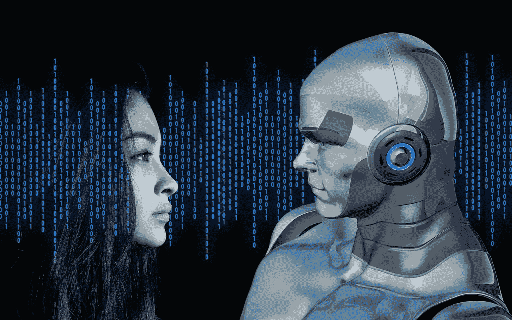
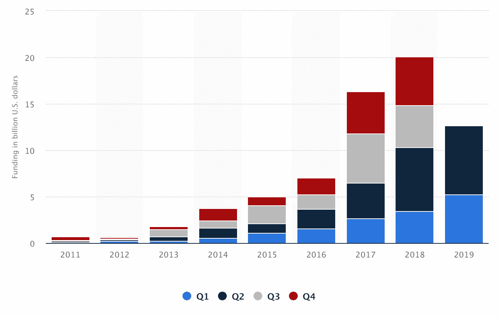
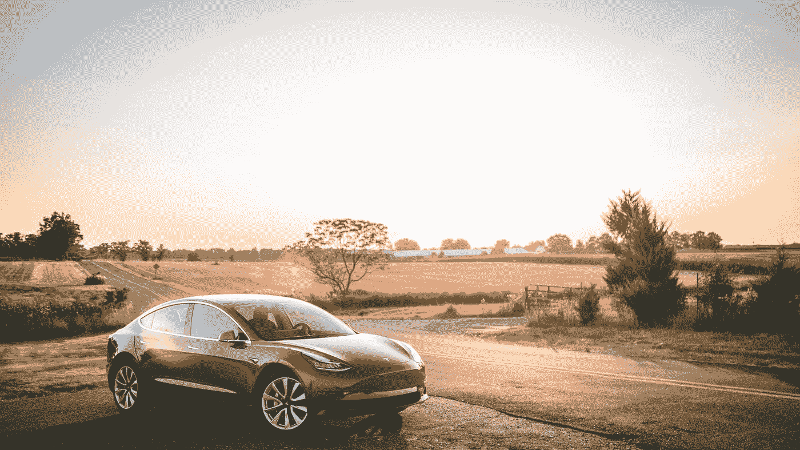

# 人工智能 AI-到 2025 年收入超过 1000 亿美元

> 原文：<https://towardsdatascience.com/artificial-intelligence-ai-over-100-billion-in-revenues-by-2025-e737459a345e?source=collection_archive---------27----------------------->

## 我们没办法，嗡嗡的 AI 这个词，无处不在。这个行业有很棒的营销人员，但还有更多。

Photo by [Geralt](https://pixabay.com/users/geralt-9301/) on [Pixabay](https://pixabay.com/illustrations/binary-code-privacy-policy-woman-2175285/).

人工智能是热门的技术创新和研究之一。人工智能将扰乱人类生活的所有部分，最终，它将接管我们的星球。人们往往会忘记代码是由人类生成的，而人工智能最终只是自动逻辑调整软件的和平。我们不应该害怕人工智能机器人接管地球。我们应该更害怕心怀不轨的人染指强大的 AI 工具。科技行业充斥着铺张浪费。有时我们会忘记现实。

**炒作和创新吸引资本**

从一年前[对物联网市场状况的研究中可以看出，超过 15 万亿的经济体](/internet-of-things-booming-15-trillion-market-88fde1da2113)将围绕物联网行业增长。当然，它肯定不会纯粹靠炒作，而是靠现实生活中的解决方案在那里发展。

人工智能营销非常成功，这导致了资本的吸引力。尽管投资者变得越来越聪明，但我们喜欢行动和活力。成功的营销带来的正是这一点。部分是因为市场营销，人工智能的发展已经吸引了大量的初创公司、组织和大学的融资。资本使得大规模的实验成为可能，从而加快了发展的速度。由于快速发展，我们现在看到人工智能产生的收入数量在增长。

**收入增长**

据 Tractica 称，到 2025 年，来自使用人工智能的软件的收入将从 2018 年的 95 亿美元增加到 1186 亿美元。

Chart by Statista outlining the industries.

此外，Tractica 认为，在人工智能开发方面，我们现在终于从宣传转向现实，即将看到真正的工作解决方案进入市场。可以看出，Tractica 的信念已经实现。例如，人脸识别、机器人技术和语音软件。这些是按计划使用的工作解决方案。

[Tractica 报告](https://www.tractica.com/research/artificial-intelligence-market-forecasts/)对人工智能在消费者、企业、政府和国防领域的市场机会进行了量化评估。

据 MarketWatch 估计，2024 年，人工智能的总市值为 1910 亿美元，CAGR 为 37%。

[MarketWatch](https://www.marketwatch.com/press-release/artificial-intelligence-market-is-estimated-to-be-worth-us-191-billion-by-2024-2019-01-23) 也指出缺乏有才能的工人，以及人工智能可能威胁人类尊严的风险。这是增长的潜在风险。然而,《市场观察》估计，由于引入了更新的技术，它的影响微乎其微。

大观研究:[全球人工智能 AI 市场](https://www.grandviewresearch.com/press-release/global-artificial-intelligence-ai-market)

有了这样的技术预测，人们就可以预测资本开始流动。政府、风险资本家和其他投资者在人工智能的发展上投入了大量资金。

## 在开发人工智能解决方案的初创公司和项目上投入了大量资金

自主技术的前景就像一块吸引资本的磁铁。

Photo by [Austin Distel](https://unsplash.com/@austindistel?utm_source=medium&utm_medium=referral) on [Unsplash](https://unsplash.com?utm_source=medium&utm_medium=referral)

**欧盟投资 12 亿美元给** [人类大脑项目](https://www.humanbrainproject.eu/en/)，该项目是关于在机器中复制人类大脑。这不仅是关于人工智能，但它肯定是它的一部分。

美国初创公司场景:“2019 年迄今为止的 66.2 亿美元**，这使我们有望略高于 **2018 年 86.7 亿美元的总额”——**[Crunchbase research](https://news.crunchbase.com/news/ai-companies-raise-more-money-across-fewer-rounds/)。**

**Crunchbase News 对与人工智能和机器学习相关的公司的风险投资进行了分析，发现对美国初创公司的投资继续增加。到目前为止，该领域的公司在 2019 年筹集了 66.2 亿美元，这使我们有望略高于 2018 年的 86.7 亿美元。— [Crunchbase](https://news.crunchbase.com/news/ai-companies-raise-more-money-across-fewer-rounds/) ，2019 年 9 月 9 日。**

****从 2011 年到 2019 年，全球范围内增加了四分之一:**2019 年第二季度，AI 资助额为**74.1 亿美元。—**[**Statista**](https://www.statista.com/statistics/943151/ai-funding-worldwide-by-quarter/)**

****

**Quarterly AI funding from 2011 to 2019 by Statista.**

****软银新的专注于人工智能的 100 美元基金:**软银以其庞大的基金规模在硅谷引起轰动。现在它推出了一个 1000 亿的基金来投资人工智能的发展。**

**软银在 2017 年推出了 1000 亿美元的愿景基金，并进行了积极的投资，震惊了风险投资界。现在，亿万富翁孙正义宣布了一个更大的基金，以 1080 亿美元投资于公司，开发人工智能。— [福布斯](https://www.forbes.com/sites/samshead/2019/07/26/softbank-launches-new-108-billion-vision-fund-to-invest-in-ai/#5b53aea4568d)2019 年 7 月 26 日。**

****微软 10 亿美元投资**成 OpenAI 项目。**

**微软对 OpenAI 的 10 亿美元投资可以实现什么— [观察者](https://observer.com/2019/07/microsoft-openai-investment-potential/)2019 年 7 月 23 日**

## **难怪人工智能会吸引资本——除了炒作之外，它也产生收入。**

**到 2025 年，人工智能解决方案预计将产生超过 1000 亿美元的收入。人工智能不仅仅是炒作。我们可以看到影响和机会，人工智能提供。资本流入开发是有原因的。**

****

**Photo by [Erik Mclean](https://unsplash.com/@introspectivedsgn?utm_source=medium&utm_medium=referral) on [Unsplash](https://unsplash.com?utm_source=medium&utm_medium=referral)**

**让我们举几个例子:**

****预测性维护:****

**国际自动化协会估计每年机器停机的成本为 6470 亿美元。借助人工智能和机器学习，我们可以改善维护操作，并引入令人兴奋的东西:预测性维护。提高效率，延长机器寿命。**

> **有了空调，按时清洗过滤器可以减少多达 15%的能耗。通过预测性维护，机器的生命周期预计将延长 3-5 年。**

**根据国际能源署(IEA)[冷却的未来报告 2018](https://www.iea.org/futureofcooling/) 显示，全球每年空调消耗的电力高达 2020 TWh，而且数量还在不断增加。越来越多的空调安装。让我们算一算，明白这是什么意思。**

## **根据 [IEA](https://www.iea.org/futureofcooling/) 的数据，冷却每年消耗 2020 TWh = 20.2 亿千瓦时的电力。**

***使用全球平均电价，* [*每千瓦时*](https://www.globalpetrolprices.com/electricity_prices/)*0.14 美元，我们可以推测冷却所用能源的总成本。成本= 20.2 亿千瓦时* 0.14 美元/千瓦时= 282.8 亿美元。***

****为了继续简化计算，我们接着说我们将从中节省 15%。总计可节省 424.2 亿美元。****

***282 8 亿美元* 0.15 = 424 亿 20 00 万美元节省。这个非常简化的计算的主要目的是给出一个人工智能潜力的概念。***

## **环境与人工智能**

**人工智能解决方案正在开发中，以帮助应对气候变化。**

****以下是人工智能对可持续环境影响的一些想法:****

****预测性维护****

**例如，预测性维护，确保设备得到良好维护并按时运行。美国能源部研究了延长机器的生命周期，同时减少 15%的能源节约。**

> ***根据美国能源部的数据，清洗空调的过滤器可以节省 15%的能源消耗。***

****无人驾驶汽车****

**有了自动驾驶汽车，我们就有希望进入没有人拥有汽车的未来。我们可以有自动驾驶的汽车，100%被占领。你有一个手机应用程序，像优步，你可以从那里订购一辆车去下一个目的地。**

****

**Photo by [Vlad Tchompalov](https://unsplash.com/@tchompalov?utm_source=medium&utm_medium=referral) on [Unsplash](https://unsplash.com?utm_source=medium&utm_medium=referral)**

**关于人工智能如何帮助我们应对环境问题的更多想法，请看看下面的文章。**

****该领域顶级思想家**[**The Verge**](https://www.theverge.com/2019/6/25/18744034/ai-artificial-intelligence-ml-climate-change-fight-tackle)**2019 年 6 月 25 日**以下是人工智能如何帮助应对气候变化**

****利用人工智能进行气候科学—** [**欧洲联合空间欧空局**](https://www.esa.int/Applications/Observing_the_Earth/Space_for_our_climate/Harnessing_artificial_intelligence_for_climate_science)**2019 年 9 月 18 日****

**ResearchGate 一直在研究人工智能如何帮助我们处理数据，以做出最佳的环境决策。从他们的[论文](https://www.researchgate.net/publication/220204701_Artificial_Intelligence_and_Environmental_Decision_Support_Systems)中找到更多有趣的想法:**人工智能和环境决策支持系统。****

## **带着自主代码走向未来**

**未来将属于自治法典。自主代码并不意味着人类变得一无是处。恰恰相反。**

**然而，还需要更多的教育，以及人们学习新技术的意愿。**

**自主这个词并不意味着不需要人类。更多的技能和教育使我们能够利用人工智能的潜力。这是一个非常受欢迎的让我们轻松生活的附加工具。**