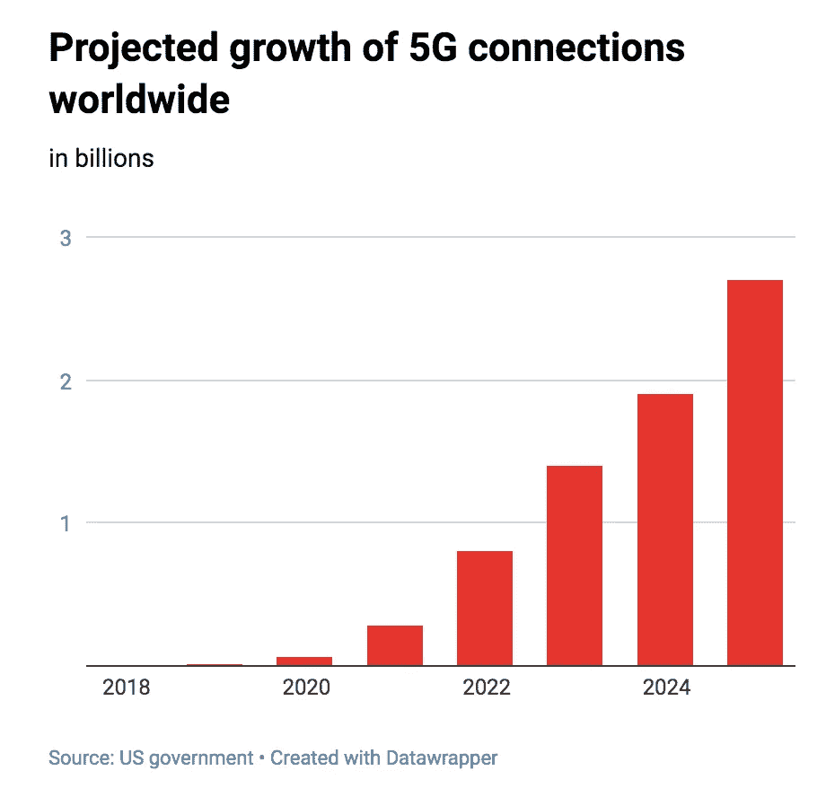
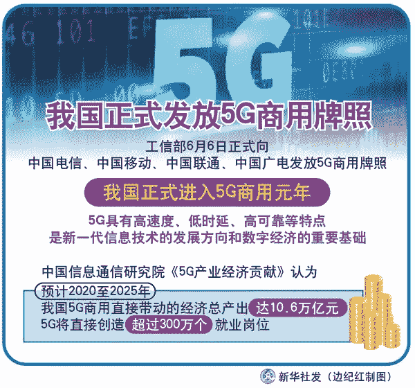

# 人工智能和 5G

> 原文：<https://towardsdatascience.com/artificial-intelligence-and-5g-d59de7dfd213?source=collection_archive---------4----------------------->

Photo by [@perchekindustrie](https://unsplash.com/@perchekindustrie)

## 为什么 5G 与 AI 领域相关？

我本周的重点是探索人工智能和 5G 的交集。当考虑这种组合的潜在风险和可能性，或者与行业专家讨论他们的想法时。谁在研究这将导致的影响或变化？电信公司在这些领域进行了大量投资，许多人对可能的不利后果表示担忧。它可能会改变我们在人工智能领域使用应用程序的方式，你可以用一个小设备做更多的事情，因为你的连接允许数据更快速地移动。因此，在一个界面上，许多应用程序将被云分散(在一个服务器上)。很明显，如果好的方面可以延伸，那么不好的方面也可以。

我将解释并说明:

1.  5G 是如何工作的。
2.  频谱分配。
3.  机器人和 5G。
4.  欧盟关于 5G 的安全政策。
5.  中国的 5G 扩张。
6.  谷歌以 21 亿美元收购 Fitbit。

# 1.5G 是如何工作的？

**5G 网络**是数字蜂窝**网络**，其中提供商覆盖的服务区域被划分为称为小区的小地理区域。

在[数字趋势](https://www.digitaltrends.com/mobile/what-is-5g/#Specifics)中已经尝试了一个很好的解释。

文章解释了频谱:低频段，中频段和高频段。

***“低频段频谱*** *也可以描述为 sub 1GHz 频谱。它主要是美国运营商用于 LTE 的频谱频段，并且正在迅速耗尽。虽然低频段频谱提供了很大的覆盖范围和渗透率，但有一个很大的缺点:峰值数据速度将达到 100Mbps 左右。*

***中频段频谱*** *提供比低频段更快的覆盖范围和更低的延迟。然而，它不能穿透建筑物以及低频带频谱。在中频段频谱上，预计峰值速度可达 1Gbps。*

***高频段频谱*** *是大多数人想到 5G 时想到的。也就是通常所说的* ***毫米波*** *。高频段频谱可以提供高达 10Gbps 的峰值速度，并且延迟非常低。高频段的主要缺点是覆盖面积小，建筑物穿透性差。”*

在花哨的连结点上有很多令人毛骨悚然的 5G 展示。

这还以进化的方式表现出来，就像技术领域经常做的那样。

成为第一个 5G 技术覆盖的城市本身就是一个目标。从某种意义上说，是技术的推动者。

# 2.人工智能、5G 和频谱分配

10 月 25 日，麻省理工学院技术评论的 Karen Hao 写了一篇文章，名为:“ [DARPA 正在押注人工智能将下一代无线设备带入网络](https://www.technologyreview.com/s/614627/5g-ai-darpa-next-generation-of-wireless-devices/?fbclid=IwAR2uZk86R8P-him-9ozmFTSUcqexZTwsurT39GpoQ2-G5bCwvAQzeud9bG8)”本文将重点放在无线通信的一个重要方面。因为有一个关于带宽如何通过无线电频谱工作的计划。无线电频谱频率范围内的电磁波被称为无线电波，它们被广泛应用于现代技术，尤其是电信领域。为了防止不同用户之间的干扰，无线电波受到国家法律的严格管制，由国际机构国际电信联盟(ITU)协调。Karen Hao 的文章讨论了最近由国防高级研究计划局(DARPA)组织的一次黑客马拉松。她在文章中写道:

> “这一挑战是由于人们担心无线技术的日益普及可能会导致我们的设备用来相互通话的电波过度拥挤。”

由于频率是在不同的商业和政府实体之间划分的，那些拥有一点频谱权利的人很少 100%使用所有的时间。正在出现的新 5G 网络使这一点变得更加紧迫，因为预计它将随着时间的推移而大幅增长。

麻省理工学院技术评论中显示的图表检索于 2019 年 10 月 28 日

DARPA 发布的竞赛中要解决的挑战是设计一种新型的通信设备，它不会每次都在相同的频率上广播。建议的提议是使用机器学习算法来找到可用的频率。他们希望从通过“笔和纸”管理的系统转移到由“机器自主”管理的系统。

郝凯伦描述了 10 名决赛选手相互竞争的决赛。这包括在军事任务、应急响应和音乐会场地中支持通信的场景。佛罗里达大学的一个团队赢得了 200 万美元的大奖。

## 2.1 物联网和人工智能革命

为了看到 5G 最突出的可能性，看看三星等几个从其扩张中受益匪浅的参与者可能会很有意思。三星在 2019 年 10 月 28 日撰写的一篇新闻文章中描述了[物联网和人工智能革命](https://news.samsung.com/us/5g-opportunities-app-developers/)。

这篇文章声称，5G 连接将允许不同的解决方案实时访问更多数据，这将使解决方案变得非常不同。5G 使用“少得多的电力”，利用可以持续一年的物联网传感器。在农业中调节灌溉水平，在制造业中检测设备状况何时改变。

除此之外，还有可能为医生开辟多种用途，以确保对患者数据的处理。该文章指出:

> “5G 的速度比 4G 快 20 倍。但这种最新一代的网络不仅仅是“更快的 4G”加上创纪录的低延迟，5G 的速度将允许开发人员创建最大限度地利用改进的反应时间的应用程序，如体育赛事或安全目的的近实时视频传输。"

## 2.2 但这是一场比赛吗？

正如今年早些时候指出的那样，希望扩大 5G 连接的公司做出了巨大努力，将竞争框定为一场竞赛。这是来自行业游说组织 CTIA 的一个完整的微型网站，题为“[5G 竞赛](https://www.ctia.org/the-wireless-industry/the-race-to-5g)频谱中存在严重的折衷，由于部署的速度，这些折衷被忽略了。

> “一旦在大城市建设 5G 的‘竞赛’获得‘胜利’，在该国其他地方扩大接入的压力将会消失，从而使这种差距变得更加严重。在仓促行事之前，仔细考虑所有这些事情是值得的。”

因此，我们不应该被这场“竞赛”冲昏头脑，而对这种扩张可能带来的不利后果视而不见。

# 3.人工智能和 5G 机器人

## 3.1 可能使机器人和人工智能得到进一步应用的速度

如果我们忽略人工智能和机器人可能造成的环境破坏，考虑到它对资源的大量需求，让我们想想它实际上可以做什么。电话公司和电信公司吹捧你可以用你的手机做的惊人的新事情，如果你能“提高你的速度”或把它带到一个新的水平。然而说实话，你会怎么做？不比以前多多少。流媒体已经运行得相当好了，你还可以玩 candycrush 等等。然而，在它到来之前，我们无法想象我们会用这种速度或连接做什么。每个人，或者大多数人，坐在公共交通工具上，眼睛盯着电话。公共场所挤满了不知何故拿着手机漫不经心地走在前面的人，他们在旅途中导航、阅读、玩耍或社交。除了您的直接使用，我们还应该了解行业中的几个使用案例。

## 3.2 人工智能结合 5G 机器人技术

有一点可以肯定的是，这种类型的技术可能会使机器人以不同的方式和“智能”机器人在更广阔的环境中工作。我们可以立即考虑将这种技术用于防御目的和监测人口。然而，另一方面，在医院和卫生技术领域，这可以通过技术发明实现不同的工作环境或跟进。

运行与人工智能领域相关的解决方案已经在外部完成，所以你真的会注意到不同吗？如果视频、文本或其他表达/输入被转移到不同的地方，那么对用户来说有什么不同。看到这将如何有所帮助可能是具有挑战性的，人工智能用例在以前的文章中提到过。在 5G 网络中使用机器学习技术来提高所分配的无线电频谱的利用率。目前看来

*   *无人驾驶的自动驾驶汽车，*
*   *自动化或管理公共交通，*
*   *时间紧迫的工业自动化，*
*   *远程医疗*

这些都是硬件和软件能够改变运营的领域。当然，流程自动化已经在影响工作生活，来自工人的数据被监控，绩效被衡量。然而，可以在医疗保健、运输和工业中操作的机器人可能会因物联网中的这些新技术而得到增强。

## 3.3 区块链、5G 机器人和人工智能

无论这个标题看起来多么像一个时髦的词，这些新型解决方案所需要的安全性还是有一些值得一提的。考虑到谁在这个物联网领域工作的问题，我们可以说像 **IOTA** 这样的参与者将会看到*巨大的增长*。

> “我们的愿景是通过验证真实性和交易结算来支持所有互联设备，这将激励设备实时提供其属性和数据。这催生了全新的通用应用和价值链。”

 [## 下一代分布式账本技术

### IOTA 协议是由 IOTA 基金会开发的分布式分类帐技术。这是下一代…

www.iota.org](https://www.iota.org/) 

因此，我认为在这些进步中所要求的安全性，像 IOTA 这样的公司参与者将是必要的，以使其网状或至少能够工作。

## 3.4 一个迫在眉睫的问题——维持 5G 机器人和人工智能

正如在引言中提到的，我们必须严肃地质疑这种进步，我们不能一边把双手举到耳朵上，一边继续跑进“现代性”和“进步”。如果我们忽视前面提到的时髦词宾果的潜在不良后果，我们就有大麻烦了。将人工智能传输到高度加密的 5G 网络的能源和资源要求听起来绝对荒谬，这样做甚至有道理吗？

# 4.欧盟国际安全政策、人工智能和 5G

## 4.1 连通性增加和新出现的风险

2019 年 10 月 9 日，Techcrunch 写了一篇关于 5G 技术的新联合[风险评估报告](https://ec.europa.eu/newsroom/dae/document.cfm?doc_id=62132)的文章。迄今为止，欧盟顶住了以国家安全为由抵制华为作为 5G 供应商的压力。2019 年 3 月，美国建议欧盟阻止华为进入其市场。该报告确定*【安全挑战】*更有可能出现在 5G 网络中。

*“攻击风险增加，攻击者的潜在进入点更多:随着* ***5G*** *网络越来越多地基于软件，* ***风险*** *与主要的* ***安全*** *缺陷相关，例如源自供应商内部糟糕的软件开发流程的缺陷变得越来越重要。”*

*   某些设备变得越来越敏感，例如基站或网络中的管理功能。
*   移动网络运营商对供应商的依赖可能会导致更多的“攻击途径”。这些都可能被威胁者利用。*非欧盟国家或国家支持的国家被认为是最严重的国家，最有可能以 5G 网络为目标。*
*   单个供应商的风险状况将变得很重要。
*   存在严重依赖供应商的风险。依赖性会带来很高的风险。
*   对可用性和完整性以及隐私和机密性的威胁。

据 TechCrunch 报道，下一步将是:“……在 12 月 31 日之前，开发一个缓解措施工具箱，由[网络和信息系统合作小组](https://ec.europa.eu/digital-single-market/en/nis-cooperation-group)商定，旨在解决国家和联盟层面的已识别风险。”

> “这意味着 5G 安全业务需要相应地扩大规模，以应对与下一代技术密切相关的多维安全挑战。仅仅禁止一家供应商并不能解决问题。”

## 4.2 5G 领域的最佳英国科技创业公司

毕马威为初创公司举办了一场比赛，在这场比赛中，我看到了进步*(我与毕马威合作)*。我将列出本次竞赛中提到的两个创业公司:

1.  [***卫戍科技***](https://www.garrison.com/) *开创了一种创新的安全平台，以应对持续和有针对性的攻击威胁，这些攻击利用了企业互联网连接。加里森科技公司的首席执行官大卫·加菲尔德在下面的采访中告诉我们更多。*
2.  [***SenSat Technology***](https://www.sensat.co.uk/)**利用主要城市地区的模拟现实，利用机器学习技术提取可操作的见解。这降低了电信公司的 5G 部署成本，并最终降低了消费者的 5G 成本。**

*安全平台变得越来越重要，尤其是当 5G 的推出处理敏感数据时。使用人工智能来增强这些通信对于机器人的良好工作至关重要。*

*根据安全报告:*“…还应考虑欧洲在软件开发、设备制造、实验室测试、符合性评估等方面的工业能力发展”*因此，我们可以预计未来几年将会有更多投资投入到欧盟的 5G 工业扩张中，或者大量投资于 5G 安全。*

# *5.2019 年的中国和 5G*

## *5.1 作为 5G 技术的领导者，超越全球竞争*

*据说中国正在率先实施 5G，我将在 2019 年底探索当前形势的轮廓。为了这篇文章，我研读了高岗的文章。EY 关于中国和 5G 的报告；最近在彭博的文章；在财富方面。中华人民共和国官方国营新闻机构 [*新华社*在 2019 年早些时候报道了](http://www.xinhuanet.com/fortune/2019-06/06/c_1124590839.htm)中国目前扩大 5G 网络的计划。其表示，工信部正式向中国电信、中国移动、中国联通、中国广电发放 5G 商用牌照。*

**

*西环通讯社检索 2019 年 10 月 31 日信息图*

> **“中国信息通信研究院《5G 产业经济贡献》认为，预计 2020 至 2025 年，我国 5G 商用直接带动的经济总产出达 10.6 万亿元，5G 将直接创造超过 300 万个就业岗位。”**
> 
> **中国信息通信研究院《5G 产业经济贡献》认为，从 2020 年到 2025 年，中国 5G 商用直接经济产出将达到 10.6 万亿元，5G 将直接创造超过 300 万个就业岗位。**

*在这方面，中国也表示欢迎外国公司在中国工作。*

*商务部和生态与环境部发布了一项 2019-2020 年短期计划，通过促进依赖 5G 的电子产品和汽车的消费来共同解决这一问题。在被特朗普列入黑名单后，华为等商业公司已经开始[快速迈向](https://www.bnnbloomberg.ca/businessweek/huawei-digs-in-for-a-drawn-out-battle-with-trump-s-white-house-1.1269195)开发自己的技术，以摆脱美国正在进行的贸易战。*

*EY 的一份报告概述了中国准备好[赢得‘5G 竞赛’](https://www.ey.com/Publication/vwLUAssets/ey-china-is-poised-to-win-the-5g-race-en/$FILE/ey-china-is-poised-to-win-the-5g-race-en.pdf)。他们制作了一个贴切的信息图表来说明这一点，显示中国在当前的 5G 连接中占有很大份额；收入和很大程度上的本地关系。*

**

*EY 于 10 月 31 日检索的信息图*

*尽管某些国家对中国的信任度有所下降，但仍有共同开发 5G 的明确兴趣，并有 5G 解决方案的预算支出。*

*10 月 30 日，《彭博》杂志发布了一篇名为[中国推出全球最大 5G 手机网络](https://www.bloomberg.com/news/articles/2019-10-30/china-to-roll-out-world-s-largest-5g-mobile-phone-network)的文章。与中国三大国有无线运营商首次推出 5G 手机服务相关的新闻。该文章指出:*

> **[*中国最大的运营商中国移动有限公司*](https://www.bloomberg.com/quote/941:HK) *在北京、上海、深圳等 50 个城市推出网络，套餐价格低至每月 128 元(18 美元)***

**这是在华为及其 5G 技术拒绝我们的背景下发生的。这是一年后的计划，但现在比计划提前推出。这意味着中国拥有世界上最大的商用 5G 网络。**

****

**Retrieved from [Bloomberg](https://www.bloomberg.com/news/articles/2019-04-08/why-5g-phones-are-arriving-with-subplot-of-espionage-quicktake) on the 31st of October**

> ***此外，彭博写道，在中国占据主导地位是华为的重要战略举措:***
> 
> **在全球最大市场的主导地位可以削弱美国针对其他国家安装华为设备的行动的影响，美国指责这些国家构成了 [*安全威胁*](https://www.bloomberg.com/news/articles/2019-01-23/how-huawei-became-a-u-s-government-target-quicktake) *。尽管面临美国的压力，华为在 7 月份表示，它已经签署了 60 多份商业合同，在全球范围内提供 5G 网络，其中至少有 28 份在欧洲。***

**咨询公司 EY 此前概述了商业发射的途径，但似乎中国正在加速超越这些预期:**

****

**EY 于 10 月 31 日检索的信息图**

**此外，还有一系列用例需要考虑。我之前提到过一些，但是我们可以看到在个人和商业用例中有更多的可能性需要考虑。**

****

**2019 年 10 月 31 日，外交关系委员会数字和网络空间政策项目主任艾伦·西格尔(Alan Segal)在《财富》[在线上指出:](https://fortune.com/2019/10/31/china-5g-rollout-spectrum/)**

> ***“这很大程度上也是因为意识到(美国)在这一领域没有制造商，所以，让我们试着让中国慢下来，”***

**将这一点与世界上最雄心勃勃的人工智能政策结合起来，似乎是一种取得技术领先地位的有趣方式。**

**至少从表面上看，中国似乎已经取得了 5G 的领先地位。**

**在这样说的时候，我们必须适度地添加一些关于 5G 以及与这些技术和分布式相关的知识。规模不是一切，我们可能不知道谁正在推动 5G 技术超越中国投资的当前范围和规模。**

# **6.Fitbit + Google AI + 5G =？**

## **6.1 谷歌以 21 亿美元收购 Fitbit**

**the Verge 发表的一篇文章[2019 年 11 月 1 日](https://www.theverge.com/2019/11/1/20943318/google-fitbit-acquisition-fitness-tracker-announcement?fbclid=IwAR0UnmqCPUNTRB8DIDpRbuqSk-4iSbisEwR2EyptgUqfJ3yT2zwp8g0I0oA)宣布谷歌收购 FitBit:**

> **[*谷歌刚刚宣布*](https://blog.google/products/hardware/agreement-with-fitbit?_ga=2.109995341.918473813.1572613323-1996097189.1566566630) *以 21 亿美元收购可穿戴公司 Fitbit***。在宣布这一消息的博客文章中，谷歌设备和服务 SVP 公司的里克·奥斯特洛表示，收购 Fitbit 是“一个在 Wear OS 上进行更多投资以及将谷歌可穿戴设备引入市场的机会。”****

***这可能是一项复杂的投资，但我看到了一些关于为何进行此次收购的不同观点:***

*   ***谷歌希望投资可穿戴设备，但未能独自开发出足够可行的解决方案。因此，它收购 FitBit 是为了提供这种服务。***
*   ***谷歌收购 FitBit 是为了专有技术。***
*   ***谷歌收购 FitBit 是为了它的数据——不是为了增加广告，而是为了协助其在健康技术方面的投资(这构成了 Alphabet 投资组合的很大一部分)。***

***可能有更多的原因，然而，在保护消费者健康数据方面，消费者似乎有很强的意识。11 月 1 日直接来自 FitBit 的声明如下:***

> ****“消费者信任对 Fitbit 至关重要。强有力的隐私和安全指导方针从第一天起就是 Fitbit DNA 的一部分，这一点不会改变。Fitbit 将继续让用户控制他们的数据，并将对其收集的数据及其原因保持透明。该公司从不出售个人信息，Fitbit health and wellness 数据也不会用于谷歌广告。”****

***Rick Osterloh，谷歌设备与服务高级副总裁。表示他们将把 FitBit 在硬件方面的人才与软件和人工智能结合起来，打造更好的可穿戴设备。***

***与此同时，拥有谷歌的 Alphabet 正在扩大对 Verily 和 Calico 的投资。这是 Alphabet Inc .的季度报表中反复提到的两家公司。健康数据是一个热门话题。***

> ****尽管谷歌可能不会将 FitBit 数据用于广告，但它很可能会将这些聚合数据用于 Verily 和 Calico 的药物开发或健康洞察。是什么阻止了 Google/Alphabet 这样做？****

***我从 Alphabet 的[投资者关系页面](https://abc.xyz/investor/static/pdf/20191028_alphabet_10Q.pdf?cache=376def7)的 2019 年第三季度(Q3)页面中获取了一份描述。以下两节摘自 Q3。***

## ***6.2 印花棉布***

****Calico 是一家生命科学公司，其使命是利用先进技术来增加我们对控制寿命的生物学的了解。****

***【2014 年 9 月，艾伯维公司(AbbVie)和 Calico 签署了一项研发合作协议，旨在帮助两家公司发现、开发和向市场推出针对年龄相关疾病患者的新疗法，包括神经退行性疾病和癌症。在 2018 年第二季度，艾伯维和 Calico 修订了合作协议，导致总承诺量增加。截至 2019 年 9 月 30 日，艾伯维已根据协议出资 7.5 亿美元资助合作，并承诺额外出资 5 亿美元，将于 2019 年第四季度支付。截至 2019 年 9 月 30 日，Calico 已出资 5 亿美元，并承诺追加 7.5 亿美元。***

****Calico 利用其科学专业知识建立了世界级的研发机构，专注于药物发现和早期药物开发；艾伯维提供科学和临床开发支持及其商业专业知识，将新发现推向市场。两家公司平等分享本协议项下项目的成本和利润。艾伯维的出资在 Calico 的财务报表中被记录为负债，由于 Calico 产生了符合条件的研发费用，因此该负债被减少并反映为研发费用的减少。****

****截至 2019 年 9 月 30 日，我们已向 Calico 出资 4.8 亿美元，以换取 Calico 可兑换优先股单位，并承诺根据需要和特定条件额外出资 7.5 亿美元。****

## ***确实地***

****Verily 是一家生命科学公司，其使命是利用世界健康数据，让人们享受更健康的生活。2018 年 12 月，Verily 获得了 10 亿美元投资轮的 9 亿美元现金。剩余的 1 亿美元于 2019 年第一季度收到。截至 2019 年 9 月 30 日，Verily 已从向外部投资者出售股权证券中获得总计 18 亿美元的收入。这些交易作为权益交易入账，没有确认任何收益或损失。****

## ***6.4 你对 21 亿美元有什么期待？***

***当你以难以想象的金额(对大多数人来说)收购一家公司时，预期投资回报并非不可思议。***

***另据[Quartz](https://qz.com/1675133/alphabet-q2-2019-earnings-show-non-google-revenue-lags/):**Alphabet**报道称，来自谷歌广告业务的**收入**为 326 亿美元，比去年同期增长了约 16%***

***尽管 Alphabet 收益丰厚，但这是一个相当大的赌注。自 2015 年首次公开募股以来，Fitbit 的股票下跌了[~ 80](https://www.forbes.com/sites/greatspeculations/2019/11/01/will-fitbit-be-better-off-with-google/#6151dfd040a2)。***

***在收购之前的几年里，FitBit 的销售额和收入似乎一直在下降。***

***谷歌正在购买进入可穿戴设备市场的方式，并可能大幅增加 FitBit 的扩张以及该平台的可能性。***

******

***Retrieved from [IDC](https://venturebeat.com/2019/05/30/idc-apple-still-led-wearables-market-in-q1-2019-but-huawei-grew-282/) on the 2nd of November***

## ***6.5 赌注开始了***

***这个赌注会有回报吗？有关系吗？***

***这为理解人类提供了更多的力量，这无疑是谷歌成功的一部分。***

***亚马逊 Alexa 可能会和你说话，但随着 5G 的发展，在你身上安装一个可以做到这一点的设备，同时持续传输结果可能会达到更高的程度。***

***今年早些时候，有人预测 5G 将提振 FitBit 的股价:***

> ****“通过让可穿戴设备做更多的事情，让它们变得更加不可或缺，5G 将让可穿戴设备变得更加流行和有价值，提振这些公司的财务状况。”****

***5G 的到来还将使[可穿戴设备能够更精确地监测个人的身体、情感和精神健康](https://www.msn.com/en-us/news/technology/how-5g-will-transform-the-way-we-live-and-work/ar-BBVmhnq)。***

***换句话说，谷歌的这项投资有望获得回报。***

****投资的另一个原因可能是意识到“搜索”正在发生变化。越来越多的人在问 Alexa，也会问自己的设备。因此，设备的“战斗”或竞争可能会影响谷歌目前的战略投资。****

# ***结论***

***5G 网络正在扩张，它们拥有潜力，但我们不应屈服于“竞赛”心态。虽然从安全的角度来看这是可以理解的，但从环境后果的角度来看，这是一个两难的选择。中国在将覆盖范围扩大到几个城市方面“领先”，这或许是为了表明他们没有被正在进行的贸易战吓倒。5G 可能会使较小的连接设备在连接方面更好地工作。因此，或许谷歌通过收购 FitBit 大举进军可穿戴设备是一场有意义的赌博。然而，人工智能和 5G 的问题既是一个个人安全问题，也是一个国际安全问题，甚至更多。毫无疑问，现在这些解决方案正在推出，政府和独立研究人员必须在公司内部密切跟进。***