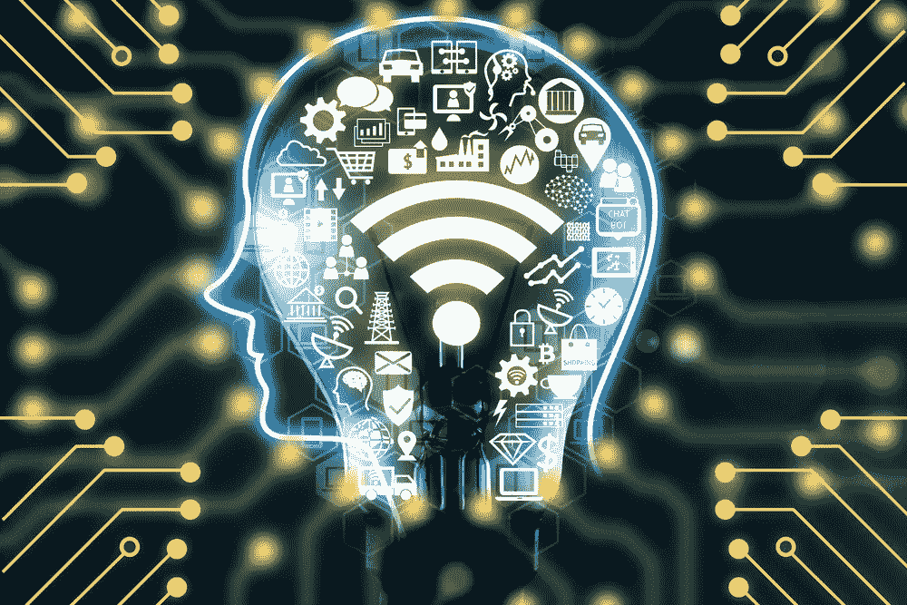

# 人工智能和商业价值

> 原文：<https://towardsdatascience.com/artificial-intelligence-and-business-value-ce70083b228f?source=collection_archive---------18----------------------->

数字技术无处不在。世界上现在有近 50 亿人拥有移动电话连接，超过 70 亿部移动电话正在使用中(有些人有不止一部电话)。大约有 25 亿部手机是智能手机。手机的普及率现在正接近电力的普及率——约 88%的世界人口，即 67 亿人用上了电。

与此同时，先进的数字技术，特别是人工智能，正在嵌入各种物理“东西”，从汽车到烤面包机到恒温器。每部智能手机都有一些人工智能的元素，这意味着人工智能正在影响世界上至少 25 亿人口。过去三年来，每家公司都在努力理解数字冲击，并确保某种程度上的战略到位。在这段时间里，各种各样的人和资源都在努力预测公司、人和世界将从数字技术，更具体地说，从人工智能中获得的价值。这是 techland 创造兴奋和 FUD(恐惧、不确定性和怀疑)的自然循环的一部分，随后是可预测的投资狂热，导致一些重大突破和一些同样重大的失败。

以下是我读过的一些当今关键技术的商业价值主张(转述):

1.  人工智能大于电和火。
2.  区块链的经济价值是互联网的 10 倍。
3.  到 2025 年，IOT 的经济影响预计将在 3.9 至 11.1 万亿美元之间。
4.  到 2030 年，区块链的全球经济增加值预计将达到 3 万亿美元。
5.  2018 年，人工智能(AI)产生的全球商业价值预计将达到 1.2 万亿美元。
6.  人工智能衍生的商业价值预计将在 2022 年达到 3.9 万亿美元。

# 浮夸还是真货？

我们该如何理解这些宣言？这是一块劣质的劳力士手表，还是真货？从远处看，你真的分不清一块浮华的劳力士和真品；只有仔细观察，你才能知道它是不是赝品。那么，让我们仔细看看。

# 累计值不能超过收入

在我职业生涯的早期，我在一家财富 50 强制造公司从事供应链转型项目。在此计划的第一阶段，团队执行了一个流程来制定转型计划。在第一阶段，我们绘制了现有流程，确定了未来愿景，确定了从 A 点到 B 点的解决方案，量化了从 A 点到 B 点的价值，并制定了分时段的价值交付计划。该交付计划包括基于交付的经济利润(也称为 EVA 或 ROIC)的回报分析。然后，总体计划被提交给 C 级主管批准。这种方法现在在软件行业相当标准。(虽然这种方法在当时的软件行业是新颖的，但公司已经使用类似的方法几十年了，至少从 1915 年杜邦模型的开发开始)。

尽管我后来参与了几十个转型项目，但在这个早期转型项目开始时发生了一件有趣的事情，这件事在当时非常突出，此后我一直记得。这位聪明、经验丰富且有点讽刺的客户项目负责人召集团队讨论了该过程中价值发现部分的状态。他做了一个有趣的评论，**“记住，每个改进领域的累积价值不能超过收入。”**在对改进的狂热中，许多项目追求相同的改进桶；例如，库存是供应链项目的常见目标。项目负责人想说的是，如果公司将所有单个部门和公司的库存改善项目目标相加，它们可能会超过资产负债表上的库存数量。因此，重要的是要仔细检查个别改进目标的价值，并确保项目之间没有二次探底。

数万亿美元的数字技术改进索赔也是如此。

# 什么是商业价值？

大价值宣言的一个问题是，它们背后没有太多的定义或科学。有人说销量增加就是商业价值；其他人可能会说降低成本。两者都是商业价值，但是更正式的定义也要考虑成本。商业价值的一个常见正式定义是经济利润:

经济利润=税后净利润减去资本成本。

换句话说，它是我的收入减去我所有的运营成本，再减去我需要用来创造收入的所有资本成本。这是一个相当标准的定义，在商业界已经存在了 100 多年。让我们用这种思维来看看是否有任何万亿美元的价值陈述通过了嗅探测试。

假设世界经济是一门生意。如果是这样的话，全球企业将拥有约 82 万亿美元的收入和约 6.2 万亿美元的税后净利润。全球增长率约为 3.7%。现在，让我们说商业价值意味着利润(因为全球经济很难获得资本配置的成本)，人工智能将创造约 1 万亿美元的年增量价值。这意味着艾将净利润提高 16%；如果增量价值为 2 万亿美元，那么 AI 将为净利润带来 32%的巨大增长。现在，假设没有利润扩张，但 AI 通过销售增长创造了这样的价值。对于 2 万亿美元的增量利润，人工智能必须创造 26 万亿美元的额外 GDP。这需要全球增长率大幅上升，而这是极不可能的。10 万亿美元的增量价值呢？Fuhgeddaboudit。

你大概可以看到这是怎么回事。这些数字没有通过最基本的嗅探测试，至少在使用商业价值的标准定义时没有。

我们可能遗漏了什么？

# 电对人工智能

电的商业价值是什么？那就好比问水对人体的价值是什么。思考它的价值的一个合理的方法是把它拿走。如果你从人体中取走水，人体将不复存在。如果你把现代公司的电拿走，它也将不复存在。像人工智能这种东西的商业价值是不一样的；一点也不像电。它不像水；更像是酒，或者音乐，或者甜点。如果它不复存在，商业仍将继续，但生活将少了很多乐趣。换句话说，在马斯洛的需求层次中，人工智能和类似技术的商业价值的最大份额将朝着金字塔的顶端增长，从而实现更高水平的启蒙。例如，在零售业，更高层次的启示来自于产品和履行选择的高度个性化的体验。

那么，如果这是真的，那么如何对它进行估价呢？**答案很简单——会有赢家，也会有输家。**一个 1 万亿美元的价值馅饼可能看起来像这样:赢家获得 8000 亿美元，输家损失 8000 亿美元，2000 亿美元的价值浪潮提升所有船只。在这个简单的例子中，整个经济和社会将获得 20%的份额，而 80%将是一个零和游戏。我的猜测是，这 20%比代表赢家和输家的 80%更接近真实的经济价值。

因此，如果今天的商业竞争主要发生在马斯洛层次结构的顶端，正如个性化所表现的那样，如果人工智能是提供这些能力的关键成分，那么人工智能的价值确实是巨大的。在成熟市场尤其如此，消费者不再将葡萄酒、音乐和甜点视为必需品。越来越多的人开始变得必须拥有。人工智能将越来越多地决定赢家和输家，即使它不会显著增加整体蛋糕的大小。不幸的是，它的价值可能会不平衡地增长，那些已经被过度服务的人会变得越来越不平衡。

# 无所事事的情景

对于企业来说，这实质上意味着考虑所谓的“无所事事的情况”这是克里斯滕森、考夫曼和施在《哈佛商业评论》经典文章[、**、**](https://hbr.org/2008/01/innovation-killers-how-financial-tools-destroy-your-capacity-to-do-new-things)中提出的思维模式。正如作者所言，“[回报分析]的第一个错误是假设不投资于创新的基本情况——无所事事的场景，与创新产生的现金流进行比较——是如果不投资，公司目前的健康状况将无限期地持续到未来。”这基本上意味着如果你不投资，你必须考虑倒闭的可能性。

因此，人工智能和数字技术的任何数万亿美元的价值陈述大多都是关于避免价值破坏，而不是以增加销售或利润的形式创造增量价值。与无所事事的情景相比，这一价值将是巨大的增量，但与当前的收入和利润基线相比，这一价值非常小。

# 兜了一圈

如果这听起来有点像循环讨论，那是因为确实如此。前面列举的数值有对有错。他们说人工智能将为社会创造和传递那么多价值，这是错误的；但就获胜者而言，他们是对的。用赢家的累计价值减去输家的累计价值，然后再减去所需投资，可能只会给全球 GDP 增长率带来增量正增长。一度，电力也决定了赢家和输家，但它同时也显著扩大了整体蛋糕。

那么，结果如何？劳力士是真的还是假的？答案是两者都不是。这块表是真的，是真的，但它既不是真正的劳力士，也不是华而不实的劳力士。这是一种完全不同的手表——姑且称之为卡地亚，而且是真正的卡地亚。

*原载于 2019 年 2 月 8 日*[*【www.worldlocity.com】*](https://www.worldlocity.com/single-post/2019/02/08/Artificial-Intelligence-and-Business-Value)*。*