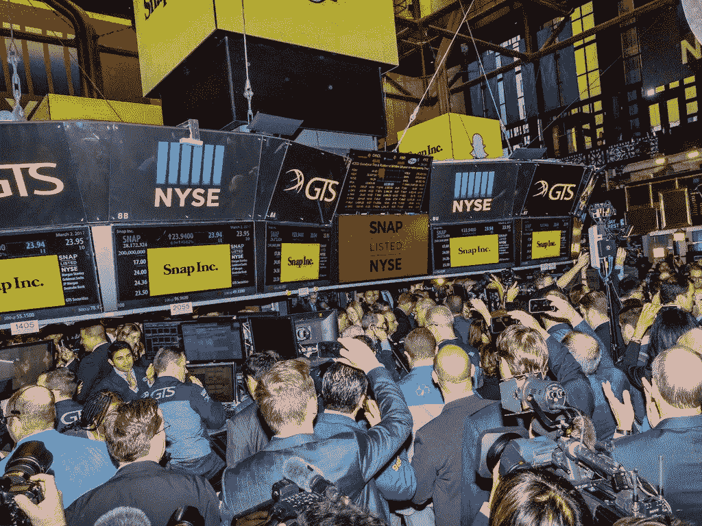
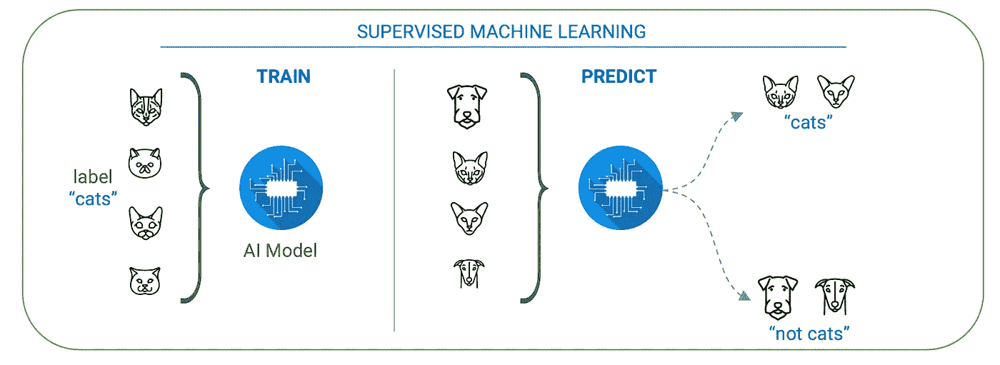
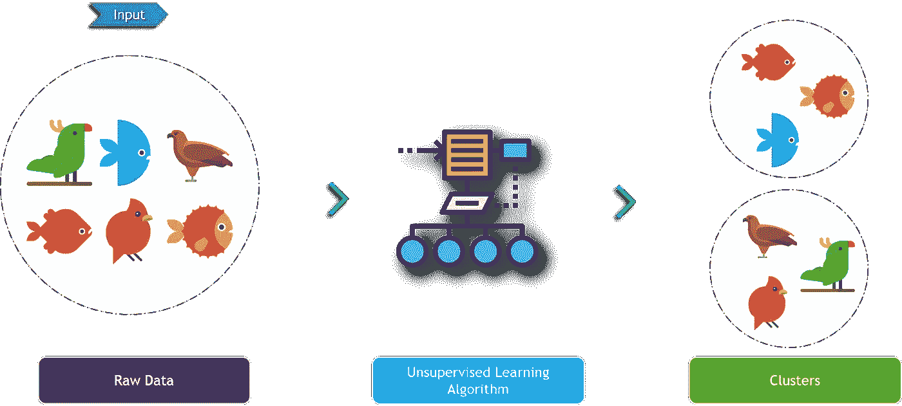
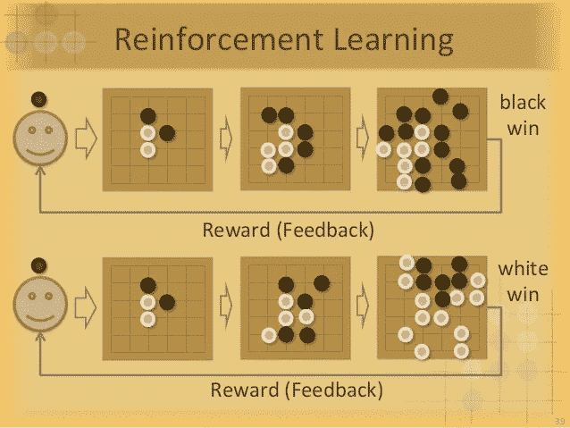

# 人工智能及其在金融中的应用

> 原文：<https://towardsdatascience.com/artificial-intelligence-and-its-application-in-finance-9f1e0588e777?source=collection_archive---------19----------------------->

## 金融中的人工智能

## 人工智能将如何驱动行业的未来

Snapchat’s IPO on the New York Stock Exchange (Source: Hollis Johnson)

“交易大厅”。当你听到这些话的时候，你会想到什么？你可能会想到西装革履的男人疯狂地打手势，不停地咒骂对方，或者类似的混乱环境。然而，这些曾经无处不在的场内经纪人正被高速计算机程序所取代。

例如，Citadel Securities 每天交易 9 亿股股票(占美国股票交易的八分之一)。只有 40 人在该公司的交易大厅工作，监督使用算法来完成股票订单的计算机。高盛雇佣的程序员和工程师比脸书还多。2018 年，金融科技(fintech)公司筹集了 400 亿美元。如果事情还不清楚的话，**技术将会扰乱金融部门。**人工智能是引领这一变革的技术之一。在我们了解人工智能在金融服务中的应用之前，我们必须了解技术本身。

# 机器学习

机器学习是人工智能的一个子集，专注于开发无需显式编程即可根据经验自主学习和改进的计算机程序。机器学习的三大类型是监督学习、非监督学习和强化学习。

## 监督学习

监督学习的目标是创建预测模型。最初，带有标记的输入和输出示例的训练数据集被馈送给算法(因此命名为受监督的)。然后，算法在调整了参数的训练集上运行，直到达到令人满意的准确度。通过这种分析，算法创建了一个可以预测未来输出的函数。在上面的图像中，人工智能模型被赋予了被标记为“猫”的猫的图片。然后，该模型根据猫的标记数据进行训练，直到它可以识别猫图像中的模式。因此，该模型将能够通过对先前识别的模式做出反应来预测后来的图像是否显示猫。

## 无监督学习

无监督学习的目标是在数据中发现模式。与监督学习相反，无监督算法被赋予一个没有分类或标记样本的训练集(因此得名无监督)。为了辨别模式，该算法使用聚类。每个集群由满足其要求所需的标准来定义；然后，将该标准与处理后的数据进行匹配，以形成聚类。然后，根据共同特征将训练集分成多个簇。在上图中，输入数据没有类别标注，由鱼类和鸟类组成。使用此输入数据建立的无监督模型将通过基于共同特征对数据进行分组来创建一个鱼类集群和另一个鸟类集群。

## 强化学习

强化学习的目标是训练一个模型做出一系列决策，使总回报最大化。在强化学习中，机器学习模型面临类似游戏的情况，在这种情况下，它使用试错法来解决它所面临的问题。程序员通过增加奖励和惩罚来操纵模型以某种方式行动。结果，模型被激励去执行有奖励的行为，而被阻止去执行招致惩罚的行为(这个反馈就是“强化”)。一旦该模型自行找出最大化回报的最佳方法，它就会从随机试验发展到复杂的策略。例如，谷歌的 Alpha Go 计算机程序训练来玩围棋，最终击败了世界冠军。这是一个巨大的成就，因为有 10 种⁷⁰可能的棋盘配置(比已知宇宙中的原子数量还要多)，而且以前没有计算机程序击败过职业围棋选手。

# 自然语言处理

自然语言处理是[人工智能](https://becominghuman.ai/)的另一个子集，用于金融领域。自然语言处理的首要目标很简单:破译和理解人类语言。语音识别软件(例如 Siri)从语音音频中分离出单独的声音，分析这些声音，使用算法找到最佳匹配的单词，将声音转录成文本。在将自然语言转换成计算机可以理解的形式后，计算机利用算法从文本中推导出意义并收集必要的数据。现在我们了解了机器学习和自然语言处理，我们可以更好地理解金融中的人工智能。

# 金融中的人工智能例子

[人工智能](https://becominghuman.ai/)在卖方(投资银行、股票经纪人)和买方(资产管理公司、对冲基金)都有多种多样的应用。

**卖方**

*   公司正在使用机器学习来测试投资组合(信贷/交易)
*   银行正在试验自然语言处理软件，该软件可以监听客户的对话，并检查他们的交易，以建议额外的销售或预测未来的请求(信贷/销售)
*   银行正在使用机器学习算法，为公司的资产负债表推荐最佳利率互换(利率/交易)
*   自然语言处理软件监控收件箱和电子平台中的客户信息，以确定他们希望如何在基金之间分配大宗交易(利率/销售额)
*   受监督的机器学习算法寻求资产价格和其他数据之间的相关性，以预测未来几分钟或几小时的货币价格(外汇/交易)
*   强化学习人工智能运行数百万次模拟，以确定执行客户订单的最佳价格，同时降低市场影响(现金/交易)
*   自然语言处理软件可以阅读合同，并通知客户互换到期和其他条款(衍生品/销售)

## 买方

*   计算机正在筛选历史数据以识别潜在的股票、债券、商品和货币交易，使用机器学习来预测它们在各种经济情景下的表现。历史数据也被检查以帮助设置赌注的大小、时间和持续时间(识别交易/投资组合结构)
*   机器学习算法分析市场变化的数据，以相应地模拟交易的变化。此外，对估价进行分析，并预测价格(监控交易)
*   算法分析不同的数据集，如消费者对品牌的情绪和石油开采特许权。卫星图像和房产清单等数据可以用来追踪经济趋势。自然语言处理还分析盈利电话的文字记录，阅读新闻，监控社交媒体。还对来自央行和会议的评论进行关键词和情绪分析(正在进行的研究)

总体而言，金融机构以各种方式利用人工智能来改善他们的运营。随着华尔街进入一个新时代，技术只会在金融行业变得更加普遍。

**先别走**！

我是 Roshan，16 岁，对人工智能和金融的交叉领域充满热情。要查看人工智能在金融领域的更具体的项目，请查看这篇关于使用自动编码器检测日志条目异常的[文章](https://medium.com/@roshan.adusumilli/fighting-financial-fraud-with-artificial-intelligence-f2a6bcaf131e?source=friends_link&sk=fb014bb565dee72caeec6b4c45afe207)。

在 [Linkedin](https://www.linkedin.com/in/roshan-adusumilli-96b104194/) 上联系我