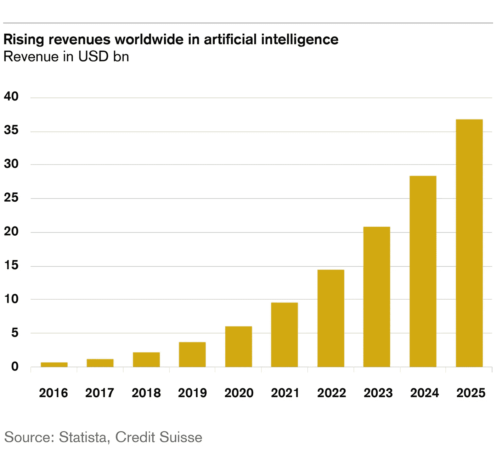

# 人工智能和非营利组织

> 原文：<https://towardsdatascience.com/artificial-intelligence-and-nonprofit-e6cdaaae166f?source=collection_archive---------13----------------------->

Photo by [@joelfilip](https://unsplash.com/@joelfilip)

## 非营利组织如何善用人工智能？

AI 安全的一部分可能是确保分配或致力于平等吗？我以前写过关于 AI 中的[公平；](https://medium.com/@alexmoltzau/artificial-intelligence-and-fairness-75c2490e8d57?source=friends_link&sk=32fc4151778edb664eb79dd57e712118)[数据质量的重要性](/facebook-vs-eu-artificial-intelligence-and-data-politics-8ab5ba4abe40?source=friends_link&sk=756bbc8cf12d7bab4c83f6b802abdf9e)；和与性别有关的平等。然而，最具挑战性的文章是《不平等与人工智能》。如果人工智能恶化或加剧了不平等，那么它真的安全吗？最大的不平等之一是什么？

对于非营利组织来说，重要的是与新技术的制造商联系，看看是否有任何一部分收入可以用于人道主义目的或项目。尽管我们可以质疑这些技术，因为它们当然不是完美无缺的，但非营利组织能够筹集资金和解决问题无疑是重要的。这些组织面临的问题通常是一个迫在眉睫的大问题“如何做”？在一个理想的世界里，他们的运作是不需要的，然而在目前的情况下，慈善部门有一席之地，而且他们的运作方式肯定在改变。

随着这些服务转移到应用程序或社交媒体，参与者多种多样，跟上这些服务似乎是一个挑战。在许多情况下，人工智能或人工智能等技术被集成到现有的产品或服务中。有必要协作吗？我们继续假设它可以与机器学习项目一起产生，并且一部分钱应该捐给慈善机构。让我们探索几个选项，但首先快速看一下人工智能。

# AI 为好

由于我一直在集中撰写关于人工智能的文章，我已经看到了人工智能的崛起趋势。看起来部分慈善机构对此很感兴趣，但是让我们先看看可能性和一些可能的问题。我首先回顾一下 Salesforce 最近发布的名为[AI for Good non profit Trends&用例](https://www.salesforce.org/thank-you-ai-for-good-ebook/)的报告。

来自 Salesforce 报告覆盖五个方面:(1)对 AI 的描述；(2)为什么非营利组织应该参与进来；(3)想象美好的未来；(4)利用 AI 推进你的使命；(5)如何保持 AI 的伦理性。

首先，我发现他们对人工智能的描述有点令人困惑，因为它把一切都放在一个篮子里。在这方面，我认为芬兰著名的人工智能课程《AI 的人工智能元素》所做的区分，与之前的另一篇文章提供了更恰当的区分:

***“狭义 AI”或“应用 AI”****是利用软件来研究或完成特定的问题解决或推理任务。也许可以说，在这种意义上，应用人工智能是最常见的用法，比其对应的* ***广泛/强烈的人工智能*** *更容易定义，后者据说在时间上接近 AGI 的思想——更有能力体验意识。”*

这一点更清楚，我们的具体重点是狭窄的人工智能，我们可以进入报告的描述，他们提出了几个一行的例子:语音助手 Siri 照片的脸书推荐引擎；亚马逊，推荐产品；和谷歌地图提供最佳路线到一个理想的位置。在这之后，他们尝试销售 Salesforce 产品，并概述非营利组织如何开始使用人工智能(了解更多关于应用人工智能的信息):

1.  *采集数据*
2.  *从数据中学习*
3.  *根据洞察力采取行动*

这听起来像是一个简单的三步过程，但却带来了很大程度的复杂性。以良好的方式处理信息变得越来越重要，因此高质量的数据也是非营利组织可以发挥作用的地方。他们从《经济时报》的一篇文章中为盈利组织提供了一个令人信服的论据。

> “人工智能和机器学习正在成为盈利领域的热门话题。事实上，拥有人工智能的盈利组织预计到 2020 年其收入将平均增长 39%，成本将下降 37%。”— [《经济时报》(印度时报)2017 年 1 月 17 日](https://economictimes.indiatimes.com/tech/ites/artificial-intelligence-adoption-driving-revenue-growth-for-businesses-infosys/articleshow/56622301.cms)【加粗】

除此之外，非营利组织对人工智能的使用预计将在未来两年增长 361%。这可能更能说明目前使用人工智能的非营利组织数量很少，以及人工智能或机器学习劳动力有多昂贵。有人认为，在全球层面上，非营利组织体现的价值观和原则有助于塑造人工智能的未来。这些应用程序可以被识别并获得支持，而不是利用易受攻击的人。

在报告中还提到了人工智能的五项原则。

1.  **有益:**资助研究以确保人工智能的有益利益不应该只用于国防或健康——必须有对人工智能的有益使用，可以解决非营利组织长期以来一直在处理的严重挑战性任务。
2.  **人类价值调整:**随着《T4》*《黑客帝国》* 等纪录片的推出，以及欧盟因脸书和谷歌对数据或竞争规则的监管而对其处以数十亿美元的巨额罚款，数据公民权正受到越来越多的讨论。这些公司认为的*“好”*是什么？这可能与非营利组织中人们所认为的“好”不相符。参与这一价值调整至关重要。
3.  **科学与政策之间的公开辩论:**科学与政策之间的健康交流对于造福人类的进步至关重要。如果私营公司、科学、决策者和非营利组织之间就可能的“好”或对社会的风险进行公开辩论，这可能是有益的。
4.  **系统和人工智能社区之间的合作、信任和透明度:**如果我们考虑合作的方面，非营利组织决定开始让不同类型的社区参与发展其对战争或国防中这一新技术的理解，尽可能多地了解使用这一技术进行筹款的潜在财务好处，这是至关重要的。如果[欧盟除此之外还决定采取伦理和以人为本的方法来发展人工智能](/artificial-intelligence-ethics-vs-world-domination-7cf2a5734151?source=friends_link&sk=43d1f42dc31c89d3b4410c3a3a0de271)，那么这可能会与更广泛的欧洲战略保持一致。
5.  **安全与责任:**那里似乎是越来越多的数据科学家和开发人员使用机器学习技术，然而人工智能安全的上升及其是否一致是一个很难回答的问题。从表面上看，我们可以得出一个不一致的结论，事实上，如果我们正在为社会构建这些应用程序，而在这些领域的投资却少得多，那么这似乎不是一个优先考虑的问题。网络安全很重要，但跨学科团队为非营利组织和企业提供安全服务似乎越来越有必要。[毕马威灯塔](https://home.kpmg/no/nb/home/nyheter-og-innsikt/2018/11/om-kpmg-lighthouse.html)有安全、编程和社会科学背景的人。该团队也紧邻直接从事国际发展和可持续发展工作的毕马威 IDAS。由于我目前在这种环境下工作[ *作为毕马威*的实习生，我可以看到这些组合对于确保负责任的运营可能很重要，因为不是所有的慈善机构或小型组织都可以拥有一个运营团队来解决该领域的各种问题。如果我们将这一点与金融专业知识结合起来，那么就相对容易证明，在非营利项目中实施人工智能的过程中，开始朝着更安全的方向迈进。

我们站在数字鸿沟面前，面对严重的不平等，我们必须尽最大努力负责任地采取行动。

## 为什么这对非营利组织有更大的好处？

Salesforce 的报告概述了相对于商业而言，个人非营利组织 AI 的好处。我采纳了他们的两条建议(因为我觉得第三条更像是推销)，并加入了一些我自己的想法:

1.  **非营利组织的资源和员工的时间有限**，在这方面，负责任地使用技术的人工智能辅助运营可能是有益的。这可能是日常工作中的情况，也可能是紧急通信出现危机的情况。我之前在挪威人工智能研究中心(CAIR)采访过 Morten Goodwin，他们最近写了一些关于机器学习如何在灾难中更快地识别出需要帮助的人的论文。
2.  **具有宣传目标的非营利组织可以从访问更复杂的指标**(通常显示得更好)中受益，从而更好地了解他们的受众以及对态度和行为的影响。指标并不能说明一切，但它们有时有助于提供更大图景的概览，而且除此之外，显示信息的新方式可能有助于委托人、成员或资助者更好地了解他们正在帮助解决的情况(当然，在这方面保持隐私的需要非常重要)。

在这方面提到的一个有趣的倡议是 GovLab，这是一个智囊团，经常与政府有关的主题合作，如激进主义和卫生保健。技术的成功确实完全取决于开发该技术的参与者之间的关系，并且已经有几个不太成功的治理项目(即使是微软的)。我看了一份由万维网基金会*(互联网的创造者)*写的关于[在阿根廷和乌拉圭](https://medium.com/swlh/ai-governance-in-argentina-and-uruguay-aeb68417db93?source=friends_link&sk=d352d3f641fcafc9b45649a9035cf15b)的人工智能治理的报告。人工智能领域内不加批判的应用很可能会损害当前的信任和未来新项目的实施。

## 什么是伦理 AI？

有许多可能的方法来解决这个问题。一个经典案例是关注捐赠者。有了捐赠者的数据，你只需点击一个按钮，就可以进行分析。可以预测给予的可能性，志愿服务的历史。程序结果可以用历史数据进行分析和显示，但这当然不应该总是作为判断的一部分，而是为了更好地理解。

然而，这当然提出了几个关于伦理(道德原则)的问题。随着脸书开始在培训和研究领域进行大规模投资，解决这一问题的趋势越来越明显。谷歌正试图开发隐私技术，如由半结构化机器学习的[进步辅助的](/advancements-in-semi-supervised-learning-with-unsupervised-data-augmentation-fc1fc0be3182?source=friends_link&sk=cbac033d5f98b5ff54daf4547a3d0ace)[联合学习](/google-federated-learning-and-ai-64c6e4e4e22f?source=friends_link&sk=45176a2f883275f562669a7931190cf1)。因此，试图在没有任何方法深入了解他们是谁的情况下学习人们做什么，这似乎是一项具有挑战性的任务。Salesforce 报告概述了“保持人工智能道德”的六种不同方式。

1.  **建立多样化的团队**。建议招聘多种背景。然而，在这种情况下，必须提到的是 [Equal AI](https://www.equalai.org/learn-more/) 和其他人认为机器学习领域目前可能是最不多样化的领域之一。
2.  **培养道德观念**。道德是一种心态，而不是一份清单。授权员工做正确的事情很重要。公司可以和非营利组织一起培养道德观念。
3.  **进行社会系统分析**。让利益相关者参与流程的每个阶段，以纠正人工智能数据中系统性社会不平等的影响。开源平台可以从社区获得信息，并创建所谓的“社区冲刺”，这在灾难或危机的情况下尤其重要，以支持不同群体的参与。
4.  **透明**。理解价值观，知道谁受益谁付费，以及让用户控制数据以提供反馈是绝对必要的。探索发展尤其重要，因为有可能混淆或告知。[数量越多，责任越大](/towards-social-data-science-f90c5c020855?source=friends_link&sk=2c86ddf5dcdef6f055843d3f01771bed)非政府组织最不想要的就是一个“黑匣子”和算法，这些东西无法向资助者解释，或者你知道可能存在外部性(损害)，这些外部性会让你措手不及。
5.  **了解自己的价值观**。如前所述，哪些关键应用程序应该自动化或不应该自动化？在做决策时，检查可能产生冲突并导致妥协的结果和权衡是至关重要的。*做出取舍时，必须让每个受影响的人都明白。*如果人工智能算法阻止人们确切了解决策是如何做出的，这可能会很困难。 [Cassie Kozyrkov](https://medium.com/u/2fccb851bb5e?source=post_page-----e6cdaaae166f--------------------------------) 谷歌的首席决策工程师写了很多关于这个话题的文章。
6.  让用户控制他们的数据。非营利组织收集用户数据是不可避免的，由于非营利组织的角色，这个部门可以成为比其他公司或组织更专注于考虑数据公民的参与者。该报告建议您允许用户更正或删除您收集的关于他们的数据。非营利组织最终可以通过各种在线接触点或物联网获得大量关于其成员的数据。
7.  **保护您的数据**。非营利组织很少提到数据安全(或者说不够经常)。2019 年 5 月，纽约最大的非营利组织之一 People Inc 发生了一次[重大数据泄露](https://www.zdnet.com/article/one-of-new-yorks-largest-nonprofits-suffers-data-breach/)(多达 1000 名客户)。同样，许多非营利组织没有大量专门的 IT 人员，但网络攻击是一个真正的威胁，GDPR(2018 年 5 月生效)必须考虑。小型慈善机构可能会因为不遵守规定而破产，大型慈善机构可能会面临巨额罚款。
8.  **接受反馈**。允许用户反馈他们对狭义人工智能的看法。在这种情况下，将你的产品命名为人工智能可能是获得关注的一种快速方式，但如果技术没有得到解释，这也是一种从客户那里获得抽象不信任的快速方式。或许谈论机器学习技术比谈论人工智能更明智？如果是这样的话，不管怎样，它必须被清楚地解释，并且有可能让人们与你的方法互动。人工智能开发解决方案领域的社区似乎有一种开放源代码的态度，然而并非如此。如果没有反馈，当您处理治理问题时，您的产品会变得更弱*更不符合*。

## 金融科技领域的毕马威智能自动化

在 2019 年 3 月[毕马威最近发布的一份名为《缓解压力点:智能自动化的状态》的报告中，我们可以了解到与人工智能相关的某些相关技术的概况。*这样描述:“智能自动化是颠覆性技术的总称。它包括机器人流程自动化(RPA)、人工智能(AI)、机器学习(ML)、认知计算(CC)和智能分析。”*我将用一个相对容易理解的概述来解释这一点。](https://assets.kpmg/content/dam/kpmg/xx/pdf/2019/03/easing-pressure-points-the-state-of-intelligent-automation.pdf)

在这份报告中，毕马威将 ***人工智能*** *描述为:机器模仿智能人类行为的能力。*

***【机器学习(ML)*** *:机器学习是人工智能的一种应用，它使系统能够自动从经验中学习和改进，而无需显式编程。机器学习专注于开发可以访问数据并使用数据进行自我学习的计算机程序。*

***【认知计算(CC)*** *:认知计算是在计算机化的模型中模拟人类的思维过程。认知计算涉及自学系统，这些系统使用数据挖掘、模式识别和自然语言处理来模仿人脑的工作方式。*

***【RPA】****:机器人流程自动化使组织能够配置计算机软件或“机器人”来捕获和解释现有的应用程序，以处理交易、操纵数据、触发响应并与其他数字系统通信。*

当我们谈论人工智能时，自动化中的这些技术是高度相关的。作为自动驾驶汽车中使用的一个例子，它通常是这些技术的组合。这更多的是关于非营利组织的运营模式，而不是简单的一次性收入解决方案，它可以解决所有问题。有一个名为[人工智能:增强、加速和自动化决策](https://home.kpmg/xx/en/home/insights/2018/03/recognizing-the-value-of-artificial-intelligence.html)的概述网站已经收集了关于这个主题的不同报告。

如果我们看看 salesforce 报告以外的内容，根据 2019 年第二季度 [KPMG Venture Pulse 报告](https://assets.kpmg/content/dam/kpmg/xx/pdf/2019/07/venture-pulse-q2-2019-global.pdf)人工智能和机器学习(特别是在网络安全领域)在过去十年左右的时间里，计算方面的进步已经开始产生重大优势，以利用智能算法的力量实现关键流程的自动化。瑞士瑞信银行的其他预测预测，全球人工智能领域的收入将会上升。其中的一部分可以用于非营利部门。

[Credit Suisse Group](https://www.credit-suisse.com/ch/en/articles/private-banking/warum-und-wie-in-kuenstliche-intelligenz-investieren-201706.html)

# 倡议的三个例子

在我们深入三个简短的案例研究之前，我们可以问问非营利组织目前是如何运作的。通过对非营利案例和人工智能的简短搜索，你可能会在 2017 年 8 月 7 日的当前时间体验到，你会发现很少有案例容易理解。相反，想得多，做得少；可能有必要采取谨慎的方法。非营利组织不使用应用人工智能是因为他们不确定或者没有意识到吗？这是一个不容易立即回答的问题。甚至以人工智能为目标的非营利组织似乎也不愿意使用或展示他们对这些技术的使用。

## 谷歌人工智能造福社会

Google.org 向世界各地的组织发出公开呼吁，要求他们提交如何利用人工智能来帮助应对社会挑战的想法。他们收到了来自 6 大洲 119 个国家的申请，项目范围从环境到人道主义。从这些申请中，他们选择了 20 个组织来支持。这是一个关于不同组织如何使用人工智能应用程序或至少尝试可能用途的有趣信息宝库。我将提到几个我觉得有趣的例子:

*   ***Nexleaf*** *分析:疫苗的储存条件会显著影响其有效性，这在基础设施有限的偏远地区尤其具有挑战性。他们将利用人工智能技术建立预测疫苗降解的数据模型，量化面临风险的疫苗价值，并最终开发出一个端到端的系统，以确保安全、有效的疫苗交付。*
*   **。人权律师目前被要求从大量的文件库中筛选出与他们的案件最相关的事实。他们正在使用自然语言处理和机器学习方法来提取、探索和连接法律、判例、受害者证词和决议中的相关信息。**
*   ****危机短信热线公司*** *:危机中的人们和危机短信热线的顾问之间迄今已交换了超过 1 亿条消息，要平衡数量的高峰和顾问的可用性是一项挑战。危机短信热线将使用自然语言处理和辅导员能力数据来优化他们如何为辅导员分配短信，目标是减少等待时间，同时仍然确保有效的沟通和降级。**
*   ****雨林连接*** *。雨林正受到非法砍伐和全球变暖日益严重的威胁。雨林连接正在使用普通的移动技术和深度学习进行生物声学监测，以检测即时威胁和跟踪雨林健康。**

## *数据种类*

*[Datakind](https://www.datakind.org/about) 的使命是:“利用数据科学的力量为人类服务。”他们令人信服的论点是，公司用来提高利润的算法和技术可以被使命驱动的组织用来改善世界，从抗击饥饿到倡导儿童福利等等。这必须有所保留，但在某些情况下，现有的应用程序也可以用于非营利部门。他们将顶级数据科学家与领先的社会变革组织聚集在一起，在前沿分析和高级算法方面进行合作，以最大限度地提高社会影响。*

**

*Photo by [@alexacea](https://unsplash.com/@alexacea)*

## *格雷夫蒂*

*[亚当·马特尔](https://www.gravyty.com/about/team/adam/)是 [Gravyty](https://www.gravyty.com/) 的首席执行官和联合创始人。Gravyty 通过可操作的人工智能提高筹款人的效率，帮助非营利组织筹集更多资金。Gravyty 让筹款人能够在正确的时间最大限度地利用他们的时间与正确的捐赠者建立关系。Gravyty 最近被《慈善纪事报》评为第一名[“行之有效的新筹款想法”](http://info.gravyty.com/blog/cultivating-major-donors-just-add-data-chronicle-of-philanthropy-article-0)。在一篇文章中(奇怪的是，又是一位 Salesforce 成员写的)，他给出了一系列建议，他主张:*

*   ****AI 和预测分析集成到一个平台****
*   ****人工智能不会取代筹资者，而是让他们更加成功和投入****
*   ****主动式人工智能应用将优化性能和业务成果****
*   ****非营利组织有机会通过人工智能驱动的应用引领规范分析的使用****

# *结论——与技术相关的非专利产品*

*它需要非营利组织、私人和政府行为者之间的合作。出于公平、安全、问责和透明的考虑。*

*随着对人工智能的日益关注以及其预计的收入增长，非营利组织应该更加明确地了解如何与技术领先者保持联系，以在未来筹集资金。这些趋势确实指向一个错综复杂的空间，其中数据不成比例，甚至不平等现象恶化，这种完全无视数据质量或安全的大批量生产加剧了这种不平等现象。*

*在这个充满不负责任和负责任的行为者的混乱空间中，非营利组织可以发挥桥梁作用，负责任地和合乎道德地使用技术，同时引导资源解决我们在这个星球上看到的最严重的不平等。*

***这是第 500 天的第 89 天。我目前第 50-100 天的重点是人工智能安全。如果你喜欢这个，请给我一个答复，因为我确实想提高我的写作或发现新的研究，公司和项目。***