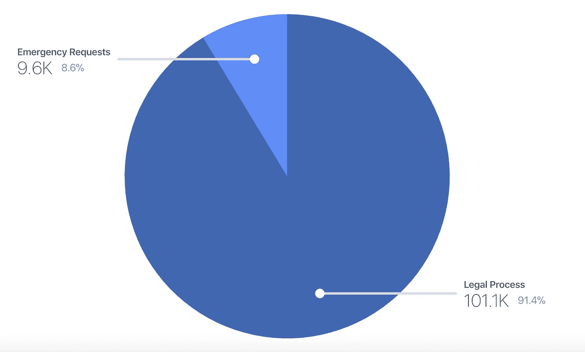
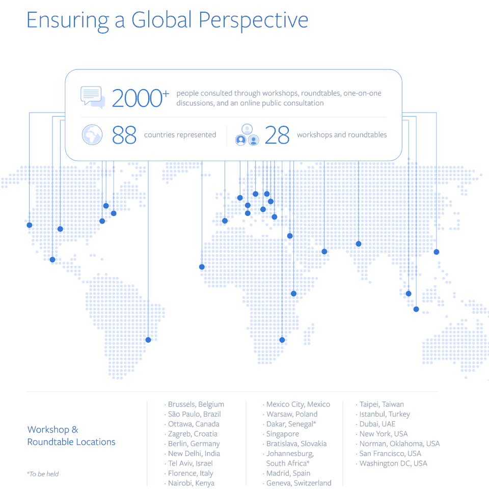
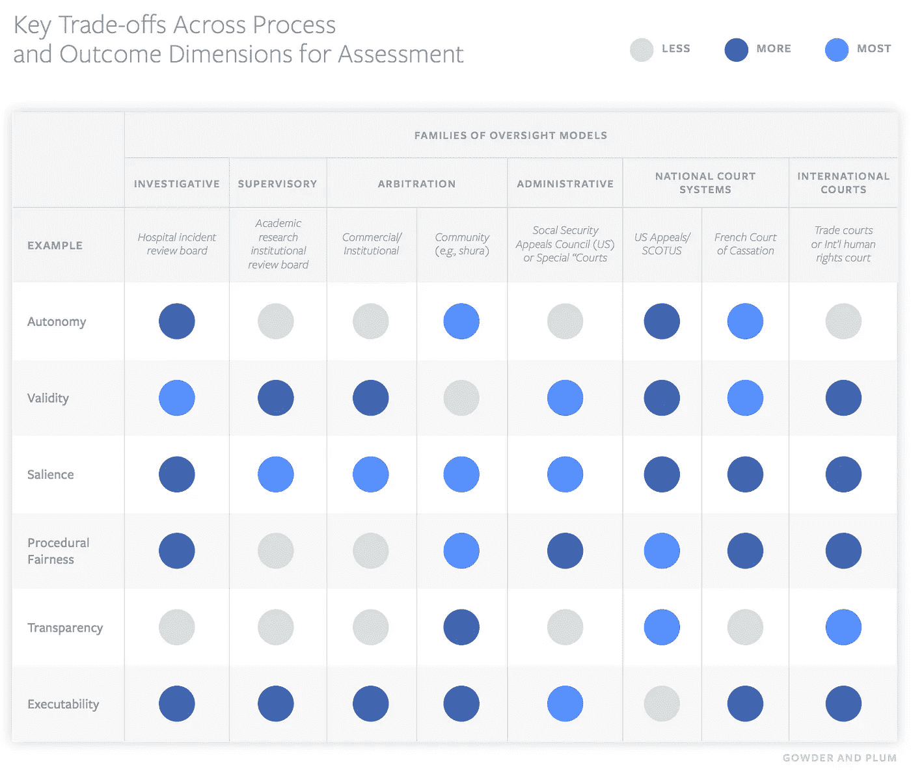

# 脸书如何定义与人工智能相关的恐怖主义？

> 原文：<https://towardsdatascience.com/artificial-intelligence-and-terrorism-in-social-media-cf166adaf78e?source=collection_archive---------26----------------------->

Photo by [@jankolar](https://unsplash.com/@jankolar) on Unsplash

## 人工智能与社交媒体中的恐怖主义定义

恐怖主义这个术语有多大用处？我认为这是没有用的，因为它把具体的辩论模糊成一种以暴制暴的反动模式。然而，从政治学的角度来看，这在某种程度上是一种社会建构主义的 T2 方法。日益证券化的人工智能将不可避免地被掺入这些大型社交媒体公司的政策过程中。让我来探讨一下脸书是如何解决这个问题的。

*在这篇文章中我将关注:*

*(1)脸书及其对恐怖主义的定义；
(2)进入人工智能的陈述方法；
(3)脸书日益壮大的安全团队；
(4)人类中庸的现实一面和可能的创伤；
(5)以美国为中心关注社交媒体上的恐怖问题；
(6)政府对用户数据的要求；
(7)即将成立的全球监督委员会可能为组织和政府使用人工智能树立先例；
(8)模糊的 Snapchat 恐怖主义，比较的展望 outro。*

## 1.脸书及其对恐怖主义的定义

2018 年，地球上最大的社交平台之一决定尝试定义恐怖主义，其内容如下:

*“为实现政治、宗教或意识形态目的，对人员或财产实施有预谋的暴力行为以恐吓平民、政府或国际组织的任何非政府组织。”*

在 2018 年 4 月 23 日发表的名为*困难问题的博客文章中:科技在阻止恐怖分子进入脸书方面有多有效？根据我自己的估计，中间有一段是这样的:*

> 互联网的民主化力量给全世界的个人、活动家和小企业带来了巨大的好处。**但是糟糕的演员一直试图利用它来达到自己的目的。白人至上主义者在 20 世纪 80 年代使用电子公告板，第一个亲基地组织的网站在 90 年代中期建立。虽然网络恐怖主义的挑战并不新鲜，但随着数字平台成为我们生活的核心，它变得越来越紧迫。在脸书，我们认识到保障人民安全的重要性，我们利用技术和我们的反恐团队来做到这一点。[粗体字已添加]**

脸书在这篇博客中声称:

1.  我们的定义与一个团体的意识形态或政治目标无关。
2.  我们的反恐政策不适用于政府。
3.  脸书的政策禁止恐怖分子使用我们的服务，但仅有政策是不够的。我们需要执行它。

尽管做出了这一声明，他们同时表示，他们的重点是 ISIS、基地组织及其附属组织，这些组织目前构成了最广泛的全球威胁。然而，这些也是美国最感兴趣和最优先考虑的问题。

## 2.脸书如何利用人工智能反恐？

这篇博文还提到了脸书写的一篇名为 [*难题:我们如何反恐*](https://newsroom.fb.com/news/2017/06/how-we-counter-terrorism/) 的文章。由全球政策管理总监[*莫妮卡·比克特*](https://www.facebook.com/mbickert1) *和反恐政策经理* [*布莱恩·菲什曼*](https://www.facebook.com/brian.fishman.5) *撰写。*本帖已于 2017 年 6 月 15 日发出。

这个帖子的顶点是**人工智能**。我们希望在我们社区的人看到之前，立即找到恐怖内容。脸书显然至少从 2017 年就开始使用人工智能来删除与恐怖主义相关的帖子(他们声称这是最近的事情)。当时，他们似乎把精力集中在 ISIS 和基地组织上。

*   *图像匹配:*当有人试图上传恐怖分子的照片或视频时，他们的系统会寻找图像是否与已知的恐怖分子照片或视频匹配。这样他们可以避免人们上传相同的视频。
*   语言理解:脸书已经开始尝试使用人工智能来理解可能鼓吹恐怖主义的文本。当时，他们正在尝试删除与之前已经删除的内容(历史数据)相关的文本
*   *清除恐怖分子集群:*脸书声称从对恐怖分子的研究中了解到，他们倾向于激进化和集群行动。这种线下趋势也反映在线上。他们使用一些信号，如某个帐户是否是大量因恐怖主义而被禁用的帐户的朋友，或者某个帐户是否与被禁用的帐户具有相同的属性。
*   惯犯:脸书表示，他们在检测惯犯创建的新虚假账户方面速度更快了。通过这项工作，他们已经能够大大减少恐怖分子惯犯帐户在脸书的时间。他们认为这个过程是“对抗性的”,因为对方一直在开发新方法。
*   *跨平台合作:*因为他们不希望恐怖分子在脸书应用程序家族中有一席之地，他们已经开始开发系统，使我们能够在我们所有的平台上对恐怖分子账户采取行动，包括 WhatsApp 和 Instagram。

在 2018 年第一季度，[报告称](https://newsroom.fb.com/news/2018/06/removing-bad-actors-from-facebook/)已经删除了 8.37 亿条垃圾邮件和 250 万条仇恨言论，并在全球禁用了 5.83 亿个虚假账户。这与该声明有关，该声明称，它是通过使用以下技术来辅助的:*“…机器学习、人工智能和计算机视觉..”*检测*“坏演员”*并更快地行动。他们特别提到了与选举有关的这一点。

2019 年，他们特别消除了他们所谓的“来自伊朗、以色列和俄罗斯的不真实行为”。

像克赖斯特彻奇枪击案这样的直播攻击需要人类的节制。LeCun 在最近的一次活动中表示，脸书还需要几年时间才能使用人工智能来实现大规模的视频直播。LeCun 缺乏训练数据的问题。“谢天谢地，我们没有很多真实的人开枪打其他人的例子，”你可以使用电影镜头训练识别暴力，但随后包含模拟暴力的内容将被无意中与真实内容一起删除。

> 自动化系统据称主要用作人类版主的助手。

人工智能不是适可而止的灵丹妙药。在这种背景下理解人工智能当然是不够的 **。**脸书有一个社区运营团队，该团队必须将个人资料和新闻故事区分开来。这种*‘更细致入微的方法’*需要人类的专业知识。了解脸书如何使用人工智能当然是不够的，如果不了解他们的实际安全团队如何管理这些工具以及框架。

## 3.脸书不断壮大的安全和安保团队

脸书饲料，因为该公司的 200 人反恐小组删除了他们。在剑桥分析公司隐私丑闻之后，脸书面临着压力，需要证明它能够监管自己。)2018 年报道。

脸书计划在 2017 年成为增加 3000 人的——每天 24 小时用数十种语言工作，审查这些报告并确定背景。该链接指的是马克·扎克伯格发布的一篇帖子，该帖子称，除了他们计划雇佣的人之外，他们已经雇佣了 4500 人。

2018 年 7 月 6 日(12 月 4 日更新)来自脸书的运营副总裁 Ellen Silver 声称要在全球范围内扩展，覆盖每个时区和 50 多种语言。他们还迅速增加了安全和安保方面的工作人员:

*“在脸书从事安全和安保工作的团队现在超过 3 万人。这个团队中大约有一半是内容审查人员，包括全职员工、承包商和我们合作的公司。”*

## 4.不安全给脸书工人造成创伤

2019 年 2 月，The Verge 发表了一篇名为[创伤楼层:美国脸书版主的秘密生活](https://www.theverge.com/2019/2/25/18229714/cognizant-facebook-content-moderator-interviews-trauma-working-conditions-arizona)的文章。这篇文章当然描述了这些主持人工作的挑战性条件，但是它也提到了在世界各地工作的 15，000 名主持人的统计数据。看起来确实有相当一部分是通过 Cognizant 等公司分包出去的，这些公司必须签署保密协议，因为保密是为了保护员工。

> ”总体而言，员工们描述了一个永远徘徊在混乱边缘的工作场所。在这种环境下，工人们通过讲关于自杀的黑色笑话来应对，然后在休息时间抽大麻来麻木他们的情绪。在这个地方，员工可能会因为一周犯几个错误而被解雇，而那些留下来的人则生活在对前同事回来寻仇的恐惧之中。”

也许具有讽刺意味的是，在试图处理恐怖事件时，会给处理者造成一定程度的创伤。《The Verge》报告中的某些关键发现似乎值得强调或至少考虑:

*   凤凰城的版主年薪仅为 28800 美元，而脸书普通员工的总薪酬为 240000 美元。
*   员工被微观管理到上厕所。两名穆斯林雇员被勒令在每天分配的九分钟“健康时间”内停止祈祷。
*   主持人通过讲述关于自杀的黑色笑话来应对看到的创伤性图像和视频，然后在休息时间吸食大麻来麻木他们的情绪。主持人通常在工作中很兴奋。
*   *员工在离开公司后出现类似 PTSD 的症状，但不再有资格获得脸书或 Cognizant 的任何支持。*
*   *员工们已经开始接受他们应该节制的视频和模因的边缘观点。凤凰城遗址是一个扁平地球人和一个大屠杀否认者的家。一名前雇员告诉我们，他不再相信 911 是一次恐怖袭击。*

根据这篇文章，这些中心通过准确性标准运作，这意味着被审查的帖子正在被审查。脸书设定的目标是 95%的准确率，但 Cognizant 通常没有那么高(接近 80–92%)。版主必须建议正确的社区标准违反或风险失去准确性。The Verge 的文章提到了版主必须考虑的几个不同的事实。

1.  社区指南、[公开发布的指南](https://www.facebook.com/communitystandards)和内部文档。
2.  已知问题。一份 15000 字的第二份文件，附有评注。
3.  试图达成共识的主持人之间的讨论。
4.  脸书自己的内部信息发布工具。

此外，据说保住一份工作的挑战可能相当困难:*“这份工作就像一个高风险的电子游戏，你一开始得 100 分——一个完美的准确性分数——然后抓啊抓，尽可能多地保留这些分数。因为一旦跌破 95，你的工作就有风险了。”*

被解雇的员工经常威胁要回去工作，并伤害他们的老同事。据 The Verge 报道，NDA 人通常会阻止你谈论你正在做的工作，甚至声明你曾经为脸书工作过:*“他们尽可能长时间地工作——当他们离开时，NDA 人会确保他们更深地隐藏起来。对脸书来说，他们似乎从来没有在那里工作过。从技术上讲，他们从来没有。”*

脸书对如何管理他们的政策有一个清晰的想法:

> “我们希望将个人观点和偏见完全排除在外——因此，理论上，两个评论相同帖子的人总是会做出相同的决定。”

在一份与《The Verge》的文章相矛盾的声明中，他们表示:“对内容审查者的一个常见误解是，他们受到配额的驱使，被迫做出仓促的决定。”据称，他们在三个地区有四名临床心理学家，负责设计、实施和评估弹性计划。然而，考虑到这些员工必须经历的工作，这种没有专业人员在现场的分散式精神护理是否可取是值得怀疑的。

## 5.以美国为中心的全球反恐

我们可以问一个简单的问题:当我们为世界设计政策和指导方针时，在给定的框架中什么观点是普遍的？正如你可能已经猜到的那样，我怀疑一个基于一个地点的通用框架是否能在全球范围内很好地运行。

他们的执法重点是伊斯兰恐怖组织，而不是右翼极端主义或其他形式的“恐怖”。他们与[微软、Twitter 和 YouTube 在与恐怖分子内容相关的哈希](https://newsroom.fb.com/news/2016/12/partnering-to-help-curb-spread-of-online-terrorist-content/)上有合作关系。这些都是总部设在美国的公司。

**反语音程序**。脸书支持几个主要反间谍计划。例如，去年我们与战略对话研究所合作发起了在线公民勇气倡议。[项目](https://www.edventurepartners.com/peer-to-peer-facebook-global-digital-challenge)的挑战是设计、试点、实施和衡量旨在抵制仇恨和暴力极端主义的社交或数字倡议、产品或工具的成功。据报道，它与欧洲 100 多个反仇恨和反极端主义组织进行了接触。

他们还与 Affinis Labs 合作，在马尼拉、达卡和雅加达等地举办黑客马拉松，在这些地方，社区领袖与科技企业家联手开发创新的解决方案，以抵制网络上的极端主义和仇恨。

> 我们希望脸书成为恐怖分子的敌对之地。

说到这里，他们引用了 1984 年，在一次失败的暗杀后，爱尔兰共和军(IRA)的声明:*“今天我们是不幸的，但是记住，我们只能幸运一次——你必须永远幸运。”从某种程度上来说，这句话很有道理，但你不可能永远回避一切。如果没有失败的余地，那么完美表面上的任何污点都会污染图像——当然这对脸书来说很重要。我们可以问，这种去中心化的适度决策，是否更容易将任何与安全和安保相关的“外部性”归咎于外部行为者。*

## 6.政府对用户数据的要求

如果有安全事件需要访问，当然可以访问脸书的数据。[2018 年下半年，政府对用户数据的请求](https://transparency.facebook.com/government-data-requests)在全球范围内增长了 7%，从 103，815 次增加到 110，634 次。美国继续提交数量最多的请求，其次是印度、联合王国、德国和法国。据脸书称，这反映了正常的增长。

作为请求的一部分，58%包括禁止脸书通知用户的保密命令。在对他们的美国国家安全报告指标的内部审查中，脸书发现它少计了来自《外国情报监视法》( FISA)的请求。脸书将这些请求分为紧急请求和法律程序。

Facebook may voluntarily disclose information to law enforcement where we have a good faith reason to believe that the matter involves imminent risk of serious physical injury or death.

理解这两种不同的数据请求可能是有用的:

***法律程序请求:*** *我们从政府那里收到的请求都伴随着法律程序，就像搜查令一样。我们仅根据我们的服务条款和适用法律披露账户记录。*

***紧急公开请求:*** *在紧急情况下，执法部门可以不经法律程序提交请求。根据具体情况，如果我们有充分理由相信该事件涉及严重人身伤害或死亡的紧迫风险，我们可能会自愿向执法部门披露信息。*

作为官方调查的一部分，政府官员有时会要求提供使用脸书的人的数据。这些请求绝大多数涉及刑事案件，如抢劫或绑架"

在此期间，脸书和 Instagram 根据 511，706 份版权报告删除了 2，595，410 条内容；基于 81243 条商标报告的 215877 条内容；以及基于 62，829 个假冒报告的 781，875 条内容。

脸书最近开始与专注于人工智能的伦理机构合作。这种合作关系的重点似乎是在安全方向，至少在慕尼黑，他们合作的研究所将解决影响人工智能使用和影响的问题，如安全、隐私、公平和透明。我之前已经描述过这可能是有问题的:一个自律道德行为的问题。

## 7.全球监督委员会确保全球视角

脸书正在创建一个全球监督委员会。在 2019 年 1 月[新任全球事务和沟通副总裁 Nick Clegg 的](https://fbnewsroomus.files.wordpress.com/2019/01/draft-charter-oversight-board-for-content-decisions-2.pdf)[帖子](https://newsroom.fb.com/news/2019/01/oversight-board/)中，发布了一份章程草案。草案列出了 11 个问题以及考虑因素和建议的方法。最近在 2019 年 6 月下旬[，脸书就此话题发表了另一篇文章](https://newsroom.fb.com/news/2019/06/global-feedback-on-oversight-board/)。

据称，他们(脸书)已经在世界各地举办了 6 次深入的研讨会和 22 次圆桌会议，有来自 88 个不同国家的 650 多人参加。他们与 250 多人进行了个人讨论，并收到了 1，200 多份公众咨询意见。

随后，脸书发布了一份 44 页的报告，名为*脸书内容决策监督委员会的全球反馈&输入。这涉及全球章程、董事会成员、内容决策和治理。尼克·克莱格在导言中指出:*

> “我们的任务是建立保护言论自由的系统，帮助人们与他们关心的人联系，同时仍然保持在线安全。我们认识到，我们不仅要公平行使我们的酌处权，还要建立与时俱进的结构，这是一项巨大的责任。我们现在面临的挑战是，在创建这个监督委员会的过程中，要支持、平衡和保障世界各地在我们平台上的每个人以及那些即将进入我们平台的人的言论自由和安全。”

这份报告认为脸书需要更多的民主。需要有 ***一个系统来上诉*** 。报告给出了不同的温和例子。报告还指出，脸书对全球现有的一系列监督模式进行了研究，确定了监督设计的六个“系列”。他们展示的网格是这样的。

According to the report public reason giving will be a crucial feature of the Oversight Board, one which drives at the heart of the legitimacy of its decisions.

章程草案建议，脸书将选择第一批成员，未来的选择将由理事会自己接管。该报告指出，将未来的选择留给理事会本身的提议引发了质疑，因为这可能导致*“递归问题”*和*“偏见的永久化”*针对理事会成员提出了几种方法:

1.  会员资格将由脸书用户通过完全民主的投票产生。
2.  一种混合方法，结合选择程序，使脸书、外部团体和用户都可以参与。
3.  征求公众对申请人名单的意见。
4.  邀请民间社会团体挑选一些董事会成员。
5.  要求政府对名字和候选人进行权衡。
6.  公开提名程序。
7.  从脸书用户中选择成员的随机抽签系统。

人们一致认为多样性很重要，尽管有人提到完美的代表性是不可能的。大多数人同意，脸书的雇员(现任和前任)应该被排除在董事会之外。有人建议固定期限为三年，可展期一次。

在报告中建议了两种提交方式，既可以让脸书发送重要或有争议的内容，也可以让用户使用。脸书提议，较小的陪审团，而不是整个董事会，将听取和审议案件。很明显:*“一个强烈的共识是理事会的决定应该影响脸书的政策制定。”*

有人指出，脸书将设立一个独立的信托基金来支付董事会成员的薪酬。有人认为，该委员会需要自己的工作人员，他们应该完全独立于脸书。董事会的范围将是内容治理。然而，有人指出，理事会可以听取其他政策问题，如:*“…算法排名、隐私、当地法律、人工智能、货币化、政治广告和偏见。”*

因此，可以说，脸书和人工智能领域可能会受到该委员会在未来做出的决定的影响，如果该委员会可能成立的话。事实上，考虑到脸书的规模，这既可以影响私营公司采取某些做法，也可以影响国家根据这个半独立的委员会作出的决定立法。内部报告的结论指出:

> “脸书发现自己处于历史上独特的地位。它不能剥夺或给予任何人言论自由，但它是实现全球言论自由的渠道。”

## 模糊的 Snapchat 恐怖主义？比较研究 outro

在他们的[社区指南](https://www.snap.com/en-US/community-guidelines/)中，Snapchat 没有定义恐怖主义，但是他们写道:*“恐怖组织被禁止使用我们的平台，我们不能容忍宣扬或推动恐怖主义的内容。”然而，我们可能会问自己两个问题:什么是恐怖组织，如果恐怖主义仍未被定义，那么鼓吹恐怖主义在实践中意味着什么？你可以采取“当我看到恐怖主义时我就知道”的方法，但这种方法会留下很多模糊的选择，而不透明的决策。这似乎是恐怖主义邪恶问题的一部分:定义。*

国际政治中的恐怖主义很难定义，你如何定义它也很大程度上说明了你如何更广泛地思考政治。虽然众所周知很难界定，但如果脸书的监督委员会出现，这可能是未来要进行的讨论之一。脸书一直关注伊斯兰恐怖主义，而不是美国的右翼极端主义或枪支暴力，这是一个令人担忧的例子。然而，他们建立董事会的举动可能是一个恰当的回应。

不同政府要求用户数据的监管或方式应继续受到透明的严格审查。国家是一个可以施加暴力的行为者；国家造成的暴力可能是模棱两可的，特别是当有人声称 T2 支持恐怖主义的时候。最肯定的是，国家可以使用恐怖手段，而且它正在发生，所以恐怖分子必须在少数群体中；是种族灭绝还是恐怖；这种区别重要吗？

在某些情况下，恐怖是为了吓唬人——暴力被用在限制性的情况下。非国家行为者非法使用暴力是为了传播意识形态吗？如果是这样的话，那么在一个由脸书管理的董事会中，谁的意识形态以及对多样性的担忧是真实的。何时证明干预是正当的，而不是如何证明干预是正当的，这可能很重要，因为实用主义的定义是普遍利益的产物。

在不对称的权力分配中，什么时候暴力行为是弱者的*武器*？毒枭和资助政治权力的大型资源利益集团有什么区别？目标方面值得考虑:知道某人的意图，但是形成这个意图的环境同样重要。在恶劣的工作条件下缓解恐惧只是众多例子中的一个。

如果我们认真看待我们是有想法的个体，有一些模式，但很多是很难预测的。如果很难预测人类的行为，那么就很难知道人们的目的，也很难看出人们的意图。

钱从哪里来？我们有数据经纪人，但目前没有足够的监管来确保数据流是负责任的，或者无意中被出售给打算将数据用于此目的的团体。恐怖主义模糊了——它不是一个价值中立的术语。技术根本不是价值中立的。它与证券化和国家权力的理念以及技术为善的伦理话语联系在一起。

给它贴上恐怖分子的标签是另一种分类。理解是如何预防它的一个重要工具。在内容适度的快速发展中，把 T 字放在上面是诱人的，然而我们需要参与其中。

尽管我们有必要尊重大公司试图缓和与国家机构合作的方式，但我们也需要持批评态度。罗伯特·考克斯说得好:“理论永远是为了某人或某事。”在这方面 ***也许技术总是对某人或某事过于*** 。我将以今天在课堂上分享的一段视频作为结束，这段视频对恐怖主义的标签提出了一个批判性的观点:

**这是第 500 天的第 53 天**

我已经坚持每天写一篇文章 50 天了。这些文章在探索人工智能领域中社会科学和计算机科学的交叉方面表现一般。