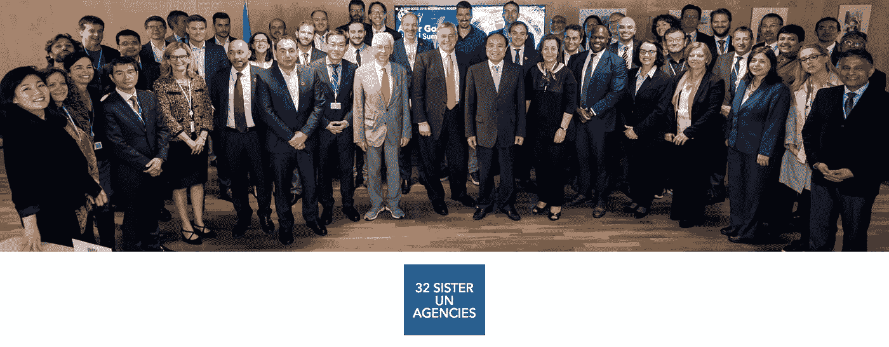
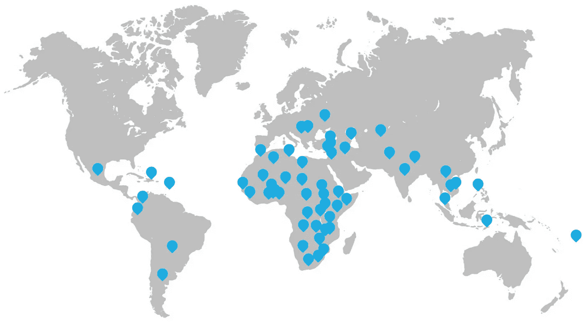
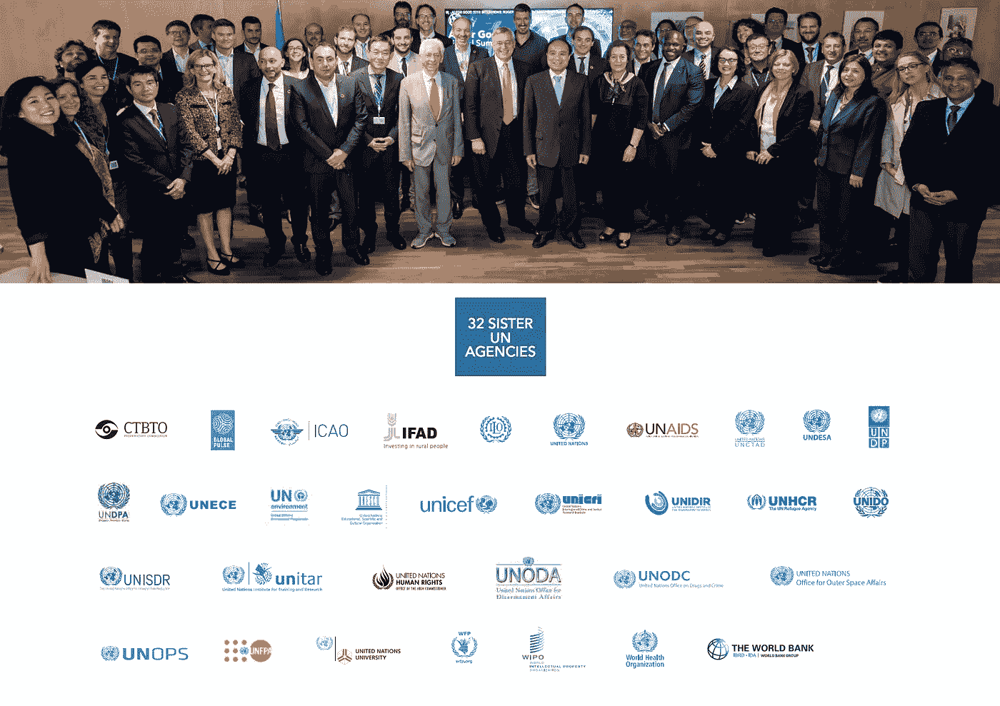

# 人工智能与联合国开发计划署

> 原文：<https://towardsdatascience.com/artificial-intelligence-and-the-undp-779b50de9acd?source=collection_archive---------19----------------------->

A screenshot of page 62 of the compendium United Nations Activities on Artificial Intelligence from 2018

## 用人工智能消除贫困和减少不平等

我以前曾评论过，人工智能安全的话题应该同样涉及确保人工智能领域为气候变化或减少不平等等重要目标服务。在这方面，我觉得开发计划署的战略很有意思。

开发署致力于通过国家的可持续发展消除贫穷和减少不平等。这项任务正在 170 多个国家和地区进行。最近，联合国开发计划署发布了 2019-2021 年数字战略。由于这可能会对开发署正在开展的工作产生影响，并且人工智能被提到是他们战略的一个突出方面，我决定深入研究人工智能和开发署。

## 在联合国开发计划署 2019-2021 数字战略中，人工智能是一个重要的机遇

在他们名为*重大机遇*的 2.1 版新战略中，他们首先提到了人工智能，以及一系列其他技术*‘在各个层面震撼我们的世界’*。根据他们最近的报告，开发署正在这方面进行组织变革:

> “数字化转型是全面的，它不仅仅是一个 it 问题，也不仅仅是一个关注运营和管理的问题。我们的数字化转型将把开发署内部和我们的合作伙伴网络之间的知识联系起来，为我们的服务对象提出更好的想法。”

他们分成三个“工作流”。

1.  在第一个工作流程中，他们的目标是建立领导力并使其成为可能。因此，可以说他们正在扮演一个更加积极的角色。他们可能已经聘请了一名联合国开发计划署首席数字官(CDO)，至少在 2019 年 3 月发布了该职位的招聘广告。他们也将在实践网络社区中招募数字冠军。
2.  在第二个工作流程中，他们致力于支持 IT，协调 IT 战略和数字战略以“利用”数字信息。他们旨在聚合和收集第三方数据，并建立面向客户的主动服务。他们提到 DevOps 和设计思维是这方面的重要方法，可以更好地响应内部和外部客户的请求。
3.  作为补充，第三个工作流的重点是增强企业的数字化能力。他们将通过促进创新来做到这一点；数字素养；数字通信；联盟和生态系统；和灯塔计划。

***“数字灯塔”项目(据联合国称):*** *是一个短期的、明确的、可衡量的方案，使用数字技术，可以作为一个榜样——整个组织内类似方案的“灯塔”。*

他们确实在战略中简单提到了数字鸿沟，并不是所有的问题都能通过技术解决。有一篇来自 2018 年的 [UNDP 博客帖子，对将 AI 视为一系列积极项目中的救星进行了批判性思考。在这一战略中，没有太多的重点放在规划问题上，而是更多地关注要采取的行动。一个*战略*毕竟可以说是一个行动计划，旨在实现一个长期或总体目标。尽管联合国开发计划署是一个被认可的大型组织，但他们无法独自取得很大成就。](https://www.undp.org/content/undp/en/home/blog/2018/let_s-talk-about-artificial-intelligence.html)

## 开发署于 2018 年加入人工智能伙伴关系

[8 月 1 日——联合国开发计划署(UNDP)加入了人工智能伙伴关系(Partnership on Artificial Intelligence，AI)](https://www.undp.org/content/undp/en/home/news-centre/news/2018/undp-joins-tech-giants-in-partnership-on-ai.html) ，这是一个由公司、学者和非政府组织组成的联盟，致力于确保人工智能以安全、道德和透明的方式发展。[2016 年由科技巨头](https://www.partnershiponai.org/)——亚马逊、deep mind/谷歌、脸书、IBM 和微软——成立，此后埃森哲、英特尔、牛津互联网研究所——易贝牛津大学，以及联合国儿童基金会和人权观察等非营利组织[以及更多](https://www.partnershiponai.org/partners/)加入。

## 开发署加速器实验室

我确实同意开发计划署正在与这些公司建立的伙伴关系，我要说的是，在它们的数字战略中非常清楚地表明，这有一个明确的业务重点(有人会说是创业——自下而上)。除此之外，他们还与联合国开发计划署加速器实验室一起扩大规模。它们是:*“围绕发展挑战构建全球最大、最快的学习网络。”*然而人工智能在他们的网站上被迅速提及:*“人工智能对失业的影响”，*(检索 2019 年 8 月 13 日)。

The Accelerator Labs are UNDP’s new way of working in development. Together with our core partners, the State of Qatar and the Federal Republic of Germany, 60 labs serving 78 countries will work together with national and global partners to find radically new approaches that fit the complexity of current development challenges. ([UNDP](https://acceleratorlabs.undp.org/))

“这些实验室是由人种学家、企业家、工程师和设计师组成的团队，我们将他们带入联合国开发计划署，与我们在生物多样性、性别平等和减贫方面的专家合作。”然而，这些实验室表面上确实有一种明显的“科技感”,然而我可能错了。

## 与大型科技公司合作

我将快速说明美国几家大型科技公司的经济实力，这只是为了暗示这些公司现在的重要性。此外，在与开发相关的问题中，这些参与者将扮演越来越重要的角色，因为他们进入了讨论治理相关问题的空间，至少这是我温和的预测。

美国五大科技巨头(亚马逊、苹果、脸书、微软和 Alphabet)在 2018 年的总收入超过 8000 亿美元，这将使成为世界上 GDP 排名前 20 位的国家。

开发署的创新基金将通过这一伙伴关系与社区合作，负责任地测试和推广人工智能的使用，以实现可持续发展目标。*“通过利用数据的力量，我们可以为风险、政策和项目评估提供信息，我们还可以利用机器人和物联网(IoT)来收集数据，并达到以前认为无法达到的目标——不让任何人掉队。”*

## 联合国关于人工智能的活动

2018 年人工智能全球峰会汇集了人工智能创新者和公共及私营部门决策者，包括 30 多个联合国机构，以制定人工智能战略和支持项目，加快实现联合国可持续发展目标(SDG)的进展。

在"联合国伙伴会议"上进行了讨论，并有一份关于联合国人工智能活动的汇编[,其中包括 27 个联合国机构的两页报告汇编:列于附件——禁核试组织、民航组织、劳工组织、国际电联、UNAIDS、贸发会议、经社部、开发署、欧洲经委会、环境署、教科文组织、人口基金、联合国全球脉动、难民署、儿童基金会、犯罪司法所、裁研所、工发组织、联合国减灾办公室、训研所、裁军厅、外空办、联合国大学、WFP、世卫组织、知识产权组织和世界银行集团。](https://www.itu.int/dms_pub/itu-s/opb/gen/S-GEN-UNACT-2018-1-PDF-E.pdf)

2018 年 9 月 24 日，在纽约联合国人口基金总部举行的 AI for Good UN Partners 会议上，首次讨论了该简编。

> 会上商定，联合国人工智能活动简编将与联合国行政首长理事会所有成员共享。

A screenshot of page 62 of the compendium United Nations Activities on Artificial Intelligence

## 与开发署一起建立人工智能组合

开发署的人工智能组合正在迅速增长。无人驾驶飞机和遥感被用于改善数据收集和知情决策:在马尔代夫用于备灾，在乌干达让难民和收容社区参与共同发展基础设施。他们与 IBM 合作，使开发计划署的快速综合评估自动化，使国家发展计划和部门战略与 169 个可持续发展目标保持一致；联合国开发计划署与联合国环境规划署合作，在 T2 启动了联合国生物多样性实验室。空间数据平台将帮助各国支持保护工作，加快实现 2030 年议程。

这符合开发署 2018-2021 年战略计划，其中创新在完成该组织的使命和实现可持续发展目标方面发挥着核心作用。

**这是第 500 天的第 72 天。我目前第 50-100 天的重点是人工智能安全。如果你喜欢这个，请给我一个答复，因为我确实想提高我的写作或发现新的研究，公司和项目。想聊什么或者讨论什么请联系！**