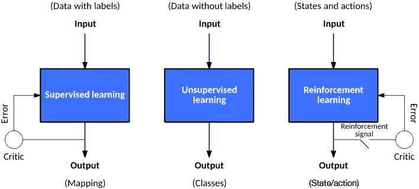

# 人工智能和训练数据

> 原文：<https://towardsdatascience.com/artificial-intelligence-and-training-data-8020a8e2279c?source=collection_archive---------28----------------------->

Photo by [@maxvdo](https://unsplash.com/@maxvdo)

## 什么是数据，如何在机器学习中使用数据，如何收集数据？

在脸书的一个关于人工智能和深度学习的小组上发布了一个帖子，要求探索一些主题，其中最有趣的一个是训练数据。

问题是:

> “你能试着写一篇关于训练数据的重要性以及如何获得它们的文章吗？对于一些模型来说，训练数据真的很难获得，就像定制语音到文本一样，很难有人获得那么多小时的语音数据。”
> —赛·拉格哈瓦

我在各种文章中写过数据，但是我还没有具体写过测试数据，所以我会尽力而为。

首先解释什么是人工智能环境中的测试数据，特别是机器学习技术，然后讨论如何解决这个问题。

***测试数据*** *是* ***数据*** *，其已经被专门识别用于* ***测试*** *，典型地是计算机程序。*

> “在机器学习中，一个常见的任务是研究和构建可以从数据中学习并对数据进行预测的算法。这种算法通过从输入数据建立数学模型，做出数据驱动的预测或决策。”

但首先，什么是数据？

## 什么是数据？

虽然这应该是一个简单的问题，但事实并非如此。

在最近的一次会议上，我与布鲁塞尔自由大学的法学教授 Gloria González Fuster 进行了交谈。

她职业生涯中的大部分时间都在尝试浏览数据的法律定义，她也有通信科学的背景。

许多输入人工智能系统的数据是法律描述的“个人数据”，因为它们与可以被识别的人有关。

这些人在法律上又被称为“数据主体”，而那些决定数据处理的人是“数据控制者”。

她建议将所有参与数据制作和处理的人重新定义为“数据制作者”。

她认为我们对数据的理解存在一些重大差距。

她让观众闭上眼睛几秒钟，试着想象什么是数据。

试着闭上眼睛，想象几秒钟数据是什么。

当然，播放这个视频。

Gloria 讲述了一个有趣的故事，一名女子向 Tinder 询问帮助算法确定应该向她展示哪些男性的数据。她发现这是一个相当具有挑战性的过程。

认识到数据定义和数据所有权是复杂的，我们可以转向更二元的定义。

**结构化数据是指驻留在记录或文件内固定字段中的任何数据。这包括关系数据库和电子表格中包含的数据。**

****非结构化数据*** *(或非结构化信息)是没有预定义的数据模型或者没有以预定义的方式组织的信息。**

## *机器学习中的输入数据*

*我以前写过不同类型的学习框架。因此，我总结和概括了这可能看起来像在这里的数据。*

***监督学习**从标注为 [*的*训练数据**](https://en.wikipedia.org/wiki/Training_set) *中推断出一个函数。**

***无监督学习**在没有预先存在标签的情况下，帮助在数据集中发现以前未知的模式。*

***强化学习**关注的是软件代理应该如何在一个环境中采取行动，以最大化某种累积回报的概念。*

*社会科学家马克斯·韦伯在建立这样的模型时描述了理想类型:抽象的、假设的概念的构建。*

**

*From an [article by M. Tim Jones](https://developer.ibm.com/articles/cc-models-machine-learning/) written in 2017 retrieved the 19th of October 2019.*

*将这些方法结合起来并添加到其他方法中也正在发生。*

***半监督学习**利用未标记数据进行训练——通常是少量标记数据和大量未标记数据。*

***数据扩充**是一种策略，使从业者能够显著增加训练模型可用数据的多样性，而无需实际收集新数据。*

*谷歌人工智能提出的一篇研究文章中的最后两个组合就是我之前写的内容。*

* [## 无监督数据增强的半监督学习研究进展

### 为什么对人工智能领域很重要？

towardsdatascience.com](/advancements-in-semi-supervised-learning-with-unsupervised-data-augmentation-fc1fc0be3182) 

用于构建最终模型的数据通常来自多个数据集。这用于拟合参数，例如人工神经网络中的权重，然而，它也可以来自少数数据集，这些数据集正在被增强或实验，直到得到结果。它甚至可以从没有或很少的数据开始，而不是在头脑中有一个特定的目标，技术定义有点松散。

Cartoon by [xkcd](https://xkcd.com/2173/)

## 聚合还是不聚合，这是一个问题

我想说，爱是聚合数据问题的答案，其实不是。

***数据汇总*** *是收集信息并以汇总形式表示的任何过程，用于统计分析等目的。一个常见的聚合目的是基于特定变量(如年龄、职业或收入)获取特定群体的更多信息。*

答案是，聚合数据是一个巨大的业务和不断增长的行业，已经成为使用各种技术来实现它。如果我们回到问题的一部分:

> …有人很难获得这么长时间的语音数据

我们可以后退一步或横向考虑这个问题。

> …某人很难获得…数据

很难获得数据。当你要求数据时，你所期望的可能不是对数据获取的批判性的看法，然而这就是你所得到的。下面是我写的两篇文章来说明这一点。

**数据存储*(动词；******)*:***通过引发情绪反应诱使某人提交数据*。

 [## 数据存储

### 获取数据的有趣方式

towardsdatascience.com](/databaiting-d26cad4c49ca)  [## 使用 FaceApp 进行数据绑定🤷

### 除了对国家归属和人工智能恐惧的痴迷

medium.com](https://medium.com/zero-equals-false/databaiting-with-faceapp-1d810089f61d) 

我举的一个例子是 spit → 23andMe 被葛兰素史克部分收购，葛兰素史克是世界上最大的制药公司之一，现在使用你的 spit 进行药物测试(如果你把你的 spit 发给他们)。

如果我们以“语音数据”为例，让我们考虑一下 Alexa。亚马逊 Alexa 正在收集前所未有的大量语音数据，它不确定他们是否会[完全删除这些数据，即使你要求他们](https://www.theverge.com/2019/7/3/20681423/amazon-alexa-echo-chris-coons-data-transcripts-recording-privacy)，尽管我们应该希望他们在一定程度上遵守 GDPR。

如果你问某人:“嘿，你能给我关于你家的布局和你的生活模式的所有信息吗？”听起来很唐突。

如果你说:“嘿，我有一个神奇的新吸尘器，它可以清洁你的地板，而你不需要动一根手指。”更简单。

让我们以言语为例。

“嘿，只要把你的声音上传到这里，你就可以得到一个真实的声音版本来愚弄你的朋友。”听起来不错，很有深度。

 [## 自动化的类似人类的文本到语音~ Voicepods

### Voicepods 是一种易于使用的服务，可以使用最先进的技术将您的内容转换为真实的声音

www.voicepods.com](https://www.voicepods.com/) 

你可以看看 Mozilla 让你捐出你的声音来考虑一下不同之处:

 [## Mozilla 的共同心声

### Common Voice 是一个项目，旨在帮助让语音识别对所有人开放。现在你可以捐出你的声音来帮助我们…

voice.mozilla.org](https://voice.mozilla.org/en) 

你可以让你的朋友为你的机器学习项目贡献他们的声音。如果你有 10-100 个朋友，这是你可以利用的数据。如果你在你要处理的领域内有更具体的数据，那么这些数据可能更具体地针对你要解决的问题。

尽管你应该记住技术债务和知识债务。如果您不了解哪些培训数据在 IT 基础架构的什么地方使用过，情况可能会很糟糕，甚至是灾难性的。同样，如果你不理解你所接受的决策训练，也许是因为庞大的数据集，它可能会带来自身的风险。

*   什么是数据，什么不是数据，可能没有我们想象的那么简单。
*   如果你不这么认为，那么非结构化数据和结构化数据是一个相当实际的区别。
*   不同的学习形式可能会对您的培训数据提出不同的要求。
*   记住你的训练数据在哪里，什么时候训练的，它可能会过时。

这些是由一个有趣的问题引发的一些即时想法。

另一个问题是:你愿意在聚合数据方面走多远？

你有多确定你的数据值得使用？

Gif by [**@yipan**](https://giphy.com/channel/yipan)

我希望你喜欢这篇短文。*这是第 500 天的第 137 天。500 天来，我每天都写一篇关于人工智能或与之相关的新文章。**