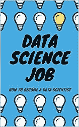

# 2020 年你应该读的人工智能书籍

> 原文：<https://towardsdatascience.com/artificial-intelligence-books-you-should-read-in-2020-4d3cecd21efa?source=collection_archive---------13----------------------->

## 为自动化时代的未来做好准备

人工智能成为 2019 年最流行的话题之一。由于人工智能在许多行业和我们日常生活中的实际应用，它将继续存在。这就是为什么你应该通过阅读顶级人工智能书籍，为我们的技术未来做更好的准备。我把它们分成三大类:社会学、哲学和商业导向。

Best Artificial Intelligence books to read in 2020

# 社会学人工智能书籍

最紧迫的问题是，人工智能将如何影响我们人类，以及它将为我们带来什么样的未来。我们生活在自动化时代，因此我们必须制定正确的政策——既要促进现在的增长，又不能浪费我们的未来。

《德乌斯人:明日简史》现在是一本关于技术，尤其是人工智能如何影响社会的经典书籍。作者提出了一个历史的观点，并讨论了我们现在和未来的分歧。必读！

[奇点临近](https://www.amazon.com/gp/product/B000QCSA7C/ref=as_li_tl?ie=UTF8&camp=1789&creative=9325&creativeASIN=B000QCSA7C&linkCode=as2&tag=petacrunch-20&linkId=7f06d54776eba2b7924ae8432cffba4a)普及了术语“技术奇点”，并展示了它将对我们产生的社会学影响。作者是一位著名的未来主义者，他按照自己的原则生活。

# 哲学人工智能书籍

如果我们想展望未来，等待我们的是一个技术奇点，一个人工智能能力将超过人类的时刻。这将是一个巨大变化的时刻，虽然它可能永远不会到来，但从未来的角度思考我们现在正在做的事情是值得的。

[超智能](https://amzn.to/35rxe1B)是思考人工智能和人工通用智能的经典参考。尼克·博斯特罗姆列出了其他作者经常使用的所有理论。不容易读懂，但非常令人满意。

Life 3.0 是对人工智能的又一次尝试，如果人工智能比我们聪明得多，这对人类意味着什么。它有非常好的例子，并以一个迷人的故事开始，讲述了 AGI 如何进入世界并让一家公司占据主导地位。

# 面向商业的人工智能书籍

如果不是在这么多领域发现了这么多应用，人工智能也不会那么受欢迎。以机器学习的形式使用 AI 无处不在。这里有一个非常实用的专注于人工智能的商业书籍列表。

《人工智能的超能力》不仅是中国如何利用人工智能造福人类的绝佳参考，也是中国初创企业生态系统的绝佳参考。和硅谷有多么不同。

[Artificial Intelligence Business](https://amzn.to/37kBr99)

[人工智能商业](https://amzn.to/37kBr99)是为商业人士和商业导向的数据科学家提供的人工智能简明指南。注重实际，关注最新趋势。

[应用人工智能](https://amzn.to/37ldLkM)是为商业领袖设计的。它为你提供了一个思考机器学习、深度学习、AGI、人工智能的框架，并展示了当今商业世界中的多个用例。

请留言告诉我你对这些书的看法。

如果你想看更多的技术书籍，请看我列出的 2020 年你应该看的[数据科学书籍](http://www.datasciencerush.com)。

 [## 加入我的人工智能时事通讯

### 让我们保持联系——每周或每两周一次关于技术和人工智能的电子邮件。](https://creative-producer-9423.ck.page/c3b56f080d) 

最后，如果你想了解成为一名数据科学家意味着什么，那么看看我的书[数据科学工作:如何成为一名数据科学家](https://amzn.to/3aQVTjs)，它将指导你完成这个过程。

Data Science Job