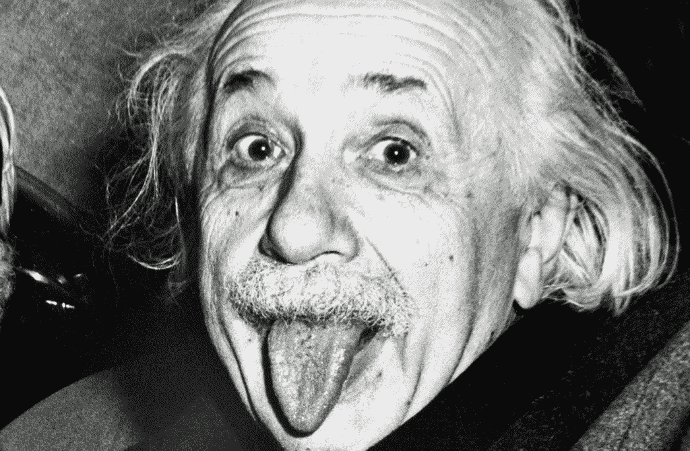

# 人工智能永远不可能是真正的智能

> 原文：<https://towardsdatascience.com/artificial-intelligence-can-never-be-truly-intelligent-227fe9149b65?source=collection_archive---------12----------------------->

## 不要称机器是智能的——至少现在还不要

Photo by [Alex Iby](https://unsplash.com/photos/-iFhGZP_mhk?utm_source=unsplash&utm_medium=referral&utm_content=creditCopyText) on [Unsplash](https://unsplash.com/search/photos/artificial-intelligence?utm_source=unsplash&utm_medium=referral&utm_content=creditCopyText)

假设我被锁在一个房间里，给了我一大堆中文写作。我不懂中文，既不会写也不会说。我甚至无法将文字与其他类似的文字区分开来，比如日语。现在，我收到了第二批作品，但这次是一套英文说明(我知道如何将第一批作品与第二批作品联系起来)。我使用这些英文说明来寻找写作中的模式和常见符号。

然后我收到了第三批文章，同样是一套英文说明，这有助于我把它与前两批联系起来。这些说明还帮助我用相同的符号和字符来组织一个回答。这样下去。

过了一段时间，我对这个游戏变得如此精通，以至于没有人仅仅通过看我的回答就能判断出我是否是一个母语为汉语的人。但这是否意味着我懂中文？当然不是。

这个聪明的例子，叫做**中文房间论点**，来自约翰·r·塞尔的*头脑、大脑和程序(1984)*【1】强调了我们对人工智能理解的根本缺陷。这篇文章歌颂了这样一种观点，即我们试图人为制造的“智能”并不是真正的“智能”,你和我都认为这是我们人类的固有特征。这不过是对人类智慧的模仿或幻想。

# 什么是智能？

多年来，心理学家、研究人员和哲学家试图正式定义智力的概念。尽管有长期的研究和争论，人们已经对智力的定义进行了多次不同的尝试，但是至今还没有一个标准的定义。

通俗地说，我们在日常对话中使用“智能”一词；但是这里的上下文只意味着对人的相对“聪明”的主观测量。当非正式使用时，这个词暗指在个人水平上达到非常具体的程度的智力。在这篇文章中，我们只关注一般智力作为人类的一个定义特征。

莱格和赫特，*通用智能:机器智能的定义(2007)*【2】*试图定义一个智能的通用衡量标准。他们提出了一个通用定义，该定义考虑了迄今为止提出的大多数定义[3]:*

> *智能衡量代理在各种环境中实现目标的能力。*

*这可能是我们最接近的一次，但仍有不足。这个定义集中在一个基于目标的，可观察的代理特征。它意味着，为了让智能存在，它必须被观察者感知，并且主体必须被某种目标的完成所驱动。*

*这篇文章对智力提出了不同的看法，它与人类的本性有着千丝万缕的联系。澄清一下，这不是科学的观点，而是哲学的观点。*

# *智慧的人性*

*人类已经进化成智慧生物。Yuval Noah Harari 在《智人:人类简史》中用认知革命的理论阐述了这一点，这一理论将我们与地球上的其他物种区分开来，并使我们成为今天地球上的主导物种。因此，我们可以假设人类的智力是我们“智力”的黄金标准。*

*但是为什么我们从智力的正式定义中排除了我们与生俱来的人性呢？仅仅是关于计算能力，信息处理和记忆吗？为什么只衡量生产率和效率？*

*除了执行任务的能力，我们还需要考虑无形的因素——智慧、幽默、道德、伦理、自由意志、自我意识、直觉和意识——更不用说创造小说的能力了。正如哈拉里提到的，讲故事的能力是推动我们物种成为地球主人的原因。*

*不用说，这也意味着要考虑到人类更黑暗的一面——欺骗、自私、撒谎和欺骗的能力。这种创造小说的能力——讲故事的艺术——就是我们所说的想象力。如果爱因斯坦之所以是爱因斯坦，仅仅是因为他拥有庞大的信息和知识储备，加上处理这些信息的超常能力，那么任何一台超级计算机都将能够取代他，我们今天就能够复制数百万份他的大脑。*

**

**“Imagination is more important than knowledge” — Albert Einstein**

# *人工智能呢？*

*人工智能研究人员使用许多可用的智能定义中的一个作为他们创造人工“智能”代理工作的基础。在谷歌上快速搜索一下，就能得出人工智能的定义:“能够执行通常需要人类智能的任务的计算机系统的理论和发展，如视觉感知、语音识别、决策和语言之间的翻译。”*

*那我们一起玩吧。想象一台遵循指令、执行任务并做出决策的机器——然而它不知道它*是什么*，不知道它在做什么，*为什么*它在做，或者它的目的是什么。它甚至不想知道。机器比你更快，更擅长存储海量数据，效率更高。它能以光速进行计算，服从 T 的指令，听从命令，还能下一盘非常好的棋。*

*然而，无论移动有多快，游戏玩得有多有效率，策略看起来有多“聪明”——它仍然被限制在棋盘的四个角上，并且机器在一套预定的规则下工作。这台机器要么被预先编程，要么吸收大量数据并从中学习。不管怎样，它的知识仅限于它接触过的东西。*

*机器会作弊吗？它会不会愤怒地突然发飙，沮丧地掀翻棋盘？它的目标很明确:赢得比赛。没有古怪和不可预测的空间。例如，机器感觉不到来自对手恐吓战术的压力，因为它不理解恐吓的概念。情绪与游戏无关。另一方面，当我们在国际象棋比赛中与 Vishwanathan Anand 对决时，我们可能会流汗、紧张和恐慌。*

*AlphaGo 可能会在围棋比赛中击败 Lee Sedol，DeepBlue 可能会在国际象棋比赛中击败加里·卡斯帕罗夫，但这些都是只有一个目标的“弱人工智能”。他们不是多面的智慧生物。像那样的机器只不过是一种超高产、高效率的工具——一种达到目的的手段；本身不是一个独立的存在。一个高效的工厂工人当然可以被一台高效得多的机器取代——但是自动化并不等同于智能。*

**

**“****It’s a human thing****. You wouldn’t understand” — A fantastic movie called “I, Robot” (2004)**

# *人类，还是“像人类”？*

*我们今天所知道的人工智能正在拼命地玩模仿游戏。这就引出了一个问题——如果我的行为完全像人类，那我是人类吗？*

*聊天机器人在这方面做得很好。现在很多聊天机器人都可以轻松通过图灵测试。它们模仿人类情感的程度令人恐惧。这并不意味着机器人是人类。这意味着机器人在创造情感幻觉方面非常出色，即使它们没有情感幻觉。自然，你似乎从机器人那里得到的“情感支持”是一场闹剧。*

*人工智能可以创作音乐、绘画并模仿人类的声音调制和语音[4]——但它们仍然遵循一种算法；一套预编程的规则和模式。就算他们有能力创作艺术，他们的创作中有没有感悟？他们对自己的工作感到自豪吗？他们会有意识地把情感和它联系起来吗？*

*对错的问题在这里也不重要。有些人可能会说，如果机器没有“感觉”会更好，这样它就可以在人们可能失去判断力或在情感压力下反应迟钝的情况下工作。当涉及到决策时，没有感情的代理人也确保公平和冷酷的理性。但是如果人性是智力的障碍，那么这些特工肯定没有资格坐在桌子旁边。*

*今天，我们试图达到的目标和真正的智能相距甚远。我们目前的定义和观点是错误的——我们只考虑基于目标的方法来衡量智力，但我们没有考虑到将人与机器分开的特征:自我意识。只要我们继续把头脑和大脑分开，我们可能永远无法实现机器的真正智能。*

## *参考资料:*

**[1]塞尔，J. R. (1984)。头脑、大脑和程序；* [*中的文章行为与脑科学*](https://www.researchgate.net/journal/0140-525X_Behavioral_and_Brain_Sciences)*3(3):417–457:*[*https://www . law . upenn . edu/live/files/3413-sear le-j-minds-brains-and-programs-1980 pdf*](https://www.law.upenn.edu/live/files/3413-searle-j-minds-brains-and-programs-1980pdf)*

**【2】*[*http://www . vetta . org/documents/legg-hut ter-2007-universal-intelligence . pdf*](http://www.vetta.org/documents/legg-hutter-2007-universal-intelligence.pdf)*

**【3】*[*http://www . vetta . org/documents/A-Collection-of-Definitions-of-intelligence . pdf*](http://www.vetta.org/documents/A-Collection-of-Definitions-of-Intelligence.pdf)*

**【4】*[*https://blogs.microsoft.com/ai/xiaoice-full-duplex/*](https://blogs.microsoft.com/ai/xiaoice-full-duplex/)*