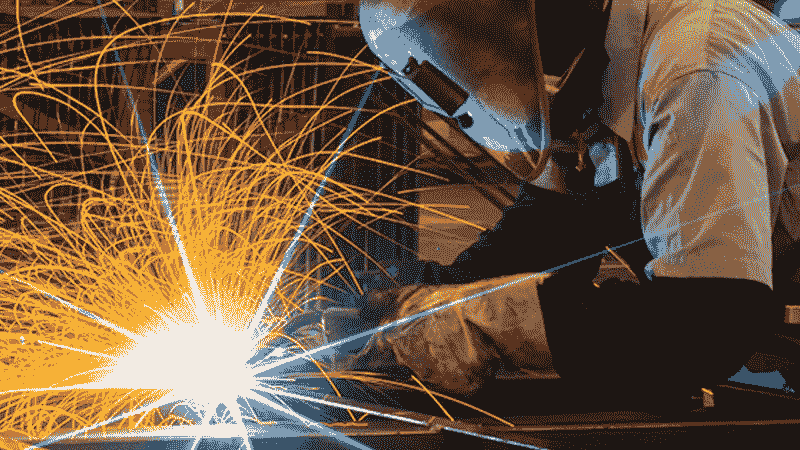

# 人工智能:用更多的精力更快地做蠢事！

> 原文：<https://towardsdatascience.com/artificial-intelligence-do-stupid-things-faster-with-more-energy-379aa6bac220?source=collection_archive---------6----------------------->

## 在数据推动的时代，我们为什么需要新一代的领导者

选择题时间！什么样的工人最好？

可靠的工人，他们准确、快速、高效地执行订单。

*B)不可靠的工人，他们可能想做也可能不想做被告知的事情。*

如果你认为这是一个简单可靠的选择(A)是显而易见的答案，请三思。这真的取决于给工人下达指令的人的技能。

In case you’d prefer the video version, here’s me talking you through the same ideas.

可靠的员工会有效地扩大一个好领导的明智决策，但不幸的是，他们也会放大一个愚蠢的决策者。还记得那些经典的咖啡馆海报吗？*“咖啡:用更多的精力更快地做蠢事！”*当一个领导无能(或者堕落)的时候，不靠谱的工人是一种福气。不能把专一的决心从他们身上拽出来？太棒了！当狂热者全心全意地追求糟糕的决策者设定的目标时，事情会变得可怕。

> 决策者的素质很重要！当一个领导无能或者堕落的时候，不可靠的工人是一种福气。

如果你有一个傻瓜在负责，不可靠的选项(B)是你最好的希望:没做多少事，领导者的愚蠢失败了。

> 计算机是最可靠的工作者，它们能以惊人的速度大规模满足你的愿望。

现在是坏消息！计算机是最可靠的工人。他们只做让他们做的事。不多也不少。他们不为自己着想。他们根本不思考！除了你告诉他们想要的，他们什么都不想要。(事实上，神经科学家将动机——想要——等概念视为一种生物特权。说一台机器真的想要任何东西是没有意义的。)如果你告诉你的电脑想对这个世界说一百万次“你好”，你不会得到任何抱怨。指望我为你做同样的任务？不行，我已经厌倦了。

与机器相比，人类是不可靠的。如果你选择一项人类和机器能够在*个体*水平上同样出色地完成的任务，并将其分配给 1000 台机器和 1000 个人，我不会赌人类团队会获得最佳总分。原因如下。

> 如果你最痴迷于个人层面的绩效或模型复杂性，你可能会错过一个重要的概念:系统层面的激励复杂性。

我们都是珍贵的雪花，伴随而来的额外好处是在我们各自的方面都不可靠。我们每个人都花了一生的努力来培养，没有两个人从我们的环境中获得相同的一系列输入。结果是，员工们的各种激励令人眼花缭乱——从和孩子玩耍到寻找垃圾食品，再到偶尔看起来很忙。随着他们的不可靠性拉向不同的方向，它给糟糕的决策者踩了刹车。

> 我们人类所有的不可靠性都指向不同的方向，给糟糕的决策者踩刹车。

这就是为什么人类通常不像机器那样高效地放大领导者的意图。(也就是说，如果人们像铁屑和磁铁一样站在一起，历史表明我们会做出一些可怕的事情。)

计算机系统倾向于遵循更简单的激励机制，因为这些机制是由建造它们的人类决定的。作为头脑简单的生物，我们倾向于选择像“*收益最大化*或“ [*准确识别猫*](http://bit.ly/quaesita_donttrust) ”这样的目标。如果我们觉得有趣的话，也许我们可以一次结合两到三个。

> 今天的应用程序背后是大量的机器，它们都遵循着*相同的*简单命令。

相比之下，这个星球上所有不同的思想都经历了各种各样的激励，都朝着不同的方向努力。即使是一个单一的大脑也充斥着处于反叛边缘的竞争目标的宇宙。一个开发者如何手工制作这样一个系统？你不知道……或者也许机器辅助的超复杂激励设计是下一个巨大的类人智能( [HLI](http://bit.ly/quaesita_ai) )突破的来源。抛开猜测不谈，今天的应用程序背后是大量的机器，它们都遵循着*相同的*简单命令。

> 技术是衡量人类决策者意愿的杠杆。

谁下的命令？不管是谁负责这个项目。我希望我们停止使用暗示有任何技术是自主的或者独立于人的语言。难道不是人类建造的吗？(还是有什么我不知道的外星事件？)

For those who prefer watching to reading, here’s a keynote I gave on this topic

因为它总是来自于*人*并由*人*设计，所有的技术都是建造它的人的愿望的回声。有时，这种回声在按下按钮后会持续很长时间，以至于很容易忘记人们在其中扮演的角色。它总是做人们建造它要做的事情……可悲的是，这往往不是人们希望它做的事情。(Devs，你知道那个 bug 是*你*的错，不是电脑的，对吧？)

> 头发尖尖的老板是天启四骑士之一。

技术衡量人类决策者的意愿。这是一个杠杆，它越大，它就越是一个杠杆。当杠杆变得足够长，足以推动世界时，为什么我们不要求知道使用杠杆的人是否有能力负责任地使用杠杆？

Image: [SOURCE](https://tvtropes.org/pmwiki/pmwiki.php/Main/PointyHairedBoss).

在过去的几个世纪里，糟糕的决策者相对来说是自我限制的，所以培训人们的决策技能并没有被认真对待。当然，你可以从婴儿时期就开始辅导皇室成员，但为什么要为其他平民费心呢？

今天，随着计算机系统的规模扩大到触及更多的生活，我们经常被提醒，你的花园品种技术产品经理有幸拥有一个更美好的童年，并没有通过快速赶上来做好准备，以承担他们在技术推动的世界中日益增长的责任。

> 地位太高，手艺不够。

最糟糕的是那些只把决策视为捶胸顿足和施加地位的另一种方式的领导者。把杠杆拉得足够长，这个尖头发的老板就变成了天启四骑士之一。也许是时候重新思考决策作为一门科学和一项需要培养的技能了。

## **这些和人工智能有什么关系？**

到目前为止，我们的讨论一般都是关于可伸缩技术的。没有一个是[特有的人工智能](http://bit.ly/quaesita_ethics)。

ML/AI 的问题在于，有效且负责任地构建它需要可扩展技术的所有决策技巧，甚至更多。更像是决策智慧和决策愚蠢的放大器(我希望你会同意其中一个听起来更合胃口)。

> 就当是神灯泛滥吧。

当我想到[机器学习](http://bit.ly/quaesita_simplest)和 [AI](http://bit.ly/quaesita_ai) 的时候，我想到了一个神灯的泛滥。忘记人形机器人吧——这些技术要强大得多。与传统编程不同，它们允许你解决一个问题，即使你自己想不出解决方案的步骤。

> AI 可以让你把不能表达的东西自动化。

那是因为他们让你用[例子和目标来表达你的愿望，而不是明确的指令](http://bit.ly/quaesita_sbucks)，这意味着你可以[超越人类表达的自动化](http://bit.ly/quaesita_fad)。

人工智能代表了人类进步的一个根本性飞跃……但是你还记得每个*小心你的愿望*故事的寓意吗？

> 危险的不是精灵，而是不熟练的许愿者。

在那些故事中，危险的不是妖怪。是不熟练的许愿者。精灵的魔法可能会给人类带来巨大的好处，但这取决于你把它指向哪个方向。如果我们的物种被赋予了巨大的力量，我会比众多善意的骗子更不害怕好莱坞漫画中的恶棍(严重的精神变态非常罕见)。

> 与传统编程相比，ML/AI 涉及到用更接近那些神灯故事的风格来表达你想要的东西。

在其核心，ML/AI 范式是一种与机器交流的新方式。与传统的编程(一步一步的指令)相比，ML/AI 涉及到以更接近那些神灯故事([目标和例子](http://bit.ly/quaesita_ethics))的风格表达你想从精灵那里得到什么。

> 当你把与[数据](http://bit.ly/quaesita_hist)大规模交流的权力交给轻率的交流者时，会发生什么？
> 
> 人工智能的可怕之处不在于机器人。是人民。

一个 ML/AI 系统要么测试失败，什么也不提供(因为你的精灵太无能了，以至于你把灯送回了阁楼)，要么通过测试，并提供*决策者想要的*。不是决策者想要或希望的，而是*确切地说*决策者*要求*的。如果他们许了一个愚蠢的愿望呢？

> 测试一个 ML/AI 系统保护你免受一个无效的精灵，而不是一个愚蠢的愿望。

如果你怀有以下情绪，请非常害怕:*“我从来不做老板让我做的事，我只做老板真正想做的事。”*

Less hoping and more training, please. [SOURCE](https://thecomicninja.wordpress.com/tag/pointy-haired-boss/page/2/).

你的意思是你的老板不知道如何负责任地许愿。让他们负责一个人工智能项目是一场迟早会发生的灾难。取而代之的是，他们需要训练或者被放到安全的地方？)在那里他们不能造成任何伤害。把你的视线从他们身上移开一会儿，他们会要求一个人工智能系统制造尽可能多的回形针。

> 我们需要比以往更加努力地工作，以确保参与决策角色的任何人都拥有负责任地实现愿望的技能。

或许最危险的许愿者是那些其愿望会产生意想不到的后果，从而逃脱脆弱的安全网的人。即使许愿者有最好的意图，如果他们不能充分考虑他们的要求，使愿望的精神与其文字相符，他们也是一个危险。权力越大，责任越大……明智地使用这种权力。这需要技巧，而不仅仅是良好的意愿。但是你如何为人工智能时代建立负责任的许愿技能呢？通过投入时间和[寻找他们](http://bit.ly/quaesita_di)。

> 可扩展的技术就像不断加长的杠杆，我们不能忘记在这些杠杆的末端有一个人类决策者。

规模强大的技术变得越来越容易使用，因此认识到它们融入了多少[的人性元素](http://bit.ly/quaesita_dmguide)比以往任何时候都更加重要。

> 如果你习惯于指责没有生命的物体，你在这里没有帮助。睁开你的眼睛，看看机器后面的人。

如果你想担心人工智能，不要担心[人或机器人](http://bit.ly/quaesita_ethics)。担心规模、速度、范围和寿命。工具的效果越大，你就越需要小心使用它。你的决定影响的人越多，你的责任就越大。

> 如果你问我是否害怕人工智能，我听到你问我的是我是否害怕人类的疏忽。

如果你问我是否害怕人工智能，我听到你问我的是我是否害怕人类的疏忽。这是这个问题对我来说唯一有意义的方式。我的回答？不。我对我们人工智能的未来很乐观。我相信人们可以学会负责任地建立安全有效的系统，推动进步，让周围的人生活得更好。

这与智商无关，这是关于站出来*选择*建立一些新的精神肌肉。一旦人们意识到某件事值得认真对待，他们通常会给你留下深刻印象。想象一下，试图向从未见过汽车的人解释高速公路。(“你的速度有多快？！周围还有其他人吗？怎么还有人活下来？”)不知何故，我们大多数人都设法获得了安全驾驶技能……尽管显然不知道如何正确地走路。(为什么是的，我确实住在纽约— [是什么泄露了这个秘密？)](https://www.travelandleisure.com/slideshows/walking-in-new-york-city)

同样，我相信如果你有决心，你可以发展你的决策技能。这些东西[可以教](http://bit.ly/quaesita_di)。这就是为什么我(和其他像我一样的人)选择站出来，为培养一批精通[决策智能](http://bit.ly/quaesita_di)的新一代领导者做出贡献。

> 如果我们教人们如何建造神灯，我们也必须教授负责任地许愿的技巧。否则，巨大的规模会带来巨大的问题。

[决策智能](http://bit.ly/quaesita_di)是一门新的学术学科，涉及选项选择的所有方面。作为一项运动，它建立在这样一种认识上，即如果我们教人们如何建造神灯，我们也必须教他们负责任地许愿的技巧。否则，巨大的规模会带来巨大的问题。

如果你的团队缺乏在项目开始时负责任地许愿的技能，那么所有美丽的工程都没有意义——最终只会带来有毒的垃圾。另一方面，如果我们[培养有技能的领导者](http://bit.ly/quaesita_di)，那么人类可以享受前所未有的安逸和富足。在有能力的决策者手中，可扩展技术可以帮助我们解决人类面临的一些最大问题。

我们花了太长时间坚持用简单的解决方案来解决问题——简单是指我们可以用头脑去思考它们。简单的方法不能解决所有的问题，所以是时候把复杂的解决方案加入到我们的清单中了。人工智能是我们如何越过那些低挂的水果[到达星星](http://bit.ly/quaesita_fad)的方法。

如果你很好奇，你可以从这里开始学习决策智能:

 [## 什么是决策智能？

### 人工智能时代领导力的新学科

towardsdatascience.com](/introduction-to-decision-intelligence-5d147ddab767)  [## AI 入门？从这里开始！

### 深入项目所需了解的一切

medium.com](https://medium.com/hackernoon/the-decision-makers-guide-to-starting-ai-72ee0d7044df) 

# 感谢阅读！人工智能课程怎么样？

如果你在这里玩得开心，并且你正在寻找一个为初学者和专家设计的有趣的应用人工智能课程，这里有一个我为你制作的娱乐课程:

Enjoy the entire course playlist here: [bit.ly/machinefriend](http://bit.ly/machinefriend)

# 喜欢作者？与凯西·科兹尔科夫联系

让我们做朋友吧！你可以在 [Twitter](https://twitter.com/quaesita) 、 [YouTube](https://www.youtube.com/channel/UCbOX--VOebPe-MMRkatFRxw) 、 [Substack](http://decision.substack.com) 和 [LinkedIn](https://www.linkedin.com/in/kozyrkov/) 上找到我。有兴趣让我在你的活动上发言吗？使用[表格](http://bit.ly/makecassietalk)联系。