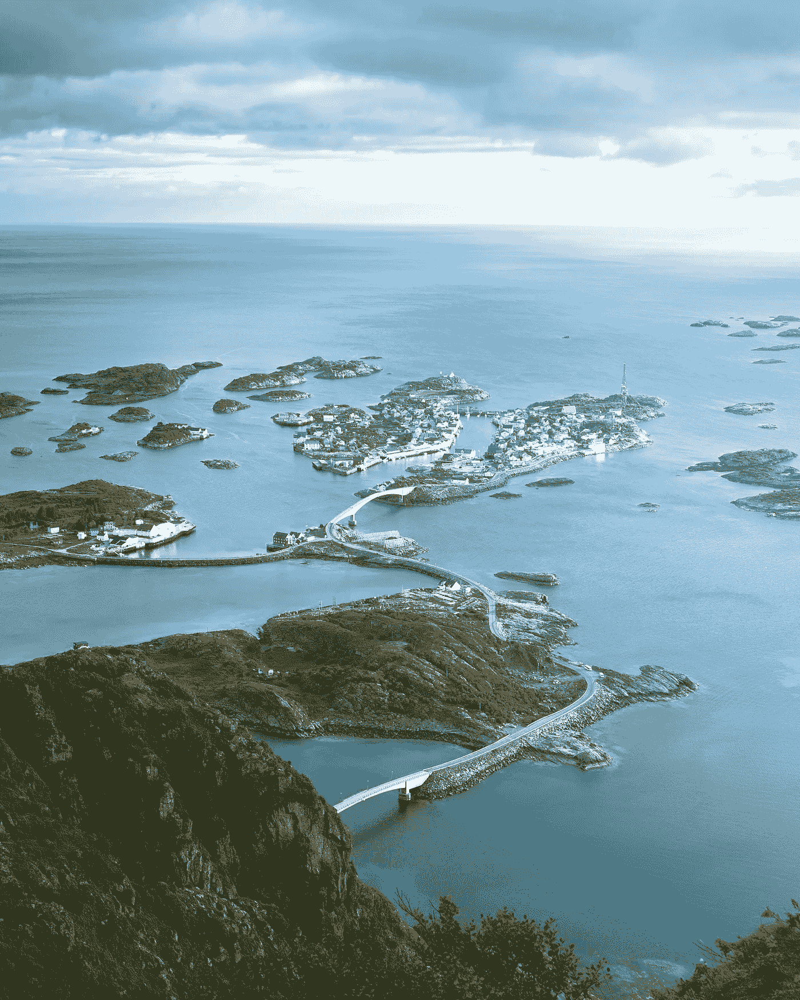

# 人工智能——伦理与世界统治？

> 原文：<https://towardsdatascience.com/artificial-intelligence-ethics-vs-world-domination-7cf2a5734151?source=collection_archive---------40----------------------->

Photo by [@deko_lt](https://unsplash.com/@deko_lt)

## 对挪威来说，这是一个奇怪的问题

一个朋友联系了我，他正在挪威的一个大型商业会议上帮忙主持一个活动，这个会议是工业界和政界人士聚会的地方。活动的名称是*“人工智能——伦理与世界统治？”*。在这种情况下，有人问了我几个问题，我将尽力回答。然而，我将首先讨论我收到的与该主题相关的一系列问题。这些问题涉及竞争力、以人为中心的人工智能、挪威利益和社会责任人工智能。首先让我们从事件的描述开始。

## (安全)困境

人工智能被选为国家竞争力的战略性重要技术。在全球范围内，存在着实现最雄心勃勃的目标和战略的军备竞赛。欧盟希望在全球范围内发挥领导作用，以加强业务发展和欧盟在世界上的战略地位。与此同时，欧洲国家在数据安全、道德和“以人为中心”的技术发展方面有着明确的目标。根据一些人的说法，这些目标可能与赢得“人工智能军备竞赛”的目标相冲突，而中国和美国等全球竞争对手的限制较少，例如获取人工智能开发的原材料，特别是数据。

*在这种情况下，我被问了四个问题:*

*   应该联系哪些与此主题相关的挪威教授？
*   欧盟如何加强其在人工智能中的地位，追求“以人为中心”的人工智能意味着什么？
*   挪威在这幅图景中的角色和可能性是什么？谁在维护挪威的利益？
*   发展 AI 对挪威和欧洲的竞争力有多重要？
*   具有社会责任感的人工智能如何在地缘政治游戏中成为竞争优势？

## 应该联系哪些与此主题相关的挪威教授？

不同领域的各种教授都值得联系。每个人都有自己的专业领域，就像教授一样，划分出一个重点领域。这是我按优先顺序列出的三个人的短名单:

1.  比约恩·海兰。我今年春天完成的社会科学中的机器学习模块的老师名叫[比约恩·霍兰德](https://www.sv.uio.no/isv/personer/vit/bjornkho/)，他是政治学研究所的教授。他既教授 [STV2500 欧洲决策过程和政策领域](https://www.uio.no/studier/emner/sv/statsvitenskap/STV2500/)，也教授 [STV1515 —](https://www.uio.no/studier/emner/sv/statsvitenskap/STV1515/index.html) 机器学习和社会科学家编程。他的背景是 2005 年伦敦政治经济学院的博士学位。他是《欧盟政治》编辑委员会的成员。他的研究兴趣是立法政治、应用政治方法论和计算社会科学。
2.  Lene Pettersen 是奥斯陆大学的副教授，她最近写了一篇关于新闻参与式商业模式的文章。她的背景是人类学、媒体研究和商业的混合体。此外，她还是跨学科媒体研究中心(STM)委员会(STM)的成员，也是 STM 关于数字媒体领域的算法、自动化和数据分析的《Norsk medietidsskrift》特刊(2019 年 1 月 17 日)的两位编辑之一。
3.  两位挪威学者即将出版一本关于数字伦理的书。Leonora Onarheim Bergsj 和 kon Bergsjø是这本书的两位作者。因此，他们可能对这个问题有一些清晰的想法。利奥诺拉拥有奥斯陆大学的伦理学和宗教哲学博士学位。她的研究重点是数字伦理。

对于 UiO 教授本周在阿伦达尔苏卡参加的活动，我还有什么进一步的建议吗？这是一个棘手的问题。因为半年来我一直试图在奥斯陆大学寻找对社会科学相关课题感兴趣的教授。我已经通过人工智能社会研究组织了一系列关于人工智能应用的社会科学问题的演讲。

## 欧盟如何加强其在人工智能中的地位，追求“以人为中心”的人工智能意味着什么？

毫无疑问，这是一个具有挑战性且抽象的问题。人工智能领域内的大部分努力不都是以人为中心的吗？它毕竟是由人类创造的，并被灌输了基于我们决定的行动。人工智能不是*【它】*或*【物】*，至少在大多数情况下还不是，我们把它比作我们自己，陈词滥调已经变成拥有一只机器手臂和一只人类手臂。这是一个持久的形象。

想要“通过我们的图像进行重建”听起来很直观，特别是深度神经网络(DNN)的焦点，这是最受欢迎的机器学习技术，它重振了该领域，是以神经元(一种发射神经脉冲的专门细胞)为模型的。因此，由于一系列(几乎)类似人类的机器人，这似乎已经成为科学家或超人类学家的痴迷，他们倡导通过技术增强人类生理来改变人类状况。我们在谈论超人、奇点等等。它当然有一种宗教氛围。

我以前写过关于 [*AI 和冒名顶替综合症*](/ai-and-the-imposter-syndrome-bf66e1daf8d8?source=friends_link&sk=8e168fe5d71b939d5f0ac43557883623) 的文章，谈到拟人化(赋予人类特征)以及为什么它可能为开发人员创造一种危险的文化，并可能导致一系列关于给定项目能力的误解。从某种意义上来说，如果成为人类本身就是一个伟大的目标的话，这可以比作争取永生或追逐圣杯。我并不是说有些人不应该追求它，但是如果这种看法成为人工智能发展中的主导思想或教条，这将是潜在的危险。

我们必须看到技术应用的局限性和不同之处，甚至麻省理工学院提出的机器行为也暗示了人类和机器的对立。就像:这不是人类的行为，这是不同的，必须这样研究或理解。另一方面，如果我们采取一种不那么社会建构主义的方法(与这种政治观点相关),并从国家权力的角度考虑现实主义，我们可以大胆地进行完全不同的讨论。然而，让我们更长时间地坚持建构主义的观点。

## 发展 AI 对挪威和欧洲的竞争力有多重要？

欧盟正在加强其在人工智能中的地位，因为人工智能已经证券化。沃尔和布赞的证券化理论在这方面很有意思。理论家们常用的一个例子是，恐怖主义是安全讨论中的重中之重，尽管人们更有可能死于汽车或可预防的疾病，而不是恐怖主义。证券化研究旨在了解“谁证券化(证券化行为者)，在什么问题上(威胁)，为谁(参考对象)，为什么，有什么结果，同样重要的是，在什么条件下。”

从这个意义上说，欧盟(行动者)正在将人工智能(威胁)安全化，以采用以人为中心的方法(参照对象，必须保护的理想)来保护欧盟公民以及欧洲社区(观众)。当然，这可以被重新定义和简化。然而，以人为中心的观点认为这种选择有些不人道，可以说他们是对的。

我写了关于[脸书对欧盟人工智能和数据政治](/facebook-vs-eu-artificial-intelligence-and-data-politics-8ab5ba4abe40?source=friends_link&sk=756bbc8cf12d7bab4c83f6b802abdf9e)以及欧盟对脸书违反隐私条例的罚款。在本文中，我重点关注欧盟基本权利机构(FRA)的报告，名为 [*数据质量和人工智能——减少偏见和错误以保护基本权利*](https://fra.europa.eu/en/publication/2019/artificial-intelligence-data-quality) *。这个概念更接近于所谓的公平，我也探讨了它与性别和平等的关系。*

值得一提的是，这种做法并非欧盟独有。最近，斯坦福大学开设了以人为中心的人工智能研究所。然而，当它从微软获得如此大一部分资金时(如果我错了，请纠正我)，欧洲的伦理研究所，如慕尼黑的研究所，从脸书获得如此多的[资金，这可能会有问题。如果以人为中心是明显的利益冲突，那么这些机构就是高度以人为中心的。我们很难下定决心。](https://medium.com/@alexmoltzau/some-current-issues-in-funding-of-ethical-artificial-intelligence-a7be9ca1a178?source=friends_link&sk=70ba1570388643fc8334f305d4ebd706)

## 挪威在这幅图景中的角色和可能性是什么？谁在维护挪威的利益？

我还没有完全回答这个问题，但我确实[之前概述了 2019 年](https://becominghuman.ai/scandinavian-ai-strategies-2019-16ecec9f17dc?source=friends_link&sk=46ecb92fa21edd4a3268037c7fd7b926)所有斯堪的纳维亚人工智能战略。我们所有人面临的最大风险是气候危机，我们不应忘记这一点。是的，开发负责任的机器学习应用程序很重要，然而现在人工智能安全的最大威胁是而且应该是气候变化。如果我们将出口产生的排放包括在内，那么挪威是世界上最大的二氧化碳排放国之一。削减石油和天然气，专注于可再生能源以及人工智能领域的高科技发展，可能是一种方法。

人们普遍认为，如果我们要履行对《巴黎协定》的承诺以及确保人类生存的责任，就必须这样做。我不是在暗示 AI 不是威胁。与此同时，重要的是要考虑到挪威没有核武器，尽管它以出口形式出售大量武器。一段时间以来，核战争的威胁一直笼罩着人类，这可能是因为我们问自己一些问题，例如在这场辩论中提出的问题。

如果我们追溯到政治学和国际关系，美国是影响力最大的霸权国家，尽管它受到中国等新兴大国的挑战，未来我们可能会有一个两极世界，有两个大国，而不是一个大国(单极)。谁在维护挪威的利益？中国最近收购了一系列挪威公司，一位富有的商人也在挪威购买土地。

中国的采矿(铜矿)和觅食(购买 Norske Skog)可能导致挪威在更大程度上成为中国的供应商。美国通过以延斯·斯托尔滕贝格为首的北约对挪威的兴趣似乎相对清晰。欧盟正在扩大与挪威的能源合作，因此也有一些既得利益。然而，如果我们更具体地问自己“谁”是一个人，我发现很难回答这个问题。

如果我们问“谁”是一个机构，挪威的利益在于和平，那么奥斯陆和平研究所似乎是一个重要的机构。此外，挪威国防研究机构(FFI)与挪威国防部门在维护我们的国防利益方面有着浓厚的兴趣。挪威网络防御系统正在大规模招募各种角色——这一点似乎很清楚。

## 具有社会责任感的人工智能如何在地缘政治游戏中成为竞争优势？

很难知道是否会考虑采取激烈的行动，比如将挪威所有的政府系统都建立在区块链的基础上。量子计算与人工智能相结合的黑客努力(特别是递归神经网络)似乎是一种威胁，可以随着加密的增加而减轻(尽管这不是我的领域)。

爱沙尼亚已经通过电子爱沙尼亚这样做了。鉴于[最近对佐治亚州法院的勒索攻击](https://www.governing.com/topics/mgmt/tns-ransom-attack-georgia.html)或挪威金融科技公司最大的[之一 VISMA 的黑客攻击，这一点可能很重要。由于网络攻击正在发生，这导致安全意识的增加或缺乏。然而，在这种情况下考虑人工智能的能量使用是至关重要的。此外，由于气候危机的恶化，这种数字安全困境或数字不安全性可能会威胁到我们的生存。](https://www.reuters.com/article/us-china-cyber-norway-visma/china-hacked-norways-visma-to-steal-client-secrets-investigators-idUSKCN1PV141)

安全困境与数字相关，但在这种情况下，这种对数据安全化的关注可能导致 Putnam 所描述的与国际和国内政策相关的两级博弈。也可以说，这可以创造出一定的政治人物，当他们对“俄罗斯”(例如[face app](https://medium.com/zero-equals-false/databaiting-with-faceapp-1d810089f61d?source=friends_link&sk=e034427c03a753dfdd2b88fbf03877d4))或“中国”的数据干扰构成威胁时。

在这种情况下，对脸书或谷歌处以巨额罚款可能被视为一种保护措施，同时也证明了政治实力。因此，人工智能或人工智能应该是什么的“想法”或意识形态可以在政治环境中被利用。人们担心新技术会在某些社会中变得无处不在(当然这是有充分根据的),表现出政治意愿当然可能是一种战略举措。

挪威已经开始在 NAV(国有福利系统)中开发机器学习能力。我知道这一点，因为他们试图通过会谈在大学里招募我们。将编程与社会科学相结合是一种越来越需要的结合，至少这是哥本哈根大学在[创立社会数据科学硕士项目](/ai-safety-and-social-data-science-527c2c576a98?source=friends_link&sk=23c6f786de9571012aeec56d9adcff74)之前的研究显示的。人工智能可以社会民主吗？[AI 安全能不能考虑工作安全](https://becominghuman.ai/does-ai-safety-consider-job-safety-or-not-f21af695824e?source=friends_link&sk=e5e9a69612afea433e31571bce0ba412)？

社会责任人工智能当然会考虑社会科学、自然科学和其他科学领域。我认为英国作为一个例子犯了一个大错，他们的重点是投资 2 亿英镑在纯粹的自然科学上。然而，他们当然可以证明我错了。为什么不走独特的道路，专注于被认为是斯堪的纳维亚人参与民主进程以及关注社会民主人工智能？我们能否将可持续发展作为人工智能发展的重点？对我来说，这是有趣的问题，需要提出来，而不是挂在世界统治上。

对于小小的挪威来说，这确实是一个奇怪的问题，然而我们经历了入侵，除了应对我们面临的严峻的气候危机之外，我们还必须考虑这种发展可能带来的影响，同时照顾我们的公民(新老公民)。

这是第 500 天的第 65 天。我目前第 50-100 天的重点是人工智能安全。如果你喜欢这个，请给我一个答复，因为我确实想提高我的写作或发现新的研究，公司和项目。