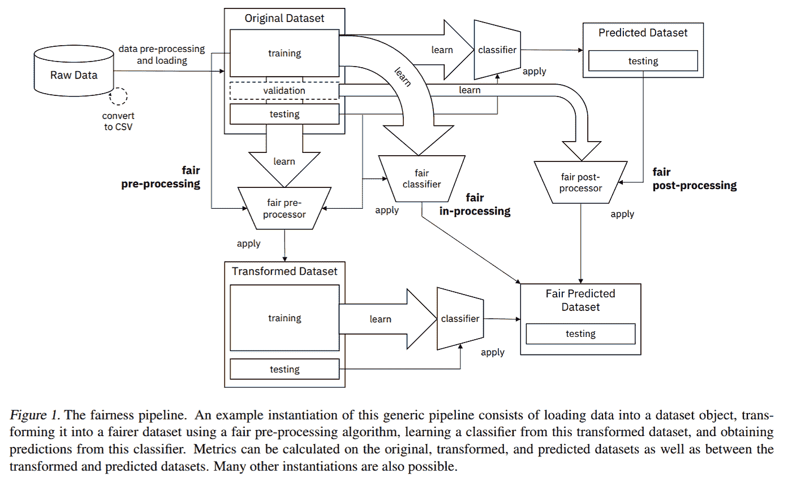
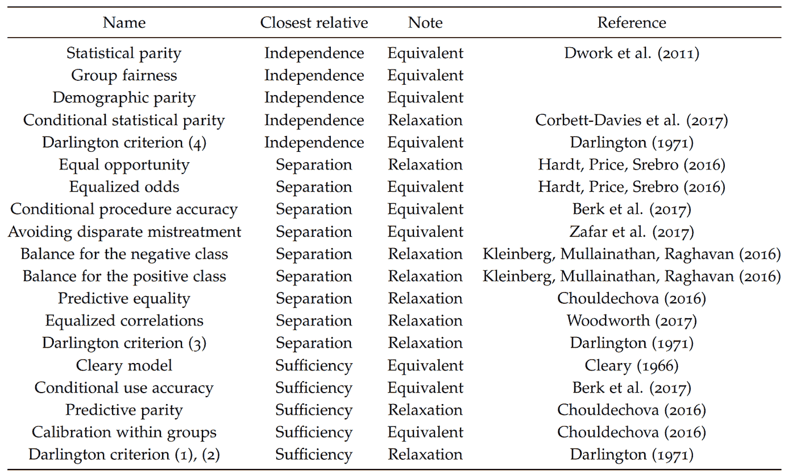

# 人工智能公平性入门

> 原文：<https://towardsdatascience.com/artificial-intelligence-fairness-and-tradeoffs-ce11ac284b63?source=collection_archive---------10----------------------->

## [内部 AI](https://medium.com/towards-data-science/inside-ai/home)

## 它是什么以及要做的权衡

Photo by [Bill Oxford](https://unsplash.com/@bill_oxford?utm_source=unsplash&utm_medium=referral&utm_content=creditCopyText) on [Unsplash](https://unsplash.com/@bill_oxford?utm_source=unsplash&utm_medium=referral&utm_content=creditCopyText)

# 1.目的

这是什么是人工智能，什么是人工智能公平，为什么公平是重要的，偏见如何进入系统，如何解决算法偏见和利润权衡的初级读本。这是一个广泛而复杂的话题。所以缩小范围，这篇文章不是关于:

*   人工一般也不是超级智能。它是关于我们已经在使用的产品和服务
*   杀手机器人也不是自主武器
*   故意伤害，而是无意的偏见
*   数据隐私，错误信息，也不是反垄断。虽然公平与这些相关
*   产生对人工智能的社会信任，包括透明度、可解释性和问责制等问题
*   企业应该如何雇佣和管理团队来解决偏见

术语注释:算法、人工智能、自动决策系统(ADMs)、机器学习和模型在本文中可互换使用。

# 2.什么是人工智能

人工智能对不同的人有不同的意义。下图有助于描述不同之处。计算机科学家将人工智能广义地定义为模仿人类行为的技术，这包括 if-then 程序、知识库和机器学习等。企业通常意味着机器学习，是人工智能的一个子集。机器学习(ML)是一种从数据中学习以执行特定任务(例如预测、分类)的计算机程序。ML 包括诸如回归、随机森林和深度学习等算法。

今天在媒体上讨论的人工智能的进步通常是指机器学习的进步，特别是深度神经网络神经网络通过将每个相互连接的神经元建模为接收输入并产生输出的数学函数，粗略地模拟了大脑的工作方式。随着更多神经元的加入，网络增强了模拟更复杂关系的能力，并提高了模型的准确性[1]。简单来说，把神经元想象成我们大脑的组成部分。更多的神经元=更聪明(潜在的)。

# 3.定义偏见和公平

在统计学中，偏差意味着对真实情况的不准确描述(如潜在人群)。在社会背景下，偏见是对一个结果或一群人的偏好，无论是公平还是不公平。通俗地说，在本文中，偏见意味着不公平或不想要的偏见。

公平没有一个统一的定义。什么被认为是公平的取决于上下文。这一挑战也为人们提供了批判性思考、明确表达和量化公平的需求和机会。几十年前，“黑人”在美国当奴隶被认为是“正常”的。在西班牙占领菲律宾期间，中国人(像我一样)因为他们的种族而被迫住在外面的城市。现在，基于肤色或种族的歧视是非法的，也是社会所不能接受的。

# 3.1.如何定义偏见和公平？

# 3.1.1.团体对个人

构建公平的一种方式是通过群体或个人的公平。群体公平要求由特定属性定义的不同群体应该有相似的结果。在实践中，组属性通常由法律定义，但它可以是任何东西——“受保护的属性”。最常见的属性是性别和种族。有关定义受保护属性的法律法规列表，请参见附录 7.1。法律法规使得衡量群体公平性变得更加容易。

个体公平要求相似的个体应该有相似的结果。这在直觉上很有道理，但很难付诸实践。如何建立个人之间的相似性因环境而异，并且难以衡量。在评估抵押贷款申请时，两个人的信用评分更重要，但在评估 MBA 申请时则不那么重要。不可能设定一个适用于所有情况的个人公平的标准定义。

# 3.1.2.具体指标和权衡的示例

作为一个例子，我们可以想象一家银行正在评估 100 份抵押贷款申请。70 个来自男性，30 个来自女性[2]。受保护的属性是性别。衡量公平的一个标准是人口均等。获得批准的男女比例应该是一样的。如果 35 名男性(50%)的抵押贷款获得批准，那么应该有 15 名女性(50%)获得批准。然而，从某种意义上来说，这是不公平的，如果有更高比例的贷款值得个人在任何一组。一些人认为，更重要的是模型的预测精度应该对每个群体都一样。这是衡量机会均等或准确性的标准。如果抵押贷款获得批准的男性中有 90%预计会偿还贷款，那么女性也应该是 90%。公平的两种定义都有道理，而且很可能相互冲突。一种不干涉公平的方法是在决策时有意排除受保护的属性和任何密切相关的变量(这在实践中很难做到)。这叫做群体无意识。

附录 7.2 显示了 19 个公平性指标的非详尽列表。一些研究人员已经证明，一些定义相互冲突。理解权衡很重要，因为它直接影响我们和企业的利润。

# 4.我们为什么要担心

# 4.1.社会影响

凯茜·奥尼尔的获奖著作《数学毁灭的武器》展示了 ADM 是如何在获得工作、贷款、保险和公平正义方面损害人们的生活[3]。ProPublica 研究了一些美国法院使用的软件系统如何预测“黑人被贴上高风险标签但实际上不会再犯的可能性几乎是白人的两倍。”[4]更多的黑人可能错误地在监狱呆了更长时间，这略微增加了累犯率[5]。这是恶性反馈循环的证据。超过 90%的公司使用自动简历筛选工具，亚马逊废弃的自动招聘工具对女性有偏见。这些例子并不是要表明 ADM 本身是危险的，而是它在我们的社会中是如何根深蒂固的。ADM 是工具，通常是出于良好的意图而构建的，并且具有积极的益处。

ADM 通常用于在大规模下做出一致且准确的决策。人类倾向于做出不一致和有偏见的决定。在午餐或休息前，法官们将有利裁决的可能性降低到 0%,否则会回到平均 65%。其他示例可在附录 7.3 中找到。

# 4.2.业务影响

ADM 还允许网络规模的互联网接入需求的涌入。每个职位空缺收到 250 份申请。谷歌每年收到 300 万份简历，雇佣了 7000 人。自动筛选候选人的效率要高得多。它解放了招聘人员，让他们可以建立人际关系和面试候选人。这提高了每个招聘人员的生产率(即降低了企业的成本)。

回到第 3.1.2 节的抵押贷款的例子，研究人员开发了一个工具，显示不同的公平定义如何导致不同的利润[8]。这个假设的例子展示了一个公平定义如何导致利润比理论最大值低 21%。第 6 节更多地讨论了利润权衡。

# 5.偏见从何而来，如何解决

下图显示了偏见在机器学习过程中的位置以及可以进行干预的位置[9]。使用“creeps in”是有意的。大多数开发人员不会有意在模型中加入偏见。

# 5.1.偏见的来源

由于数据、算法和模型的使用方式，可能会出现偏差。用于训练模型的数据可能不具有代表性/不完整，或者已经有偏差。根据定义，不具代表性的训练数据是有偏差的。该模型将表现不佳，无论它是否用于歧视某个群体或个人。不具代表性的数据集可能因各种原因而产生，如数据收集不完整和子人群过采样。有偏见的数据集是记录过去有偏见的决策的数据。根据这些数据训练的模型只会反映和强化这种偏见。

模型构建过程包括选择要在模型中包含的特征以及要使用的算法。在大多数情况下，模型构建者(例如，数据科学家、机器学习工程师)选择将哪些特征包括在训练数据集中。选择什么样的特征将包含建造者的偏见。在大多数算法中，有一个代价函数正在被最小化。在线性回归的情况下，它是平方偏差。成本函数通常设置为最大化准确性，但它可以配置为优化不同的指标。然而，通常它被设置为最大化准确性，这通常会加强数据集中嵌入的偏差模式。

模型的使用和评估方式也会导致偏差。在第 3.1.2 节的贷款示例中，用于确定是否批准抵押的阈值是由用户设置的。不同的阈值反映了不同的公平性测量。模型的性能也通过使用不同的度量来评估，通常使用精确度。公平指标的使用或缺乏也会导致偏差。

# 5.2.偏差缓解方法

根据机器学习管道中的干预阶段对偏差缓解方法进行分类。公平的预处理方法解决了数据中存在的偏差。公平的处理中方法修改学习过程以“忽略”敏感属性或惩罚算法“不公平”。公平后处理方法修改现有模型的输出。下图很好地概括了更常见的方法[10]。我们不会深入研究每一种具体的方法，因为它太专业了。下面没有列出的一种预处理方法是收集更多(有用的)数据。

# 6.利润与公平的权衡

企业目前面临的问题是意识、标准的不确定性、缺乏解决偏见的合格方法[11]。这是投入最多努力的地方。有几个工作组和机构正在带头定义公平并教育私人和公共选民(如 AI NOW、OpenAI)。

然而，随着前者的解决，一个将变得更加突出的问题是它将如何影响利润。在监管、道德和社会约束中，利润激励企业。正如第 4.2 节所说明的，利润和公平之间存在矛盾。公司没有自然的动机去确保公平的机器学习算法。下面用混淆矩阵说明了一种思考预测如何与利润联系起来的方法。机器学习算法的价值是能够增加真阳性和真阴性的数量，每个都有一个值。每一个假阳性和假阴性都是代价高昂的。分配给每个的值取决于每个上下文。在医疗情况下，假阴性的代价更高，而在死刑判决中，假阳性的代价更高。期望值是企业使用该算法可以预期获得的利润。模型越精确，利润越高。

降低准确性的偏差缓解方法将面临企业的抵制。不幸的是，准确性和公平性之间通常有一个权衡。不同的偏差缓解方法对精度有不同的(负面)影响。预处理方法对准确性的影响最小，因此对企业更有价值[12]。收集更多的数据可以进一步提高准确性，同时也提高了公平性。然而，数据收集和处理是昂贵的，并且是机器学习管道中最耗时的部分。根据 Wallach 的调查，这是从业者最大的痛点之一。例如，没有关于收集什么额外数据的指南或最佳实践，部分原因是每个用例需要不同的数据。意识到并清楚这种权衡是很重要的，因为企业领导人可以做出更明智、更好的选择。

# 7.附录

# 7.1.美国受管制域列表

**受管制领域**

*   信贷(平等信贷机会法)
*   教育(1964 年民权法案；1972 年教育修正案)
*   就业(1964 年民权法案)
*   住房(《公平住房法》)
*   公共住宿(1964 年民权法案)

**法律认可的“受保护类别**

*   种族(1964 年民权法案)
*   颜色(1964 年民权法案)
*   性别(1963 年《同酬法》, 1964 年《民权法》)
*   宗教(1964 年民权法案)
*   民族血统(1964 年民权法案)
*   公民身份(移民改革和控制法)
*   年龄(1967 年就业年龄歧视法)
*   怀孕(《怀孕歧视法》)
*   家庭状况(1964 年民权法案)
*   残疾状况(1973 年康复法，1990 年美国残疾人法)
*   退伍军人身份(1974 年越战时期退伍军人重新安置援助法案，制服服务就业和再就业权利法案)
*   遗传信息(遗传信息非歧视法)

**歧视法**:完全不同的待遇(正式的对故意的)对完全不同的影响(20%规则，法律经验法则)。完全不同的待遇可以被认为是程序公平。基本理念是机会均等。不同的影响是分配的公正。这两个目标之间存在矛盾。

【资料来源:机器学习中的公平，NIPS 2017 教程作者:索隆·巴罗卡斯和莫里茨·哈特([*https://mrtz.org/nips17/#/*](https://mrtz.org/nips17/#/)*)*

# 7.2.公平的定义

*资料来源:梭伦·巴罗卡斯、莫里茨·哈特、阿尔温德·纳拉亚南(*[*https://www.fairmlbook.org*](https://www.fairmlbook.org)*)*

# 7.3.人工智能/ADMs 如何改善社会结果的其他示例

相对于人工筛选，招聘算法产生的候选人更加多样化，更有可能通过面试，接受工作邀请，并在工作中表现更好[13]。在消费者贷款决策中使用 ADM 将增加长期利润，同时也减少对老年和移民借款人的偏见[14]。用预测累犯的算法代替法官，增加了社会福利。所有犯罪类别的犯罪率最高可降低 25%，监狱人口可减少 42%，同时也显著降低了非裔美国人和西班牙裔美国人在监狱中的比例[15]。

ADM 还允许网络规模的互联网接入需求的涌入。每个职位空缺都会收到 250 份申请[16]。谷歌每年收到 300 万份简历，雇佣了 7000 人[17]。自动筛选候选人的效率要高得多。它解放了招聘人员，让他们可以建立人际关系和面试候选人。

# 结束注释

[【1】](https://www.notion.so/kennso/fc8154e8a8ab4def84dfaf4c81158ea3?v=11bebeb29395414d89ea40f2e58a5c55&p=204def405c974720863218860fd935cd#_ftnref1)麦肯锡在对人工智能用例的分析中使用了同样的速记参考。有几种神经网络技术，如前馈、生成对抗网络和卷积神经网络。参考麦肯锡的研究，了解商业环境中最常见和最有价值的技巧。来自“人工智能前沿笔记:深度学习的应用和价值”2018 年 12 月 4 日接入。https://www . McKinsey . com/featured-insights/artificial-intelligence/notes-from-the-ai-frontier-applications-and-value-of-deep-learning。

[2]摘自 Google PAIR 的假设工具。[https://pair-code.github.io/what-if-tool/ai-fairness.html](https://pair-code.github.io/what-if-tool/ai-fairness.html)

[3]凯西·奥尼尔。“破坏数学的武器。”百老汇图书。2016.

[4] ProPublica。“机器偏见”。2016.[https://www . propublica . org/article/machine-bias-risk-assessments-in-criminal-pending](https://www.propublica.org/article/machine-bias-risk-assessments-in-criminal-sentencing)

5 博·考吉尔和凯瑟琳·塔克。《经济学、公平和算法偏差》。为《经济展望》杂志做准备。2019.【https://papers.ssrn.com/sol3/papers.cfm?abstract_id=3361280 

[6]劳伦·韦伯。《你的简历 vs 湮没》。华尔街日报。2012.[https://www . wsj . com/articles/sb 10001424052970204624204577178941034941330](https://www.wsj.com/articles/SB10001424052970204624204577178941034941330)

[7]杰弗里·达斯廷。“亚马逊废弃了对女性有偏见的秘密人工智能招聘工具”。路透社。2018.[https://www . Reuters . com/article/us-Amazon-com-jobs-automation-insight/Amazon-scraps-secret-ai-recruiting-tool-that-show-bias-against-women-iduskcn 1 MK 08g](https://www.reuters.com/article/us-amazon-com-jobs-automation-insight/amazon-scraps-secret-ai-recruiting-tool-that-showed-bias-against-women-idUSKCN1MK08G)

[8]用更智能的机器学习攻击歧视。[https://research . Google . com/big picture/attack-discrimina tion-in-ml/](https://research.google.com/bigpicture/attacking-discrimination-in-ml/)

[9] IBM。“人工智能公平 360:一个可扩展的工具包，用于检测、理解和减轻不必要的算法偏差”。[https://arxiv.org/abs/1810.01943](https://arxiv.org/abs/1810.01943)

[10]它来自一个博客，但却是我能找到的唯一一个很好的总结。没有论文像这篇论文那样简洁地总结了现有的方法。阿吉特什·库马尔。“机器学习模型:偏差缓解策略”。[https://dzone . com/articles/machine-learning-models-bias-mitigation-strategies](https://dzone.com/articles/machine-learning-models-bias-mitigation-strategies)

[11]微软的一个研究小组对行业从业者所面临的问题做了一个很好的调查。他们采访了 35 名从业者，调查了 267 名从业者，这些从业者来自不同的行业和产品。瓦拉赫等人。艾尔。"提高机器学习系统的公平性:行业从业者需要什么？"[https://arxiv.org/abs/1812.05239](https://arxiv.org/abs/1812.05239)

[12]罗斯等人。艾尔。“机器学习中公平增强干预的比较研究”。【https://arxiv.org/abs/1802.04422 号

13 博·考吉尔。《人类和算法中的偏见和生产力:来自简历筛选的理论和证据》。[http://conference . iza . org/conference _ files/macro econ _ 2017/cow gill _ b 8981 . pdf](http://conference.iza.org/conference_files/MacroEcon_2017/cowgill_b8981.pdf)

[14]威尔·多比、安德烈斯·利伯曼、丹尼尔·帕拉维西尼、维克拉姆·帕塔尼亚。“测量消费者贷款中的偏差”。NBER。2018.[https://www.nber.org/papers/w24953](https://www.nber.org/papers/w24953)

[15]乔恩·克莱因伯格等人，“人类决策和机器预测”。NBER。2017.[https://www.nber.org/papers/w23180](https://www.nber.org/papers/w23180)

[16]约翰·苏利文。“为什么你找不到工作。用数字解释招聘”。呃。2013.[https://www . ere . net/why-you-can-get-a-job-recruiting-by-the-numbers/](https://www.ere.net/why-you-cant-get-a-job-recruiting-explained-by-the-numbers/)

17 马克斯·尼森。“这就是为什么你只有 0.2%的机会被谷歌录用”。石英。2014.[https://qz . com/285001/heres-why-you-only-a-0-2-chance of-get-over-England-Google/](https://qz.com/285001/heres-why-you-only-have-a-0-2-chance-of-getting-hired-at-google/)