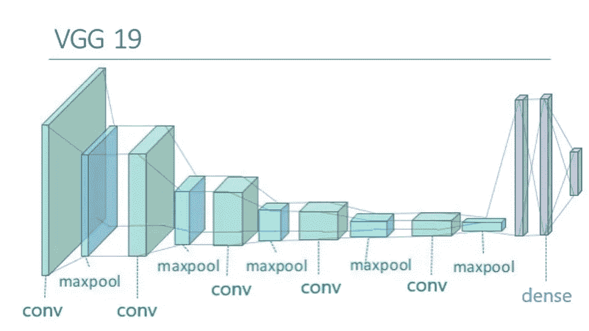

# 学习手语的人工智能

> 原文：<https://towardsdatascience.com/artificial-intelligence-for-learning-sign-language-ab1f7937195b?source=collection_archive---------23----------------------->

LOVE in Sign Language

这个故事开始于马德里**西班牙**。冬天来了，一个由四个年轻的爱好者组成的团队开始了一个项目。

最初的想法是创建一个学习*手语*的应用程序，不仅因为这是我们社会的一个有趣的方面，也是为了那些需要学习它来交流的 3400 万患有残疾听力损失的儿童。

技术的美妙之处在于它也可以用来帮助别人。我们的目标正是这样。

当时的主要想法是，构建一个**神经网络模型**，能够从相机捕捉的图像中实时分类用户所做手势的表示。这个“用户”可以是在家学习手语或巩固他们在学校教他或她的东西的孩子，也可以是对从头开始学习手语感兴趣的成年人，例如，从字母表字母或数字开始。

**数据**

在每个像我们这样与数据相关的项目中，工作的一个重要部分是数据集。没有数据，我们甚至无法开始尝试构建一个能够理解用户在摄像机前做什么手势的模型。

由于我们来自西班牙，我们首先想到的是为 LSE 开发应用程序。但是研究和创新并不是一条玫瑰色的道路。我们找不到任何与西班牙语字母表相关的数据，在互联网上找不到，甚至没有写信给可能拥有这些信息的实体。所以我们不得不决定使用出现在几个网站上的数据:美国手语。

作为初始阶段，我们开始探索字母和从 0 到 9 的数字。然后我们有了另一个问题。该应用从一开始就被认为是基于构建一个能够从静态图像中分类标志的**深度神经网络**。这个事实给有运动的字母带来了一个问题:J 和 z。我们决定暂时去掉这两个字母。

然后，我们找到了字母和数字的数据。这些数据实际上是人们手部的图像，取自 Kaggle，一个在我们社区广泛使用的存储库。

**型号**

第二阶段是训练一个模型，让它变得如此智能，以至于当它看到一个标志的图像时，它能识别出是哪一个。我们从一个**卷积神经网络(CNN)** 开始，它有几个卷积层，最大池化、扁平化和全连接。但我们从经验中了解到，即使验证准确性很高，验证损失很低，但最重要的是实时性能，用我们的相机，用不同的手和手后面不同的背景。这不是一个好结果。

那时，我们决定利用以前的智能模型，一个能够从图像中分类对象的深度 CNN，用 ImageNet 训练的 VGG19。

Network architecture of the VGG19

ImageNet 是一个大型数据库，拥有超过 1400 万张图片，包含 20000 多个类别，精简版有 1000 个类别。用这个数据集训练了几个模型，使它们能够理解图像中非常抽象和有创造性的部分。我们必须利用这些特性。这个过程在社区中被称为“T2”特征提取。只需采用一个没有顶层的预训练模型，冻结该模型，添加我们的顶层，指定我们想要分类的类别数量，并用我们的数据集对其进行训练。这似乎是一个好主意，但同样，在实时体验中，它并不像我们希望的那样好。

然后，我们后退一步，思考使用预训练模型的想法。用来训练 VGG19 的 ImageNet 数据集不包含徒手类，也不包含 sing 语言表示类。所以我们试图做的是强迫一个网络对一些东西进行分类，而它基本上只能智能地对世界上除了手以外的其他东西进行分类。

那时我们决定进行“**微调**”，这是另一种在**深度学习**中经常使用的技术。我们决定只冻结 VGG19 的前 6 层，并用我们的数据集和顶层一起训练其他层。

另一方面，但与此同时，数据集正在经历几次变化。我们意识到初始数据集太差，然后我们给自己设定了用自己的相机获取图像的任务，我们将它们与初始数据集混合，并使用图像的混合来设置一个**图像数据生成器**，包括一些转换，如剪切范围、宽度和高度的移动等。

有了这两种成分的混合，一个非常强大的数据集和一个超级智能的模型，我们只希望有好的结果。我们抓到他们了。

Example of application with the Sign Language Digits

我们乐于接受对我们最初工作的反馈，因为我们目前正在开发它，以便将来有更好的应用程序来帮助他人。我们在 github 上也有开放代码，链接如下:

 [## ecabestadistica/手语翻译-python-opencv

### 项目的目标是为儿童提供必要的应用程序

github.com](https://github.com/ecabestadistica/sign-language-translator-python-opencv) 

我们是 Elisa Cabana ( [Twitter](https://twitter.com/elisacabana) )、Jessica Costoso、Jordi Viader ( [LinkedIn](https://www.linkedin.com/in/jordiviader/) )和 Miguel Gallego ( [GitHub](https://github.com/MiguelyGallego) )，在卡洛斯·辛坦拿( [Youtube](https://www.youtube.com/channel/UCy5znSnfMsDwaLlROnZ7Qbg) )的帮助下。我们希望有一天技术被用来消除那些需要我们帮助的人的障碍，因为对一些人来说，障碍实际上是所有人的损失。