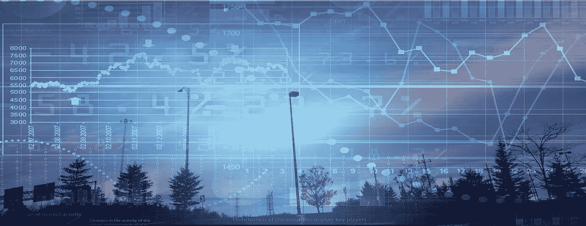
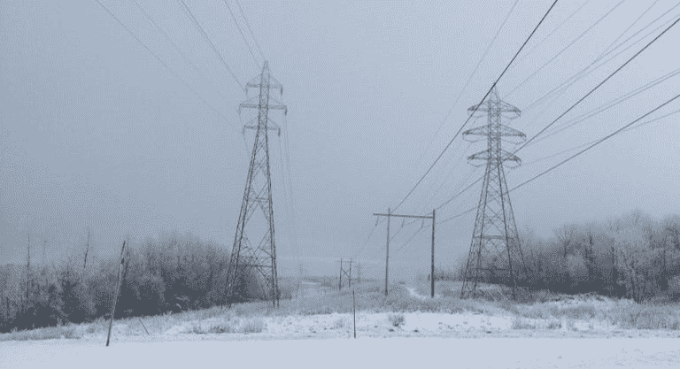
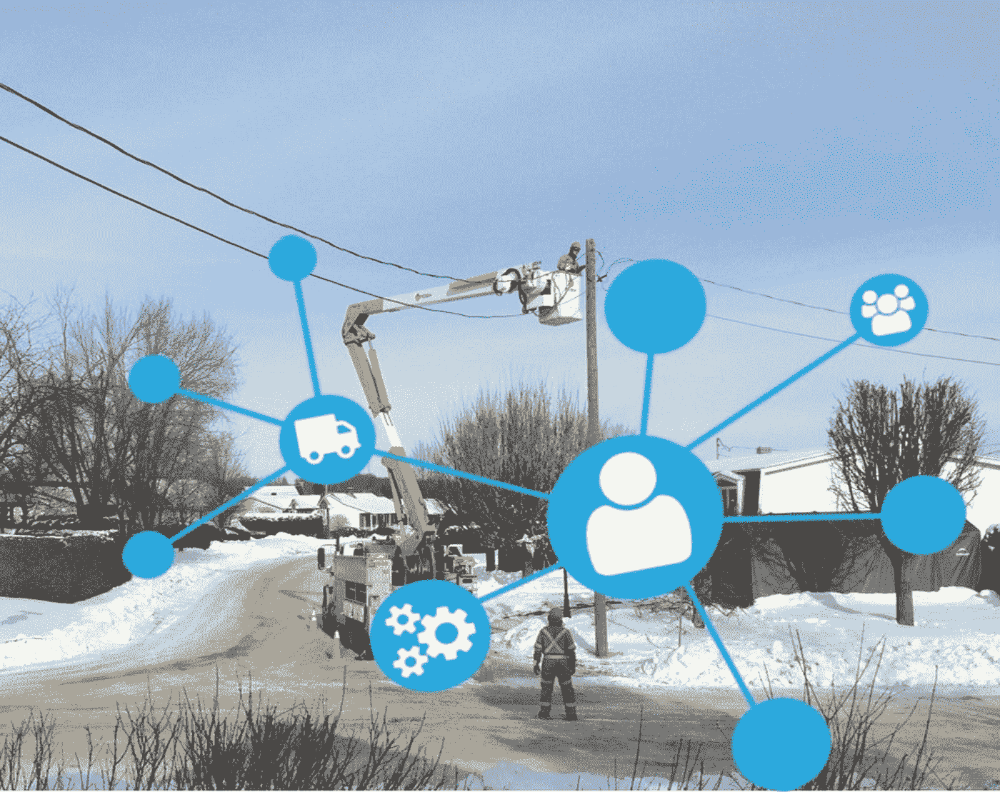
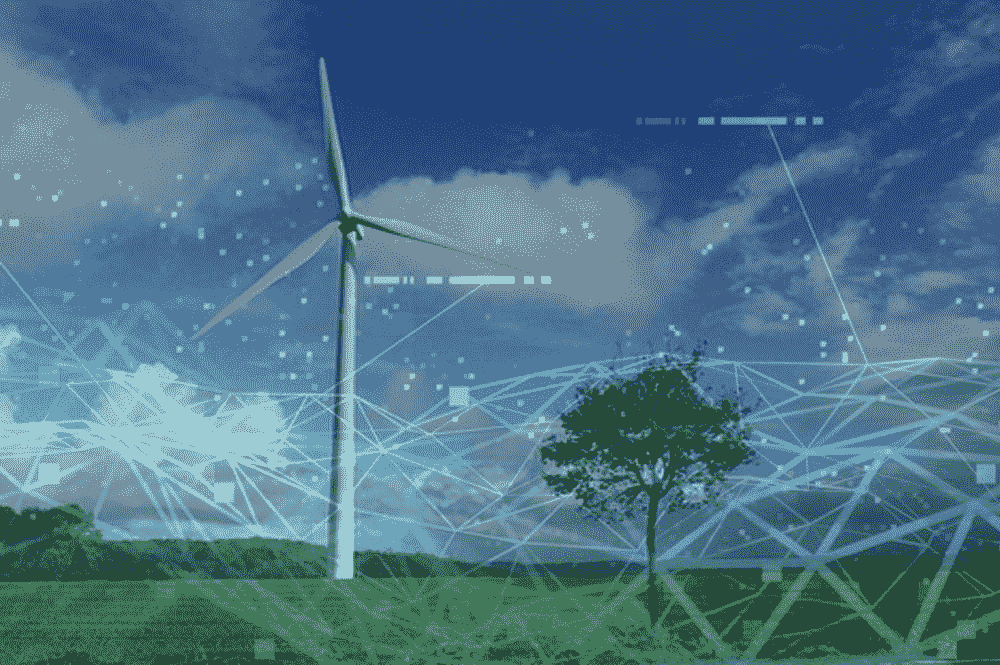

# 人工智能在一个“别无选择，只能让它聪明”的能源行业！

> 原文：<https://towardsdatascience.com/artificial-intelligence-in-a-no-choice-but-to-get-it-smart-energy-industry-1bd1396a87f8?source=collection_archive---------5----------------------->

可再生能源(RE)热潮为经济、能源部门和应对气候变化带来了巨大机遇。但是，由于其固有的间歇性，单靠可再生能源(如太阳能或风能)仍然无法实现全部需求或减少温室气体的积极目标。此外，对于没有准备的开发人员来说，分布式可再生能源项目的经济性变得越来越有竞争力(也就是说，由于不断变化的环境，变得更瘦和更有风险)。

因此，能源部门面临着一波变革，不仅挑战其增长，也挑战其弹性(例如，见《纽约时报》关于为什么 PG&E 申请破产将允许该公司在电价较高时试图撤销或重新谈判与供应商签订的合同的文章)

简而言之，能源市场正在发生变化，而供应链正变得更具竞争力，大自然给电网基础设施带来了更大的压力。毫不奇怪，客户对控制其能源命运的兴趣正在增加。

对于公用事业、消费者、决策者和经济而言，储能正在迅速引发能源领域的彻底变革。这是一个范式上的实质性变化。这就好比是互联网比电报，或者是 18 世纪的风车比现代的风力涡轮机。

如果利用得当，储能可以独立运行，为客户、公用事业和电网提供多种服务，增加冗余、弹性和能效，即使在可再生能源经济效益不佳的情况下也是如此。此外，能量存储在形成和平滑可变发电和支持不断变化的需求方面的潜力将使能源部门的投标超越当前的电网限制。

**智能储能**

事实上，由于生产阶段与非生产阶段的不规则交替，能量储存极大地有助于解决与太阳能或风能作为能源的间歇性相关的问题。然而，不仅是这些能源，还有需求方本身的周期性和混沌动态，电池硬件本身对释放真正的能量价值没有什么作用。情况的复杂性使得简单的解决方案或者单一的技术很难成为救世主。释放这一价值的关键是通过复杂的软件对能量存储和(生产-消费)系统的复杂动态特性进行适当的控制。这就是人工智能(AI)形式需要“智能”(而不是简单的控制)的地方。将可再生能源与人工智能驱动的存储结合起来，可能会改变区分未来项目的范式。我们可以称之为“智能储能”或 IES。

**优化独立系统**

首先，我们可以很容易地看到智能储能如何满足商业和工业对“独立”系统的需求。为可再生能源装置增加存储几乎总是会增加项目的经济价值，主要是通过在客户用电高峰期使用存储的太阳能或风能。但是，为了正确优化系统的规模，并最大限度地提高 RE+存储系统对客户的回报，人工智能开辟了许多可能性，例如:执行实现这些回报所需的预测分析、机器学习、大数据和网格边缘计算。每一秒钟的数据都可以被捕捉和分析，包括负载、发电、天气、附近电网的拥堵和电费。ie 可以推动实时自适应存储调度，为客户和电网创造越来越多的价值。

**产生额外的合同收入**

其次，IES 还可以提供其他服务，或“价值叠加”额外的合同收入(帮助承包商更好地优化特定项目的报酬)。ie 可以驱动存储在电池网络中的未使用能量的“传送”,作为一种虚拟集成的资源提供给那些需要电力的电网位置。IES(与 is AI 一起)将动员一个可用能源网络来满足某个部门的过度需求，该部门正在经历高需求并使电网紧张。其结果是为提供商带来额外的收入和更低的运营成本，同时为客户带来存储节省能源费用的好处。

**增加价值流**

第三，随着新的激励和价值流的出现，这些优势将变得更加重要。商业环境变得越来越复杂，包括降低需求费用、通过虚拟发电厂增加收入、应对不断变化的利率和从投资税收抵免中获取更多价值。在确保计划合规性的同时实现回报最大化是一项挑战。这一天不远了，它将变得如此复杂，以至于只有通过人工智能才能实现 RE+存储的全部价值。

人工智能将能够为可再生能源项目提供一系列新的价值流。客户、太阳能开发商、纳税人、公用事业公司和电网都是赢家。例如，将智能存储添加到太阳能项目中可以最大限度地提高投资回报，在面对不断变化的费率、需求方或气候条件时，为主机站点提供更大的控制力和灵活性，同时支持访问新的公用事业项目或批发市场收入机会。公用事业和电网运营商可以从客户所在地的虚拟发电厂签订服务合同，在需要的时间和地点准确地提供稳定、可靠和经济高效的能源。在一些地区，这可能导致避免需要新的调峰电厂或其他昂贵的基础设施。

人工智能供电的储能正在推动“智能”能源系统的崛起。我们已经可以看到，部署了智能存储的风能或太阳能将很快使独立系统的部署相形见绌。当我们将人工智能与再存储结合起来时，我们确保了能源资源正在发挥其全部潜力——这是可再生能源行业、电力行业本身以及客户的最佳前进方式。

总之，这些改进(优化独立系统、产生额外的合同收入和增加价值流)只是人工智能和通过“智能储能”实现的储能将改变能源行业的众多方式中的 3 种。

人工智能、储能和电力行业:迈向智能和弹性电网！

全球能源行业在生产、销售和分配能源的方式上面临着根本性的变化。而且反应中出现了一些矛盾([https://www . energy central . com/c/CP/energy-execs % E2 % 80% 99-tone-climate-changing-they-still-see-long-fossil-future](https://www.energycentral.com/c/cp/energy-execs%E2%80%99-tone-climate-changing-they-still-see-long-fossil-future))。在提高恢复能力的同时，减少二氧化碳排放的压力很大。因此，必须找到方法来管理可再生能源日益增长的电力生产，这种生产是不可预测的，并且依赖于当地天气的异常，甚至当我们考虑气候变化的影响时，依赖于全球气候的异常。

越来越清楚的是，全球需要清洁、廉价和可靠的能源。这不仅是电网运营商的问题，而且能源来源的可靠性和电力成本也是消费者、政府和民间社会行为者以及商人所关心的问题，这些人都希望取悦他们的客户或他们的选民。

人工智能(AI)可能是满足这些需求的非常有用甚至强大的工具。而且，我们会看到越来越多的人工智能应用在能源领域。值得注意的是，通过最佳储能管理最大限度地提高绿色低碳发电的增长是一项人工智能应用，将产生潜在的巨大长期影响。

**人工智能整合包括存储在内的各种能源的能力**

各种形式的可再生电力资源出现作为传统的煤和天然气发电厂的继承者。然而，可再生能源生产的一个关键问题是它的间歇性。阴天或一系列安静无风的下午会降低产量并造成停电。相反，在不需要的时候会产生过多的能量。事实就是如此，在 2018 年 3 月，葡萄牙面临阳光明媚和多风的日子，在那里它生产的可再生电力比它消耗的还要多([https://www . NPR . org/sections/the two-way/2018/04/05/599886059/in-March-Portugal-made-more-than-successful-renewable-energy-to-power-the-whole-coun](https://www.npr.org/sections/thetwo-way/2018/04/05/599886059/in-march-portugal-made-more-than-enough-renewable-energy-to-power-the-whole-coun))。这种潜在的能量浪费或缺乏意味着最大限度地利用能量储存及其所有形式(电化学、热、机械等)是很重要的。)如果我们想要最小化备用能量的使用，例如，柴油发电机、燃煤发电厂或其他调峰电厂，这种存储能够被快速激活也是至关重要的，这些备用能量目前被用于平滑进入高峰时期的快速下降。

需要智能存储或“智能能量存储”(IES)解决方案来管理过多的峰值。人工智能可用于预测和制定储能管理决策。例如，人工智能可以通过短暂削减主电网的电力需求来管理电力短缺，同时它可以使用整个社区或地区的存储。人工智能的使用将生成电力需求、产量和天气的预测，通过预测和管理产量波动，可以减少对这些安全措施的需求。这项任务的速度和复杂性需要先进的人工智能。人工智能研究还研究规模和复杂性开始超过人类操作员的决策。它可以是安装在消费者、终端用户或高度使用场所(如工业设施)的数千个混合能量存储单元(电、热、其他)的网络。

**一个庞大但敏感的网络**

这也将增加供应的安全性。在北美，发电厂的平均寿命超过 30 年，电力变压器的平均寿命超过 40 年。传输系统的恶化导致了 2003 年“东北”的崩溃，影响了美国和加拿大的几个互联系统。这一故障导致 5000 万人连续几天断电，愚蠢的是，一条超载的输电线路倒塌并撞上了一棵树。这种情况显然会对整个区域网络产生连锁效应，并构成公用事业公司难以管理的任务，可以通过更好的需求预测或本地网络的更好响应来避免。快速变化。

人工智能能够“理解”(或破译)数据集，以及数据中的模型或模式，并进行非常准确的预测和模拟，这将增加电网优化、能源效率甚至需求增长期的机会。

人工智能(AI)与许多先进的能量存储技术相结合，当它与机器学习、深度学习和先进的神经网络相结合时，可以展示能源转换和公用事业部门的巨大潜力。随着去碳化、权力下放和新技术的部署，公用事业、独立电力生产商和其他能源公司正在使用人工智能来管理可再生能源份额不断增长所导致的供需失衡。

客户群已经变得巨大。客户群已经增长到数亿用户，但整体结构仍然需要现代化的大修。这是一个由发电厂、输电线路和配电中心组成的庞大网络。而这一切，距离托马斯·爱迪生 1882 年在曼哈顿下城为首批 59 家北美客户供电，开设美国第一座发电站还不到 140 年。在美国，这个网络已经包括了近 5800 个发电厂和超过 270 万公里(约 170 万英里)的输电线。据估计，如果美国总能源需求预计到 2050 年增长 25%，那么到 2040 年，全球能源使用预计将增长 15.3%(数据摘自美国能源信息署)。

除了使电力网络和系统变得智能和灵活，人工智能算法还可以帮助公用事业和能源公司了解和优化用户行为，并管理能源消耗。在不断变化的背景和环境中的不同部门。

**一种扩展的分散生产**

另一个挑战是分散发电的出现和发展，即私人用户利用风能和太阳能等可再生能源发电并使用自己的电力。这使得供求关系变得复杂，迫使公用事业公司从私人用户那里购买多余的能源，这些用户生产的电力多于他们消耗的电力，然后将这些电力送回电网。自 2010 年以来，太阳能的使用增加了两倍多，预计这一趋势将随着光伏电池的发展而继续，光伏电池是一种利用阳光发电的设备，可以降低成本，提高效率。

当前系统的设计一般没有考虑到能源的多样化，特别是可再生资源的增加。例如，在许多美国管辖区，当需求超过供应时，公用事业公司提前几分钟启动以化石燃料为基础的发电厂，即所谓的“最先进”发电厂，以避免连锁灾难。这个过程是最昂贵的，但也是这些公司最赚钱的部分。这导致消费者支付更高的电费，并增加向大气中排放的温室气体。随着未来几年能源需求的大幅增长，这些问题将会加剧。为了避免 IES 的这些非最佳(至少)运行模式，AI 可以启用自动学习算法，结合这些复杂网络上的数据和实时气象数据(来自卫星、地面观测和气候模型)，充分利用这些算法来预测可再生能源产生的电力，如风、太阳和海洋。

结合大数据、云和物联网(IoT)等其他技术，人工智能储能可以通过提高电源的可访问性，在电网管理中发挥重要作用。可再生能源。

**具有储能功能的智能电网**

为了应对即将到来的各种挑战，看来关键的可持续和可靠的解决方案之一将是智能储能，其中人工智能将是大脑。这种“具有能量存储的智能电网”将不断收集和合成来自数百万智能传感器的海量数据，以便及时做出如何最佳分配能源资源的决策。此外，“深度学习”算法的进步将彻底改变能源经济的需求和供应。在“深度学习”算法中，机器可以从大型数据集的模式和异常标记中进行自我学习。

因此，我们将看到越来越多的专业化微电网以更高的分辨率管理当地的能源需求。这些可以与各种新的储能技术相结合，即使在极端天气条件或其他故障影响到更广泛的电力系统时，也能实现当地社区之间的持续交流。

在供应方面，工业能源将转向一个具有更大能源组合的投资组合，其特点是增加可再生资源的生产，并最大限度地减少由于与这些资源相关的自然间歇性、太阳辐射和风力的可变强度而造成的干扰。例如，当可再生能源的运行超过某个阈值时，由于风力增强或晴天，电网将减少化石燃料的生产，从而限制气体排放。有害的温室效应。在可再生能源产量低于峰值的时期，情况正好相反，可以尽可能高效地利用所有能源，必要时只依赖化石燃料。此外，生产商将能够管理多种来源产生的能量，以应对实时需求的社会、空间和时间变化。

**获胜组合**

在接下来的几年里，IES 技术有望通过自动化太阳能和风能部门的运营来提高可再生能源部门的效率。这也将使公用事业和生产者价格指数推出新的业务和服务模式。

如果这种具有储能功能的智能电网能够通过更好地整合可再生资源，以最有效的方式使用包括化石燃料在内的能源，随着这些技术在复杂性和容量方面的发展，整个系统可能能够大大减少其碳足迹。尽管未来技术创新存在不确定性，但我们也可以期待智能电网系统通过优化地方和国家层面的供需来降低电费并防止灾难性停电。

同样，基于 IES 的应用可以通过以下方式为能源和公用事业部门创造额外的收入机会:

使软件应用程序能够分析大型数据集、识别模式、检测异常并做出准确预测，或者能够基于学习自主做出准确决策。

通过使用高级算法和利用区块链来保护数据和实现以客户为中心的解决方案，促进客户积极参与需求响应计划。

使用预测分析([https://www . SAS . com/en _ us/insights/analytics/predictive-analytics . html](https://www.sas.com/en_us/insights/analytics/predictive-analytics.html))改善设备操作和维护，并提供停机时间，从而延长设备寿命。

对于那些寻求影响社会未来的人来说，人工智能和储能之间的接口是一个极好的起点。技术创新正在从根本上改变我们对这两个行业的看法，它们的整合还处于初级阶段。它们的协同作用可以改变我们从来不知道的世界，并在改善其可持续性的同时开辟机会…实现智能和弹性电网！

本文是 2019 年 2 月和 3 月首次发布 Linkedin Pulse 的 2 篇文章的系列:

 [## 人工智能和储能将从哪些方面改变能源领域？

### 可再生能源(RE)热潮为经济、能源部门和战争带来了巨大的机遇…

www.linkedin.com](https://www.linkedin.com/pulse/what-ways-artificial-intelligence-energy-storage-change-bilodeau/)  [## 人工智能和储能将从哪些方面改变能源领域？(第二部分)

### 人工智能、能量存储和电力工业:迈向智能和弹性电网！这是第二次…

www.linkedin.com](https://www.linkedin.com/pulse/what-ways-artificial-intelligence-energy-storage-change-bilodeau-1e/)