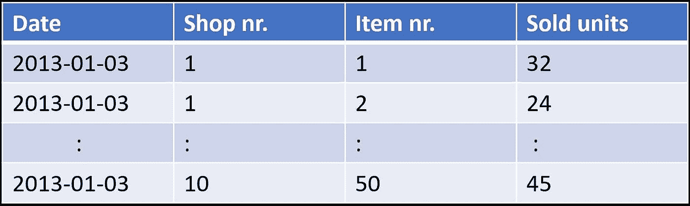

# 供应链管理中的人工智能

> 原文：<https://towardsdatascience.com/artificial-intelligence-in-supply-chain-management-predictive-analytics-for-demand-forecasting-80d2d512f155?source=collection_archive---------1----------------------->

## 利用数据推动运营绩效

供应链管理(SCM)在当今几乎每个行业都至关重要。尽管如此，尽管它很重要，但它并没有像许多其他领域一样受到人工智能初创公司和供应商的关注。然而，考虑到工业物流、运输和仓储收集的大量数据，这是一个具有很大潜力的领域。

# 数字化转型，数字化，工业 4.0 等等。

这些都是你以前可能听说过或读到过的术语。然而，在所有这些时髦词汇的背后，主要目标是利用技术和数据来提高生产率和效率。设备和传感器之间的信息和数据的连接和流动允许大量的可用数据。关键的促成因素是能够使用这些大量的可用数据并实际提取有用的信息，从而有可能降低成本、优化容量并将停机时间降至最低。这就是最近围绕机器学习和数据分析的讨论发挥作用的地方。

# 供应链的人工智能

与任何其他行业一样，当前对数字化的关注也在改变供应链管理。提高供应链的效率对许多公司来说非常重要。在艰难的利润率下运营，即使是微小的改进也会对底线利润产生重大影响。

数据分析和机器学习有利于供应链管理的例子包括需求预测和仓库优化。考虑到工业物流、运输和仓储收集的大量数据，能够利用这些数据来推动运营绩效对于那些正确操作的人来说可能是一个游戏规则改变者。

# 案例研究:需求预测的预测分析

为了说明机器学习在供应链中的使用，我将通过一个专注于需求预测的示例案例研究。以下示例涵盖了一家假设的挪威零售商，包括位于不同位置的各个商店以及一个主要的中央仓库，如下图所示。

对于这样的零售商来说，挑战之一是优化货物的本地仓库存储与集中仓库存储:一方面，大量的本地存储是昂贵的，另一方面，主要依赖于集中存储并且冒着商店中商品售罄的风险是另一个因素。因此，仓库优化非常重要，获得准确的销售预测将是非常有用的信息。

为了限制案例研究中的数据量，匿名化的数据集包括 2013 年至 2017 年期间 10 家不同商店的 50 件商品子集的销售商品数量。总的来说，这个数据集大约有 100 万行，数据格式如下所示:

因此，历史销售记录代表了我们试图从中提取有用信息以预测未来销售的数据。当然，理想情况下，这可以由其他可用数据源(例如天气数据)来补充，因为销售很可能会受到天气状况的影响。例如，如果您想预测一家杂货店下周销售的冰淇淋和烧烤食品的数量，拥有天气预报信息可能是非常有用的信息(尤其是对于挪威的示例零售商，那里的夏季天气至少可以说是不稳定的！).幸运的是，挪威计量研究所有一个[“weather API”](https://api.met.no/)，在那里你可以下载天气数据，如果你想试一试的话，可以免费试用！

# 训练数据和目标变量

在本例中，我们试图预测 10 家商店中包含在示例数据集中的 50 种(匿名)商品中的每一种商品的销售数量。基本的想法是，历史销售记录可能包含一些隐藏的模式，我们的机器学习模型可以挑选出来。如果是这种情况，模型就可以利用这些模式对未来的销售做出准确的预测。

我们使用 2013 年 1 月至 2017 年 9 月的历史销售记录作为我们模型的训练数据，然后我们尝试预测 2017 年最后一个季度(10 月至 12 月)的销售商品数量。

下图左侧显示了商店 10 中“商品 15”的培训数据子集。这表现出明显的年度周期性(夏季销售额最高)，以及销售逐年增长的线性增长趋势。我们的目标是预测 2017 年 10 月至 12 月的销售额，如右图所示。

# 定义机器学习模型

定义了训练数据和我们的目标变量(我们试图预测的变量)之后，我们现在可以建立一个预测模型，试图利用数据集中隐藏的模式来预测未来的销售。

# 时间数列预测法

时间序列预测是机器学习的一个重要领域。这一点很重要，因为有太多的预测问题涉及到时间因素。然而，虽然时间组件增加了额外的信息，但与许多其他预测任务相比，它也使时间序列问题更难处理。

有几种类型的模型可用于时间序列预测。其中一个受欢迎的选择是“长短期记忆网络”，或简称为 [LSTM 网络](https://en.wikipedia.org/wiki/Long_short-term_memory)，这是一种特殊的神经网络，根据以前时间的数据进行预测。它在语言识别、时间序列分析等方面非常流行。然而，根据我的经验，在许多情况下，更简单类型的模型实际上提供了同样准确的预测。使用诸如[随机森林](https://en.wikipedia.org/wiki/Random_forest)、[梯度推进回归器](https://en.wikipedia.org/wiki/Gradient_boosting)和[时间延迟神经网络](https://en.wikipedia.org/wiki/Time_delay_neural_network)的模型，可以通过添加到输入的一组延迟来包括时间信息，从而在不同的时间点表示数据。

我不会在这里进行进一步的数据分析，但是对于时间序列预测的机器学习的介绍，你可以看一下我以前的一篇关于这个主题的文章。

# 预测模型

由于本文的主要焦点不是技术方面的细节，所以我将简单地提及一些实现细节。

数据集由带标签的数据(即[监督学习](https://en.wikipedia.org/wiki/Supervised_learning))组成，是[数字和分类变量](/data-types-in-statistics-347e152e8bee)的混合。使用“日期”变量，我们还可以提取一些额外的有用特征，例如星期几，日期是否是国家假日等。，与单独使用日期相比，它为我们的模型增加了有用的信息。

对于这些混合变量类型，[基于树的模型](https://en.wikipedia.org/wiki/Decision_tree_learning)通常是一个好的选择。在下面的例子中，我决定使用一个[随机森林算法](https://en.wikipedia.org/wiki/Random_forest)，作为一个非常简单的基线预测模型。这主要是因为这种类型的模型可以轻松处理不同数据类型(数字和分类)的混合，并且它们通常“开箱即用”地执行得相当好，不需要任何大量的[超参数调整](https://en.wikipedia.org/wiki/Hyperparameter_optimization)。

# 结果

在对模型进行训练之后，我们现在可以检查它在测试数据上的表现如何(2017 年最后一个季度)。预测模型被训练为同时预测 10 家商店中每一家的所有 50 件商品的销售额，但是为了便于直观地显示结果，我决定这里只绘制“商品 15”的预测作为示例。

从下图开始，我们比较了商店 10 的实际销售额和预测销售额。我们注意到，我们的简单基线模型在捕捉每周周期和 12 月销售单位数量的特征下降方面做得相当好(注意，y 轴被截断，以便更清楚地显示实际销售和预测销售之间的偏差)。尽管如此，我们观察到该模型不能捕捉所有的短期波动(或噪声)，鉴于训练数据包含的信息有限，我也不期望它能捕捉到。

另一方面，在右图中，我绘制了实际销售与预测销售的对比图，但这一次销售单位的数量是所有 10 家商店的平均值。通过这样做，大多数短期波动(或噪声)“达到平均”，我们观察到实际销售和预测销售之间有更好的匹配。

你是对单个商店的水平感兴趣，还是对所有商店的总销售额/平均销售额感兴趣，这取决于你想要达到的目标:如果你主要关心的是优化你的中央仓库，预测总销售额可能会提供足够的信息，而挖掘单个商店的详细信息可能会很费时间，而且收效甚微。这一切都归结为明确定义你的目标，并专注于你试图解决的业务问题，而不是你用来解决它的技术。

# 摘要

上面的用例示例简单介绍了机器学习在供应链中许多有趣和有用的应用之一。在未来，我相信机器学习将会被用在比我们今天所能想象的更多的地方。你认为它会对各个行业产生什么影响？我很想在下面的评论中听到你的想法。

如果你有兴趣了解更多与人工智能/机器学习和数据科学相关的主题，你也可以看看我写的其他一些文章。你会发现它们都列在我的中型作者简介中，你可以在这里找到。

而且，如果你想成为一个媒体会员，免费访问平台上的所有资料，你也可以使用下面我的推荐链接。(注意:如果您使用此链接注册，我也会收到一部分会员费)

 [## 通过我的推荐链接加入媒体- Vegard Flovik

### 作为一个媒体会员，你的会员费的一部分会给你阅读的作家，你可以完全接触到每一个故事…

medium.com](https://medium.com/@vflovik/membership) 

# 更多来自 Vegard Flovik 媒体:

1.  [蒙特卡洛方法简介](/a-gentle-introduction-to-monte-carlo-methods-98451674018d)
2.  [从物理学到数据科学的转变](/q-a-with-a-data-scientist-1f872518315f)
3.  什么是图论，为什么要关心它？
4.  [用于图像分类的深度迁移学习](/deep-transfer-learning-for-image-classification-f3c7e0ec1a14)
5.  [构建一个能读懂你思想的人工智能](https://www.linkedin.com/pulse/building-ai-can-read-your-mind-vegard-flovik-phd/)
6.  [机器学习:从炒作到现实应用](/machine-learning-from-hype-to-real-world-applications-69de7afb56b6)
7.  [人工智能和大数据隐藏的风险](/the-hidden-risk-of-ai-and-big-data-3332d77dfa6)
8.  [如何使用机器学习进行异常检测和状态监控](/how-to-use-machine-learning-for-anomaly-detection-and-condition-monitoring-6742f82900d7)
9.  [如何(不)使用机器学习进行时间序列预测:避免陷阱](/how-not-to-use-machine-learning-for-time-series-forecasting-avoiding-the-pitfalls-19f9d7adf424)
10.  [如何利用机器学习进行生产优化:利用数据提高绩效](/machine-learning-for-production-optimization-e460a0b82237)
11.  [你是怎么把物理教给 AI 系统的？](/how-do-you-combine-machine-learning-and-physics-based-modeling-3a3545d58ab9)
12.  我们能使用纳米级磁铁构建人工大脑网络吗？

## 人工智能研讨会——从宣传到现实应用