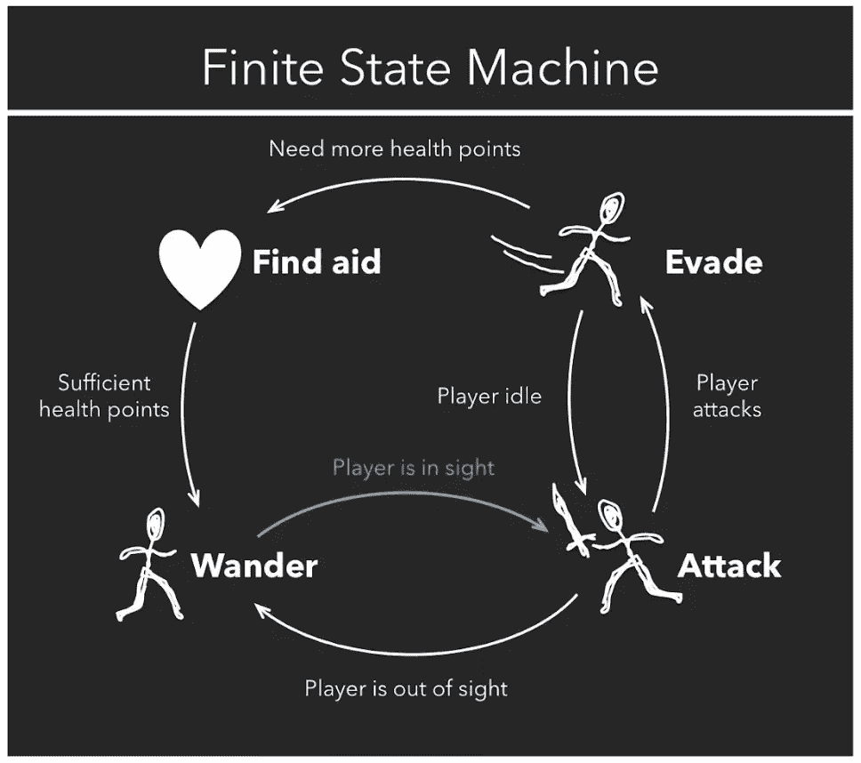
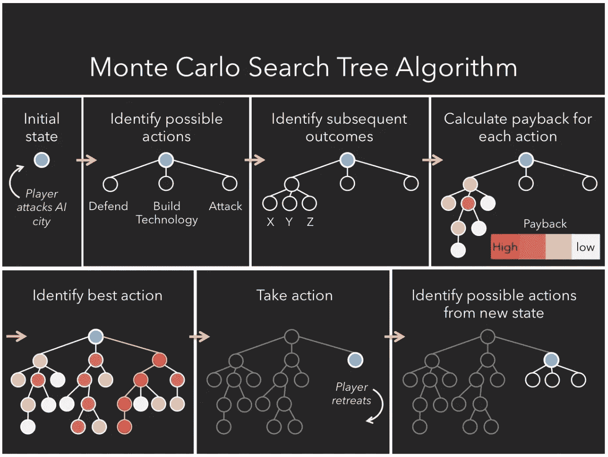
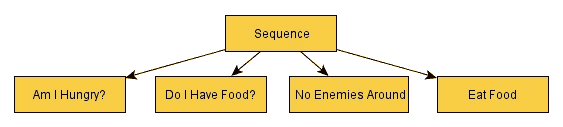
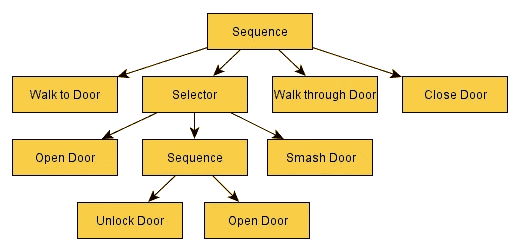
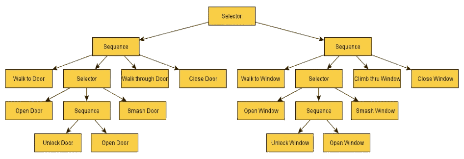
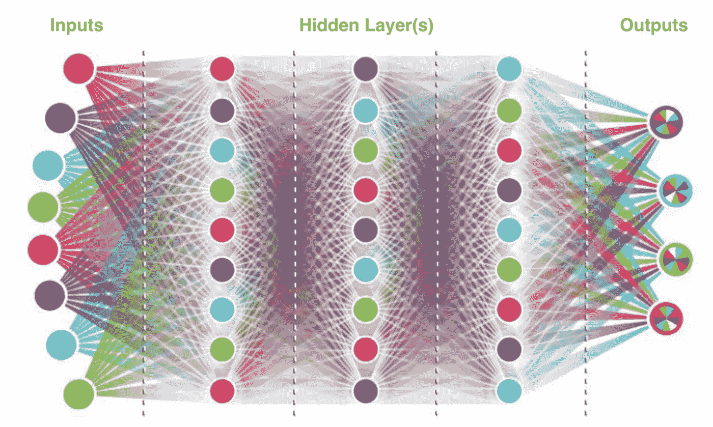

# 电子游戏中的人工智能

> 原文：<https://towardsdatascience.com/artificial-intelligence-in-video-games-3e2566d59c22?source=collection_archive---------6----------------------->

## 概述视频游戏人工智能如何随着时间的推移而发展，以及目前在游戏中的应用

由劳拉·e·舒蒙·马斯和安迪·卢克撰写

Virtual Reality Photo by Harsch Shivam

大多数人可能认为过去几年发布的大多数游戏都有高度复杂的人工智能，用于任何非玩家控制的角色、生物或动物(在本文中通常称为*机器人*)。然而，许多视频游戏开发商担心失去对整体玩家体验的控制，不愿在游戏中内置先进的人工智能。事实上，电子游戏中人工智能的目标不是创造一个无与伦比的实体供玩家与之斗争，而是意味着最大限度地提高玩家的参与度和长期享受。

如果你拿起一个新游戏开始玩，你会不会有更多的享受被一遍又一遍彻底摧毁？或者，你更愿意和与你水平相当的人/事配对，这样你就可以随着时间的推移不断学习和提高？绝大多数玩家可能会选择后者。这并不意味着人工智能在现代游戏行业没有一席之地，只是意味着它的目的与我们最初的预期不同。我们不想创造最好的人工智能，我们想创造最令人愉快的人工智能供玩家互动/竞争。

# 人工智能在游戏中的历史

人工智能是一个非常宽泛的术语。它不一定需要成为一个从玩家的行为中学习的模型。Wolfenstein 3D 早在 1992 年就发布了，甚至那款游戏中的士兵都有一个初步的人工智能形式。F *inite 状态机(FSM)算法*是一个相对简单的人工智能，设计师创建了一个机器人可以经历的所有可能事件的列表。然后，设计者会对每种情况做出具体的反应(Lou，2017)。我们可以想象，在 1992 年，Wolfenstein 3D 的开发者考虑到了敌军士兵可能经历的所有情况。一扇门可能在他们的视野中打开，Blazkowicz(Wolfenstein 系列的主人公)可能走进视野，他们可能从后面被击中，他们可能看不到 Blazkowicz，等等。开发人员会编辑这个列表，并针对每种情况，告诉机器人应该做什么。下面是 Lou 文章中的一个有用的视觉效果:

Figure 1 (Lou, 2017)

这显然是一个简单化的例子。我们可以想象，我们构建的细节越多，它就会变得越复杂。在放弃之前，机器人应该搜索 Blazkowicz 多长时间？当/如果它们放弃了，它们应该留在原地还是回到它们的产卵点？这个列表会很快变得很长，很详细。在 FSM 中，每种情况都会被游戏开发者分配一个特定的动作。

FSM 算法在每个游戏中使用是不可行的。例如，想象在一个策略游戏中使用 FSM。如果一个机器人被预编程为每次都以同样的方式回应，玩家将很快学会如何智胜计算机。这创造了一个重复的游戏体验，正如你所料，对玩家来说是不愉快的。创建 M *onte 卡洛搜索树(MCST)算法*是为了防止 FSM 的可重复性。MCST 的工作方式是首先想象一个机器人当前所有可能的动作。然后，对于每一个可能的行动，它分析一个玩家可能做出的所有反应，然后考虑它可能做出的所有反应，等等。(楼，2017)。你可以想象这棵树会有多快变得巨大。这里有一个很好的图表来形象化 MCST 是如何工作的:

Figure 2 (Lou, 2017)

图 2 突出显示了使用 MCST 的计算机在对人类组件采取行动之前所经历的过程。它首先查看它拥有的所有选项，在上面的例子中，这些选项要么是防御，要么是建造技术，要么是攻击。然后，它构建了一个树，预测此后每一次潜在行动成功的可能性。上面我们可以看到，成功可能性最高的选项是‘攻击’(因为暗红色等于奖励的概率更高)，因此计算机选择攻击。当玩家下一步行动时，计算机会再次重复树的构建过程。

想象一下像《文明》这样的游戏，电脑可以做出大量的选择。如果计算机要为整个游戏的每一个可能的选择和每一个可能的场景建立一个详细的树，它将会花费非常长的时间。它永远不会行动。因此，为了避免这种巨大的计算，MCST 算法将随机选择几个可能的选项，并只为选中的选项构建树。这样，计算会快得多，计算机可以分析哪一个选项最有可能获得奖励。

# 《异形:孤立》中的人工智能

最近，视频游戏中更受欢迎的高级人工智能形式之一是来自创意大会的*外星人:隔离*的外星人。对于人工智能在幕后的工作方式有一些误解。然而，这是一个非凡的展示，展示了人工智能可以用来为玩家创造一个迷人而不可预测的环境。

*Alien: Isolation* 中的外星人有两种驱动人工智能的力量控制它的运动和行为:导演人工智能和外星人人工智能。导演人工智能是一个被动的控制器，负责创造一个愉快的玩家体验。为了做到这一点，临时导演随时都知道玩家*和*外星人在哪里。然而，它不与外星人分享这一知识。人工智能总监关注着所谓的*威胁指标*，它本质上只是一种对预期玩家压力水平的衡量，由多种因素决定，如外星人与玩家的接近程度、外星人在玩家附近停留的时间、玩家可见的时间、运动跟踪器设备可见的时间等。这个*威胁量表*通知外星人的*工作系统*，它本质上只是外星人的任务追踪器。如果*威胁标尺*达到一定等级，任务“搜索新位置区域”的优先级会增长，直到外星人离开玩家进入一个单独的区域。

**行为决策树:**

在深入研究外星人人工智能如何工作之前，首先强调决定过程的结构是很重要的。外星人人工智能使用一个广泛的行为决策树，有超过 100 个节点和 30 个选择器节点。想象下面这个简单的例子:

Figure 3 (Simpson, 2014)

行为树的工作方式是从左到右提问。成功允许沿着树前进，而失败将返回到序列节点。流程是这样的:序列->我饿了吗？(成功)->序列(运行)->我有食物吗？(成功)->序列(运行)->周围没有敌人(成功)->序列(运行)->吃食物(成功)->序列(成功)->父节点(Simpson，2014)。如果在任何时候，其中一个节点返回(fail)，整个序列都将失败。例如，如果结果是“我有食物吗？”失败后，它不会检查周围是否有敌人，也不会吃食物。相反，该序列会失败，这将是该序列的结束。

序列显然会变得更加复杂，在深度上变得多层次。下面是一个更深入的例子:

Figure 4 (Simpson, 2014)

请记住，当序列成功或失败时，它会将结果返回给它的父节点。在上面的例子中，让我们假设我们已经成功地接近了门，但是没有打开门，因为门是锁着的，我们没有钥匙。序列节点被标记为失败。结果，行为树路径回复到该序列的父节点。这个父节点可能是这样的:

Figure 5 (Simpson, 2014)

所以，我们在开门方面失败了，但是我们还没有放弃。我们的父节点有另一个序列让我们尝试。这一次是通过窗户进入。外星人人工智能有 30 个不同的选择器节点，总共 100 个节点，所以它比这个例子复杂得多，但我希望这能让你了解外星人人工智能是如何在引擎盖下工作的。

**回到外星智能**

我们知道，外星人的人工智能是控制外星人行动的系统。它从不提供关于玩家位置的信息。它从人工智能主任那里得到的唯一信息是它应该搜索哪个大致区域。除此之外，它必须自己找到玩家。它确实有一些工具可以帮助它追捕玩家。第一个是*传感器系统*，它允许外星人获取环境中的听觉和视觉线索。诸如脚步声，枪声，开门声，甚至运动跟踪器的嘟嘟声，所有这些都有助于外星人追踪玩家。音频范围取决于产生的噪声类型。除了声音传感器，外星人还可以感知视觉传感器，比如瞥见里普利跑过，或者看到视野中的门开着，等等。

外星人追捕玩家的另一个工具是*搜索系统*。开发人员已经确定了一些特定的区域，这些区域是外星人预先设定好要搜索的藏身之处。但是，它不会以任何特定的顺序搜索它们，甚至会仔细检查已经访问过的区域。当然，如果外星人听到噪音或看到视觉线索，它会搜索开发人员没有明确概述的区域。

关于《异形:孤立》最常讨论的话题是，随着游戏的进展，异形似乎对玩家了解得更多。它做出的动作似乎变得更加复杂，因为它了解了玩家游戏风格的某些特征。令一些人惊讶的是，开发人员实现这一点的方式是*而不是*通过在外星人的人工智能系统中建立一个复杂的神经网络。为了展示游戏如何实现这种外星人学习的感觉，我们需要参考一下外星人人工智能的行为决策树。

Figure 6 (Simpson, 2014)

在游戏开始时，这个行为树的某些部分对外星人是封闭的。被封锁的区域对外星人来说是不可接近的，这意味着它不能接触某些行为和动作。例如，在游戏开始时，响应远处开门声的树的部分可能不活动。如果玩家在外星人的视野中打开一扇门，它可以*解锁*行为树的这一部分，这样，在未来，开门的声音将触发一个反应。随着玩家在游戏中的进展，越来越多的外星人行为树被解锁。这给人一种外星人正在学习和适应玩家游戏风格的错觉。

# 视频游戏中的遗传神经网络

如果没有提到神经网络在视频游戏中的应用，这篇文章将是不完整的。最近有一些非常著名的例子，其中一个是人工智能击败了职业 Dota 2 团队。然而，涵盖这个主题的最佳方式是从小处着手，并对神经网络如何学习视频游戏的目标和策略建立基本的理解。

Figure 7 (Comi, 2018)

为了达到这个基本的理解目的，我们将使用的游戏是 Snake。对于那些不熟悉的人来说，贪吃蛇是一个 2D 游戏，你控制一排方块(被称为*蛇*)。你有三个移动的选择:左，右，或直走。如果你撞上了墙或者撞到了尾巴，你会立即死亡并重新开始。有一个点供你收集(被称为*食物*)，它会让你的尾巴长一个方块。所以吃的越多，变得越长。

假设我们想教我们的蛇如何获得尽可能高的分数。为了在这个世界上生存，我们的蛇需要学习一些东西。为了让我们的蛇学习，需要向它提供关于环境的信息。我们将把我们提供的信息称为*输入*。这些输入可以是我们所知道的任何信息。例如，我们的输入可以是以下 6 个是/否问题:是否清晰直、是否清晰左、是否清晰右、是否食物直、是否食物左、是否食物右(Designing AI，2017)。这将根据每个问题的答案为 6 个输入节点提供 1 或 0。然而，这些输入也可以是蛇头与墙壁、尾巴或食物之间的距离。为简单起见，让我们停留在 6 个输入节点的例子上。

接下来我们需要告诉我们的蛇的是我们希望它实现什么。为了传达我们的预期目标，我们实施了一个奖励系统。例如，我们可能会给我们的蛇 1 分，每次它向食物移动一步，可能会给它 10 分，每次它吃了食物，长度增加。然而，当 Binggeser(设计人工智能，2017)为他的蛇实施这些奖励时，他意识到他的蛇只会在一个非常小的圈子里移动。通过这种方式，他的蛇能够在避免墙壁和长尾巴带来的危险的同时获得分数。显然，这不是预期的结果。需要在初始模型中加入某种惩罚，每当蛇离开食物时就扣分。这促使蛇主要朝着食物的方向移动。

所以现在我们有了一条蛇，它拥有来自环境的信息和一个奖励系统，这个系统定义了它的目标是什么。我们将何去何从？我们的蛇实际上是如何学会玩这个游戏的？此时，快速浏览一下神经网络实际上是如何工作的会很有帮助。

**世代神经网络**

世代神经网络的构造方式与标准神经网络相同。它从一定数量的输入节点开始，然后输入到一个或多个隐藏层，最终提供一个输出。这是一个很好的视觉示例:

Figure 8 (Comi, 2018)

对于我们的蛇的例子，我们将有 6 个输入节点，它们是我们之前定义的 6 个是/否问题:它是直的吗，它是左的吗，它是右的吗，它是直的吗，它是左的吗，它是右的吗。每个输入节点通过我们称之为权重的东西连接到每个第一隐藏层节点。在图 8 中，我们看到连接到每个节点的所有线(权重)。这些权重是我们的模型在学习加强或削弱哪些输入以提供最准确的输出时将要调整的。在我们的例子中，“最准确的输出”被定义为“收集最多点数的蛇”。记住，我们的蛇向食物移动会得到分数，吃食物会得到更多分数，远离食物会得到负分数。

一代神经网络“学习”的方式是首先决定每一代的大小(假设我们希望每一代包含 200 条蛇)。接下来，它为第一代中的 200 条蛇中的每一条创建微变化的权重，然后运行第一代中的 200 条蛇中的每一条，并选择最成功的蛇(获得最多分数的蛇)。假设我们选择了在我们的第一代中得到最多分数的前 10 条蛇(前 5%)。这 10 条蛇随后成为第二代的“父母”。这 10 条蛇的重量用来定义第二代的起点。第二代的 200 条蛇将再次产生这些重量的微小变化，表现最好的将被选为第三代的“父母”，等等。

**回蛇**

因此，正如我们在上面看到的，我们可以一遍又一遍地运行我们的第一代 snake 模型(上面我们运行了 200 次),通过稍微改变每个权重来查看 snake 出现的各种变化。然后，我们选择将继续影响第二代神经网络权重的最佳表现者。我们对随后的每一代都重复这个过程，直到蛇的*学习率*开始稳定下来(换句话说，直到一代的进步减缓或停止)。

也许在第一代、第二代和第三代中，没有一条蛇吃过食物，因此也不知道食物奖励 10 分。然而，也许在第四代，一条蛇吃一块食物。这条蛇很可能在它的世代中拥有最高的分数，因此会被选择来影响未来的世代。后代的权重将基于最成功的蛇祖先而改变。10 代，100 代，甚至 1000 代之后，你可以想象会发生多大的学习。

# 视频游戏人工智能在现实世界中的应用

用于视频游戏行业的强化学习同样也成功应用于其他行业。例如，侠盗猎车手游戏(Grand Theft Auto games)已经预编程了“交通规则、道路和汽车物理”(Luzgin，2018)，用于为测试自动驾驶汽车算法提供安全和现实的环境。它不仅安全、真实，而且在虚拟环境中收集数据的速度比真实世界快 1000 倍(Luzgin，2018)。

> “视频游戏是训练人工智能算法的一种很好的方式，因为它们旨在让人类的思维逐渐进入越来越困难的挑战。”(鲁兹金，2018 年)

人工智能在电子游戏方面的最新进展之一是由 Open AI 的研究人员取得的。Open AI 创造了一个基于算法的游戏，其唯一目的就是带着天生的好奇心去探索。奖励系统的重点是奖励游戏中不断深入的探索。研究人员将这个好奇心驱动的模型放入一个超级马里奥兄弟的游戏中，它完全出于好奇心成功通过了 11 关。显然，这也有缺点，因为它需要巨大的计算能力，而且机器很容易分心。然而，这对于第一次玩游戏的人类玩家来说也是一样的。正如 Luzgin 在他的文章中引用的，“婴儿似乎采用无目标的探索来学习对以后生活有用的技能。”这种无目标探索的感觉贯穿一生，但最明显的例子是通过视频游戏探索虚拟环境。

# 摘要

如今，在视频游戏行业，人工智能有很多种形式。无论是简单的 FSM 模型还是从环境反馈中学习的高级神经网络，这些虚拟环境为人工智能的发展提供的可能性(无论是在游戏行业还是其他领域)都是无限的。

## 引用的作品

彼得·宾格泽。*设计 AI:用进化解决蛇*。2017.[https://becoming human . ai/design-ai-solution-snake-with-evolution-f 3d d6a 9 da 867](https://becominghuman.ai/designing-ai-solving-snake-with-evolution-f3dd6a9da867)

来吧毛罗。*如何教 AI 玩游戏:深度强化学习*。2017.[https://towards data science . com/how-to-teach-an-ai-to-play-games-deep-reinforcement-learning-28f9b 920440 a](/how-to-teach-an-ai-to-play-games-deep-reinforcement-learning-28f9b920440a)

卢哈比。视频游戏中的人工智能:走向更智能的游戏。2017.[http://sitn . HMS . Harvard . edu/flash/2017/ai-video-games-forward-intelligent-game/](http://sitn.hms.harvard.edu/flash/2017/ai-video-games-toward-intelligent-game/)

卢兹金，罗曼。*视频游戏作为人工智能的完美游乐场*。2018.[https://towards data science . com/video-games-as-a-perfect-playground-for-artificial-intelligence-3 B4 ebeea 36 ce](/video-games-as-a-perfect-playground-for-artificial-intelligence-3b4ebeea36ce)

克里斯·辛普森。人工智能的行为树:它们是如何工作的。2014.[https://www . gama sutra . com/blogs/ChrisSimpson/2014 07 17/221339/Behavior _ trees _ for _ AI _ How _ they _ work . PHP](https://www.gamasutra.com/blogs/ChrisSimpson/20140717/221339/Behavior_trees_for_AI_How_they_work.php)

汤普森汤米。*完美的有机体:外星人的 AI:隔离*。2017.[https://www . gama sutra . com/blogs/TommyThompson/2017 10 31/308027/The _ Perfect _ organize _ The _ AI _ of _ Alien _ isolation . PHP](https://www.gamasutra.com/blogs/TommyThompson/20171031/308027/The_Perfect_Organism_The_AI_of_Alien_Isolation.php)