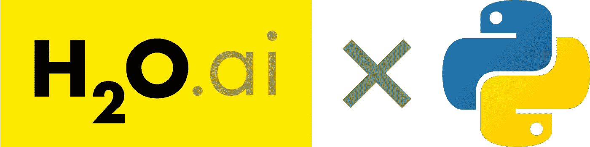
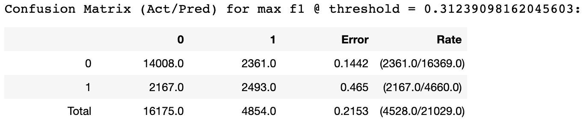
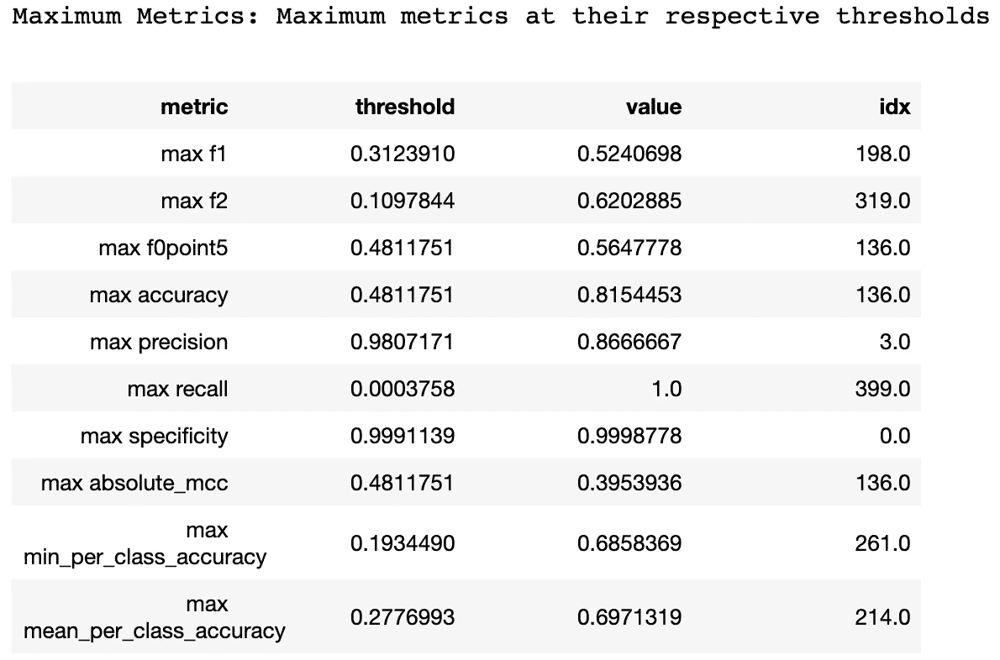
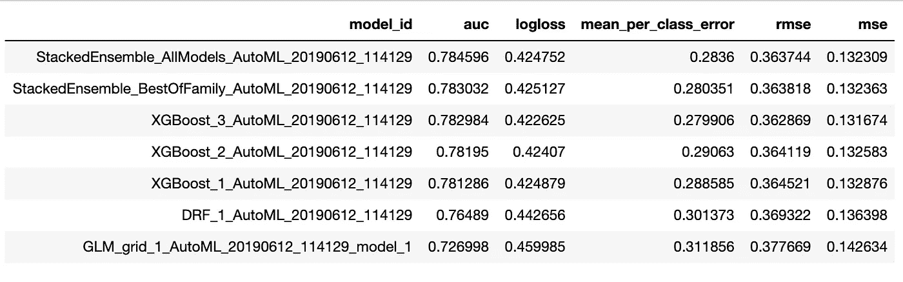

# H2O.ai 让人工智能变得简单

> 原文：<https://towardsdatascience.com/artificial-intelligence-made-easy-187ecb90c299?source=collection_archive---------7----------------------->


Photo Source: ShutterStock

## Python 中使用 H2O.ai 和 AutoML 建模的综合指南

伊桑·戴伊&爱丽斯·李

如果你和我爸爸一样，你已经在 IT 行业工作了几十年，但对数据科学却只是一知半解。现在，你的新 C-something-O 希望你组建一个数据分析团队，并使用一套你在会议上只是模糊听说过的新术语。或者，您可能是一家快速发展的初创公司的开发人员，已经花了数周时间完成了一个算法，却被将模型部署到 web 应用程序以供实时使用的问题所困扰。对于这两种情况，H2O.ai 绝对是一个值得研究的解决方案。

## 为什么是 H2O.ai？

H2O.ai 将自己定位为一个软件包，通过其开源包 H2O 和 AutoML 来简化机器学习过程。虽然像 H2O 无人驾驶人工智能这样的产品允许最终用户在没有一行代码的情况下完全自动化这个过程，但大多数用户(像我一样)希望他们的模型开发至少有一定程度的可定制性。

H2O.ai 在这里大放异彩有几个原因:

*   它将开发过程简化为一个*直观的工作流程*，
*   训练模型*比 sci-kit learn 等流行的软件包*更快，并且
*   使用 Java 对象使得将一个模型转移到产品中变得简单多了

简而言之，H2O 无疑为大型数据集提供了一个快速且可访问的机器学习平台，该平台配备了用户友好的高性能工具。



## 概观

*   入门指南
*   构建独立模型
*   使用 AutoML 寻找最佳模型
*   模型部署

好消息是，Python 中的大部分 H2O 与您可能熟悉的 sci-kit 学习函数很相似。H2O 的数据结构与熊猫非常相似，指定、拟合和评估模型的工作流程也很相似。使用来自 UCI 知识库的金融信用数据集，我们将使用 H2O.ai 来预测个人在下一次付款中违约的概率。

*注意*:如果你只对 AutoML 部分感兴趣，跳过“构建一个 Hello，World！“模型”一节，它深入到开发单个模型的本质。您可以回到那里，将它以及提供的 H2O 文档链接更多地用作参考指南。

您可以使用帖子中的代码片段或下面链接的交互式 Python 笔记本来跟进。

> GitHub:[https://GitHub . com/elyselee/H2O-walk through/blob/master/H2O % 20 walk through . ipynb](https://github.com/elyselee/H2O-Walkthrough/blob/master/H2O%20Walkthrough.ipynb)

# H2O Python 入门

## 设置相关性

尽管我希望我可以说实现就像抛出另一个 pip install 命令一样简单，但实际上要复杂得多。

首先，到 H2O 稳定链接[这里](https://h2o-release.s3.amazonaws.com/h2o/master/4698/index.html)，下载包含最新版本的 zip 文件。按照下面的命令完成软件包的安装。

```
cd ~/Downloads
unzip h2o-3.25.0.4698.zip
cd h2o-3.25.0.4698
java -jar h2o.jar
```

截至撰写本文时(2019 年 6 月)，H2O 仅支持 Java SE 运行时环境版本 8–11。您可以使用`java -version`命令检查您的版本。如果你有 Java SDK 12，你必须卸载并降级到 Java SDK 11 以保持与 H2O 的兼容性。为此，在终端中执行以下命令:`/usr/libexec/java_home -V`。复制它返回的路径名，并使用下面的命令卸载:`sudo rm -rf pathname`。前往[甲骨文 JDK 11 下载网站](https://www.oracle.com/technetwork/java/javase/downloads/jdk11-downloads-5066655.html)，创建一个帐户，并按照那里的说明进行安装。

现在您已经安装了必备包，打开您的 Python 脚本并执行下面的代码。`nthreads`参数简单地控制执行操作的内核数量，而`-1`为 H2O 分配最大数量的可用内核。

```
import h2oh2o.init(nthreads = -1, max_mem_size = 8)
h2o.connect()
```

## 数据预处理

如果你用 Python 做数据科学，使用熊猫数据框架。如果您正在从头开始编写算法并使用 NumPy 数组，那很好。但是如果你认为 H2OFrames 是值得学习的东西，我会为你节省很多时间和麻烦:它不是。

公平地说，H2O 跑得比 sci-kit learn 模型快得多的原因之一是 H2O 为熊猫提供了更高效的数据结构。但是对于特征工程，我们建议坚持使用传统的数据帧，然后在准备好导入时转换成 h2of 帧。因为这毕竟是一个 H2O 教程，我们的处理技术将使用 H2OFrames 来完成。H2O 也有很好的数据操作参考指南。

首先，我们将使用`h2o.import_file()` 函数导入 [UCI 信用卡数据集](https://archive.ics.uci.edu/ml/machine-learning-databases/00350/default%20of%20credit%20card%20clients.xls)。

```
df = h2o.import_file(‘uci_creditheader.csv’)
```

H2OFrames 的许多功能与 Pandas DataFrame 的功能是同源的。例如，我们可以使用`.columns`属性检查列，该属性返回一个特性名称列表(不是 NumPy 数组)。我们可以使用`drop()`功能删除不必要的特征(不需要轴规格)。

```
df = df.drop(‘ID’)
df.columns
```

在下面的代码中，我们将创建一个特性列名`x`和目标变量名`y`的列表。这种格式允许我们向训练和预测函数传递更少的数据结构(sklearn 要求 X_train 和 y_train)，从而显著提高运行时。

```
y = ‘default payment next month’
x = list(df.columns).remove(y)
```

当我们谈到这个话题时，需要注意的是，H2O 将根据`y`变量的数据类型自动假设一个回归或分类模型。使用`df[y].type`属性的快速检查显示我们的值是整数(1 表示贷款违约，0 表示其他情况)。然后，我们可以使用`as_factor()`函数将该列转换为因子类型。

`df[y] = df[y].as_factor()`

为了创建训练和测试集，我们将使用 H2O `split_frame()` 函数，而不是使用 sklearn `train_test_split()`函数。为此，我们需要传递训练集和验证集大小的分数列表(测试集大小是隐式计算的)。该函数返回一个列表，第一个元素引用定型集，第二个元素对应于验证集，第三个元素是测试集。

```
splits = df.split_frame(ratios=[0.7, 0.15], seed=1)train = splits[0]
valid = splits[1]
test = splits[2]
```

我们还可以使用`.nrow`属性检查每个集合的大小。请注意，这些集合中的每一个都包含 X 变量特性和 y 目标，这与我们在 sklearn 中完成的过程不同。

```
print(train.nrow)
print(valid.nrow)
print(test.nrow)
```

# 构建一个“你好，世界！”模型

## 模型构建

我们将使用随机森林估计器对我们的模型进行分类，您将再次注意到与 sci-kit learn 的相似之处。使用`H2ORandomForestEstimator()`函数，我们实例化将用于分类(或回归，如果我们有一个整数或浮点响应变量)的模型。

```
from h2o.estimators.random_forest import H2ORandomForestEstimatorrf = H2ORandomForestEstimator(seed=1)
```

*   `seed`:该参数与其他模块中的`random_state`类似，只是控制创建模型时使用的随机数。这对于使用外部数据集进行模型验证时的再现性非常重要。
*   还有一些其他特定于每个型号的参数，如`ntrees`或`min_split_improvement`，可以指定。为了找出你所选择的模型算法，查看一下 H2O 的文档。

## 拟合和预测结果

为了使我们的模型适合数据，我们必须至少传递三个参数:`training_frame`、`y`列和`x`列。但是，如果`x`参数为空，h2o 将假设在拟合时使用除`y`列之外的所有列。下面是一些其他参数，您可能希望在下面的片段中没有包括的数据中使用。同样，完整的列表可以在文档[这里](http://docs.h2o.ai/h2o/latest-stable/h2o-docs/data-science.html#supervised)找到。

```
rf.train(x=x, y=y, training_frame=train)
```

*   `nfolds`:用于交叉验证的折叠数。关于这方面的更多信息，请查看交叉验证的 [H2O 解释](http://docs.h2o.ai/h2o/latest-stable/h2o-docs/cross-validation.html)。
*   `balance_classes`:当我们的目标特征中存在类别不平衡时，我们可能希望对数据进行重新采样，在创建新分布时，通过对少数类别进行过采样或对多数类别进行欠采样。如果我们将这个参数设置为`True`，我们也可以指定一个`class_sampling_factors`参数，并传递一个比率列表来确定最终的分布。
*   `ignored_columns`:如果我们在拟合时不希望包含某些列，但这些列有助于比较预测值，如观察 ID，我们可以使用此参数指定。
*   `categorical_encoding`:在 sklearn 中，我们在预处理阶段使用单独的函数处理分类变量，而 H2O 可以使用一个热编码或标签编码等技术处理每一列。简要说明:要将需要处理的列标记为分类列，请事先使用`.as_factor()`函数来更改训练集和测试集中的数据类型。可以在[这里](http://docs.h2o.ai/h2o/latest-stable/h2o-docs/data-science/algo-params/categorical_encoding.html)找到`categorical_encoding`选项的完整列表。

**预测**

返回每个类的预测概率非常简单，可以使用`predict()`函数来完成。

```
y_hat = rf.predict(test_data=test)
```

进一步检查 y_hat，我们看到`predict()`为每个观察值返回了三列:`p0`，观察值属于 0 类的概率；`p1`，观察值属于第 1 类的概率；和`predict`，预测分类标签。这里，分类标签的判定边界(阈值)被假设为 0.5，因此任何大于 0.5 的`p1`值将对应于为 1 的`predict`标签。


## 性能赋值

真正理解模型评估的基础对于决策者最终决定一个模型是否适合部署和用户交互是至关重要的。我已经在这里写了一篇关于二进制分类的度量的文章[如果你不熟悉这个主题或者需要复习一下。](https://medium.com/@ishaandey/hackcvilleds-4636c6c1ba53)

为了检索关于我们的模型表现如何的报告，我们可以使用`model_performance()`函数，并将结果打印到控制台。

```
rf_performance = rf.model_performance(test)
print(rf_performance)
```

输出有几个部分。首先，我们看到一个标题，它指定了报告什么类型的指标`ModelMetricsBinomial`，以及模型类型`drf`。

```
ModelMetricsBinomial: drf
** Reported on train data. **MSE: 0.14036700152537882
RMSE: 0.3746558441094691
LogLoss: 0.45587629761245807
Mean Per-Class Error: 0.30286812164834764
AUC: 0.7576361236577988
pr_auc: 0.5240926163909475
Gini: 0.5152722473155975
```

我们还会收到一个混淆矩阵，纵轴是实际标签，横轴是预测标签。*注意*:混淆矩阵的值在最大化 F1 分数的阈值(概率截止值)处报告，而不是 0.5。我们这里的输出确定为 0.312。



Confusion Matrix Calculated at Threshold that Maximizes F1 Score

H2O 输出的酷之处在于，它会自动计算每个阈值处的每个指标，然后报告最大指标`value`以及达到该指标的`threshold`。同样，如果这里使用的词汇对你毫无意义，我强烈推荐阅读[这篇解释评估指标的文章](/hackcvilleds-4636c6c1ba53)。



这个组件对于理解模型是否真的完成了我们所需要的是至关重要的。想象一下，我们正在开发一个检测疾病的模型。`Specificity`指我们正确预测的实际疾病病例的比例。我们宁愿最大限度地提高特异性，而不是精确性，原因很简单，因为没有检测到真正的患病患者和放弃早期干预的成本远比虚惊一场更糟糕。

顺便说一下，我们可以通过调用 H2OModelMetrics 对象的度量函数来返回特定的度量。要查看可以调用的指标的完整列表，请在键入 H2OModelMetrics 对象名称后点击*选项卡*，并从下拉列表中选择一个选项(然后添加`()`以返回感兴趣的指标)。

```
rf_performance**.**auc()
rf_performance.confusion_matrix()
```

**参考链接**:

> *指标指南【https://towardsdatascience.com/hackcvilleds-4636c6c1ba53 :*

## 其他型号的快速备忘单:

**深度学习(DL)** :由分层神经元组成的人工神经网络，每个连续的模型层都通过聚合对前一层进行改进。要了解更多关于这种工作方式的背景，请查看我们关于深度学习的文章。

*   `epochs`:流式传输数据集的次数。
*   `L1`:添加 L1 正则化，通过将多个权重值设置为 0 来提高泛化能力和稳定性
*   `L2`:添加 L2 正则化，通过降低许多权重值来提高泛化能力和稳定性
*   `adaptive_rate`:学习率手动调谐默认开启
*   `loss`:指定损失函数，选项:`Automatic`(默认)、`Absolute`、`Quadratic`、`Huber`、`CrossEntropy`

**分布式随机森林(DRF)**:DRF 用数据集创建一个回归或分类树森林。

*   `ntrees`:树的数量
*   `max_depth`:最大树深
*   `sample_rate`:行采样率从 0 到 1(默认为 1)
*   `col_sample_rate_per_tree`:每棵树的列采样率从 0 到 1

**广义线性模型(GLM):** 一种线性回归，具有灵活的泛化能力，用于处理非线性。

*   `Solver`:要使用的求解算法:`auto`、`l_bfgs`、`irlsm`、`coordinate_descent`、`coordinate_descent_naive`、`gradient_descent_lh`或`gradient_descent_sqerr`。
*   `Lambda`:正规化强度
*   `Alpha`:L1 和 L2 之间的规则化分配

**梯度推进机器(GBM)** :通过连续细化使用弱决策树的集合(模型集合)

*   `ntrees`:集合的树数
*   `learn_rate`:学习率，范围从 0 到 1
*   `sample_rate`:行采样率从 0 到 1(默认为 1)
*   `col_sample_rate`:列采样率，范围从 0 到 1。

**朴素贝叶斯分类器**:基于应用贝叶斯定理的强特征独立性假设的分类算法

*   `max_hit_ratio_k`:命中率计算的最大预测数
*   `min_prob`:用于观察的最小概率
*   `eps_prob`:低于被 min_prob 替换的概率的截止值

**参考链接**:

> 模型估计器文档:[http://docs . H2O . ai/H2O/latest-stable/H2O-docs/data-science . html # supervised](http://docs.h2o.ai/h2o/latest-stable/h2o-docs/data-science.html#supervised)
> 
> 参数文档:[http://H2O-release . S3 . Amazon AWS . com/H2O-dev/rel-shackle Ford/5/docs-website/H2O-py/docs/H2O . html](http://h2o-release.s3.amazonaws.com/h2o-dev/rel-shackleford/5/docs-website/h2o-py/docs/h2o.html)

# AutoML:优化变得简单

正如您现在可能已经看到的，选择最佳预测模型可能是复杂且耗时的。您不仅需要确定最佳模型，还需要确定使该模型性能最大化的最佳参数。传统上，我们会通过网格搜索来进行超参数调整，但 H2O 也可以跨多个模型自动完成整个过程。

自动机器学习(AutoML)通过训练各种模型来自动化选择最佳模型的过程，使那些没有该领域专业背景的人能够像传统方法一样产生高性能的模型。想想 sci-kit 学习管道，只是更大更好。

目前，H2O 版本 3.16 中的 AutoML 支持以下模型:随机森林、极度随机森林、深度神经网络的随机网格、梯度推进机器(GBM)的随机网格、广义线性模型(GLM)的固定网格，然后训练模型的堆叠系综。

## 构建自动估计器

我们首先导入 H2O AutoML 函数，并将其用于训练集，以与之前模型相同的方式传递`x`和`y`列。

```
from h2o.automl import H2OAutoMLaml = H2OAutoML(max_models=5, max_runtime_secs=300, seed=1)
aml.train(x=x, y=y, training_frame=train)
```

*   `max_models`:这控制了要构建的模型的最大数量，不包括堆叠的集合模型。
*   `max_runtime_secs`:这是在训练模型之前 AutoML 运行的最大运行时间(秒)。

## 性能赋值

我们可以通过调用`leaderboard`属性并将输出存储在 H2OFrame `lb`中来查看最佳模型及其在各种指标上的性能，然后我们可以使用`head()`函数来查看。

```
lb = aml.leaderboard
lb.head(rows**=**lb**.**nrows)
```

输出将包含按 AUC 分数排序的最佳模型列表，并显示适用于分类或回归的几个拟合优度指标。



Leaderboard Output with Maximum Running Time of 300s

我们可以使用排行榜中的最佳模型来预测测试集上的标签，并查看之前显示的其他指标。为此，模型被存储为`aml.leader`，并拥有普通分类器所拥有的所有功能和属性。

```
y_hat = aml.leader.predict(test) 
aml.leader.auc()
aml.leader.confusion_matrix()
```

> AutoML 文档:[http://docs.h2o.ai/h2o/latest-stable/h2o-docs/automl.html#](http://docs.h2o.ai/h2o/latest-stable/h2o-docs/automl.html#)

# 进入生产阶段

H2O 的一个更大的好处是，所有经过充分训练的模型都可以存储为对象，可以很容易地部署到其他 Java 环境中进行实时评分。

为此，H2O 可以将模型转换为*M*odel*O*b*j*ect*O*optimize(MOJOs)。与普通旧 Java 对象(POJO)不同，mojo 没有大小限制，并且比 POJO 速度更快，占用的磁盘空间更小。产生一个`H2O-genmodel.jar`文件作为输出，它是一个支持计分的库，包含所需的阅读器和解释器。将 MOJO 模型部署到生产环境中时，也需要这个文件。

下面的代码将 mojo 和`h20-genmodel.jar`文件下载到用户指定的路径。

```
model.download_mojo(path='pathname', get_genmodel_jar=True)
```

有关如何在生产中访问模型的更多信息，请参见下面的 H2O 文档。

> 生产文档:[http://docs . H2O . ai/H2O/latest-stable/H2O-docs/productionizing . html #](http://docs.h2o.ai/h2o/latest-stable/h2o-docs/productionizing.html#)

# 离别的思绪

到目前为止，您已经熟悉了 python 中 H2O API 的基础知识，在 StackOverflow 和文档的帮助下，您应该能够使用 Python 启动和运行 H2O，构建和训练模型，评估其性能，甚至研究部署。

在这个过程中，我发现相对于其他来源，可以从 H2O 文档中获得资源。不要低估 StackOverflow，但也不要指望在那里找到所有问题的答案。

如果您有任何问题，请告诉我们，我们很乐意在您开始使用 AutoML 和 H2O.ai 时提供更多资源。