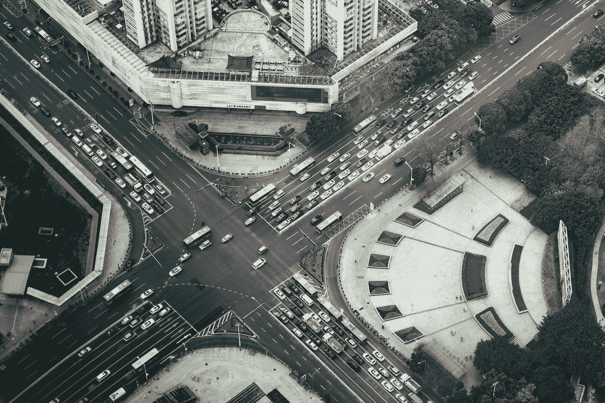
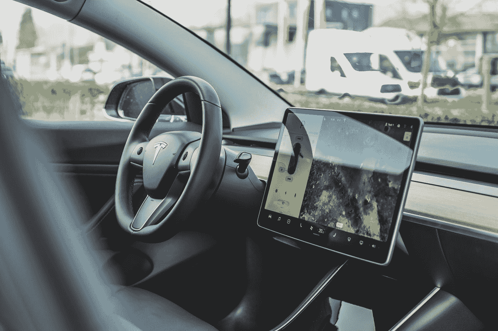

# 人工智能遇上物联网。

> 原文：<https://towardsdatascience.com/artificial-intelligence-meets-the-internet-of-things-a38a46210860?source=collection_archive---------11----------------------->

Photo by [NeONBRAND](https://unsplash.com/@neonbrand?utm_source=medium&utm_medium=referral) on [Unsplash](https://unsplash.com?utm_source=medium&utm_medium=referral)

我们需要做的是创建一个准确的和有效的机器学习模型，这需要大量的高质量和相关的数据。物联网设备有潜力产生大量数据，然后可以与人工智能一起使用。想象一下[面部识别系统](https://www.bbc.co.uk/news/av/technology-40676084/how-facial-recognition-could-replace-train-tickets)使用摄像头取代普通支付，或者回忆一下当前对[自动驾驶汽车](https://www.youtube.com/watch?v=jWreyC2l-dw)使用内置传感器收集周围数据的大肆宣传。这些解决方案同时使用了人工智能和物联网，但很少有人研究如何轻松地将它们集成在一起。幸运的是，现有的物联网平台提供了从各种设备收集数据的接口，并可以提供一种相对简单的方法来将物联网数据利用到 AI/ML 系统中。本文将为您提供一些最先进的人工智能+物联网示例，概述最流行的物联网平台以及它们如何与您的人工智能/人工智能系统集成。

如果您有任何问题或反馈，请随时通过 [Linkedin](http://www.linkedin.com/in/kacperkubara) 或通过我的[个人网站](http://www.kacperkubara.com)联系我。

# 人工智能+物联网示例

为了让你更好地了解人工智能如何与物联网结合使用，我列出了 3 个使用这两种技术的商业案例。

## ET 城市大脑

Photo by [Robert Bye](https://unsplash.com/@robertbye?utm_source=medium&utm_medium=referral) on [Unsplash](https://unsplash.com?utm_source=medium&utm_medium=referral)

由阿里云创建的 ET 城市大脑是一个复杂的人工智能平台解决方案，可以优化城市公共资源的使用。它已在中国杭州成功实施，汽车流量减少了 15%。该解决方案还有助于检测道路事故、非法停车，并通过改变交通灯来帮助救护车更快地到达患者，从而支持救护车更快地到达目标。这是一个出色的软件系统，它利用了整个城市的交通灯摄像头，并根据机器学习模型的输出，可以确定交通灯应该如何改变[1]。

## 特斯拉的自动驾驶

Photo by [Bram Van Oost](https://unsplash.com/@ort?utm_source=medium&utm_medium=referral) on [Unsplash](https://unsplash.com?utm_source=medium&utm_medium=referral)

特斯拉自动驾驶系统将 GPS、摄像头、声纳和前视雷达与专门的硬件结合在一起，以充分利用耦合到神经网络架构中的数据。它作为一个自我封闭的系统工作，从传感器收集数据，然后使用神经网络模型来帮助确定汽车运动的下一个变化。

## 教室监控系统

Facial Recognition System — [http://en.people.cn/n3/2018/0519/c90000-9461918.html](http://en.people.cn/n3/2018/0519/c90000-9461918.html)

虽然这可能会引起一些争议，但该系统已经在中国杭州的一所高中实施。教室摄像头每 30 秒扫描一次房间，该算法能够确定学生的情绪(快乐、悲伤、无聊等)。)，以及学生的行为(阅读、写作、举手等。).据该校副校长称，该系统由当地管理，关注的是全班而非单个个人的行为。这里，数据由摄像机收集，图像识别步骤在本地服务器上执行[3]。

这些例子显示了如何通过使用人工智能和从物联网设备流出的数据来解决复杂的逻辑问题。随着对这些解决方案需求的增加，构建这些系统的工具变得越来越容易获得和方便使用。在下一段中，您将了解到您拥有哪些选项来构建 AI/IoT 系统。

# 具有人工智能功能的物联网平台

物联网平台越来越受欢迎，因为它们为从物联网设备流出的数据提供了各种有用的工具和云存储选项。我不会深入讨论如何建立 AI+IoT 项目的技术细节，因为这不是本文的目的。相反，我的目标是让您大致了解每个平台都提供了什么。

## Azure 物联网

Azure IoT 有一个 [Github 知识库](https://github.com/Azure/ai-toolkit-iot-edge)，它是为了帮助你轻松集成 AI 和 IoT 而创建的。这个代码库提供了关于如何一起使用机器学习和 Azure IoT Edge 的不同代码示例。深度学习模型可以封装在 Azure IoT Edge 兼容的 Docker 容器中，然后使用 REST APIs 暴露给数据。或者，可以将它部署在云上，然后使用 REST APIs 进行预测。Azure IoT 有很多有用的教程和案例，可以在[他们的网站](https://docs.microsoft.com/en-gb/azure/iot-edge/tutorial-machine-learning-edge-01-intro)上找到。

## 谷歌云物联网

[谷歌云物联网](https://cloud.google.com/solutions/iot/)是一个令人印象深刻的物联网平台，它使你能够以多种不同的方式将数据与机器学习模型联系起来。它提供了一整套具有机器学习功能的边缘/内部计算工具，类似于 Azure IoT。谷歌还创建了一个单独的人工智能平台，以便你可以在那里训练模型，以及物联网数据的云存储选项。很少有有用的教程:[例如，这个](https://cloud.google.com/solutions/automating-iot-machine-learning)解释了如何将 ML 模型部署到物联网设备上，该设备根据即将到来的新数据进行自我更新。

## AWS 物联网

知名的 AWS 也提供 AI+IoT 解决方案。AWS 物联网分析尤其有趣，因为它提供了数据准备、可视化和机器学习工具。可以使用[亚马逊 Sagemaker](https://aws.amazon.com/sagemaker/) 训练机器学习模型，然后将其容器化，以便可以用于来自物联网设备的数据流。ML 模型也可以直接上传到运行速度更快的设备上，并且可以根据新输入的数据自动更新[4]。

## 参考

[1][https://www.alibabacloud.com/et/city](https://www.alibabacloud.com/et/city)

[2][https://clean technica . com/2018/11/04/deep-dive-into-tes las-auto pilot-driving-architecture-vs-lidar-based-systems/](https://cleantechnica.com/2018/11/04/deep-dive-into-teslas-autopilot-self-driving-architecture-vs-lidar-based-systems/)

[http://en.people.cn/n3/2018/0519/c90000-9461918.html](http://en.people.cn/n3/2018/0519/c90000-9461918.html)

[https://aws.amazon.com/iot/](https://aws.amazon.com/iot/)