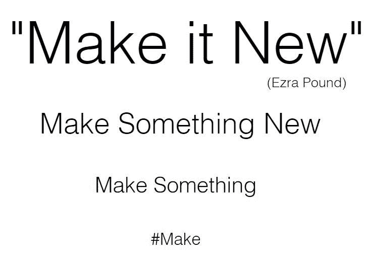
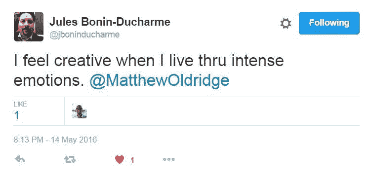
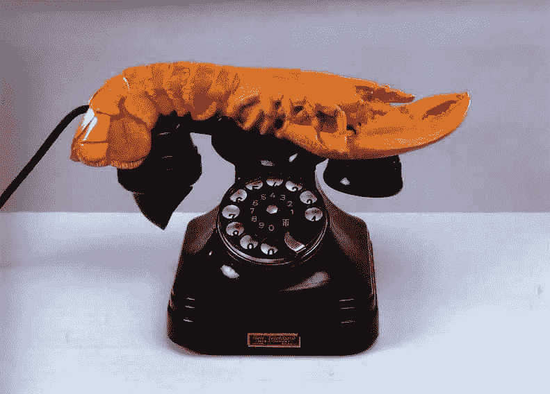
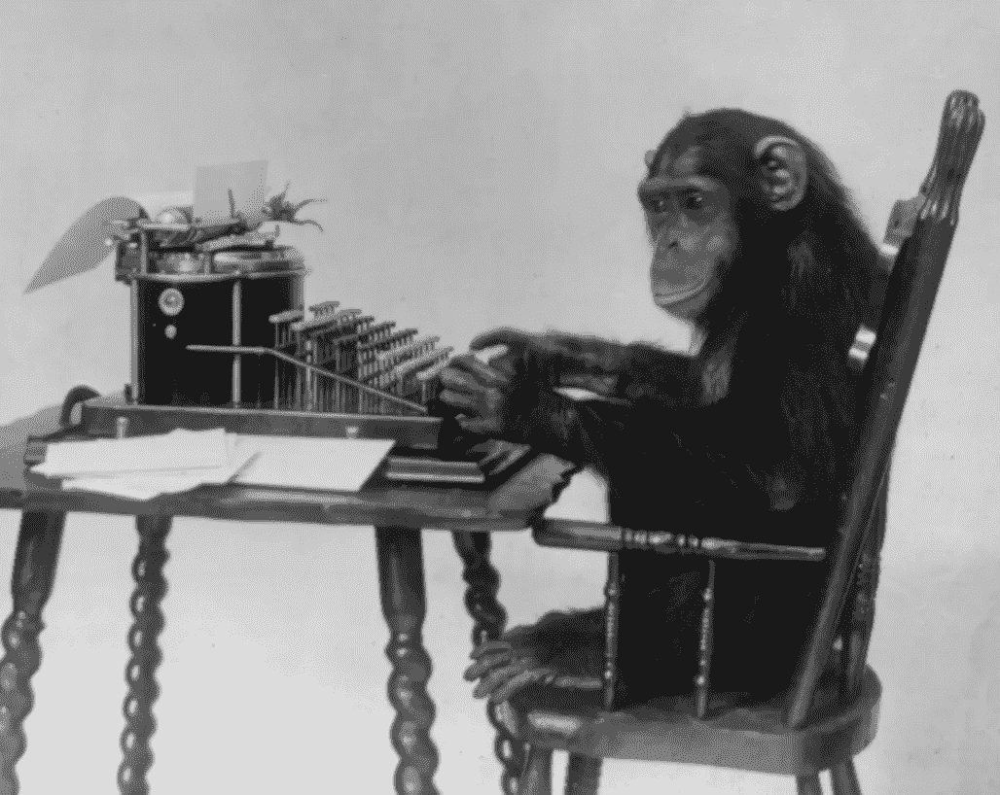

# 人工智能、音乐和人类的崇高

> 原文：<https://towardsdatascience.com/artificial-intelligence-music-and-the-human-sublime-93a9d1301592?source=collection_archive---------23----------------------->

Hannah Fry 在她的书[“Hello World”](https://www.amazon.com/Hello-World-Being-Human-Algorithms/dp/039363499X)中谈到了计算机如何被编程以近乎完美地模仿音乐。一个程序完美地模仿了巴赫的音乐词汇——包括他在所有作品中使用的音符、单词和短语。

即使是最精明的音乐家也永远无法获得巴赫的这种“数据视角”。我们可能熟悉他最喜欢的音符、音调和措辞。如果我们熟悉巴赫，就会对“巴赫性”有一个很好的概念。但是被编程来分析巴赫的机器也以他们自己的方式理解巴赫。例如，他们知道 g 后面可能是什么音符。他们可以分析音符序列，并复制它们。

这个机器学习实验的结果是，通过机器学习创造出来的假巴赫作品愚弄了很多巴赫专家。他们对此感到很难过。他们不应该。

# **机器 1，人类 0。**

虽然我们目前在分析庞大的数据集方面可以被打败，但机器仍然无法与我们的直觉和创造力相匹配。人类可以获得美学上的崇高。我们可以触摸、感受和听到美。巴赫对我们有意义，但对制造假巴赫的机器没有意义。

问题是:机器创造的巴赫真的是假的巴赫吗？如果一个现代音乐家要创作一首类似巴赫的作品，他们显然会使用他们所知道的巴赫元素来创作一些新的东西。这也准确地描述了机器正在做什么。也许这是一个平局。

也许机器已经和我们一样有创造力了。

创造力的一个很好的定义是:

# 创造新事物。

用所有可用的材料制造新的东西，是一个稍微扩大的定义。把两个以前从来没有并列过的东西并列起来，用所有可用的材料做出新的东西，是另一种说法。

我看到了创造力，就像庞德，他这样表达了意象派诗人的特权:

机器辅助的巴赫作品无疑是新的。他们采用现有的元素，并以新的方式将它们拼凑在一起，创造出与巴赫没有区别的新作品。

# **机器有创造力。**

如果你把创造力定义为人类的领域，完全有可能认为机器没有创造力。当我们做创造性的工作时，我们经常会有情绪。

朱尔斯·博宁-杜查姆是这样联系创造力和情感的:

这台机器并不敬畏巴赫，但我们敬畏。我们看到了崇高、审美价值和真正的美。如果我们对创造性的想法附加任何情感，那么，不，机器一点也不具有创造性。

# **人类 1，机器 1**

我们的另一个优势是我们能够看到以前从未联系过的事物之间的联系。这台机器在这里不是这样做的:它获取现有的巴赫乐谱并进行分析。但是我们呢？如果我们愿意，我们可以把巴赫和金属乐队混搭在一起。如果我们愿意，我们可以把巴赫和德雷克混在一起。

更严重的是，我们可以利用巴赫现有的元素，并以新的方式使用它们，创造新的音乐形式，事实上这种情况一直都在发生。音乐的历史是形式的不断重复。

我怀疑巴赫会对几个世纪以来古典音乐的所有创新感到震惊。

在创造力的其他领域，我们认为人类的创新是创造新事物的关键。诗人用新的方式把单词串在一起。视觉艺术家尝试新的笔触，新的雕刻方式。音乐家添加不协和音、和弦变化和适合歌曲的乐器。

下面是大理的*龙虾电话*:

我不确定有哪台电脑会把一只龙虾和一部电话组装在一起。为什么会这样？这个奇异而超现实的雕塑震撼着观者，带我们走出熟悉的世界，这就是超现实主义的意义。

# 超现实主义电脑艺术？

也许超现实主义的电脑艺术在摄影领域是可能的。他们可以把照片分解成像素，然后重新组合。

超现实主义诗歌是可能的，尽管我们不需要电脑，我们可以让一群猴子坐在打字机前:

Infinite Monkey Theorem-Wikipedia.

此外，计算机会说出类似艾米莉·狄金森的话吗？

*我在脑中感觉到一场葬礼。*

迪金森女士是什么意思？她头疼吗？她抑郁吗？

某个地方的某个人可能正在编写一个 Dickinson 模拟器。它会检查她的用词、措辞、行长和诗的长度，它会做得很好。

但是它会达到崇高吗？它会像迪金森一样让我们震惊吗？让我们带着敬畏和惊奇保持沉默？我对此非常怀疑。

# **诗人 1，机器 0。**

尼克·凯夫谈到美和超越，并将其置于我们的人性中。

 [## 音乐、感觉和超越:尼克·凯夫论人工智能、敬畏和人类局限性的辉煌

### “一首好歌带给我们的是一种敬畏感...敬畏感几乎完全基于我们的…

www.brainpickings.org](https://www.brainpickings.org/2019/01/24/nick-cave-music-ai/) 

我觉得那个山洞是对的。我觉得没有机器会创作出一首像凯夫的《死囚第一人称忏悔》那样病态、扭曲、阴险的歌曲，因为找不到一个更好的词，“仁慈的座位”:

我们人类可以想象坐在电椅上等着被油炸会是什么样子。我想知道叙述者做了什么。我对歌曲中的众多歌词感到敬畏。我不相信它们是机器写的。你需要关于上帝、邪恶和死刑的高深知识来写这首歌。

这首歌是凯夫的独唱。一个洞穴模拟器可以捕捉他的话语、措辞和旋律，就像它可以捕捉狄金森的一样，但它永远不可能是真正的洞穴。

我的第二个例子是苏菲洋·斯蒂文斯的《变形》，每当我听到它时，我都会震惊得屈服:

我感到恐惧。我知道“变形”是什么意思，我也知道这是个好东西，但是我觉得害怕这首歌。它属于超验宗教音乐的范畴，而机器还不能接触到精神层面。知道这首歌是圣经也有帮助，尽管无疑有许多圣经分析算法。但是世界上所有的算法都无法让你在 4 分钟内感受到这首歌的效果。

我可以继续，但这只是两个例子。

机器会不会从嘻哈音乐中跳出来，用程序控制的鼓点在每个小节上跳跃，来捕捉音乐呢？人类不得不这样做。

机器能像尼尔·杨一样弹吉他吗？尼尔·杨的主要音乐会吉他在我的脑海中形成奇怪的反馈模式。机器能复制吗？

在鲍勃·迪伦的《铁轨上的血》中，你可以听到他的纽扣敲击他的木吉他。机器会把它编辑掉吗？大概吧。

我认为我们在创造力方面仍然比机器有优势。我们进行创造性的飞跃，发明新的类型，把不同的元素放在一起，看看什么是有效的。如果未来是真正的人类，而不是算法，我们需要坚持下去。

现在，让我们宣布比赛开始:

# 人类 2，机器 1。

我们认为不仅仅是 0 和 1。我们有尼克·凯夫、鲍勃·迪伦、艾米莉·狄金森、萨尔瓦多·达利和 Qtip。我们有太阳的外星探险，我们有杰瑞·加西亚。

@ MatthewOldridge 试图“创造新事物”，至少每天都有几分钟。