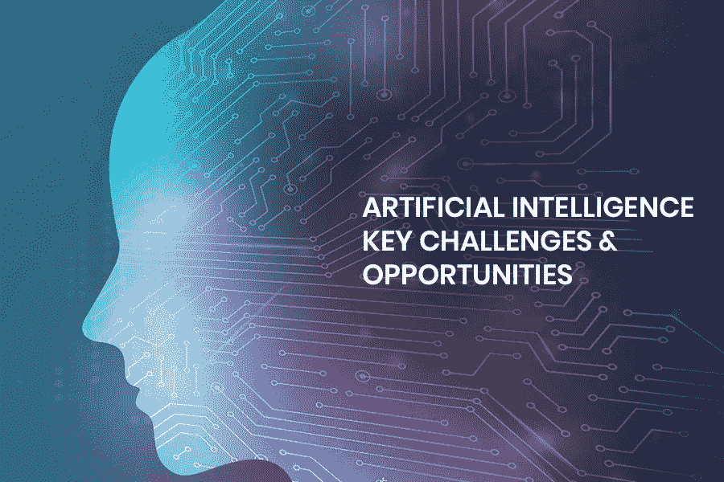
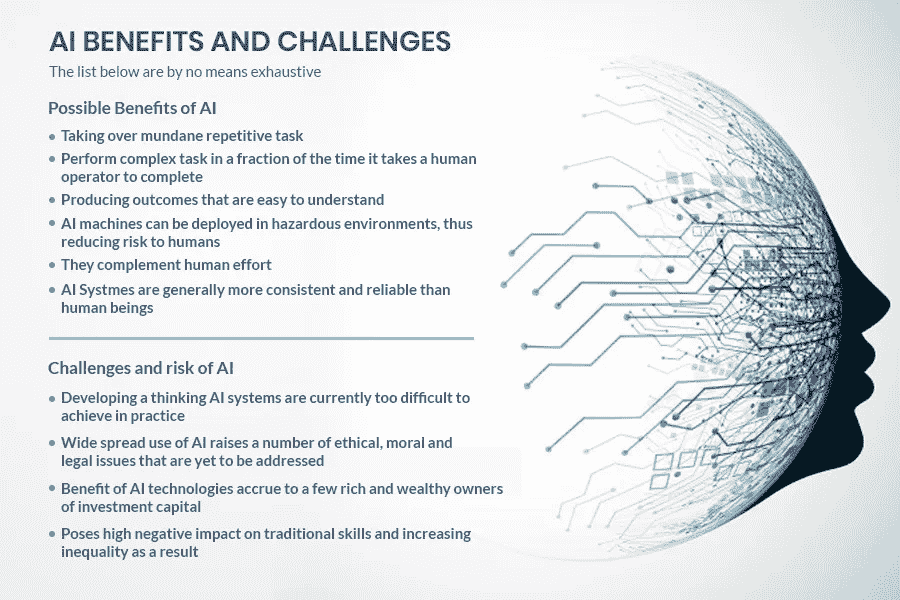

# 商业中的人工智能机遇与挑战

> 原文：<https://towardsdatascience.com/artificial-intelligence-opportunities-challenges-in-businesses-ede2e96ae935?source=collection_archive---------2----------------------->



●寻找企业在实施人工智能方面面临的机遇和挑战？

●对是否在你的业务中开始基于人工智能的开发感到困惑？

●人工智能如何影响你的业务增长和利润？

在这里，在这个博客里，你会找到所有这些问题的答案。开始吧！

人工智能是一项连外行都很好奇的技术！原因在于它有扰乱生活方方面面的强烈倾向。人工智能似乎集体散发出热情和怀疑。显然，在不同的措施！

在此之前，让我们看看人工智能的一些统计数据和事实:

●人工智能技术可以将企业生产率提高多达**40%**[**【埃森哲】**](https://www.accenture.com/in-en/insight-artificial-intelligence-future-growth)

●自 2000 年以来，人工智能创业公司的数量已经**放大到 14 倍**。 [**(福布斯)**](https://www.forbes.com/sites/louiscolumbus/2018/01/12/10-charts-that-will-change-your-perspective-on-artificial-intelligences-growth/)

●人工智能将**自动化 16%** 的美国工作岗位[**【Forrester】**](https://go.forrester.com/press-newsroom/robots-ai-will-replace-7-of-us-jobs-by-2025/)

**●15%的企业正在使用人工智能**，其中 31%的企业表示这是他们未来 12 个月的计划[**【Adobe】**](https://www.adobe.com/insights/15-stats-about-artificial-intelligence.html)

的确，人工智能不再仅仅局限于创新实验室。它因其改变商业的惊人潜力而受到称赞。然而，在发现这项技术的真正潜力之前，企业需要应对某些挑战。

# 人工智能在商业中的实施面临着几个挑战

**1。计算并没有那么先进**

看起来最有益的机器学习和深度学习技术需要非常快速地进行一系列计算(微秒或纳秒或更慢！).

它清楚地表明，这些人工智能技术利用了大量的处理能力。

AI 已经在专家讨论很久了。结果总是没有足够的力量来实现这些人工智能技术。

云计算和大规模并行处理系统为短期内实施这些技术带来了希望，但随着数据量的增加，深度学习转向自动创建越来越复杂的算法，云计算将无济于事！



[What really is Artificial Intelligence about?](https://www.slideshare.net/HarmonyKwawu/what-really-is-artificial-intelligence-about)

**2。支持**的人少了

AI 实现在市场上没有足够的用例。没有它，没有组织会有兴趣投资人工智能项目。这显然意味着，相对而言，很少有组织有兴趣投资开发基于人工智能的产品。

此外，世界上没有足够的人能够让其他企业理解*机器动力进步*的愿景。简单地说，我们可以说，知道如何操作会思考和自学的机器的人不够多。

对于这个问题的补救措施，一个温和的疗法是公民数据科学家。但这也不是永久或真正的解决办法。另一种选择是转向提供允许人工智能驱动的工作“作为服务”的平台和工具。组织能够采用现成的解决方案并插入自己的数据，而不是从头开始。

**3。建立信任**

人工智能的问题在于，它对人来说就像一个黑匣子。当人们不理解决策是如何做出的时，他们会感到不舒服。例如，银行使用基于线性数学的简单算法，这种算法很容易解释，也很容易解释它们是如何从输入到输出的。

因此，人工智能还不能在人们之间建立信任。而看起来这个问题唯一的解决办法就是让人们看到这个技术真的管用。然而，现实却有些不同。这表明，通过更准确的预测，有很多机会让事情变得更好。

这就产生了政府越权的问题。假设，该法规的一部分告诉公民可能有权要求解释在人工智能的帮助下做出的关于他们的决定。


**4。一根筋**

应该考虑的一个大问题是，大多数人工智能实现都是高度专业化的。我们也把专业化的 AI 称为“应用型 AI”。它的建立只是为了完成一个单一的任务，并不断学习变得越来越好。

它遵循的过程是查看给定的输入和产生的结果。它会查看产生的最佳结果，并记下这些输入值。广义的 AI 则不同，可以跳转到任何类似于人类的任务。然而，未来还没有到来。

这只是意味着人工智能需要接受培训，以确保他们的解决方案不会引发其他问题。具体来说，所有超出他们设计考虑范围的领域。


**5。可证明性**

从事基于人工智能的产品的组织无法清楚地展示他们的愿景，以及他们在人工智能技术的帮助下取得的成就。人们怀疑这项技术，它是如何做决定的，它的所有决定是否完美！

此外，这种困惑已经包围了人们的头脑。最终，概率，即人工智能预测背后的数学不确定性，仍然是组织的一个不清楚的领域。

他们无法证明人工智能系统的决策过程是正确的。它唯一的补救办法就是让人工智能变得可解释、可证明和透明。组织应该实现可解释的人工智能。

**6。数据隐私和安全**

大多数人工智能应用程序都基于海量数据来学习和做出智能决策。机器学习系统依赖于通常在本质上是敏感的和个人的数据。

这些系统从数据中学习并自我完善。由于这种系统化的学习，这些洗钱系统很容易出现数据泄露和身份盗窃。欧盟已经实施了《通用数据保护条例》( GDPR ),确保个人数据的完整保护。

这一步是在考虑到客户对越来越多的机器决策越来越了解之后采取的。此外，还有一种被称为联合学习的独特方法，旨在扰乱人工智能范式。

这种联合学习将鼓励数据科学家在不影响用户数据安全和保密的情况下创建 AI。

**7。算法偏差**

人工智能系统的一个大问题是，它们的好坏取决于它们接受训练的数据量。不良数据通常与民族、社区、性别或种族偏见有关。

专有算法被用来找出诸如谁批准保释，谁的贷款被批准等事情。如果隐藏在做出关键决策的算法中的偏见未被发现，可能会导致不道德和不公平的结果。

在未来，这种偏见将会更加突出，因为许多人工智能系统将继续被训练来利用坏数据。因此，从事人工智能工作的组织面前的迫切需要是用无偏见的数据训练这些系统，并创建可以容易解释的算法。

**8。数据稀缺**

事实上，组织现在比以往任何时候都可以访问更多的数据。但是，适用于 AI 应用学习的数据集真的很少。然而，最强大的人工智能机器是那些经过监督学习训练的机器。

这种训练需要带标签的数据。标记的数据是有组织的，以使机器可以理解学习。关于标记数据的另一个问题是它有一个限制。未来自动创造越来越难的算法只会使问题恶化。

尽管如此，还是有一线希望。随着时间的推移，组织正在投资于设计方法，并专注于如何创建人工智能模型，尽管标记数据很少。

# 更多关于人工智能风险的信息

这里有一个 youtube 视频，你可以查看一下，以便快速了解商业中人工智能的几个风险。这段 YouTube 视频解释了人工智能的十大可能风险:

```
<iframe width=”560" height=”315" src=”https://www.youtube.com/embed/1oeoosMrJz4" frameborder=”0" allow=”accelerometer; autoplay; encrypted-media; gyroscope; picture-in-picture” allowfullscreen></iframe>
```

===================================

# 人工智能在商业中的机遇

是的，在商业中实施人工智能存在风险和挑战。但是，就像一枚硬币的两面一样，人工智能也给企业带来了一些机会。由于与人工智能相关的机会，许多企业雇佣专门的印度开发人员来开发他们自己的基于人工智能的应用程序。让我们一个一个来看看。

# 1.营销中的人工智能

这是每个小企业的梦想，以最大限度地提高其营销预算，并集中在高成就的营销战略。此外，每个企业都想了解哪些营销活动能带来最高的投资回报。

但是需要花费大量时间来监控和分析所有媒体渠道的数据。这里，AI 营销解决方案的作用就来了！

Acquisio 等人工智能平台可以轻松帮助管理各种渠道的营销业务，如谷歌 Adwords、脸书和必应。

该机器学习层在情感分析算法的帮助下分析实时活动数据，并建议产生最佳结果的营销活动分布。

它自动进行常规投标并监控整体营销支出，以便企业主可以减少跟踪营销活动所花费的时间，并关注其他重要领域。

# 2.利用人工智能技术追踪竞争对手

跟踪你的竞争对手在做什么总是至关重要的。不幸的是，大多数企业主由于繁忙的日程安排而无法回顾比赛。在这里，人工智能的作用就出现了。

还有蜡笔之类的各种竞争分析工具。他们借助网站、社交媒体和应用程序等不同渠道追踪竞争对手。此外，他们为企业主提供了密切关注竞争对手的营销计划的任何变化，如价格变化，微妙的信息修改和公关活动。

# 3.轻松处理大数据

小企业主愿意利用大量在线和离线信息来做出明智的、数据驱动的决策，从而推动业务增长，这并不奇怪。

人工智能驱动的商业工具最有趣的地方在于，它们可以适用于每一个数据生成工作流，并提供非常适用且可操作的深入见解。

像 Monkey Learn 这样的人工智能商业工具可以整合和分析各种渠道的数据，并实现省时的分析和报告，如 Google Sheets、CSV 等中的情感分析。

# 4.人工智能集成客户支持解决方案

自动聊天系统允许小型企业扩大他们的客户服务工作，并腾出资源用于更困难的客户互动。

像 **DigitalGenius** 或 **ChattyPeople** 这样的人工智能客户服务解决方案建议或自动回答客户提出的问题，对帮助单进行分类，并将询问或消息导向适当的部门。

当你在客户支持中使用人工智能时，平均处理时间会大大减少。此外，它增强了客户服务团队的整体响应能力。

# 5.CRMs 中的人工智能

如果您找到一种方法将您的 CRM 提升到一个新的水平，并获得有价值的见解来帮助管理与现有和潜在客户的互动，您会有什么感觉！

嵌入了人工智能功能的 CRM 平台可以进行实时数据分析，以便根据您公司独特的业务流程和客户数据提供预测和建议。

==================================

**结论**

因此，我们发现人工智能的时代可能终于到来了，但还需要更多的进展。不同公司和行业对人工智能的采用也不均衡。

此外，我们研究了企业在实施人工智能时面临的所有机遇和挑战。现在，我希望你清楚你是否应该在你的公司 **从事[人工智能(AI)开发。](https://www.xicom.biz/latest-thinking/artificial-intelligence/)**

如果你希望创建基于人工智能的应用程序，你可以联系一家知名的网络开发公司，让你的梦想成真。有许多公司提供基于人工智能的软件来提高客户服务部门的效率。