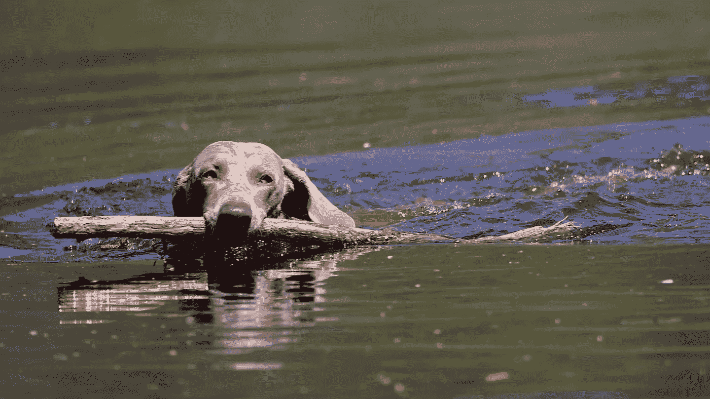
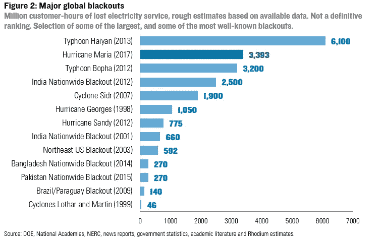
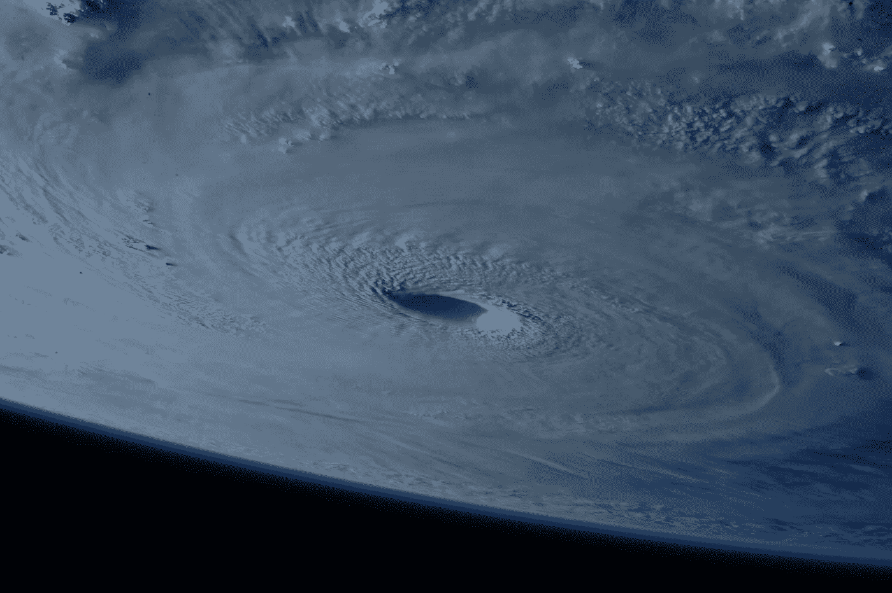
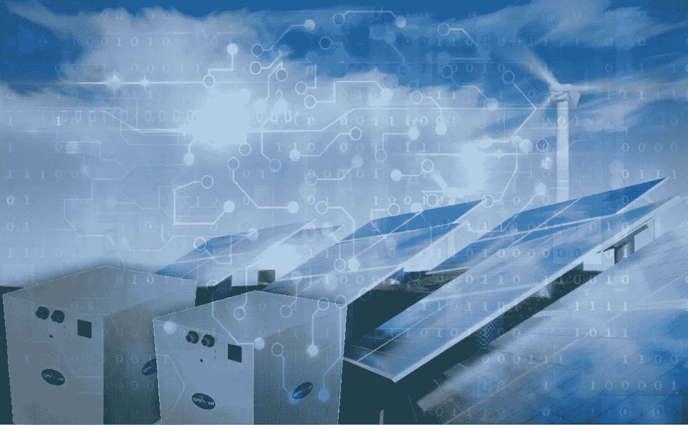
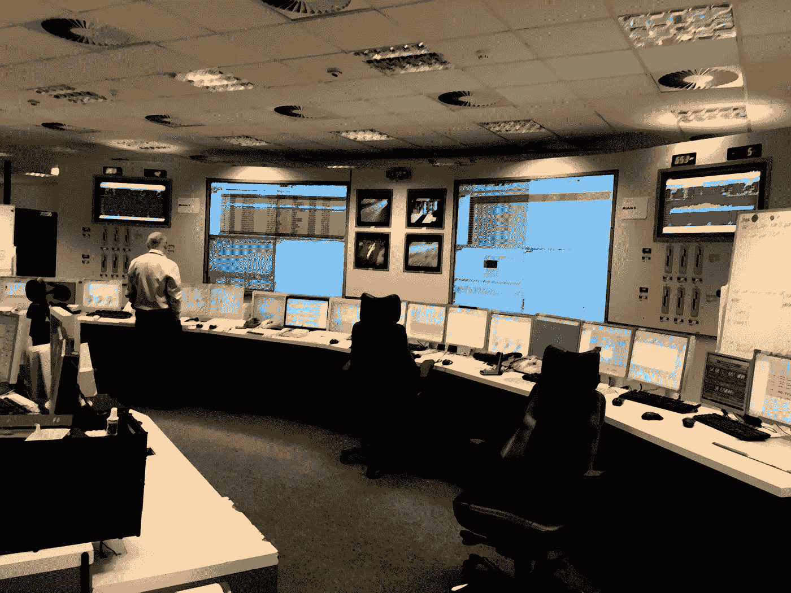
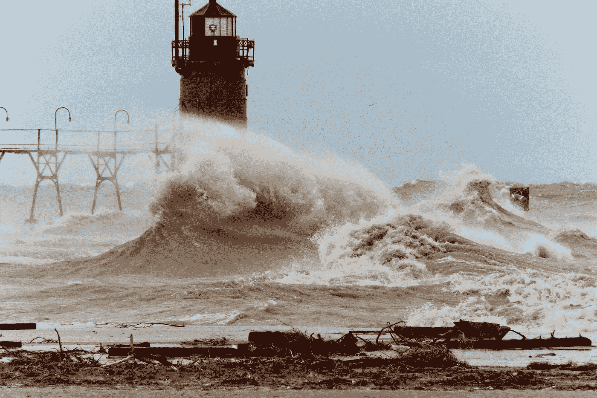

# 人工智能，我们在紧张的电网中最好的朋友

> 原文：<https://towardsdatascience.com/artificial-intelligence-our-best-friend-in-a-stressed-if-not-devasted-power-grid-3e9303d6d9ae?source=collection_archive---------32----------------------->

## 人工智能和其他转型技术，是不断增长的分布式能源资源(DERs)所必需的，特别是在飙升和更大的风暴背景下

Photo by [Nathalie SPEHNER](https://unsplash.com/@nathalie_spehner?utm_source=unsplash&utm_medium=referral&utm_content=creditCopyText) on [Unsplash](https://unsplash.com/search/photos/flood?utm_source=unsplash&utm_medium=referral&utm_content=creditCopyText)

在当今多元化的能源世界中，越来越多的个人消费资产增加了电网的复杂性。在不断变化的气候中越来越多地产生巨大风暴的情况下，这一点甚至更加重要，例如今年早些时候在菲律宾、台湾和中国造成 93 亿美元损失(已知第五大太平洋台风)和 90 多人死亡的[台风利奇马](https://en.wikipedia.org/wiki/Typhoon_Lekima_(2019))，或者最近在大西洋发生的可怕的 5 级飓风多里安。巴哈马旅游和航空部总干事 Joy Jibrilu 详细介绍了飓风 Dorian 造成的破坏，以及巴哈马需要采取的措施，特别是在基础设施方面。(来源 https://www.youtube.com/watch?v=c_8sLpTQq_E[MSBC](https://www.youtube.com/watch?v=c_8sLpTQq_E))

这看起来和我们两年前在波多黎各看到的太相似了，波多黎各遭受了 5 级飓风玛丽亚的严重破坏。损失累计达 920 亿美元，是美国历史上损失第三大的热带气旋。玛丽亚造成的停电被认为是美国历史上最大的停电，也是世界历史上第二大的停电。

Source: [DOE](https://www.energy.gov/), [National Academies](http://www.nationalacademies.org/), [NERC](https://www.nerc.com/Pages/default.aspx)

CosmiQ Works 开发了一种有趣的数据融合绘图方法，并首次对波多黎各电力和基础设施的恢复情况进行了独立的遥感评估。

 [## 波多黎各:灾后电力和基础设施恢复

### 飓风后波多黎各电力和基础设施恢复的遥感时间序列评估…

medium.com](https://medium.com/the-downlinq/a-remote-sensing-assessment-of-electrical-and-infrastructure-recovery-in-puerto-rico-following-66f5faf414fc) 

通过分析全岛观察到的亮度下降水平，这家 IQT 实验室能够确定截至 2018 年 5 月 31 日，13.9%的人仍然缺乏电力，13.2%的基础设施已经失去。

Photo by [NASA](https://unsplash.com/@nasa?utm_source=unsplash&utm_medium=referral&utm_content=creditCopyText) on [Unsplash](https://unsplash.com/search/photos/hurricane?utm_source=unsplash&utm_medium=referral&utm_content=creditCopyText)

# 分布式与集中式

拥有太阳能发电、风力涡轮机和电动汽车的分散式系统为脱碳的未来提供了希望，但也为公用事业公司和消费者带来了挑战，但它们需要妥善规划和运营才能生存，或者至少在这样一场灾难性的灾难发生后及时重启。

能源电网的转型、新服务的出现、新参与者: [prosummers](https://medium.com/@aditya.vikram/the-rise-of-prosumers-and-what-it-means-for-consumer-companies-26d408325934) 、[consumer ' actors](https://medium.com/@Jitips/consumactor-the-real-advertising-cornerstone-2b5e00b1fd21)以及自我消费等新模式，改变了电网本身的运营要求和约束，并对日益庞大的数据进行管理，如果不求助于人工智能，这些数据将无法工作。

能源市场正在脱离只有集中式发电厂的模式，进入分布式电网和点对点市场的时代。能源生态系统的多种元素正以令人眩晕的速度进化。我们看到一个非常复杂的市场正在形成，配电公司需要允许越来越多的可再生能源和灵活的能源资产安装在电表后面，同时保持稳定的本地电网。与此同时，安装了这种灵活资产的专业消费者希望优化他们的能源流动，以实现投资价值的最大化。

一个日益严峻的挑战是分散发电的出现和加速发展，在这种情况下，私人用户，无论大小，都可以利用风能和太阳能等可再生能源发电和使用自己的电力。这使得供求关系变得复杂，迫使公用事业公司从私人用户那里购买多余的能源，这些用户生产的电力多于他们消耗的电力，然后将这些电力送回电网。自 2010 年以来，太阳能的使用大幅增加，预计这一指数趋势将随着光伏电池(利用阳光发电的设备)的出现而继续，从而降低成本并提高效率。

*Source:* [*Novacab*](http://www.novacab.us) *Multiple DERs with* [*Hybrid Energy Storage and Artificial Intelligence*](http://www.novacab.us)*.*

# 扩大分散生产

当前系统的设计一般没有考虑到能源的多样化，特别是可再生资源的增加。例如，在许多美国管辖区，当需求超过供应时，公用事业公司提前几分钟启动以化石燃料为基础的发电厂，即所谓的“最先进”发电厂，以避免连锁灾难。这个过程是最昂贵的，但也是这些公司最赚钱的部分。这导致消费者支付更高的电费，并增加向大气中排放的温室气体。随着未来几年能源需求的大幅增长，这些问题将会加剧。为了避免 IES 的这些非最佳(至少)运行模式，AI 可以启用自动学习算法，结合这些复杂网络上的数据和实时气象数据(来自卫星、地面观测和气候模型)，充分利用这些算法来预测可再生能源产生的电力，如风、太阳和海洋。

结合大数据、云和物联网(IoT)等其他技术，人工智能储能可以通过提高电源的可访问性，在电网管理中发挥重要作用。可再生能源。

*Source:* [*Smart Phases*](https://medium.com/@smbilodeau/a-smart-move-for-smart-phases-9028b8188607) *Power Generation with and Artificial Intelligence.*

# (深度)学习曲线

人工智能可以极大地帮助管理电力消耗，以便大型公用事业公司或更小的电网可以在价格昂贵时出售，在价格便宜时购买。在这种情况下，机器学习，尤其是深度学习算法可以以一种非常有趣的方式应用于能源领域。随着最终用户成为“专业消费者”，智能设备激增，大数据可供分析，可再生能源不断增长，商业模式和法规也在不断调整。

将所有这些结合在一起有助于达到能量流动和/或储存的最佳时机、方向和容量。通过[人工智能](https://www.energycentral.com/c/iu/4x4-case-4-smart-ways-use-artificial-intelligence-4-areas-utility)算法来确定何时生产、消耗、储存和交易能源，以实现最终用户、服务提供商和电网运营商的成本效益。随着成千上万个新兴能源社区的出现，这一愿景可能会变得更加清晰，甚至可能成为未来 5 到 10 年的主要现实。

越来越多的可持续社区、公用事业和运营商目前正处于模拟阶段或试点项目的第一阶段。预计到 2025 年，物联网(IoT)将需要超过 100 亿个智能设备和超过 1 亿辆电动汽车(公交车、卡车和乘用车)，超过 10 亿个专业消费者(私人和工业)拥有自己的“生产”千瓦时(太阳能或其他)，这将是维持可靠性、安全供电和电网稳定性的巨大挑战。

对 DERs 在未来几年的发展有多种预期。但这些变化需要全新的运营范式，没有比现实生活更好的技术考验了。涉及人工智能、储能和可再生能源的新模式已经在各大洲的许多国家得到不同程度的应用，更不用说澳大利亚、加利福尼亚、德国、中国、哥斯达黎加、以色列和世界上许多其他国家了。

当我们面对一个对人类干预做出反应的气候时，尤其如此。人工智能与可再生能源和能源储存的正确使用不仅可以帮助我们减少能源消耗对二氧化碳排放的影响，还可以适应日益增长的灾害影响(与人为气候变化有关)。

设想 AI 和 DER 将成为变革性技术，很快成为我们制作新网格模型的最好朋友，这并不需要通灵。

Photo by [James Peacock](https://unsplash.com/@jimmyp9751?utm_source=unsplash&utm_medium=referral&utm_content=creditCopyText) on [Unsplash](https://unsplash.com/search/photos/flood?utm_source=unsplash&utm_medium=referral&utm_content=creditCopyText)

本文是由荷兰的[夏羽·比洛多](https://www.linkedin.com/in/stephane-bilodeau/?locale=en_US)撰写的关于**人工智能和能量储存**的系列文章的延伸。工程博士，对外经济合作中心。创始人&首席技术官、Smart Phases ( [Novacab](http://www.novacab.us/) )、加拿大[工程师协会会员](https://engineerscanada.ca/about/committees/operational/public-affairs-advisory)以及[能源中心](https://www.energycentral.com/member/profile/217621/activity)和[媒体](https://medium.com/@smbilodeau)的专家撰稿人。