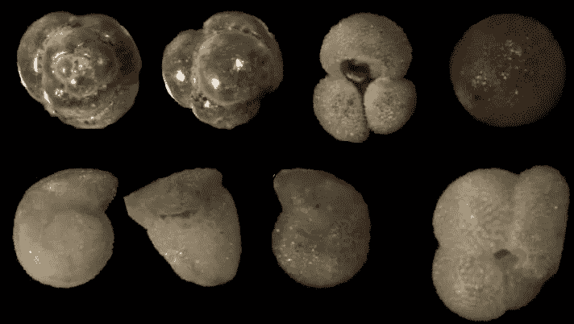
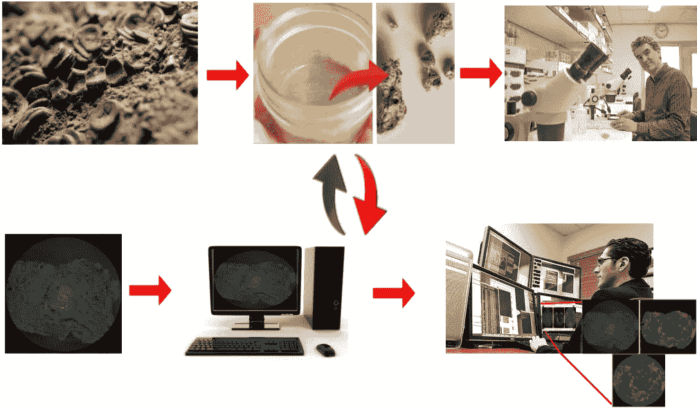
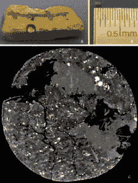
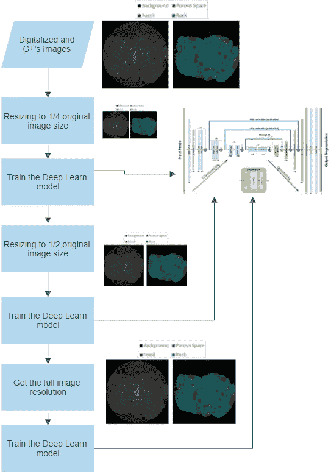
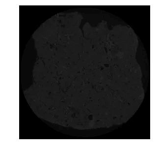
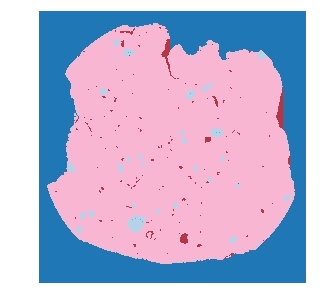
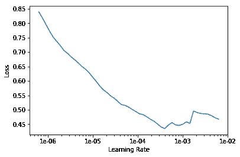
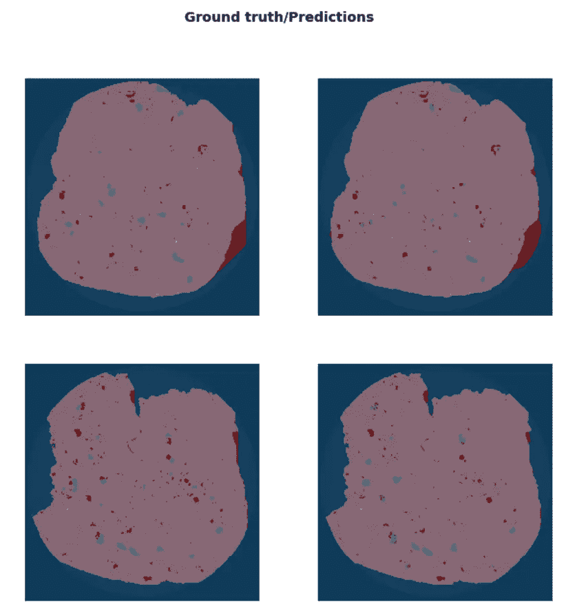
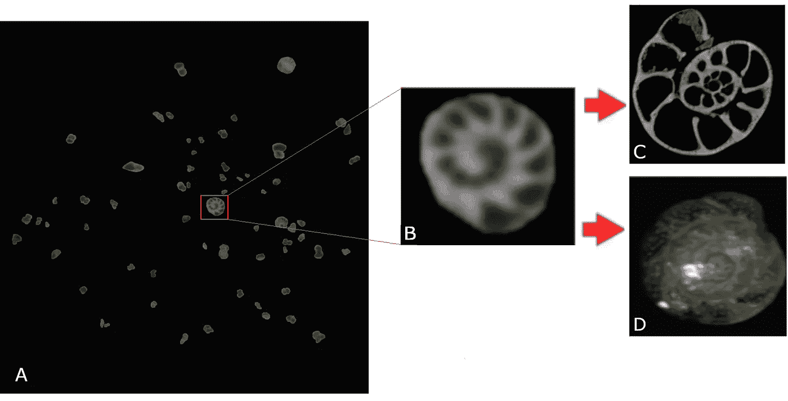
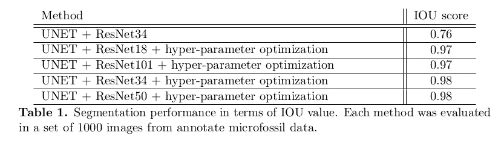

# 人工智能和古生物学:利用深度学习搜索微体化石

> 原文：<https://towardsdatascience.com/artificial-intelligence-paleontology-use-deep-learning-to-search-for-microfossils-18760bb30880?source=collection_archive---------13----------------------->

## 如何用语义分割分析从钻机探头获得的沉积岩微断层图像

在这篇文章中，我们展示了一种基于深度学习的方法，用于通过 MicroCT 获取的钻孔岩心样本中的全自动微体化石识别和提取。对于鉴定，我们开发了一种深度学习方法，这种方法导致了高正确微化石鉴定率(98% IoU)。为了验证这一点，我们使用了微体古生物领域的专家们得出的基本事实。我们还提出了第一个完全注释的 MicroCT 获得的公开可用的微体化石数据集。

## 人工智能和古生物学

古生物图像的计算分析的应用范围从动物、植物和微生物进化的研究到给定时代生物栖息地的模拟。

但是现在古生物学不再仅仅是一门纯科学了。它还可以应用于解决经济活动领域中的问题，例如石油勘探，其中有几个因素需要分析，以便识别勘探地点的潜力并最小化与石油开采过程相关的费用。一个因素是要探索的环境的特征。这种分析可以通过几种方式进行:使用探针、提取样品进行岩石物理成分评估或与其他钻井的测井记录进行对比。

当我们研究样本提取时，在沉积岩中发现的化石对于这种岩石的表征至关重要。在这里，计算机断层扫描(CT)是重要的，因为它保存样本，并使其可用于几次分析。基于由 CT 生成的 3D 图像，可以执行若干分析和模拟，并且可以自动执行当前手动且费力执行的过程。

想象一下下面的场景:一个古生物学家收到一个含有微化石的岩石样本进行分析。人工分离微生物化石的整个过程需要很长时间，并且在这个过程之后，岩石样品被破坏。在此之后，古生物学家将使用显微镜对物理隔离的微化石进行分析，并对每个隔离的化石进行人工分类。



A few microfossils manually extracted from our carbonatic rocks and photographed with a Z-stack microscope

现在让我们假设这位古生物学家工作的公司获得了一种基于人工智能的断层图像分析软件，专门用于微化石分析。该软件在最少或根本没有监督的情况下，自动从岩石样品中进行微生物化石鉴定和提取。古生物学家现在可以加载他的断层扫描样本，选择特定的管道，并让程序在夜间执行，只让古生物学家评估获得的结果并对每个提取的微化石进行分类。



The before & after of microfossil analysis…

## 基于深度学习的微体化石识别和分类

你可以通过深度学习采用语义分割来执行上述工作流。让我们看看如何…

我们采用了一个扫描的碳酸盐岩样品，该样品是从巴西东北海岸的 [Sergipe 盆地第四纪沉积物处采集的钻机探针获得的。为了训练我们的语义分割网络，一个微体学家团队为这个岩石样本生成了一个地面真相，对整个 MicroCT 体积进行手动分割和分类。用于数字化样品的扫描仪是 Versa XRM-500 (ZEISS/XRadia)，体积大小为 956×1004×983 体素。](http://www.anp.gov.br/images/Palestras/Seminario_tecnico_R15_P4/Ingles/03_Bacia_de_Sergipe-Alagoas_R15_INGLES.pdf)

完整的数据集，加上额外的解释和专家注释的手动分割图像的基本事实可以在这里找到:【http://www.lapix.ufsc.br/microfossil-segmentation。



Digitalized rock sample

我们采用的深度学习 API 是 fast.ai/PyTorch 框架，通过超参数优化(HYPO)，我们用 UNET + ResNet34(或 ResNet50)获得了 0.98 的 IoU。不同种类的海波在这里很重要，我们将在下面解释它们。

**海波#1:可变分辨率**。MicroCT 数据提出了一个挑战:由我们使用的数据集大小和 UNET 体系结构强加的内存需求将极大地限制我们训练集的批量大小。为了克服这一限制，并能够最初处理更大的批量，以更快的速度训练网络，我们采用了一种 ***逐步渐进提高图像分辨率的训练策略*** 。

为此目的，我们在**三个周期**中进行训练:我们以原始 MicroCT 图像分辨率的 1/4 开始我们的迁移学习；训练了模型；将数据集的大小调整为原始分辨率的 1/2；再次训练，之后，我们采用全 CT 体积分辨率进行最终微调训练周期。这一战略的大纲最初是由杰瑞米·霍华德于 2018 年 5 月在[这个讨论帖子](https://www.fast.ai/2018/04/30/dawnbench-fastai/)中提出的，后来在[https://course.fast.ai/videos/?lesson=1](https://course.fast.ai/videos/?lesson=1)的一次 CNN 演讲中作为非正式交流提出的。下图显示了我们对逐步提高分辨率培训工作流程的解释。



The ***step-wise progressive improving image resolution training strategy***

**HYPO #2:差异学习率**:另一个微调我们模型的策略是*差异学习率* (DLR)策略，也是由杰瑞米·霍华德在同一个 fast.ai 课程系列的讲座中非正式提出的。

当执行迁移学习并随后进行微调时，在第一层中，被调整的预训练模型将从迁移学习中使用的新数据集学习一般的低级特征。不管图像背景如何，这些低级特征很可能与原始数据集的特征相似。因此，没有必要在这些第一层采用高学习率。随着信息在网络中的深入，特征组合变得更加复杂和特定于数据集，并且与应用环境的联系更加直接。为了使网络更好地适应特定于上下文的特征，需要在更深的层中有更高的学习速率。

**HYPO # 3: Fit1Cycle** :我们采用 Leslie N. Smith 最初开发的 *fit1cycle* 方法训练网络；

*   [https://docs.fast.ai/callbacks.one_cycle.html](https://docs.fast.ai/callbacks.one_cycle.html)
*   神经网络超参数的训练方法:第 1 部分——学习速率、批量大小、动量和权重衰减—[https://arxiv.org/abs/1803.09820](https://arxiv.org/abs/1803.09820)
*   超收敛:使用大学习率快速训练残差网络—[https://arxiv.org/abs/1708.07120](https://arxiv.org/abs/1708.07120)
*   有一篇来自 [Nachiket Tanksale](https://towardsdatascience.com/@nachiket.tanksale) 的非常有趣的文章，名为[寻找好的学习率和一个周期政策](/finding-good-learning-rate-and-the-one-cycle-policy-7159fe1db5d6)，其中讨论了周期学习率和动量。

这种方法*快*，它将允许我们在第一个迁移学习阶段只使用 5 个时期。

如果你想了解更多关于 fastai 图书馆新的学习 API 的信息，请看这本由 Sylvain Gugger 准备的笔记本。

# 动手吧！碳酸盐岩中微体化石的分段

以下是从碳酸盐岩中获得的微 CT 钻孔岩心中的微化石样品的语义分段代码。这是我们作为笔记本发布的代码([https://github . com/awangenh/Segmentation-of-micro fossils-in-Carbonatic-Rocks](https://github.com/awangenh/Segmentation-of-Microfossils-in-Carbonatic-Rocks))，它假设您要么使用 Google Colab，要么安装了最新版本的 PyTorch 和 fast.ai。你还需要一个至少有 11 GB 内存的 GPU。

## 初始化，导入 Python 库和 fast.ai 框架

```
# Notebook Initializations
%reload_ext autoreload
%autoreload 2
%matplotlib inline# Imports
from fastai.vision import *
from fastai.utils.show_install import *
from fastai.callbacks.hooks import *
from pathlib import Path
torch.backends.cudnn.benchmark=True# Show if everything is OK
show_install()
```

# 定义存储数据的位置并检查它

## 如果你将 Google Colab 与 Google Drive 一起使用，请这样做

```
from google.colab import drive
drive.mount('/content/gdrive')path = Path('gdrive/My Drive/Colab Notebooks/DL/')
path.ls()
```

## 如果您没有从 Google Drive 导入数据

```
# Adapt this to match your environment...
path = Path('myPath/')
path.ls()
```

## 定义数据变量，如 path_lbl(标签所在的本地)和 path_img(存储训练和验证数据的本地)

```
# Initialize path_lbl (local where your labels are) 
path_lbl = path/'train_masks_labels'
# Initialize path_img (local where your train and validation data are stored)
path_img = path/'train'# Check how many files are there
fnames = get_image_files(path_img)
fnames[:3]
len(fnames)# Check if label names match the size
lbl_names = get_image_files(path_lbl)
lbl_names[:3]
len(lbl_names)
```

## 显示单个 MicroCT 切片

```
img_f = fnames[0]
img = open_image(img_f)
img.show(figsize=(5,5))
```



## 加载属于该特定切片的遮罩

```
# Scan the filenames with a simple lambda function
get_y_fn = lambda x: path_lbl/f'{x.stem}_GT{x.suffix}'
```

## 显示地面真相遮罩

```
mask = open_mask(get_y_fn(img_f))
mask.show(figsize=(5,5), alpha=1)
src_size = np.array(mask.shape[1:])
```



## 加载您的标签

```
codes = np.loadtxt(path/'codes.txt', dtype=str); codes
```

## IOU 指标、初始数据分割和模型

```
# Refer to your labels as numbers
name2id = {v:k for k,v in enumerate(codes)}
```

## 定义您的误差指标

并集上的交集(IOU)度量和保存预测定义的函数

```
def iou_metric(input, target):
    target = target.squeeze(1)
    mask = target != 0
    return (input.argmax(dim=1)[mask]==target[mask]).float().mean()def save_preds(dl):
    i=0
    names = dl.dataset.items for b in dl:
      preds = learn.pred_batch(batch=b, reconstruct=True)
      for o in preds:
          o.save(path_gen/names[i].name)
          i += 1
```

## 更多的定义

重量衰减、度量、模型的定义，如果我们使用 imageNet 重量

```
wd=1e-2
metrics = iou_metric# Use a deep network
used_model=models.resnet101# We will employ transfer learning from ImageNet weights...
useImageNet=True
```

# 培训周期和验证

**这里**是我们开始训练部分的地方。首先，我们采用 256x252(1/4)分辨率。对于 512 (1/2)和 1024(全)分辨率，执行完全相同的顺序。

# 周期#1: 256x256

```
# Define the batch size and the resolution employedsize = src_size//4
size[1]= size[1]+1
bs=5
```

对数据应用转换，如分辨率更改和数据扩充…

```
normalizePar=Noneif useImageNet:
  normalizePar=imagenet_statsdata = (src.transform(get_transforms(), size=size, tfm_y=True)
        .databunch(bs=bs)
        .normalize(normalizePar))
```

用所选的数据、度量和重量衰减加载模型

```
learn = unet_learner(data, used_model, metrics=metrics, wd=wd)
```

找到最合适的学习速度

```
lr_find(learn)
learn.recorder.plot()
```



***手动*** 检查上面代码生成的图形后设置学习率…

```
# Adjust this LR accordingly to what you identified above...
lr=2e-4
```

## 学习！

```
learn.fit_one_cycle(5, slice(lr), pct_start=0.9)
```

保存重量并加载它以继续训练并执行一些数据发布…

```
learn.save('stage1-256x252')
```

保留一个装载代码，以备不时之需:

```
learn.load('stage1-256x252')
```

解冻网络以学习内部权重——在第 1 周期微调

```
learn.unfreeze()
```

采用差异学习率(DLR)并培训学习者

```
lrs = slice(lr/400,lr/4)learn.fit_one_cycle(10, lrs, pct_start=0.8)
```

保存重量和加载它继续训练和执行一些未使用的内存释放…

```
# Save the fine-tuned network @ Cycle #1
learn.save('stage2-256x252')# Release Memory
del data
del learn
torch.cuda.empty_cache()
# Collect Garbage
gc.collect()
```

# 周期#2: 512x512

我们将如上执行相同的操作，只是分辨率为 512x512

```
# Set the new Size for the MicroCT Slices
size = src_size//2
bs=1# Adapt ImageNet Parameters to our Image Characteristics
normalizePar=None
if useImageNet:
    normalizePar=imagenet_stats
data = (src.transform(get_transforms(), size=size, tfm_y=True)
        .databunch(bs=bs)
        .normalize(normalizePar))# Create a new Network for 512x512 input images
learn = unet_learner(data, used_model, metrics=metrics, wd=wd)# Load our fine-tuned low resolution network weights learned on Cycle #1...
learn.load('stage2-256x252')# Find the best learning rate for this network instance
lr_find(learn)
learn.recorder.plot()# Manually set the new learning rate (LOOK at the graph above!)
lr=1e-3
```

使用这个新的中等分辨率网络执行迁移学习阶段。我们将再次使用莱斯利·n·史密斯开发的 *fit1cycle* 方法。

```
learn.fit_one_cycle(5, slice(lr), pct_start=0.8)# Save and Load...
learn.save('stage1-512x502')learn.load('stage1-512x502')# Unfreeze for fine-tuning...
learn.unfreeze()
```

采用差异学习率(DLR)并培训学习者

```
# Prepare for varying learning rates...
lrs = slice(1e-6,lr/10)# Fine-tune for 10 epochs
learn.fit_one_cycle(10, lrs)# SAVE STAGE2 OF CYCLE #2...
learn.save('stage2-512x502')# Flush garbage..
del data
del learn
torch.cuda.empty_cache()
gc.collect()
```

# 周期# 3:1024 x 1024-全分辨率培训

现在我们将再次执行与上面相同的操作，只是分辨率为 1024x1024。我们将采用较短的迁移学习阶段。下面的大多数单元格都没有被注释，因为我们在重复步骤，只是有一些不同的参数…

```
# Original image size
size = src_size
# Batch size of one!
bs=1normalizePar=None
if useImageNet:
    normalizePar=imagenet_stats
data = (src.transform(get_transforms(), size=size, tfm_y=True)
        .databunch(bs=bs)
        .normalize(normalizePar))learn = unet_learner(data, used_model, metrics=metrics, wd=wd)learn.load('stage2-512x502')lr_find(learn)
learn.recorder.plot()# Adapt it to your values
lr=2e-5# Transfer learning stage
learn.fit_one_cycle(3, slice(lr), pct_start=0.8)# Save stage 1 of Cycle #3
learn.save('stage1-1024x1004')learn.load('stage1-1024x1004')# Prepare for the final fine-tuning
learn.unfreeze()# Prepare for varying learning rates
lrs = slice(1e-6,lr/10)# Fine-tune for 10 epochs
learn.fit_one_cycle(10, lrs)# Save stage 2 of Cycle #3
learn.save('stage2-1024x1004')
```

## 显示一些预测结果

```
learn.show_results(rows=2, figsize=(10,10))
```



## 保存所有预测结果

```
name_gen = 'image_gen'
path_gen = path/name_gen
path_gen.mkdir(exist_ok=True)save_preds(data.fix_dl)
```

# 如果培训中途中断，我该怎么办？

如果你的训练被打断了，你会怎么做？这可能是因为你在 Google Colab 笔记本上达到了连续 12 小时的“免费”操作时间，或者因为你的计算机由于某种原因停止了。我住在巴西，电力短缺是常事…

*fit_one_cycle* 方法适用于变化的自适应学习速率，遵循速率先增大后减小的曲线。如果你中断第 10 个纪元的训练，比如说 20 个纪元，然后重新开始 9 个以上的纪元，**你将不会得到与不间断训练 20 个纪元**相同的结果。您必须能够记录您停止的位置，然后从该点重新开始训练周期，并使用该周期部分的正确超参数。


A fit_one_cycle training session divided into three subsessions. Image by PPW@GitHub

你要做的第一件事就是保存你的网络:

```
learn.fit_one_cycle(20, max_lr=slice(1e-5,1e-6), 
       callbacks=[SaveModelCallback(learn, every='epoch',  
                  monitor='accuracy', name='saved_net')])
```

这将使您的网络在每个纪元都被保存，您提供的名称后面跟着*_ #纪元*。所以在纪元#3，文件 *saved_net_3.pth* 将被写入。您可以在完成以下操作后加载此文件:

*   重新创建了*数据束*和
*   用它重新实例化了网络。

重装完*后。pth* 文件，你可以重新开始你的训练，只是你要告诉 *fit_one_cycle* 考虑 20 个历元，但是要从历元#4 开始训练。

要了解这是如何做到的，请看这里:

*   [把一个长周期的政策分成几个小周期——PPW 的 GitHub](https://github.com/PPPW/deep-learning-random-explore/tree/master/divide_1cycle?source=post_page---------------------------)

**你是怎么做到的？**

fast.ai 中的 *fit_one_cycle* 方法已经开发出来，允许您告诉它从周期的哪个部分恢复中断的训练。恢复培训的代码如下所示:

```
# Create a new net if training was interrupted and you had to 
# restart your Colab sessionlearn = cnn_learner(data, models.<your_model_here>, 
                    metrics=[accuracy, error_rate])# If you're resuming, only indicating the epoch from which to 
# resume, indicated by ***start_epoch=<epoch#>*** will load the last 
# saved .pth, it is not necessary to explicitly reload the last 
# epoch, you only should **NOT** change the name given in 
# name=<callback_save_file>:
# when resuming fast.ai will try to reload 
# ***<callback_save_file>_<previous_epoch>.pth***
# Unfreeze the network
learn50.unfreeze()# Use start_epoch=<some_epoch> to resume training...
learn.fit_one_cycle(20, max_lr=slice(1e-5,1e-6), 
                    ***start_epoch=<next_epoch#>***,
                    callbacks=[SaveModelCallback(learn, 
                    every='epoch', monitor='accuracy', 
                    ***name=<callback_save_file>***)])
```

fast.ai 会告诉你“*载入<回调 _ 保存 _ 文件> _ <上一个 _ 纪元# >* ”，恢复训练。

您可以在此查看 *fit_one_cycle* 方法支持的所有参数:

*   [https://docs.fast.ai/train.html#fit_one_cycle](https://docs.fast.ai/train.html#fit_one_cycle)

# 想看看结果吗？

(A)显示了由微 CT 切片中的网络识别和分割的微化石。(B)显示了化石的细节,( C)显示了人工提取后化石的显微断层图像。(D)显示同一样本的显微镜照片。



# 我们学到了什么？

卷积神经网络和深度学习可以成功地应用于解决海洋微体古生物中的问题，这是一个你不会指望人工智能会找到应用的领域。可以训练语义分割网络，以在沉积岩的微断层图像中可靠地找到微化石，这些图像是从石油勘探钻机获得的钻孔岩心中获得的。一个现成的以 ResNet34 为网络的 UNet 框架就足以解决这个问题。

# 想了解更多？

我们还测试了其他网络，并发布了一些新的出版物:

*   [访问我们的项目页面](http://www.lapix.ufsc.br/pesquisas/microfosseis/):【http://www.lapix.ufsc.br/pesquisas/microfosseis/ 
*   访问我们的数据集页面:[http://www.lapix.ufsc.br/microfossil-segmentation/](http://www.lapix.ufsc.br/microfossil-segmentation/)
*   [看看我们的新论文*使用海洋微体古生物的深度学习方法*进行自动微体化石识别和分割](https://authors.elsevier.com/c/1b99p1LwImDX-U)
*   [查看我们关于 *bioRxiv* 的稍旧的论文，了解我们使用不同型号](http://biorxiv.org/cgi/content/short/661694v1)获得的结果



采用一种新的 HYPO 策略:一种 ***逐步渐进提高图像分辨率的训练策略*** ，可以解决微断层体积中的大量数据所带来的存储问题。这使得我们最初可以大批量工作，训练得更快更好。

引用这篇文章

```
@misc{von wangenheim_ramos de carvalho_2019, 
   title={Artificial  Intelligence & Paleontology: Use Deep Learning to search for  Microfossils},  
   url={https://towardsdatascience.com/artificial-intelligence-paleontology-use-deep-learning-to-search-for-microfossils-18760bb30880},  
   publisher={Towards Data Science},  
   author={von Wangenheim, Aldo Eduardo and Ramos de Carvalho, Luis  Eduardo}, 
   year={2019}, 
   month={Jun}
}
```