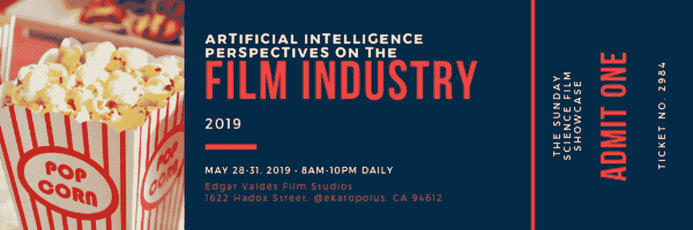
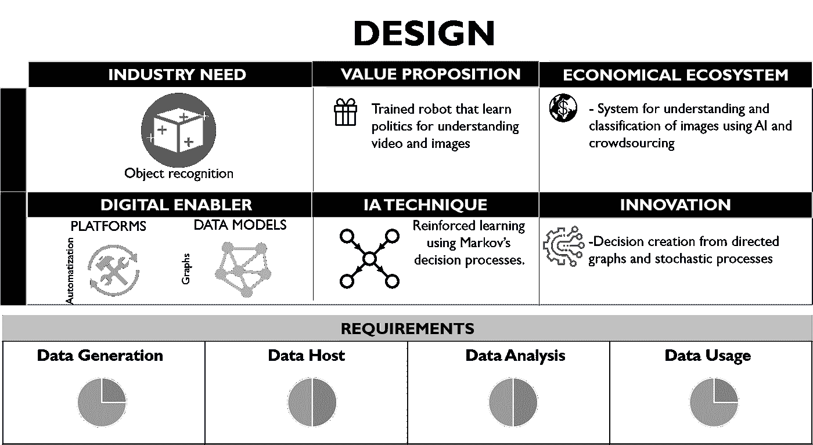
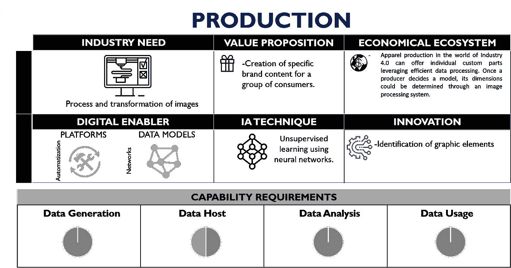
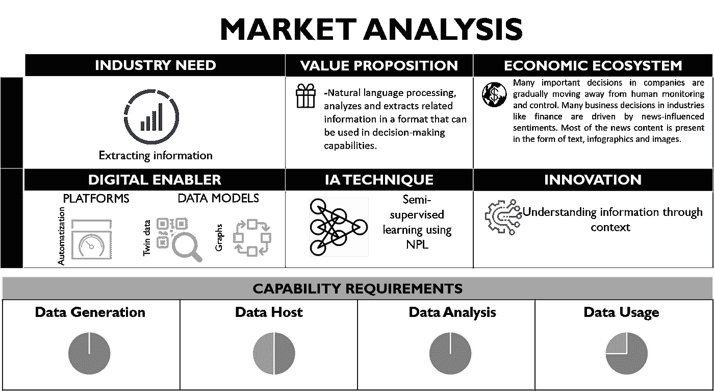
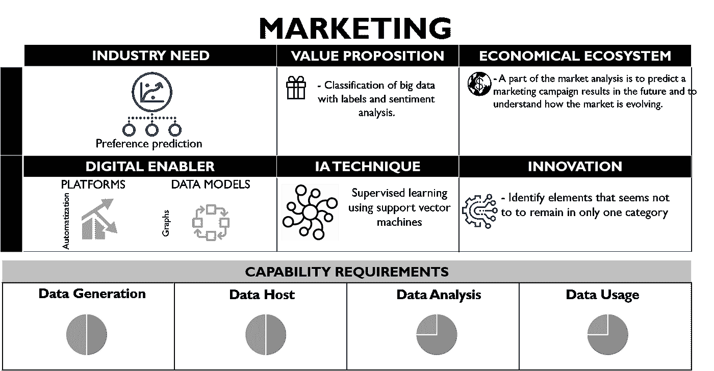

# 电影工业的人工智能视角

> 原文：<https://towardsdatascience.com/artificial-intelligence-perspectives-on-the-cinematographic-industry-1d7104554d7e?source=collection_archive---------17----------------------->

Canvas | Edgar Valdes | May 2019

> “慢慢地，我学会了人类的方式:如何毁灭，如何仇恨，如何贬低，如何羞辱。在我主人的脚下，我学到了人类最高的技能，这是其他生物所没有的技能:我终于学会了如何撒谎。”―《尼克·迪尔，弗兰肯斯坦》，根据玛丽·雪莱的小说改编

# 文学、电影和人工智能

玛丽·雪莱关于现代普罗米修斯的历史穿越了时间和空间，影响了每一代人。在个人层面，弗兰肯斯坦的经典故事和它的时代性吸引了人们对未知事物的恐惧，科学和技术就是例证。一个扮演好角色的科学家，一个创造出能够超越人类极限的超级智慧生物的人。现在这种恐惧变得比 200 年前更加重要。雪莱对人工智能的思考类似于我们今天对人工智能(AI)的阐述。也许在未来，人工智能可以拥有超越人类能力的自我意识甚至直觉。在机器学习正式发展的一个多世纪之前，雪莱出版的书(1823 年)中反复出现了同样的问题。弗兰肯斯坦的创造物学会了人类语言，他是机器智能的生动化身:他，或者说它，学习算法。

# 电影工业的信息流

对于大多数人工智能算法来说，信息处理和由此产生的知识是任何行业最渴望完成的任务。这就是所谓的“隐藏”的揭示，这反过来增加了(自动或人工)预测的能力。从前面可以清楚地看到，信息具有核心作用，因此产生大数据的行业适合从人工智能中受益更多。电影业的收入约为 1360 亿美元。一部电影的观众数量可以达到惊人的**1.78 亿**(这个数字比**的 8000 万网飞和 Bitorrent 用户**翻了一番)。此外，该行业每年还会产生超过 2000 部高水平的作品。所有这些(可能)是信息流的最大来源之一。还没有关于如何对电影业产生的数据和信息进行精确测量的正式研究。也许这是无法计算的，但让我们来打个比方:如果 YouTube 每天有 40 亿次访问，每次访问平均 40 分钟，以每分钟 250 MB 的速度，我们得到的数字是**4pb 的数据**。

看看这些数字，电影作为知识的生产者，是巨大的。我们可能会问自己:**我们如何理解所有电影生成的信息，它如何影响现实？**要回答这个问题，必须考虑现象的两个根本方面:一是通过数据产生信息；第二，这些信息如何转化为知识。

# 电影体验及其与情报学的关系

想想通过电影制作创造知识的经历。对于每一个场景，一次发生的所有动作的摘录被捕获。有人可能认为抽象是自发产生的，但事实并非如此。场景的重建是一种主观的、语境化的表达。在这种情况下，通过人和他的环境的信息生产是审美现象的一部分。信息和紧急情况是以非常密切的方式直观地联系在一起的特征。让我们将这种突现的现象称为知识。

在继续之前，让我们在理论上休息一下，说明信息来自对数据的解释。但是我们如何衡量我们是否以最好的方式诠释了一个信息呢？在数学上，一个代码(例如二进制代码)和一个条件概率被分配给构成给定消息的每个元素。这是信息论的开端。直觉上，可以理解的是，随着可预测性的增加，消息带来的惊喜(称为熵)必然会减少。这种信息流动本身就是一种现象，与全球气候或股票市场动态等突发现象密切相关。

# 电影工业中的人工智能透视

在生成艺术(如电影制作)中，要考虑的关键因素是，把它看作一个突现的发生器，并赞美这样一个问题:电影工业是如何塑造社会结构的？因此，为了理解电影工业中的信息，我们可能需要定位电影生产链中使用数字使能器(软件平台或数据模型)的所有信息点。与此同时，我们可以使用“最小加速框架”来推断人工智能可以在电影业的经济生态系统中以积极的方式影响哪里。

在电影设计后期制作的各个设计阶段，深度学习和图像识别可以用于学习和应用决策，例如识别可能不存在的场景的错误元素。这样的原因可能来自生产的错误(一个中世纪庆典上的星巴克杯子),或者甚至可以进一步推断使用人工智能众包的“对共同事物的理解”。

在早期，在制作、选角或采购阶段，服装和服饰部门还可以使用监督学习的组合，在演员选角之前或同时为整部电影创建和确定正确的设计服装。

走向消费、展示、销售阶段，AI 在其他行业已经展现出超强的市场份额预测能力。综合因果模型在产生足够数据的行业中有更好的预测性能。更重要的是，展示地点的孪生模型的图形表示也可以成为电影和物联网之间的桥梁。

此外，由于电影是最具社会性的信息生成者，由此产生的大数据可以用来提高人工智能的能力，以改善其他行业的“情绪分析”。基于偏好模型的监督学习可以提高这种情感分析的性能，使 fil 行业将其消费范围转变为人工智能技术的生产实体。

# 趋势和结论

现在让我们来谈谈电影业的趋势。一方面，我们在生产链中有标准化的流程。如果我们分析近年来该学院的科学和技术奖项，我们会看到一个明显的和日益增长的使用数字工具的趋势。在这个奖项的 40 年中，数字图像技术获得了 86 项认可，仅次于声音(166 项)、电影实验室(109 项)和特殊摄影(93 项)；远远超过了物理设备的奖项，如相机的支撑系统和起重机，甚至一些对行业来说似乎更自然的奖项，如镜头、滤镜和照明技术。强调这一点，尽管特定的人工智能技术没有获得奖励，但提名的技术非常清楚地指向这一点。像皮克斯的 [Presto 动画系统](https://www.pixar.com/presto)、[副作用软件公司的胡迪尼](https://www.sidefx.com/)和 [ILM](https://www.ilm.com/) 面部表情捕捉解决系统这样的平台，都有意将人工智能元素纳入其核心。

另一方面，增强现实和沉浸式现实技术正在开发中，这对于电影业和创作者来说可能非常有趣，但我们现在将把所有这些都忽略掉。你会在其他一些帖子里看到。创新趋势的重要性来自于电影制作的创作过程。人工智能正在成为一种理想的工具，可以扩展人类的能力，达到创造的新境界，甚至产生新的前沿故事。像许多其他行业(实际上是所有行业)一样，电影业正意识到使用数字工具可能非常有利。

总之，我们可以问自己无数个因人工智能和电影工业的相互联系而产生的问题，但其中最重要的一个(在作者看来)是:**人工智能将如何影响创作过程？**我们可以直觉地认为，人机之间的信息互联或交换在新兴现象的创造中开辟了一个新的范例，并且可以成为创造性协作的催化剂。此外，我们还可以在知识现象的扩展中诱导人机甚至机器之间的合作。作者想知道，他是否会需要为电脑创作摇篮曲。

# 承认

作者要感谢 [SAE Mexico](https://www.linkedin.com/company/sae-mexico/about/)

# 参考

[1] G. Ródenas Cantero，“电影与电影:电影中的音符”，载于《艺术与电影》，M. J .阿卡特兹和 A. Bertinetto 编辑。墨西哥:墨西哥国立自治大学，2016 年，第 401–454 页。

[2]亨利·柏格森。《进化与进化》(1907 年)。巴黎:法国大学出版社，2007 年。

[3]梅勒妮·米切尔。复杂性:导游。牛津大学出版社，2009 年。

[4]加卡宁、哈里斯；瓦格纳，马克。下一代网络中客户体验管理的人工智能范例:挑战与展望。IEEE 网络，2019。

[5]奥索巴，奥索德；社会模拟的人工智能/机器学习观点:新数据和新挑战。复杂系统的社会行为建模，2019 年，第 443–476 页。

[6]孙，。智能大数据分析:管理视角。智能大数据分析的管理视角。IGI 全球，2019。第 1 至 19 页。