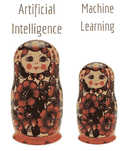
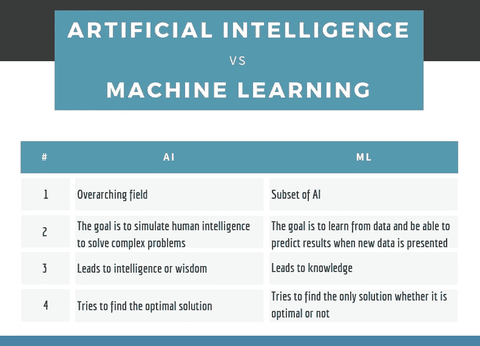

# 人工智能与机器学习——底线

> 原文：<https://towardsdatascience.com/artificial-intelligence-vs-machine-learning-the-bottom-line-eb8b0bf52fc4?source=collection_archive---------18----------------------->

## 人工智能是一个总称，指的是任何能做一些智能事情的计算机程序。你能区分这两个术语吗？

Credit: pixabay

机器学习(ML)和人工智能(AI)目前正在大肆宣传。尽管这两个术语被随意地、可互换地使用，但它们并不相同。
你可以把它们想象成一套嵌套的俄罗斯娃娃:AI 是最大的“套娃”，ML 是最小的——也就是说 ML 是 AI
(ML ⊆ AI)的**子集**。

Russian dolls

在谷歌上快速搜索人工智能和人工智能的区别会产生数百万个结果，但是，嘿…它们冗长而复杂…有时该领域的科学家仍然在争论这两者的最佳定义，并且可能会继续争论下去！
在这里，我试图用简单的术语来说明它们之间的区别，同时保持文本**简洁明了**！👏

> 所以:让我们在不到 **2** 分钟的时间内，探索一下它们的不同之处…

## 人工智能

人工智能致力于模仿人类的决策过程，并以类似人类的方式执行智力任务。任务包括:

*   问题解决
*   理解语言
*   识别声音
*   识别图像
*   学问

人工智能的起源来自[图灵测试](https://en.wikipedia.org/wiki/Turing_test)——一组类似宣言的特征，定义了一个系统如何表现出与人类同等(或无法区分)的智能行为。

它可以指任何东西，从下棋的计算机程序，到像苹果的语音识别系统，从 T21 的无人驾驶汽车，到在日本银行提供礼宾服务的机器人。

## 机器学习

ML 是 AI 的一个子领域。这里的关键概念是，机器摄取大型数据集，为自己“学习”，当接触到新数据时，它们可以做出决策。简单地说:与用特定指令手工编写计算机程序来完成任务不同，ML 允许程序学会自己识别模式并做出预测。

一些现实生活中的例子是:

*   谷歌 Gmail 的智能回复:代表你回复邮件，给出不同的回复建议。
*   [谷歌地图](https://www.drivingdirectionsandmaps.com/traffic-conditions-on-google-map/):通过在位置数据的帮助下分析交通速度，建议最快的路线以减少旅行时间。
*   [Paypal](https://www.paypal.com/tw/webapps/mpp/paypal-safety-and-security) :对客户数据使用 ML 算法来对抗欺诈。
*   网飞:推出了一款支持智能娱乐的电视剧建议引擎。

*而且只是为了好玩；看过《硅谷》这一集吗？*

🌭

## 简单地

我希望这篇文章已经帮助一些人理解了人工智能和人工智能之间的区别，并指出那些将术语混为一谈的资源。

> 人工智能是一个比人工智能更宽泛的概念，人工智能指的是使用计算机模仿人类的认知功能。
> 当机器以“智能”的方式执行基于算法的任务时，那就是 AI。

和...相对

> ML 是人工智能的一个子集，专注于机器接收一组数据的能力，并随着它们了解更多关于它们正在处理的信息而进化。

这里有一个小奖励:

AI vs ML

感谢阅读！

*我定期在* [*媒体*](https://medium.com/@semika) *上写关于技术&的数据——如果你想阅读我未来的帖子，只需“关注”我！*