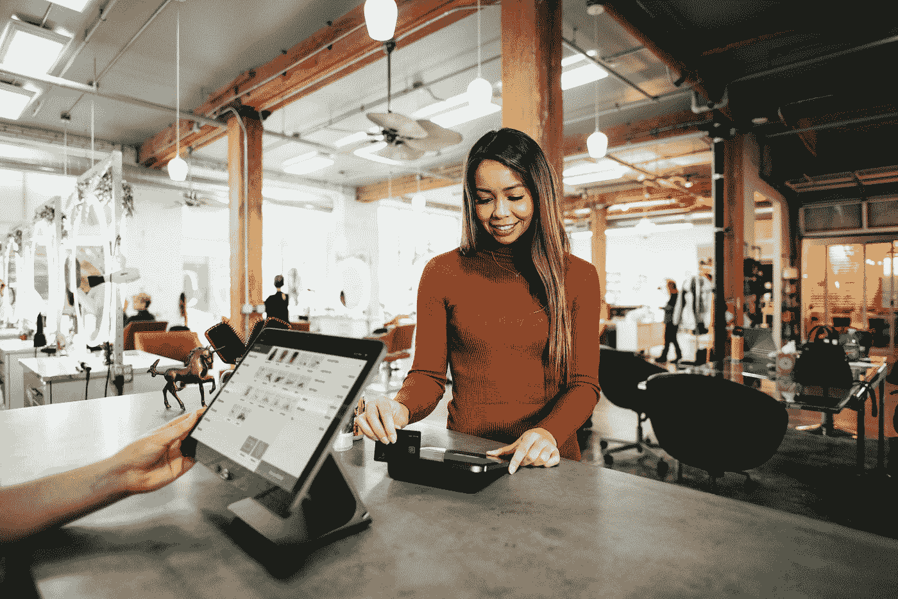

# 人工智能会给每次交互带来更多的人情味。

> 原文：<https://towardsdatascience.com/artificial-intelligence-will-bring-more-human-touch-to-each-interaction-c76b9a277678?source=collection_archive---------37----------------------->

*Image credit: Blake Wisz*

人工智能将为每一次互动带来更多的人情味

人工智能和机器学习已经成为客户关系中不可避免的趋势。人工智能正在解锁和重新定义各种可能性，以吸引当今最苛刻的消费者；满足他们不断增长的期望，发展情感联系，提供令人满意的客户体验。Juniper Research 发表的一份报告预测，到 2022 年，零售业在人工智能上的支出将达到每年 73 亿美元。优步和 Lyft 等著名应用改变了消费者对出租车的预期。传统出租车的体验，现在看来已经过时，失效。然而，人工智能的到来对人类联系的丧失敲响了警钟。

T2 最近发布的一份报告称，沃尔玛雇佣的科技人才比谷歌和脸书还多。技能需求的这一显著转变表明了零售业正在发生怎样的变化。它需要彻底改造，从吸引突破性的技术人才开始，以便继续竞争。

# 面向服务的智能

人工智能(AI)因为它的能力而到处出现。品牌正在利用它来改善客户服务，并比以往任何时候都更快地从客户那里获得答案。在美国，Capital One 银行让客户通过亚马逊 Alexa 管理他们的账户和交易。

2019 年，电子商务网站了解消费者的需求比以往任何时候都更重要。

通过开发技术，电子商务可以更好地了解他们的客户是谁，他们的期望是什么，以及如何实现他们的目标。收集到的数据将有助于预测消费者需求，推荐产品，并为每位消费者提供独特的购物体验，同时提供个性化的客户服务，并在整个客户旅程中增加市场销售额。讽刺的是，AI 的使用将使客户体验更加人性化，赋予机器人自己的效用。

借助人工智能，在线商店可以更好地了解他们的客户，并增加他们在所有渠道的营销活动的结果。这种由人工智能优化的方法不仅节省了时间，还发现了新的机会来提高他们网站的性能和增加客户忠诚度。

# 店内体验不容忽视

沃尔玛刚刚在纽约开设了他的人工智能承诺店。这个被称为 IRL(智能零售实验室)的单位是一个 50，000 平方英尺的商店，它使用人工智能来确保农产品和肉类等易腐物品的库存位置和新鲜度。

根据彭博的一份报告，亚马逊的无收银 Go 商店可能是一项价值 40 亿美元的业务，并计划到 2021 年开设多达 3000 家亚马逊 Go 商店。你再也不用排队了，当你带着你的商品离开商店时，你的亚马逊账户会被扣款，你会收到一张收据。亚马逊正在使用人工智能和从多个传感器提取的数据的结合，以确保客户只为他们拿起的东西付费。你走进一家商店，里面只有你的同行评价最高的产品。信任的程度将远远高于充斥着未经其他消费者认可的产品的普通商店。

# 人工智能还可以检测问题并确定解决方案。

在线网站可以通过利用数据来简化和减少操作任务。这要归功于允许它们对某些行为自动做出反应的技术。借助人工智能，商家网站可以更快地检测异常并解决问题。始终将客户服务放在首位。

如今，品牌面临的挑战是考虑技术的能力并为此做好准备，同时意识到人工智能、数据收集和隐私可能带来的问题。

***关于作者***

Carts Guru 的创始人兼首席技术官 Maxime Pruvost 在他 19 岁时创建了他的第一家创业公司，当时他正在法国学习计算机科学。到他毕业时，他已经成功地联合创立了两家公司。马克西姆三年前从法国搬到旧金山，在硅谷的中心发展他的新公司 Carts Guru。Maxime 热衷于制造产品，提出新想法并将其转化为现实，成功地为电子商务市场安排了高可用性 SaaS 产品的运输。