# 完全初学者的人工神经网络

> 原文：<https://towardsdatascience.com/artificial-neural-networks-for-total-beginners-d8cd07abaae4?source=collection_archive---------6----------------------->

## 简单明了的神经网络解释(附图片！)

机器学习推动了我们当今互动的许多技术，从谷歌上的搜索结果到肿瘤诊断道路上的 ETA 预测，机器学习的应用无所不在。尽管它对我们的日常生活非常重要，但我们大多数人都不知道这东西是如何工作的。我们可能听说过“人工神经网络”这个术语，但它真正的含义是什么？它是一个和人类一样思考的机器人吗？是苹果公司的超级计算机吗？还是只是一个花哨的数学方程式？

机器学习实际上涵盖了从简单的决策树(类似于你在商业管理入门课程中制作的决策树)到神经网络(模仿大脑功能的复杂算法)的所有内容。本文将深入研究神经网络，因为它们是目前大多数令人印象深刻的机器学习背后的东西。

# 首先，一个说明性的例子

为了理解什么是机器学习，考虑试图根据地面的土壤含量预测树的高度的任务。现在，因为这是我们正在谈论的机器学习，让我们假设我们可以在这项任务中获得一些非常好的数据:来自世界各地的成千上万的土壤样本。

你可以对土壤含量进行多种测量。像水分含量、铁含量、颗粒大小、酸度等。它们都对一棵树的健康和它长得有多高有一些影响。假设我们检查了世界上成千上万的树(当然都是同一种类)，并收集了它们的土壤含量和树高的数据。我们刚刚为机器学习创建了一个完美的数据集，既有*特征*(土壤含量)，也有*标签*(高度)。我们的目标是使用这些特征来预测标签。

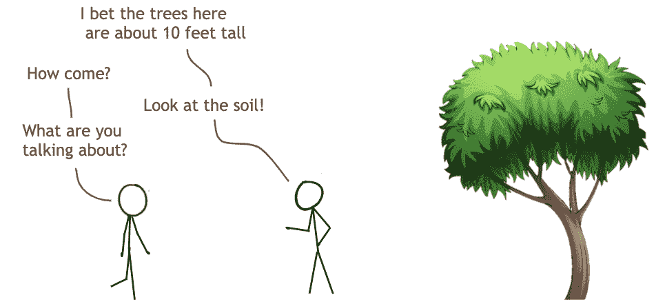

这看起来绝对是一项艰巨的任务。即使土壤含量和树高之间有关系，也不可能做出准确的预测，对吗？嗯，机器学习并不总是完全类似于我们的大脑是如何工作的，即使神经网络*是从大脑*模仿而来的。重要的是要记住，这些模型不会像我们人类一样胡乱猜测。相反，他们提出了精确的方程来决定他们的预测。让我们先把问题简化一点。

很容易想象像水分这样的单一特征会对树高产生重大影响。太干燥，树不会生长，但太潮湿，根可能腐烂。我们可以根据这个单一的测量值建立一个方程，但是它不会很精确，因为有更多的因素影响一棵树的生长。

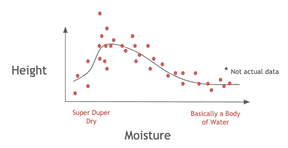

看到上面的假设关系不是一个伟大的估计了吗？这条线遵循点的总体趋势，但是如果你用它来预测你的身高，那么大多数时候你都是错的。考虑这样一种情况，那里有充足的水分，但土壤酸性太强。树不会长得很好，但是我们的模型只考虑了水分，所以会假设会。然而，如果我们考虑这两种测量，我们可能会得到更准确的预测。也就是说，我们只能说，当湿度和酸度都处于良好水平时，树会非常高，但如果其中一个或两个都处于不良水平，我们可以预测树会很矮。

那么如果我们考虑更多的因素呢？我们可以通过将这些关系合并到一个方程中，同时观察湿度**和**酸度的影响。

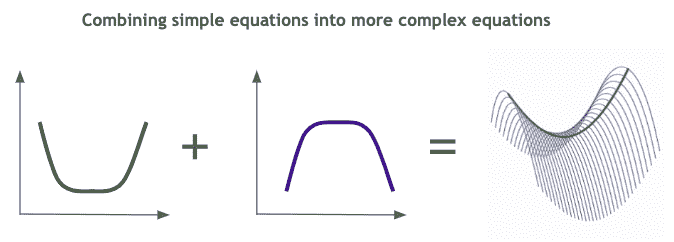

非常好。现在我们有了一个更复杂的方程来描述树的高度，它考虑了两个特征(测量)。现在，我们可以组合更多的特征，形成一个更复杂的方程。为了清楚起见，我将最终的组合方程称为我们的“T2”模型“T3”。它*模拟了特征如何影响身高。将这样简单的方程组合成一个多维模型非常简单，我们可以非常快速地创建一个非常复杂的模型。但是，对于你可以对其中一个简单方程(为高度和湿度之间的关系选择一个略有不同的方程)做出的每一个调整，现在我们必须尝试数以千计甚至数百万计的更多“模型”，每个模型都略有不同。这些模型中的一个可能很擅长对土壤含量和高度之间的关系进行建模，但是大多数可能都不擅长。*

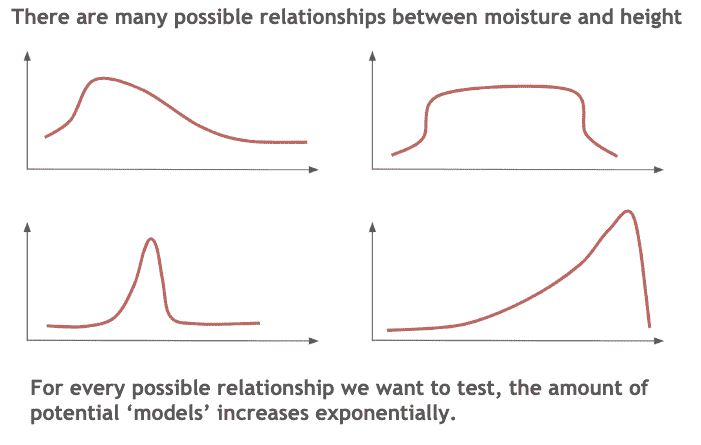

这就是机器学习的用武之地。它将创建一个由许多更简单的方程组成的模型，然后测试它的效果如何。基于它的误差(也就是说，预测有多错误),它会稍微调整更简单的方程，并测试它的效果如何。当它调整更简单的方程时，它只是改变了上图中的一个图形，使其看起来略有不同。它可以将图表向右或上下移动，也可以略微拉长波峰或增加波谷的大小。通过一个类似于进化的过程，它将达到最好的——或者至少是一个好的——解决方案。事实上，这就是为什么它被称为“机器学习”。机器*自己学习*模式，无需人类告诉它甚至像“水分对树木有益”这样简单的信息。

如果你对机器学习模型如何挑选下一个方程组合感到好奇，你应该进一步阅读关于**模型训练**的内容。具体来说，需要掌握的概念是*随机梯度下降*和*反向传播*。

如果你曾经在大学学习过傅立叶级数，把它们看作神经网络的类比是很有用的。在学校里，我们学习到你可以用简单正弦波的组合产生复杂的波，比如方波。嗯，我们也可以用类似的方式从许多简单的方程中创建一个机器学习模型。

# 神经网络的组成部分是什么？

神经网络是根据生物大脑的内部工作原理专门设计的。这些模型通过将输入特征传递给被称为感知器(想想“神经元”)的几层来模仿相互连接的神经元的功能，每一层都使用一组功能来转换输入。本节将解释感知器的组成部分，感知器是神经网络的最小组成部分。

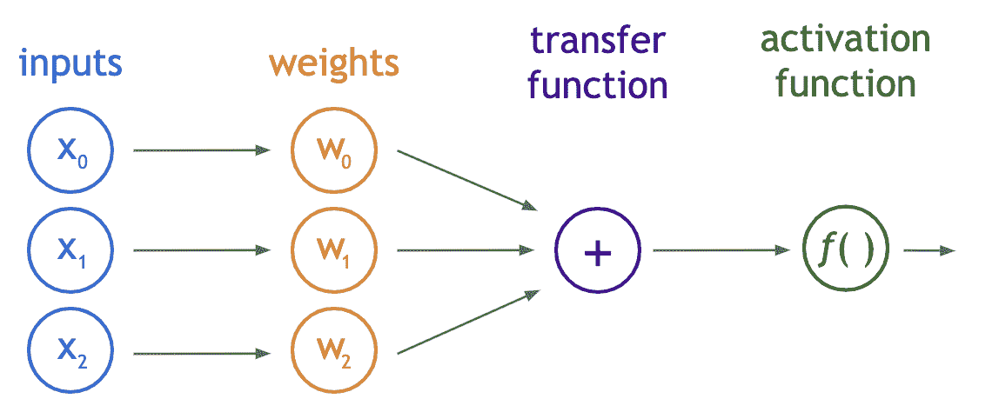

The structure of a perceptron

感知器(如上)通常由三个主要的数学运算组成:标量乘法、求和，然后使用称为激活函数的不同方程进行转换。由于感知器代表大脑中的单个神经元，我们可以将许多感知器放在一起代表一个大脑。这就是所谓的神经网络，稍后会详细介绍。

## 投入

输入仅仅是我们特征的度量。对于单个土壤样本，这将是每个测量值的数组。例如，我们可能有以下输入:

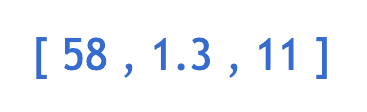

代表 58%的水分、1.3 毫米的颗粒大小和每千克土壤重量 11 微克铁。这些输入将被感知器修改。

## 砝码

权重代表标量乘法。他们的工作是评估每个输入的重要性，以及方向性。比如铁多了对身高贡献大还是小？它让树变高了还是变矮了？获得正确的权重是一项非常困难的任务，有许多不同的值可以尝试。

假设我们在-10 到 10 的范围内以 0.1 的增量尝试了所有三个权重的值。显示最佳结果的权重是 w0 = 0.2，w1 = 9.6，w3 = -0.9。请注意，这些权重的总和不一定是 100。重要的是它们之间的比较规模和方向。如果我们将这些权重乘以之前的输入，我们会得到以下结果:

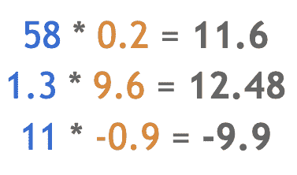

这些值将被传递到感知器的下一个组件，传递函数。

## 转移函数

传递函数不同于其它元件，因为它需要多个输入。传递函数的工作是将多个输入组合成一个输出值，以便可以应用激活函数。这通常通过对传递函数的所有输入进行简单求和来实现。

就其本身而言，这个标量值应该代表土壤含量的一些信息。该值已经使用权重将每个度量的重要性考虑在内。现在它是一个我们可以实际使用的单一值。你几乎可以认为这是土壤成分的任意加权指数。如果我们有很多这样的指数，用它们来预测树的高度可能会变得更容易。然而，在该值作为最终输出被发送出感知器之前，使用激活函数对其进行转换。

## 激活功能

激活函数将把传递函数中的数字转换成一个使输入戏剧化的值。通常，激活函数将是非线性的。如果你在大学没有学过线性代数，你可能会认为非线性意味着函数看起来不像一条线，但它比这要复杂一点。现在，请记住，将非线性引入感知器有助于避免输出随输入线性变化，因此可以增加模型的复杂性。下面是两个常见的激活功能。

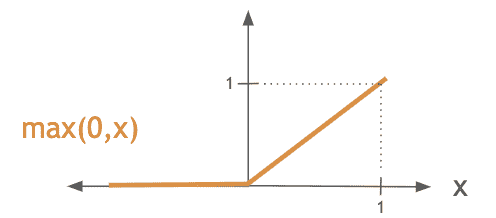

ReLU 是一个简单的函数，它将零和输入进行比较并选择最大值。这意味着任何负输入都是零，而正输入不受影响。在负值没有多大意义的情况下，或者在无需进行任何繁重计算的情况下移除线性时，这很有用。

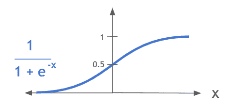

sigmoid 函数很好地将值分成不同的阈值。这对于诸如 z 得分之类的值尤其有用，在这种情况下，需要仔细查看接近平均值(零)的值，因为接近平均值的微小变化可能会显著影响特定行为，但在远离平均值的情况下，数据可能会出现同样的情况。例如，如果土壤有很多很多的水分，少量增加水分可能不会影响树的高度，但如果水分水平非常平均，那么去除少量水分可能会显著影响树的高度。它强调值的差异，如果它们更接近于零。

当你想到激活函数时，只要记住它是一个非线性函数，使输入更具戏剧性。也就是说，接近零的输入通常比远离零的输入受影响更大。它基本上迫使像 4 和 4.1 这样的值更加接近，而像 0 和 0.1 这样的值变得更加分散。这样做的目的是让我们选择更明确的决策界限。例如，如果我们试图将一棵树分为“高”、“中”或“矮”，值 5 或-5 显然代表高和矮。但是像 1.5 这样的值呢？围绕这些数字，可能更难确定决策界限，因此通过戏剧化输入，可能更容易划分三个类别。

我们在训练模型之前选择一个激活函数，所以函数本身总是相同的。这不是我们在测试数千种不同型号时切换的参数之一。那只发生在重物上。ReLU 激活函数的输出将是:

## 偏见

到目前为止，我忽略了感知器的一个成功要素。它是 1 的附加输入。在每个感知器中，这个输入总是保持不变。就像其他输入一样，它被乘以一个权重，其目的是允许激活函数之前的值上下移动，而与输入本身无关。这使得其他权重(实际输入的权重，而不是偏差的权重)更加具体，因为它们不必试图将总和平衡为 0 左右。

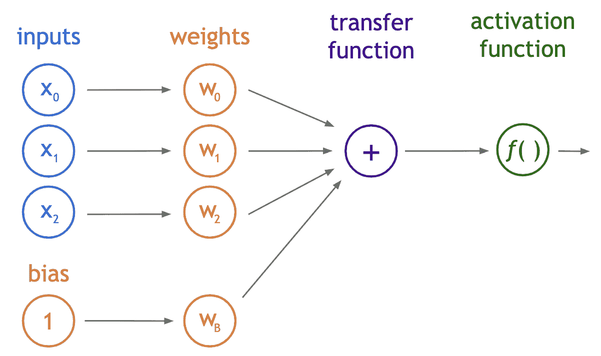

更具体地说，偏差可能会将左图这样的图形移动到右图这样的图形:

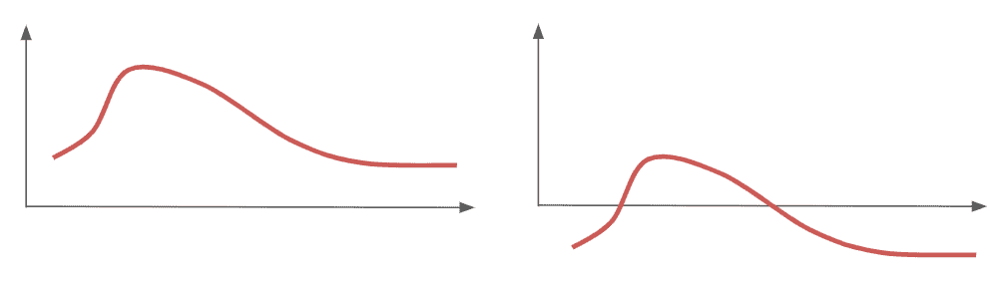

就是这样！我们现在已经建立了一个单一的感知机。我们现在已经创建了一个模拟大脑神经元的模型。我们也明白，虽然这听起来很奇怪，但这实际上意味着我们可以通过改变一些权重来创建复杂的多维方程。如您所见，组件非常简单。事实上，它们可以用下面的等式来概括:

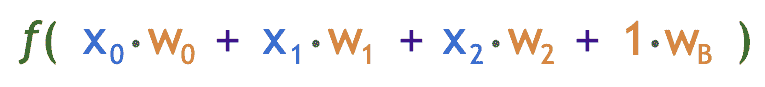

从现在开始，我将用一个绿色圆圈来表示这个等式(即一个感知器)。到目前为止，我们看到的所有组件:输入、偏置、权重、传递函数和激活函数都出现在每个单独的绿色圆圈中。当箭头指向这个绿色圆圈时，它表示一个单独的输入节点，当箭头指向绿色圆圈之外时，它表示最终的输出值。

# 多层感知器

为了表示一个感知器网络，我们只需将一个感知器的输出插入另一个感知器的输入。我们将许多这样的感知器连接成链，从一端流向另一端。这被称为**多层感知器(MLP)** ，顾名思义，有多层相互连接的感知器。为了简单起见，我们将看一个全连接的 MLPs，其中一层中的每个感知器都连接到下一层中的每个感知器。

你可能想知道“层”是什么。一层只是一排相互连接的*而不是*的感知器。MLP 中的感知器连接到它的前一层中的每个感知器和后一层中的每个感知器，但不连接到同一层中的任何感知器。让我们来看一个有两个输入值、两个隐藏层和一个输出值的 MLP。假设第一个隐藏层有两个感知器，第二个隐藏层有三个。

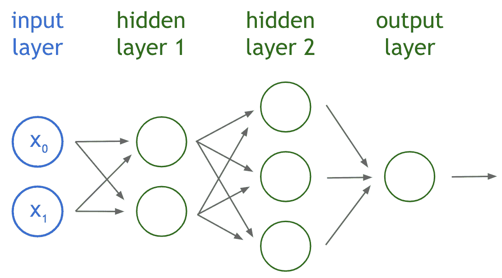

这里的感知器都将接受输入(指向圆圈的箭头)，执行上一节描述的操作，然后将输出向前推(指向圆圈外的箭头)。这样做很多次，以创建越来越复杂的方程，多次考虑相同的信息，以做出准确的预测。现在，虽然这篇文章的目的是消除神经网络的“魔力”，但很难解释为什么这有助于做出更准确的预测。事实上，我描述的方法通常被称为“黑盒”方法，因为我们不知道**为什么**它选择的方程是重要的。它目前是一个活跃的研究领域。然而，我们*能够*理解的是**神经网络在做什么**。这就像通过每个感知器跟踪权重一样简单。

我们之所以称输入层和输出层之间的层为“隐藏的”,是因为一旦从输入端输入了值，我们就不能很好地了解该值是如何转换的，直到它退出最后一个输出节点。这是因为这些中间值从未用于评估我们的模型的性能(即，获得对样本数据所做预测的误差值)。

**真的是这样。将许多这样的感知器组合在一起，有助于我们创建单个感知器可以创建的更复杂的方程。**

像这样的 MLP 的输出值能够使用土壤含量测量来预测高度。当然，在每个感知器中选择正确的权重需要大量的计算能力，但这正是“神经网络”所做的。

# 让我们看看它的实际效果吧！

在这里，我将通过整个神经网络进行两次测量。结构将与我上面展示的网络相同。这将是非常乏味的，但如果你愿意，你可以跟着做。为了简单起见，我将忽略这种偏见。

下面是我将使用的两个特性的值。它们代表 58%的水分和 1.3 毫米的粒度。

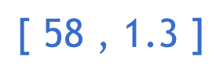

我将为每个感知器使用以下(随机)权重和激活函数。回想一下，ReLU 激活函数将负值转换为 0，并且不转换正值:

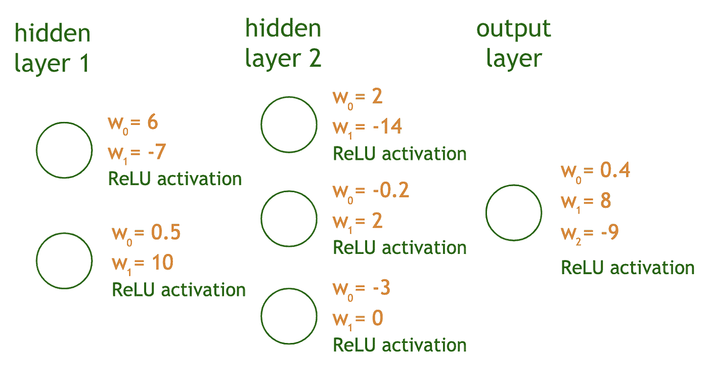

所以让我们开始吧！前两个感知器都接受两个输入(蓝色)，将它们乘以相关权重(黄色)，将它们相加(紫色)，然后应用 ReLU 函数(绿色):

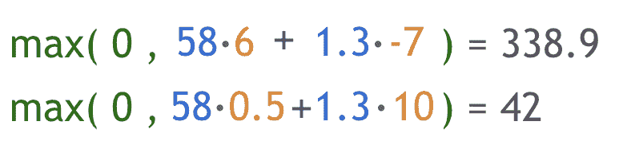

这些输出成为第三层中每个感知器的输入。所以第二个隐层的每个感知器(有三个)都会用 **338.9** 和 **42** 作为输入。这些感知器遵循以下等式:

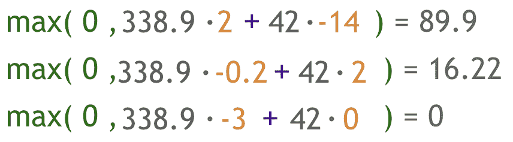

然而，对于下一层，请注意我们现在有三个而不是两个输入: **89.9** 、 **16.22** 和 **0** 。所有三个输入都必须包含在最后一个感知器的等式中，因此它将有三个权重(下面黄色部分)。它的等式仍然和其他等式一样简单明了。

作为总结，下面是每个感知器在给定输入的情况下产生的值:

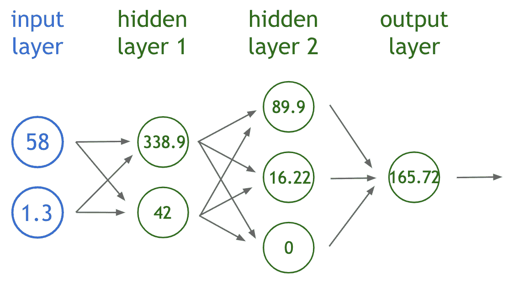

现在你知道了！这个神经网络预测出了一棵高达 165.72 英尺的树！现在，我们必须将预测结果与数据中样本树的实际高度进行比较。计算一些误差值就像计算我们的预测高度和实际高度之间的差值一样简单。然后，我们用稍微不同的权重反复重复这个过程，直到我们找到能够很好地预测许多样本的树高的权重。但是这对于人类来说太费时间了，所以我们需要一台机器来计算最佳重量。

重要提示:

*   **权重完全随机**以模拟神经网络的起点。这个模型显然没有经过“训练”,因此一旦我们将另一个样本放入其中，它就不会做得很好。我们将使用上面的结果来确定如何改变权重。
*   **中间值根本没告诉我们多少**。例如，第一个隐藏层中顶部节点的输出是 338.9，但这与神经网络预测的值 166 英尺相差甚远。重要的是不要试图将中间值解释为具有真实世界的意义。这就是为什么我们称这些层为“隐藏层”

# 就是这样！

感谢阅读:)考虑给文章一点掌声，真的是帮了我大忙！要了解更多关于机器学习的知识，请查看这篇关于计算机视觉背后的模型 CNN 的文章。