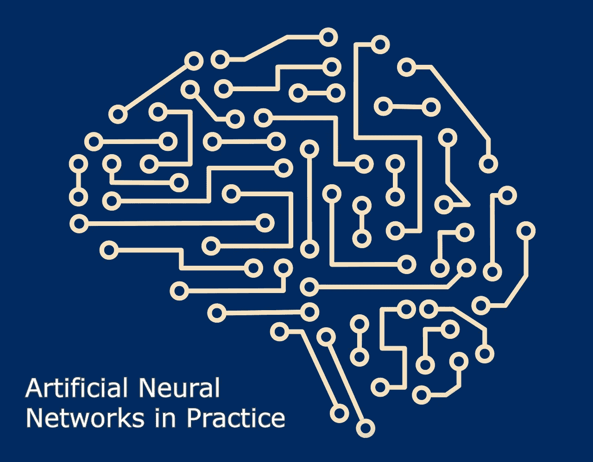

# 实践中的人工神经网络

> 原文：<https://towardsdatascience.com/artificial-neural-networks-in-practice-c950c4be47ee?source=collection_archive---------15----------------------->

## 以及人工神经网络如何重塑了许多行业

Image by Author, inspired by source. [Link](https://pixabay.com/users/marquetand-3570369/)

T 他的文章是我写的一篇更大的文章的一部分:[“人工智能简介——神经网络”](https://medium.com/@ilijamihajlovic/introduction-to-artificial-intelligence-neural-networks-5c7244f60425)如果你想了解更多关于人工神经网络的知识。去看看[我的媒体简介](https://medium.com/@ilijamihajlovic)，我在那里定期发表关于深度学习、机器学习和 iOS 开发的文章。

现在让我们来学习一下人工神经网络。我们走吧。😄

神经网络适合哪些现实世界的应用？好问题！神经网络对现实世界的商业问题有广泛的适用性。事实上，它们已经成功地应用于许多行业。

由于神经网络最擅长识别数据中的模式或趋势，因此它们非常适合预测或预报需求，包括:

*   销售预测
*   工业过程控制
*   客户研究
*   数据有效性
*   风险管理
*   目标营销

而是给你举一些更具体的例子；人工神经网络也用于以下特定的范例:识别发言者的沟通；肝炎的诊断；从故障软件中恢复电信；汉语多义词的解释；海底探雷；纹理分析；三维物体识别；手写单词识别；还有面部识别。

# 医学中的神经网络

人工神经网络(ANN)目前是医学中的一个“热门”研究领域，人们相信它们将在未来几年内广泛应用于生物医学系统。目前，这项研究主要是对人体的部分进行建模，并从各种扫描(如心电图、CAT 扫描、超声波扫描等)中识别疾病。).

神经网络在使用扫描识别疾病方面是理想的，因为不需要提供关于如何识别疾病的特定算法。神经网络通过例子学习，因此不需要如何识别疾病的细节。我们需要的是一组能代表这种疾病所有变异的例子。例子的数量没有‘数量’重要。如果系统要可靠有效地运行，需要非常仔细地选择示例。

# 心血管系统的建模和诊断

神经网络被实验性地用于模拟人类心血管系统。可以通过建立个体心血管系统的模型并将其与从患者处获得的实时生理测量值进行比较来实现诊断。如果定期执行这一程序，可以在早期发现潜在的有害医疗状况，从而使抗击疾病的过程更加容易。

个人心血管系统的模型必须模拟不同身体活动水平下的生理变量(即心率、收缩压和舒张压以及呼吸率)之间的关系。如果一个模型适用于一个人，那么它就成为这个人身体状况的模型。模拟器必须能够在没有专家监督的情况下适应任何个人的特征。这需要一个神经网络。

证明使用人工神经网络技术的另一个原因是人工神经网络提供传感器融合的能力，这种融合是来自几个不同传感器的值的组合。传感器融合使人工神经网络能够学习单个传感器值之间的复杂关系，如果单独分析这些值，这些关系就会丢失。在医学建模和诊断中，这意味着即使一组传感器中的每个传感器可能仅对特定的生理变量敏感，人工神经网络也能够通过融合来自单个生物医学传感器的数据来检测复杂的医学状况。

# 电子鼻

人工神经网络被实验性地用来实现电子鼻。电子鼻在远程医疗中有几个潜在的应用。远程医疗是通过通信链路进行远距离医疗实践。电子鼻可以识别远程手术环境中的气味。这些识别出的气味将被电子传输到另一个地点，在那里一个门生成系统将重现它们。因为嗅觉对外科医生来说可能是一种重要的感觉，telesmell 将增强远程呈现手术。

# 商业中的神经网络

商业是一个分流的领域，有几个通用的专业领域，如会计或财务分析。几乎任何神经网络应用程序都适合一个业务领域或财务分析。

将神经网络用于商业目的有一些潜力，包括资源分配和调度。使用神经网络进行数据库挖掘也有很大的潜力，即搜索数据库中显式存储的信息中隐含的模式。这一领域的大部分资助工作都被归类为专有工作。因此，不可能报告正在进行的全部工作。大多数工作是应用神经网络，如 Hopfield-Tank 网络进行优化和调度。

# 营销

有一个营销应用程序已经与神经网络系统集成在一起。航空公司营销策略师(商标缩写为 AMT)是由包括专家系统在内的各种智能技术构成的计算机系统。前馈神经网络与 AMT 集成，并使用反向传播进行训练，以辅助航空公司座位分配的市场控制。自适应神经方法服从于规则表达。此外，应用程序的环境不断地快速变化，这需要一个不断适应的解决方案。该系统用于监控和推荐每次出发的预订建议。此类信息对航空公司的盈利能力有直接影响，并可为系统用户提供技术优势。[哈奇森&斯蒂芬斯公司，1987 年]

虽然将神经网络应用于这个问题是很重要的，但同样重要的是要看到这种智能技术可以与专家系统和其他方法集成，以形成一个功能系统。神经网络被用来发现各种变量的不确定相互作用的影响。虽然这些相互作用没有被定义，但它们被神经系统用来得出有用的结论。同样值得注意的是，神经网络可以影响底线。

# 信用评估

由 Robert Hecht-Nielsen 创立的 HNC 公司已经开发了几种神经网络应用。其中之一是信用评分系统，它将现有模型的盈利能力提高了 27%。HNC 神经系统也被应用于抵押贷款筛选。Nestor 公司开发了一个神经网络自动抵押贷款保险承保系统。该系统接受了 5048 个应用程序的培训，其中 2597 个获得了认证。与财产和借款人资格有关的数据。在保守模式下，系统在 97%的情况下同意承保人。在自由模型中，系统同意 84%的情况。这是在 Apollo DN3000 上运行的系统，在大约 1 秒内处理一个案例文件时使用了 250K 内存。

# 结论

计算世界从神经网络中获益良多。他们通过例子学习的能力使他们非常灵活和强大。此外，不需要设计算法来执行特定的任务；即不需要理解该任务的内部机制。它们也非常适合于实时系统，因为它们的并行结构使它们具有快速的响应和计算时间。

神经网络也有助于其他领域的研究，如神经病学和心理学。它们经常被用于模拟部分生物体和研究大脑的内部机制。

也许神经网络最令人兴奋的方面是有一天可能会产生“有意识的”网络。许多科学家认为意识是一种“机械”属性，而“有意识的”神经网络是一种现实的可能性。

最后，我想说，尽管神经网络有巨大的潜力，但只有当它们与计算、人工智能、模糊逻辑和相关学科相结合时，我们才能充分利用它们。

**如果你想联系我，顺便说一句，你知道一个好笑话，你可以在** [**Twitter**](https://twitter.com/ikac_Ilija) **或** [**Linkedin 上联系我。**](https://www.linkedin.com/in/ilijamihajlovic/)

感谢阅读！😄 🙌