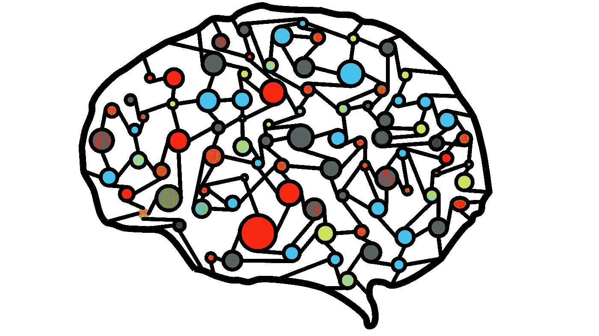
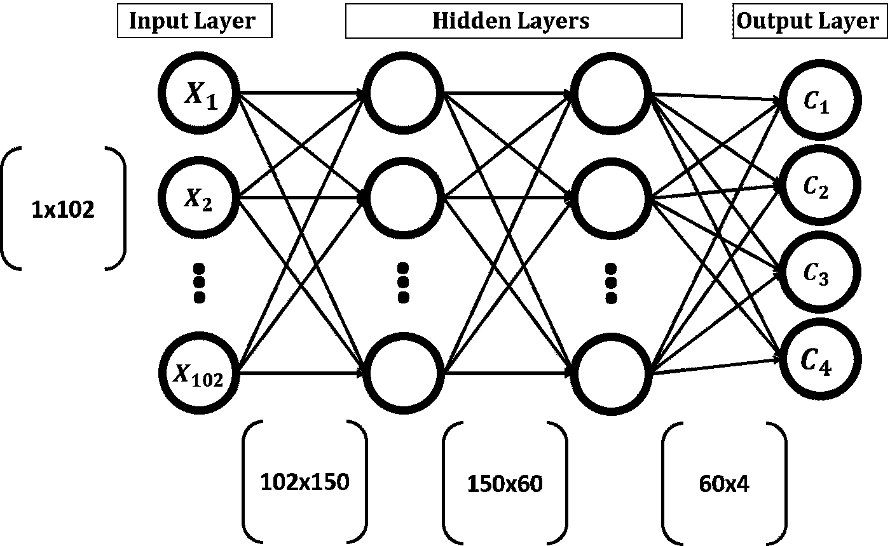
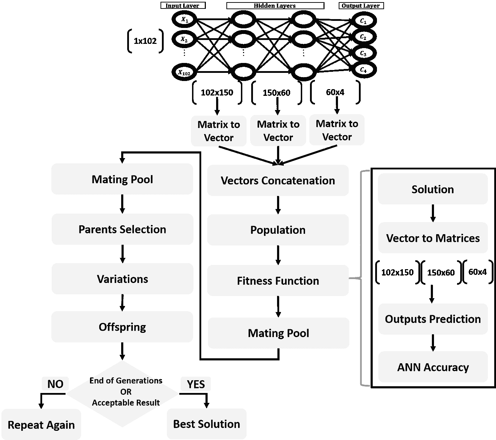
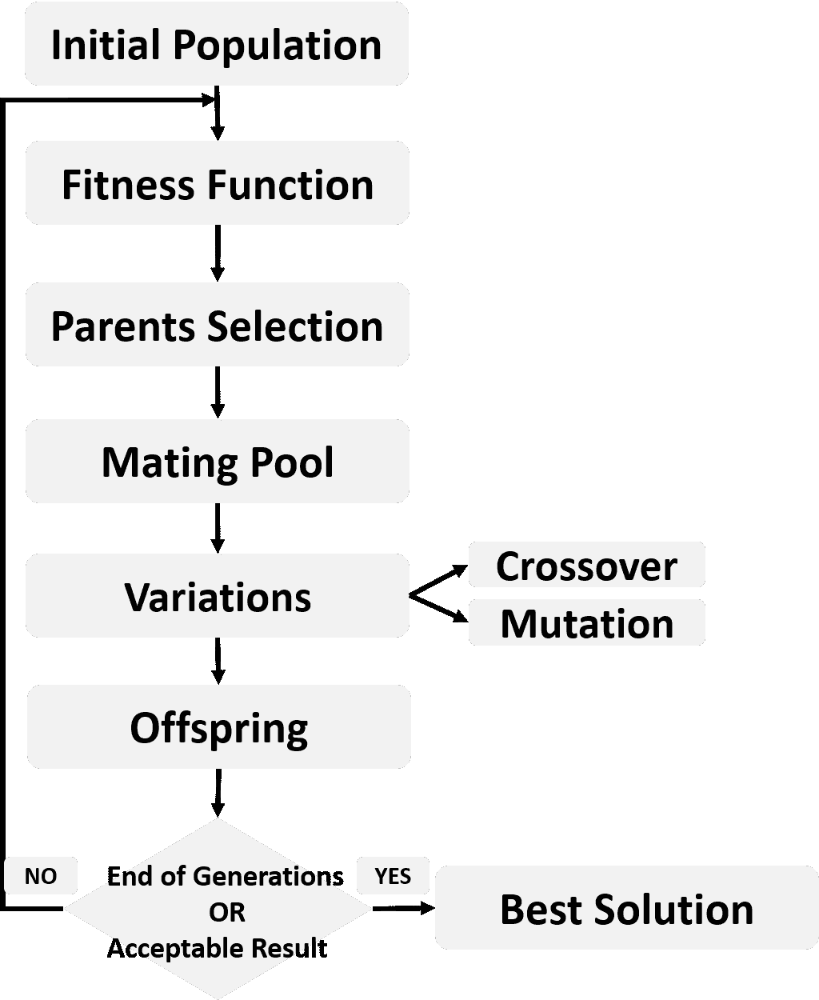
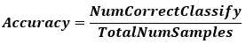
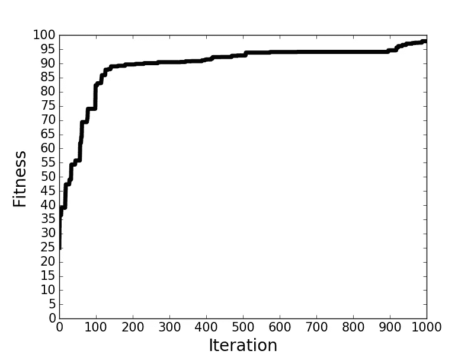

# 基于 Python 的遗传算法优化人工神经网络

> 原文：<https://towardsdatascience.com/artificial-neural-networks-optimization-using-genetic-algorithm-with-python-1fe8ed17733e?source=collection_archive---------1----------------------->



Image Created by Ahmed Fawzy Gad: [https://pixabay.com/illustrations/artificial-neural-network-ann-3501528](https://pixabay.com/illustrations/artificial-neural-network-ann-3501528/)

在我的 LinkedIn 个人资料中的标题为“**使用 NumPy 的人工神经网络实现和 Fruits360 图像数据集的分类**”的先前教程中，在此[链接](https://www.linkedin.com/pulse/artificial-neural-network-implementation-using-numpy-fruits360-gad)处，创建了一个人工神经网络(ANN)用于对 Fruits360 图像数据集的 4 个类别进行分类。本教程中使用的源代码可以在我的 [GitHub 页面](https://github.com/ahmedfgad/NumPyANN)中找到。

这个教程也可以在 TowardsDataScience [这里](/artificial-neural-network-implementation-using-numpy-and-classification-of-the-fruits360-image-3c56affa4491)获得。

本教程的快速总结是提取特征向量(360 箱色调通道直方图)并通过使用基于标准偏差的过滤技术将其减少到仅 102 个元素。后来，使用 NumPy 从头开始构建 ANN。

人工神经网络没有完全创建，因为只有前向传递准备就绪，但没有用于更新网络权重的后向传递。这就是为什么准确率很低，不超过 45%的原因。这个问题的解决方案是使用优化技术来更新网络权重。本教程使用遗传算法(GA)优化网络权重。

值得一提的是，上一篇和这篇教程都是基于我 2018 年的一本书，该书被引用为“**Ahmed Fawzy Gad‘使用深度学习的实用计算机视觉应用与 CNN’。2018 年 12 月，新闻，978–1–4842–4167–7**。这本书可以在施普林格书店[这个链接](https://springer.com/us/book/9781484241660)买到。你可以在这本书里找到所有的细节。

本教程中使用的源代码可以在我的 GitHub 页面[这里](https://github.com/ahmedfgad/NeuralGenetic)获得。

# 阅读更多关于遗传算法的信息

在开始本教程之前，我建议先阅读一下遗传算法是如何工作的，以及如何使用 NumPy 从头开始在 Python 中实现它，这是基于我在本教程末尾的参考资料一节中列出的链接中找到的以前的教程。

除了使用 Python 实现之外，在了解 GA 如何基于数值示例工作之后，我们可以开始使用 GA 通过更新其权重(参数)来优化 ANN。

# 将遗传算法与人工神经网络结合使用

GA 为一个给定的问题创建多个解决方案，并通过若干代进化它们。每个解决方案都包含所有可能有助于增强结果的参数。对于人工神经网络，所有层中的权重有助于实现高精度。因此，GA 中的单个解将包含 ANN 中的所有权重。根据前面教程中讨论的网络结构以及下图中给出的网络结构，ANN 有 4 层(1 个输入层、2 个隐藏层和 1 个输出层)。任何层中的任何重量都是同一解决方案的一部分。此类网络的单个解决方案将包含总重量数，等于 102x150+150x60+60x4=24，540。如果总体有 8 个解，每个解有 24，540 个参数，则整个总体的参数总数为 24，540x8=196，320。



看上面的图，网络的参数是矩阵形式，因为这使得人工神经网络的计算更容易。对于每一层，都有一个相关的权重矩阵。只需将输入矩阵乘以给定层的参数矩阵，即可返回该层的输出。遗传算法中的染色体是 1D 向量，因此我们必须将权重矩阵转换成 1D 向量。

因为矩阵乘法是处理 ANN 的一个很好的选择，所以在使用 ANN 时，我们仍将以矩阵形式表示 ANN 参数。因此，当与 ANN 一起工作时使用矩阵形式，而当与 GA 一起工作时使用向量形式。这使得我们需要将矩阵转换成向量，反之亦然。下图总结了将遗传算法与人工神经网络结合使用的步骤。该图被称为**主图**。



# 1D 向量的权重矩阵

群体中的每个解决方案将有两个表示。第一个是用于 GA 的 1D 向量，第二个是用于 ANN 的矩阵。因为 3 层有 3 个权重矩阵(2 个隐藏+ 1 个输出)，所以将有 3 个向量，每个矩阵一个。因为 GA 中的解被表示为单个 1D 向量，所以这 3 个单独的 1D 向量将被连接成单个 1D 向量。每个解将被表示为长度为 24，540 的向量。下一个 Python 代码创建了一个名为 **mat_to_vector()** 的函数，该函数将群体中所有解的参数从矩阵转换为向量。

```
**def** mat_to_vector(mat_pop_weights):
     pop_weights_vector = []
     **for** sol_idx **in** range(mat_pop_weights.shape[0]):
         curr_vector = []
         **for** layer_idx **in** range(mat_pop_weights.shape[1]):
             vector_weights = numpy.reshape(mat_pop_weights[sol_idx, layer_idx], newshape=(mat_pop_weights[sol_idx, layer_idx].size))
             curr_vector.extend(vector_weights)
         pop_weights_vector.append(curr_vector)
     **return** numpy.array(pop_weights_vector)
```

该函数接受一个表示所有解的总体的参数，以便遍历这些解并返回它们的向量表示。在函数的开始，创建一个名为 **pop_weights_vector** 的空列表变量来保存结果(所有解的向量)。对于每一个矩阵形式的解，都有一个内部循环来遍历它的三个矩阵。对于每个矩阵，使用 **numpy.reshape()** 函数将其转换为向量，该函数接受输入矩阵和矩阵将被整形到的输出大小。变量 **curr_vector** 接受单个解的所有向量。生成所有向量后，它们被追加到 **pop_weights_vector** 变量中。

注意，我们对属于同一解决方案的向量使用了 **numpy.extend()** 函数，对属于不同解决方案的向量使用了 **numpy.append()** 。原因是 **numpy.extend()** 将属于同一解决方案的 3 个向量中的数字连接在一起。换句话说，为两个列表调用这个函数将返回一个新的单个列表，其中包含两个列表中的数字。这适合于为每个解决方案创建一个 1D 染色体。但是 **numpy.append()** 将为每个解决方案返回三个列表。为两个列表调用它，它返回一个新的列表，该列表被分成两个子列表。这不是我们的目标。最后，函数 **mat_to_vector()** 以 NumPy 数组的形式返回群体解，以便于以后操作。

# 实施 GA 步骤

在将所有解从矩阵转换为向量并连接在一起后，我们准备好执行名为“**遗传算法优化简介**”的教程中讨论的遗传算法步骤。这些步骤在**主图**中介绍，也在下图中总结。



请记住，GA 使用适应度函数来返回每个解决方案的适应度值。适应值越高，解决方案越好。最佳解决方案在**父选择**步骤中作为父返回。

诸如 ANN 之类的分类器的常见适应度函数之一是准确性。它是正确分类的样本与样本总数之间的比率。它是根据下一个等式计算的。根据**主图**中的步骤计算每个解决方案的分类精度。



每个解的单个 1D 向量被转换回 3 个矩阵，每层一个矩阵(2 个隐藏和 1 个输出)。使用名为 **vector_to_mat()** 的函数进行转换。它在下一段代码中定义。

```
**def** vector_to_mat(vector_pop_weights, mat_pop_weights):
    mat_weights = []
    **for** sol_idx **in** range(mat_pop_weights.shape[0]):
        start = 0
        end = 0
        **for** layer_idx **in** range(mat_pop_weights.shape[1]):
            end = end + mat_pop_weights[sol_idx, layer_idx].size
            curr_vector = vector_pop_weights[sol_idx, start:end]
            mat_layer_weights = numpy.reshape(curr_vector, newshape=(mat_pop_weights[sol_idx, layer_idx].shape))
            mat_weights.append(mat_layer_weights)
            start = end
    **return** numpy.reshape(mat_weights, newshape=mat_pop_weights.shape)
```

它逆转了先前所做的工作。但是有一个重要的问题。如果给定解的向量只是一片，我们如何能分裂成三个不同的部分，每个部分代表一个矩阵？输入层和隐藏层之间的第一个参数矩阵的大小是 102x150。当转换成向量时，它的长度将是 15，300。因为根据 **mat_to_vector()** 函数，它是要插入到 **curr_vector** 变量中的第一个向量，所以它的索引从索引 0 开始，到索引 15，299 结束。 **mat_pop_weights** 用作 **vector_to_mat()** 函数的参数，以了解每个矩阵的大小。我们对使用来自 **mat_pop_weights** 变量的权重不感兴趣，只是使用了其中的矩阵大小。

对于同一解决方案中的第二个向量，它将是转换大小为 150x60 的矩阵的结果。因此，向量长度为 9000。这样的向量被插入到长度为 15，300 的前一个向量之前的变量 **curr_vector** 中。因此，它将从索引 15，300 开始，到索引 15，300+9，000–1 = 24，299 结束。使用-1 是因为 Python 从 0 开始索引。对于从大小为 60×4 的参数矩阵创建的最后一个向量，其长度为 240。因为它被添加到 **curr_vector** 变量中正好在长度为 9000 的前一个向量之后，所以它的索引将在它之后开始。也就是说，它的开始索引是 24，300，结束索引是 24，300+240–1 = 24，539。因此，我们可以成功地将向量恢复为原始的 3 个矩阵。

为每个解决方案返回的矩阵用于预测所用数据集中 1，962 个样本中每个样本的类别标签，以计算精确度。根据下一个代码，这是使用两个函数完成的，它们是**预测输出()**和**适应度()**。

```
**def** predict_outputs(weights_mat, data_inputs, data_outputs, activation=**"relu"**):
    predictions = numpy.zeros(shape=(data_inputs.shape[0]))
    **for** sample_idx **in** range(data_inputs.shape[0]):
        r1 = data_inputs[sample_idx, :]
        **for** curr_weights **in** weights_mat:
            r1 = numpy.matmul(a=r1, b=curr_weights)
            **if** activation == **"relu"**:
                r1 = relu(r1)
            **elif** activation == **"sigmoid"**:
                r1 = sigmoid(r1)
        predicted_label = numpy.where(r1 == numpy.max(r1))[0][0]
        predictions[sample_idx] = predicted_label
    correct_predictions = numpy.where(predictions == data_outputs)[0].size
    accuracy = (correct_predictions/data_outputs.size)*100
    **return** accuracy, predictions

**def** fitness(weights_mat, data_inputs, data_outputs, activation=**"relu"**):
    accuracy = numpy.empty(shape=(weights_mat.shape[0]))
    **for** sol_idx **in** range(weights_mat.shape[0]):
        curr_sol_mat = weights_mat[sol_idx, :]
        accuracy[sol_idx], _ = predict_outputs(curr_sol_mat, data_inputs, data_outputs, activation=activation)
    **return** accuracy
```

**predict_outputs()** 函数接受训练数据的单个解决方案、输入和输出的权重，以及指定使用哪个激活函数的可选参数。它只返回一个解的精度，而不是群体中所有解的精度。为了返回群体中所有解的适应度值(即精度)，函数 **fitness()** 遍历每个解，将其传递给函数 **predict_outputs()** ，将所有解的精度存储到数组**精度**中，并最终返回这样一个数组。

在计算了所有解决方案的适应值(即精度)后，主图中 GA 的剩余步骤以与之前相同的方式应用。最佳亲本根据其准确性被选入交配池。然后应用变异和交叉变异来产生后代。新一代的群体是利用后代和父母两者创建的。这些步骤要重复几代。

# 完整的 Python 实现

此类项目的 Python 实现有三个 Python 文件:

1.  **ga.py** 用于实现 ga 功能。
2.  **ANN.py** 用于实现 ANN 功能。
3.  第三个文件，用于通过若干代调用此类函数。这是项目的主文件。

# 主项目文件实现

第三个文件是主文件，因为它连接了所有的函数。它读取特征和类标签文件，基于标准偏差过滤特征，创建 ANN 体系结构，生成初始解决方案，通过计算所有解决方案的适应度值、选择最佳父代、应用交叉和变异并最终创建新群体来循环通过若干代。下面给出了它的实现。这样的文件定义了 GA 参数，例如每个种群的解的数量、选择的亲本的数量、突变百分比和代的数量。您可以为它们尝试不同的值。

```
**import** numpy
**import** GA
**import** pickle
**import** ANN
**import** matplotlib.pyplot

f = open(**"dataset_features.pkl"**, **"rb"**)
data_inputs2 = pickle.load(f)
f.close()
features_STDs = numpy.std(a=data_inputs2, axis=0)
data_inputs = data_inputs2[:, features_STDs>50]

f = open(**"outputs.pkl"**, **"rb"**)
data_outputs = pickle.load(f)
f.close()

*#Genetic algorithm parameters:
#    Mating Pool Size (Number of Parents)
#    Population Size
#    Number of Generations
#    Mutation Percent* sol_per_pop = 8
num_parents_mating = 4
num_generations = 1000
mutation_percent = 10

*#Creating the initial population.* initial_pop_weights = []
**for** curr_sol **in** numpy.arange(0, sol_per_pop):
    HL1_neurons = 150
    input_HL1_weights = numpy.random.uniform(low=-0.1, high=0.1, 

                                             size=(data_inputs.shape[1], HL1_neurons))

    HL2_neurons = 60
    HL1_HL2_weights = numpy.random.uniform(low=-0.1, high=0.1, 

                                             size=(HL1_neurons, HL2_neurons))

    output_neurons = 4
    HL2_output_weights = numpy.random.uniform(low=-0.1, high=0.1, 

                                              size=(HL2_neurons, output_neurons))

    initial_pop_weights.append(numpy.array([input_HL1_weights, 

                                                HL1_HL2_weights, 

                                                HL2_output_weights]))

pop_weights_mat = numpy.array(initial_pop_weights)
pop_weights_vector = ga.mat_to_vector(pop_weights_mat)

best_outputs = []
accuracies = numpy.empty(shape=(num_generations))

**for** generation **in** range(num_generations):
    print(**"Generation : "**, generation)

    *# converting the solutions from being vectors to matrices.* pop_weights_mat = ga.vector_to_mat(pop_weights_vector, 
                                       pop_weights_mat)

    *# Measuring the fitness of each chromosome in the population.* fitness = ANN.fitness(pop_weights_mat, 
                          data_inputs, 
                          data_outputs, 
                          activation=**"sigmoid"**)

    accuracies[generation] = fitness[0]
    print(**"Fitness"**)
    print(fitness)

    *# Selecting the best parents in the population for mating.* parents = ga.select_mating_pool(pop_weights_vector, 

                                    fitness.copy(), 

                                    num_parents_mating)
    print(**"Parents"**)
    print(parents)

    *# Generating next generation using crossover.* offspring_crossover = ga.crossover(parents,

                                       offspring_size=(pop_weights_vector.shape[0]-parents.shape[0], pop_weights_vector.shape[1]))

    print(**"Crossover"**)
    print(offspring_crossover)

    *# Adding some variations to the offsrping using mutation.* offspring_mutation = ga.mutation(offspring_crossover, 

                                     mutation_percent=mutation_percent)
    print(**"Mutation"**)
    print(offspring_mutation)

    *# Creating the new population based on the parents and offspring.* pop_weights_vector[0:parents.shape[0], :] = parents
    pop_weights_vector[parents.shape[0]:, :] = offspring_mutation

pop_weights_mat = ga.vector_to_mat(pop_weights_vector, pop_weights_mat)
best_weights = pop_weights_mat [0, :]
acc, predictions = ANN.predict_outputs(best_weights, data_inputs, data_outputs, activation=**"sigmoid"**)
print(**"Accuracy of the best solution is : "**, acc)

matplotlib.pyplot.plot(accuracies, linewidth=5, color=**"black"**)
matplotlib.pyplot.xlabel(**"Iteration"**, fontsize=20)
matplotlib.pyplot.ylabel(**"Fitness"**, fontsize=20)
matplotlib.pyplot.xticks(numpy.arange(0, num_generations+1, 100), fontsize=15)
matplotlib.pyplot.yticks(numpy.arange(0, 101, 5), fontsize=15)

f = open(**"weights_"**+str(num_generations)+**"_iterations_"**+str(mutation_percent)+**"%_mutation.pkl"**, **"wb"**)
pickle.dump(pop_weights_mat, f)
f.close()
```

基于 1000 代，使用 **Matplotlib** 可视化库在该文件的末尾创建了一个图，该图显示了精度在每代之间如何变化。如下图所示。



经过 1000 次迭代，准确率达到 97%以上。相比之下，在之前的教程中，如果不使用优化技术，这一比例为 45%。这是为什么结果可能不好的证据，不是因为模型或数据有问题，而是因为没有使用优化技术。当然，对参数使用不同的值，比如 10，000 代，可能会提高精度。在这个文件的末尾，它将参数以矩阵的形式保存到磁盘上以备后用。

# 遗传算法实现

下面列出了 **ga.py** 文件的实现。注意， **mutation()** 函数接受 **mutation_percent** 参数，该参数定义了随机改变其值的基因数量。它在主文件中被设置为 10%。这样的文件包含两个新函数 **mat_to_vector()** 和 **vector_to_mat()** 。

```
**import** numpy
**import** random

*# Converting each solution from matrix to vector.* **def** mat_to_vector(mat_pop_weights):
    pop_weights_vector = []
    **for** sol_idx **in** range(mat_pop_weights.shape[0]):
        curr_vector = []
        **for** layer_idx **in** range(mat_pop_weights.shape[1]):
            vector_weights = numpy.reshape(mat_pop_weights[sol_idx, layer_idx], newshape=(mat_pop_weights[sol_idx, layer_idx].size))
            curr_vector.extend(vector_weights)
        pop_weights_vector.append(curr_vector)
    **return** numpy.array(pop_weights_vector)

*# Converting each solution from vector to matrix.* **def** vector_to_mat(vector_pop_weights, mat_pop_weights):
    mat_weights = []
    **for** sol_idx **in** range(mat_pop_weights.shape[0]):
        start = 0
        end = 0
        **for** layer_idx **in** range(mat_pop_weights.shape[1]):
            end = end + mat_pop_weights[sol_idx, layer_idx].size
            curr_vector = vector_pop_weights[sol_idx, start:end]
            mat_layer_weights = numpy.reshape(curr_vector, newshape=(mat_pop_weights[sol_idx, layer_idx].shape))
            mat_weights.append(mat_layer_weights)
            start = end
    **return** numpy.reshape(mat_weights, newshape=mat_pop_weights.shape)

**def** select_mating_pool(pop, fitness, num_parents):
    *# Selecting the best individuals in the current generation as parents for producing the offspring of the next generation.* parents = numpy.empty((num_parents, pop.shape[1]))
    **for** parent_num **in** range(num_parents):
        max_fitness_idx = numpy.where(fitness == numpy.max(fitness))
        max_fitness_idx = max_fitness_idx[0][0]
        parents[parent_num, :] = pop[max_fitness_idx, :]
        fitness[max_fitness_idx] = -99999999999
    **return** parents

**def** crossover(parents, offspring_size):
    offspring = numpy.empty(offspring_size)
    *# The point at which crossover takes place between two parents. Usually, it is at the center.* crossover_point = numpy.uint32(offspring_size[1]/2)
    **for** k **in** range(offspring_size[0]):
        *# Index of the first parent to mate.* parent1_idx = k%parents.shape[0]
        *# Index of the second parent to mate.* parent2_idx = (k+1)%parents.shape[0]
        *# The new offspring will have its first half of its genes taken from the first parent.* offspring[k, 0:crossover_point] = parents[parent1_idx, 0:crossover_point]
        *# The new offspring will have its second half of its genes taken from the second parent.* offspring[k, crossover_point:] = parents[parent2_idx, crossover_point:]
    **return** offspring

**def** mutation(offspring_crossover, mutation_percent):
    num_mutations = numpy.uint32((mutation_percent*offspring_crossover.shape[1])/100)
    mutation_indices = numpy.array(random.sample(range(0, offspring_crossover.shape[1]), num_mutations))
    *# Mutation changes a single gene in each offspring randomly.* **for** idx **in** range(offspring_crossover.shape[0]):
        *# The random value to be added to the gene.* random_value = numpy.random.uniform(-1.0, 1.0, 1)
        offspring_crossover[idx, mutation_indices] = offspring_crossover[idx, mutation_indices] + random_value
    **return** offspring_crossover
```

# ANN.py 实现

最后，根据下面列出的代码实现 **ANN.py** 。它包含激活函数(sigmoid 和 ReLU)的实现，以及用于计算精度的**适应度()**和**预测输出()**函数。

```
**import** numpy

**def** sigmoid(inpt):
    **return** 1.0 / (1.0 + numpy.exp(-1 * inpt))

**def** relu(inpt):
    result = inpt
    result[inpt < 0] = 0
    **return** result

**def** predict_outputs(weights_mat, data_inputs, data_outputs, activation=**"relu"**):
    predictions = numpy.zeros(shape=(data_inputs.shape[0]))
    **for** sample_idx **in** range(data_inputs.shape[0]):
        r1 = data_inputs[sample_idx, :]
        **for** curr_weights **in** weights_mat:
            r1 = numpy.matmul(a=r1, b=curr_weights)
            **if** activation == **"relu"**:
                r1 = relu(r1)
            **elif** activation == **"sigmoid"**:
                r1 = sigmoid(r1)
        predicted_label = numpy.where(r1 == numpy.max(r1))[0][0]
        predictions[sample_idx] = predicted_label
    correct_predictions = numpy.where(predictions == data_outputs)[0].size
    accuracy = (correct_predictions / data_outputs.size) * 100
    **return** accuracy, predictions

**def** fitness(weights_mat, data_inputs, data_outputs, activation=**"relu"**):
    accuracy = numpy.empty(shape=(weights_mat.shape[0]))
    **for** sol_idx **in** range(weights_mat.shape[0]):
        curr_sol_mat = weights_mat[sol_idx, :]
        accuracy[sol_idx], _ = predict_outputs(curr_sol_mat, data_inputs, data_outputs, activation=activation)
    **return** accuracy
```

# 资源

*   遗传算法优化导论

[https://www . LinkedIn . com/pulse/introduction-优化-遗传-算法-ahmed-gad/](https://www.linkedin.com/pulse/introduction-optimization-genetic-algorithm-ahmed-gad/)

[https://www . kdnugges . com/2018/03/introduction-optimization-with-genetic-algorithm . html](https://www.kdnuggets.com/2018/03/introduction-optimization-with-genetic-algorithm.html)

[https://towards data science . com/introduction-to-optimization-with-genetic algorithm-2f 5001d 9964 b](/introduction-to-optimization-with-genetic-algorithm-2f5001d9964b)

[https://www.springer.com/us/book/9781484241660](https://www.springer.com/us/book/9781484241660)

*   遗传算法(GA)优化—分步示例

[https://www . slide share . net/AhmedGadFCIT/genetic-algorithm-ga-optimization-step by step-example](https://www.slideshare.net/AhmedGadFCIT/genetic-algorithm-ga-optimization-stepbystep-example)

*   遗传算法在 Python 中的实现

[https://www . LinkedIn . com/pulse/genetic-algorithm-implementation-python-Ahmed-gad/](https://www.linkedin.com/pulse/genetic-algorithm-implementation-python-ahmed-gad/)

[https://www . kdnugges . com/2018/07/genetic-algorithm-implementation-python . html](https://www.kdnuggets.com/2018/07/genetic-algorithm-implementation-python.html)

[](/genetic-algorithm-implementation-in-python-5ab67bb124a6) [## 遗传算法在 Python 中的实现

### 本教程将基于一个简单的例子用 Python 实现遗传算法优化技术，其中…

towardsdatascience.com](/genetic-algorithm-implementation-in-python-5ab67bb124a6) 

[https://github.com/ahmedfgad/GeneticAlgorithmPython](https://github.com/ahmedfgad/GeneticAlgorithmPython)

# 联系作者

*   领英:[https://linkedin.com/in/ahmedfgad](https://linkedin.com/in/ahmedfgad/)
*   GitHub:[https://github.com/ahmedfgad](https://github.com/ahmedfgad)