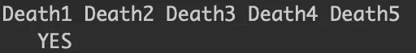
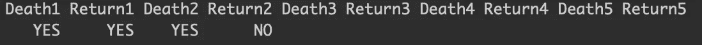
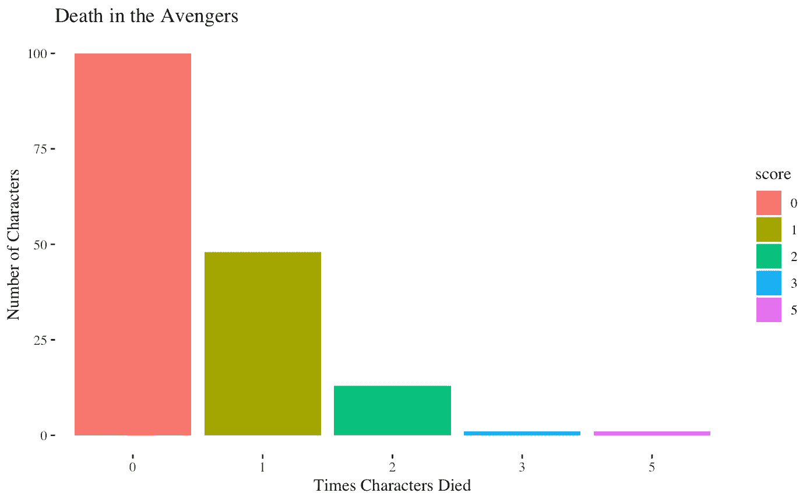
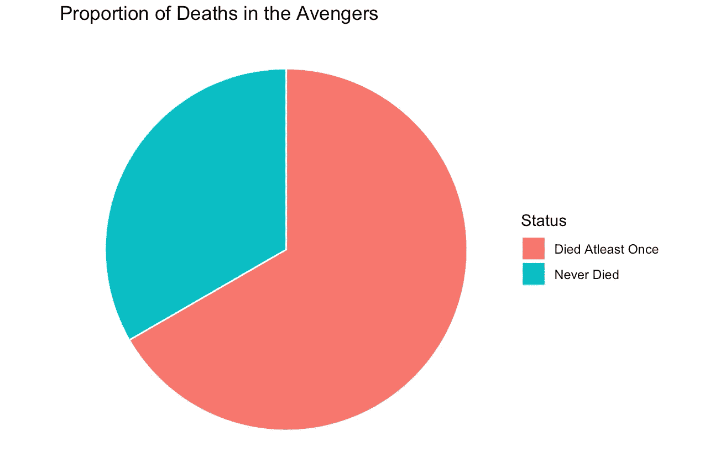
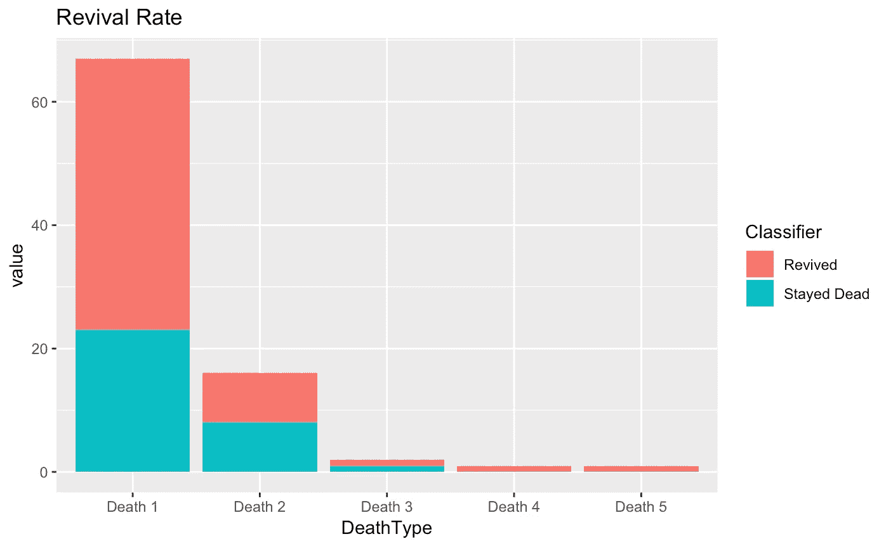
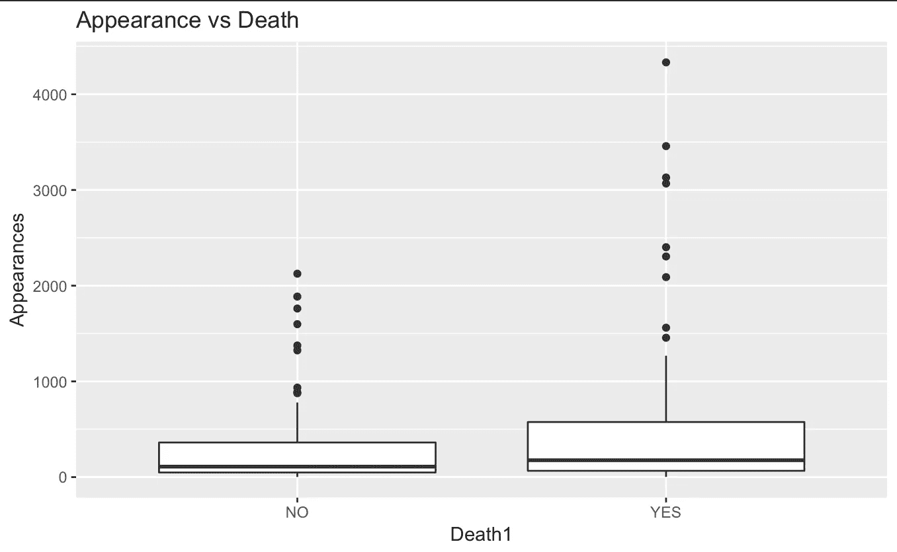
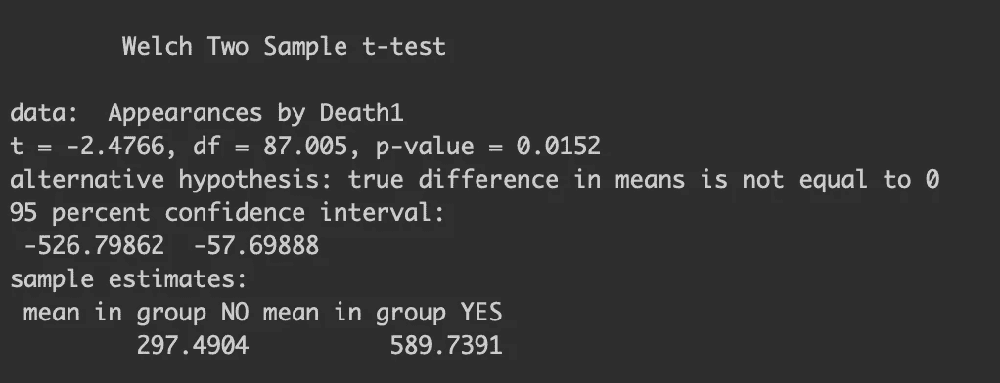
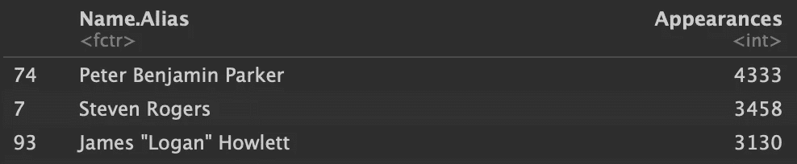

# 作为复仇者，死亡是工作的一部分

> 原文：<https://towardsdatascience.com/as-an-avenger-dying-is-part-of-the-job-bce785cad2b4?source=collection_archive---------24----------------------->

## 死亡是永久的…除非你是复仇者！

我有一个“高效拖延”的习惯，在这种情况下，我欺骗自己相信我在拖延的同时在某种程度上降低了效率。在过去的这个周末，我在两天内狼吞虎咽地看了 10 部漫威电影，之前我已经忽略了漫威电影宇宙大约十年了。由于漫威兴奋和浪费时间，我实现了这个有缺陷的框架并进行统计分析。

我接着去了[数据集搜索](https://toolbox.google.com/datasetsearch)，这是一个为寻找数据集的数据爱好者提供的优秀平台。有太多的复仇者联盟/漫威数据集可用，但 [FiveThirtyEight 的复仇者联盟](https://www.kaggle.com/fivethirtyeight/fivethirtyeight-avengers-dataset)数据集脱颖而出。

该数据集是完美的策划，它包含了所有复仇者的全名和他们的死亡信息。我想我可以扩展一下在自述文件中解释的 FiveThirtyEight 的想法，并通过可视化提出我自己的有趣见解。

值得注意的是，“死亡”包括假死的情况。真正被归类为“死亡”的是当读者和其他角色都认为这个角色真的死了，而不是这个角色是否在呼吸。我也相信这个数据集是基于漫威漫画的。

# 说明的

第一阶段是探索数据集。我在导入 RStudio 后获得的原始数据包含许多列。我想把重点放在包含人物姓名、死亡和出场次数的列上。

我意识到有 5 个死亡栏:死亡 1，死亡 2，死亡 3，死亡 4，死亡 5。他们是绝对的，他们展示了每个角色是否会死。

以下是一些例子:

例 1:旺达·马克西莫夫，心爱的用思想移动物体的斯佳丽女巫，死过一次。因此，列 Death1 有一个 Yes 条目，而其他所有死亡列都是空的。

例 2:另一方面，我们挥舞着锤子的超级英雄托尔，死了一次，复活了一次，却又死了一次。

我知道我必须重新构建死亡记录方式以便于使用，这就把我带到了下一步，数据清理。

# 数据清理

我运行了一个循环，每次角色死了，我都会得到一个分数。所以像旺达这样死过一次的角色会得到 1 分，而雷神会得到 2 分。像 T'Challa 这样从未死去的角色(真正的完美角色)得到 0 分。

我不确定是否有数据处理混淆，但是在上一步之后，我发现一些行没有名称条目，我后来删除了这些条目。

# 形象化

我使用 ggplot2 的库来执行数据可视化，如果你了解 r。

很多复仇者至少死过一次，但只有少数角色死过三次以上。

现在，让我们来看看这张饼状图，它会让你更好地感受到成为复仇者有多“危险”。

成为复仇者有大约 61%的死亡率。我不确定具体情况，但我觉得可能性很大。地球上几乎所有其他工作或活动的死亡率都更高。

但是我们来看看复仇者联盟的回报率。有很多情况，甚至在电影中，当我们认为一个角色已经死了，却在电影的结尾或下一部电影中又回来了——我正看着你呢，尼克·弗瑞。

不到 50%的“死亡”角色保持死亡状态。复活率很高，但考虑到高死亡率，这是合理的。如果《复仇者联盟》中的所有角色都真的死了，那么漫威的漫画作家将不得不不断创造新的角色。

我还调查了角色的外貌是否会影响角色的死亡率。

韦尔奇的样本 t 检验显示，至少死过一次的复仇者和从未死过的复仇者在出现次数上似乎没有显著差异。

可以肯定地说，作为一名复仇者，当你还活着的时候，死亡或者让所有人都认为你死了是工作的一部分。和出现次数没有区别。

有趣的发现:作为一个对 MCU 优先不感兴趣的人，我一直认为美国队长或钢铁侠是复仇者联盟的代言人。所以我很惊讶地发现蜘蛛侠出现的次数最多，这意味着他在漫画中出现的次数最多。

但我想是这样的。

感谢阅读！如果你感兴趣的话，这是 Github 上代码的链接。