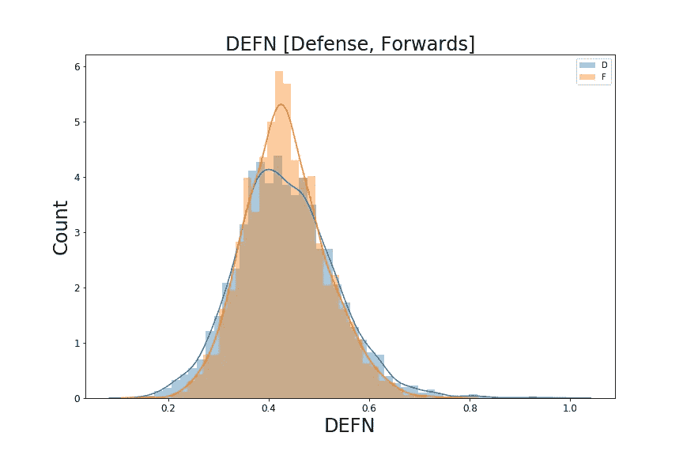
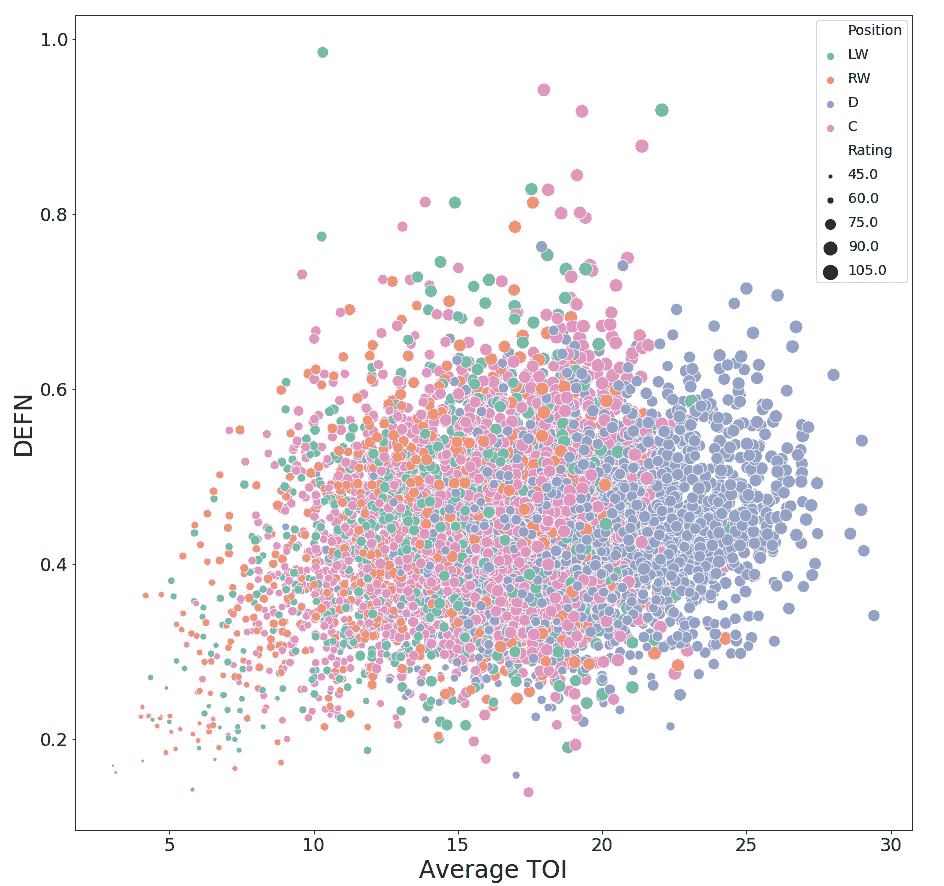
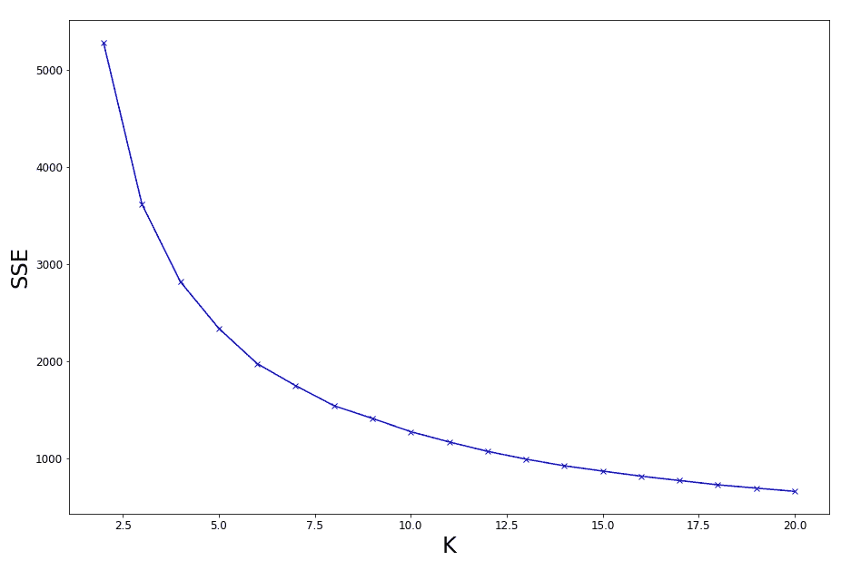
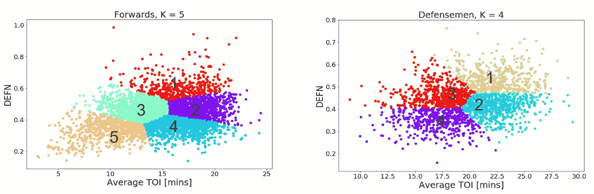
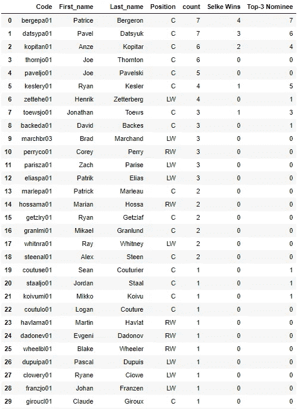
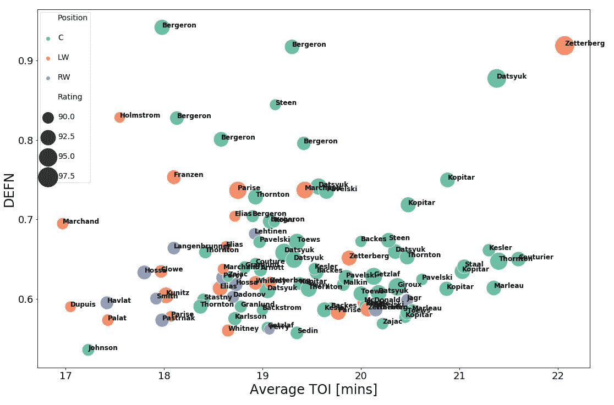
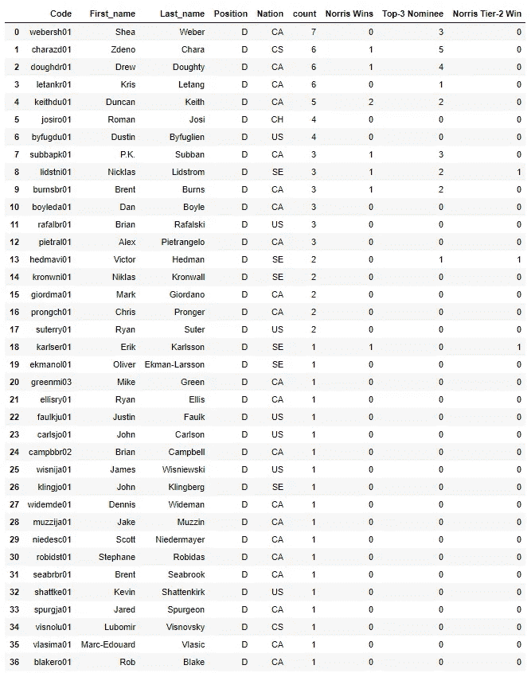
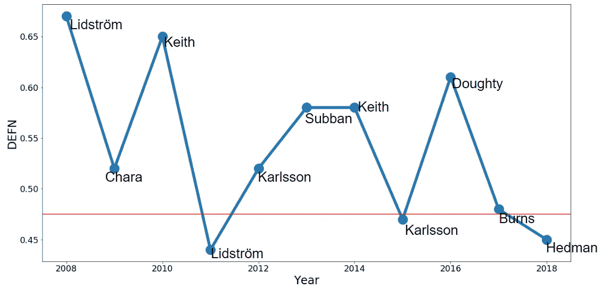
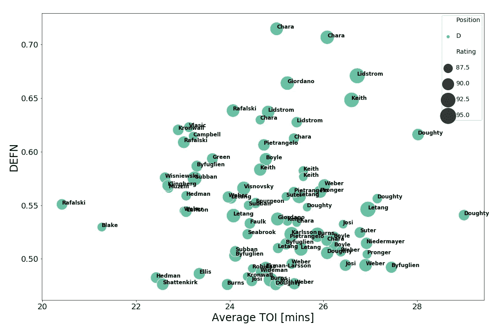

# 使用 K-means 评估 NHL 获奖者

> 原文：<https://towardsdatascience.com/assessing-nhl-award-winners-using-k-means-ce1fcce00c55?source=collection_archive---------23----------------------->

在每个 NHL 赛季结束后，各种奖项会颁发给在各个领域表现突出的球员。虽然有一些奖项是由原始数据决定的，例如，常规赛总进球数(莫里斯·理查德奖杯)和常规赛总得分(进球数加助攻数)(阿特·罗斯奖杯)，但也有一些奖项更加主观，采用投票系统来决定获胜者。大多数奖项的投票都是由职业冰球作家协会(Professional Hockey Writers ' Association)进行的，包括弗兰克·塞尔克奖(Frank J. Selke trophy):“授予在比赛的防守方面表现最佳的前锋”，以及詹姆斯·诺里斯纪念奖(James Norris Memorial trophy):“授予在整个赛季中表现出最全面能力的防守球员”。两个奖杯都只适用于常规赛的表现。

我从来不喜欢投票系统，尽管在某些情况下，最终的赢家可能非常明显。我认为这可能很有趣，通过单独使用标准和高级曲棍球统计数据，如果我可以将球员分为“等级”，并通过这样做，确定这两个投票式奖杯的获胜者，假设某一年的获胜者应该在最高等级。

**数据集**

使用的最终数据集是传统和高级玩家指标的组合。传统的统计数据涉及进球和助攻(总得分)、加减分、点球时间和冰上时间等指标，而高级球员指标则更多地涉及球员行为和控球。利用 Python 的 beautifulsoup 库，我刮到了更多传统的统计数据(比如进球、助攻、积分等。)来自 www.Hockey-reference.com[，](http://www.Hockey-reference.com,)而高级指标由[提供 www.corsica.hockey.](http://www.corsica.hockey.) 来自科西嘉曲棍球的高级曲棍球统计从 2008 年开始，因此，我有跨越 2008-2018 年的近 2000 名球员的数据。需要注意的是，我只考虑了游戏处于平均水平时的高级统计数据。数据被清除掉丢失的值，并被传入 Pandas 进行分析。虽然，我计划最终得到它，这个数据集只适用于滑冰运动员，而不是守门员。守门员的统计和溜冰者的统计非常不同。

**职责**

在我的上一篇[帖子](https://medium.com/@ashcan.jones/nhl-player-rating-using-standard-and-advanced-hockey-stats-af2a9537909e)中，我使用上述数据集设计了一个球员评级系统，其中各种统计参数被加权和求和，并通过一个标准的 Sigmoid 函数，为给定的常规赛产生 50 到 99.9(递归)之间的评级值；分数越高，玩家的表现越好。评级系统确定了四个领域，其中一个是被称为 DEFN 的“*责任*参数，占最终评级值的大约 35%(其他是*生产力* ~50%，*耐力* ~8 %，其他*杂项*游戏特性占大约 7%)。责任仅仅是(平均而言)分配给一个球员的防守责任，以及他在常规赛中履行这些责任的表现。它是一些高级统计数据的数学算法，定义如下:

CF%: CF 代表“Corsi For”，这是当一名球员在冰上时该球员的球队产生的射门次数，与“Corsi Against”(CA)相对，这是当该球员在冰上时对方球队产生的射门次数。CF%简单来说就是 CF / (CF + CA)。

CFQoC:比赛平均 CF%的质量。数字越高，竞争程度越高。关于它的解释，这是一个有些争议的统计数据，但我喜欢它被用在 OZS 的上下文中(见下文)。

CFQoT:这是玩家的队友的 CF%。它表明了一个球员相对于他的队友对整体比赛的贡献。通常这是一个很好的指标，可以看出某个球员是否让他周围的球员变得更好。

OZS:进攻区开始。给定球员在进攻区域开始移动的次数百分比。

xGF%:的预期目标与的预期目标的比率。预期目标仅仅是给定射门得分的可能性。它提供了对拍摄质量的判断。因此，xG 值为 0.2，意味着射门的概率为 20%。从本质上讲，这里的高得分球员都有高质量的机会。

该算法考虑了球员最有可能在哪个区域开始他的转变，给予低 OZS 更多的权重(因此更多的防守职责)，乘以同时在冰上竞争的球员的质量。所以一个在这里综合得分大的玩家，他的“责任心”程度更高。他们处理任务的好坏取决于责任乘以 CF%、CF qot %和 xGF%的综合因素。关于这个算法的更多信息，包括实际公式，可以在[这里](https://github.com/ashleyjones-projects/NHL-Player-rating)找到。

Fig 1\. Histograms of DEFN values for rated forwards (F) and defensemen (D) between 2008 and 2018

图一。显示了从 2008 年到 2018 年赛季所有评定的前锋和后卫 DEFN 值的分布。可以看出，两个类别都有类似的高斯分布，平均值/中值约为 0.43，标准偏差约为 0.08–0.1。

图二。显示了按位置分布的直方图(LW，C，RW =前锋，D =后卫),其中 DEFN 是每场比赛在冰上的平均时间(TOI)的函数。如上所述，TOI 决定了玩家等级中的耐力部分。球员不仅要承担责任，他们还要忍受一段时间，比其他人更久。圆圈的大小代表了某个玩家在某个赛季的等级，这个等级是从我之前的[帖子](https://medium.com/@ashcan.jones/nhl-player-rating-using-standard-and-advanced-hockey-stats-af2a9537909e)中计算出来的

Fig 2\. Scatter plot of all rated players from 2008–2018 classed into position. The size of the dot is a representation of the overall player rating

我们可以从这个情节中学到很多。防守队员比前锋打更多的时间，正如我们从图 1 中看到的。所有玩家位置的分布相当均匀。我们还可以看到，每增加一个职业，每增加一次上场时间，球员的评分就会变得更高，这是有道理的，因为一支球队会尽可能多地派出最好的球员。然而，DEFN 呢？如前所述，DEFN 值越高，责任越大，玩家履行这些责任就越好。因此，我们应该期望在前锋/防守球员类别的右上角找到整体表现最好的“防守”球员。理论上，这些球员应该是塞尔克或诺里斯奖杯的获得者。在接下来的几节中，我们将了解情况是否如此。然而，我们首先需要一种方法来对图 2 中的数据进行分类。

**K-表示**

K-means 聚类是一种无监督聚类技术，用于标记数据并将它们归入具有相似特征/行为的类别。声明设定数量的“K”个聚类，并将每个数据点与代表每个聚类的随机生成的质心进行比较。基于到最近聚类质心的最短欧几里德距离，将给定数据点分配给给定聚类。然后，该算法以迭代方式工作，重复该过程，使得质心位置被优化并稳定在它们的最终位置。这种建模的一个重要方面是，模型所训练的特征必须具有相似的量级，因此，建议首先缩放(归一化)这些特征，否则聚类算法将偏向较大的特征进行聚类。

**将前锋和防守队员聚集成“层”**

也许 K-means 的主要缺点是破译多少集群使用？除非您有一些关于数据和最佳集群数量的洞察信息，否则实施多少集群并不总是一目了然的。然而，肘方法可以提供一些见解，这个问题，虽然仍然只是提示性的。想法是运行多个不同的 K 值，注意误差平方和(SSE)。增加 K 的数量将减少 SSE，并且如果 K = N，即数据点的总数，则 SSE = 0，因为每个数据点将是其自己的聚类。相反，我们将 SSE 作为 K 个集群的函数进行检查，如图 3 中 forwards 类所示。

Fig 3\. Sum of Square Error (SSE) for different values of K in a K-means clustering model. This is for forwards, but a very similar plot is found for defensemen.

理想情况下，使用的 K 值是梯度变化最大的值(或曲线中的扭结)，类似于肘形。然而，由于 K 的平滑度，使用哪个 K 并不明显，实际上可能在 4 和 12 之间。为了得到一个更好的想法，我将两个轴标准化，计算到原点的欧几里德距离，并认为最短的距离是肘部最“尖”的部分。对于前锋 K=5 和防守队员 K=4。

Fig 4\. K-means clustering of forward and defensemen classes as can be seen by the different colours. Tiers have been assigned to each cluster where one is the highest, or top Tier.

图 4。显示了使用选定的 K 值对前锋和防守队员进行聚类的结果。在这两个图中，我们通过不同的颜色看到了聚类的数量，我们可以根据它们相对于整个群体的位置来识别层次。如上所述，TOI 和 DEFN 越高，结果越令人印象深刻。因此，第 1 层在右上角，第 2 层在正下方，依此类推。

**塞尔克奖杯**

现在我们有了一组可靠的集群，我们可以开始查看谁在第一层集群中，并查看这些名称是否与 Selke trophy 的获胜者匹配。

Table 1\. A list of the most appearances (count) in Tier-1 forwards for players with a player rating of greater than 90 from 2008–2018\. Also shown are the number of Selke wins and top-3 nominations. NB, There are more players with one appearance

表 1。，显示了在过去的 11 个赛季中，NHL 中前 30 名最好的双向前锋的名单，这些球员被归为一级，球员评分高于 90 分。也给出了一个球员被授予塞尔克奖杯的次数，或者至少他们是否曾经是顶级联赛赛季的前三名候选人。在名单的顶部是两个熟悉的名字:帕维尔·达蒂苏克和帕特里斯·贝吉龙，他们以双向风格的比赛而闻名，并赢得了多个塞尔克奖杯。还有其他塞尔克奖获得者包括，安泽·科皮塔，瑞安·凯斯勒和乔纳森·托尤斯；事实上，2008 年至 2018 年间的所有塞尔克奖杯获得者都被归入这一优秀的顶级行列。此外，还有各种各样的其他球员获得了前三名的提名。总共有 137 名不同的球员被归入这一类别，对于给定的赛季，那些球员评分为 90 或更高的球员被标绘在图 5 中。，其中 DEFN 是平均 TOI 的函数。圆圈颜色代表球员位置，大小代表该赛季的球员等级。

Fig 5\. Bubble plot of all forwards in Tier-1 from 2008–2018 with a rating greater than 90\. Colour represents player position and bubble size represents player rating value for a given season

公平地说，中锋(“C”)在这一层占主导地位，这是意料之中的，因为中锋的角色更多地被认为是一种全面的游戏风格。像布拉德·马尔尚和亨里克·泽特贝里这样的球员分别与贝杰龙和达兹尤克并肩作战，在后一种情况下，泽特贝里应该在 2008 年赢得塞尔克而不是达兹尤克，因为右上角有两个巨大的斑点(泽特贝里的贡献略好于达兹尤克)。因此，这就带来了由于我不喜欢的选民的“名声”而产生偏见的问题。然而，贝杰龙是在他自己的联赛，并有巨大的 DEFN 收视率相比，他的码头，虽然在许多赛季上场时间更少。总的来说，K-means 聚类在将最佳 Selke 候选项过滤到正确的层方面做得很好。

**诺里斯奖杯**

那么诺里斯呢？表二。显示了 2008 年至 2018 年与赛季评分至少为 88 的球员的第 1 层聚类相关的前 37 名，以及任何前 3 名提名或诺里斯获胜。在 11 个可能的诺里斯获奖者中，8 个来自第一梯队，3 个来自第二梯队。此外，在 11 年的 33 个前 3 名提名者中，23 个来自第 1 层，9 个来自第 2 层，1 个来自第 3 层。诸如 Zedeno Chara、Nick Lidströ、Duncan Keith、Drew Doughty 和 P.K. Subban 等球员都获得过诺里斯奖杯，并在此期间成为顶级俱乐部的热门成员。最佳球员是谢伊·韦伯，出场 7 次，克里斯·唐乐、查拉和多尔蒂出场 6 次。唐乐有一些不错的赛季，但许多赛季也因受伤而缩短，选民不喜欢缺席。

Table 2\. A list of the most appearances (count) in Tier-1 defencemen for players with a player rating of greater than 88 from 2008–2018\. Also shown are the number of Norris wins and top-3 nominations. The number of Tier-2 Norris winners is also shown.

图六。显示了诺里斯获奖者的 DEFN 值的时间序列，以及他们所处的层次。一级市场的平均 DEFN 截止值(红线)为 0.475，它显示了三个不在一级市场的赢家(即红线以下的赢家)。

Fig 6\. Time series of Norris trophy winners presented as DEFN over time. Winners above the red line are from Tier-1 and below from Tier-2

必须考虑的一件事是，尽管这些 DEFN 值较低，但结果是相对于同一年的所有其他球员而言的。因此，我决定调查那些年其他可能的候选人，看看那些二级获奖者是否有道理。

**2011 年:**尼克·利德斯特罗姆赢了，尽管他的 DEFN 和赛季最佳球员排名在最佳 D-men 中仅列第五。那一年，卢博米尔·维斯诺夫斯基的整体游戏(TOI=23，DEFN=0.57，评分=91.9，等级=1)优于利斯特罗姆(TOI=22，DEFN=0.44，评分=89.3，等级=2)，但它在投票中仅获得第 4 名。那个赛季，Lidströ年满 40 岁，是获得该奖项的年龄最大的球员。也许是选民们对他们多年服务的一句小小的“谢谢”？

**2015:**2015 年埃里克·卡尔松夺冠。那一年，另外两名一级防守队员排在卡尔松前面，但他们都经历了伤病困扰的赛季。虽然卡尔松的 DEFN 数据(TOI=27，DEFN=0.47，等级=91.1，等级=2)相当平均，但他和多尔蒂(TOI=29，DEFN=0.54，等级=89.5，等级=1)打曲棍球的时间最多，卡尔松在一场势均力敌的比赛中击败了多尔蒂。

**2018:**2018 年，维克多·海德曼(TOI=26，DEFN=0.45，评分=91.4，等级=2)以略高于人口平均水平的 DEFN 值获胜，击败了多尔蒂(TOI=26，DEFN=0.51，评分=91.1，等级=1)，后者可以说是综合表现更好的人。

**2017:** 有趣的是，布兰特·伯恩斯(TOI=25，DEFN=0.48，评分=92.4，Tier=1)在 2017 年获胜，被列为 Tier-1，但却在极限上。事实上，他的 DEFN 结果远低于第一级的其他潜在候选人，如多尔蒂(TOI=27，DEFN=0.55，评级=88.7，第一级)和阿历克斯·皮特兰杰洛(TOI=25，DEFN=0.52，评级=88.9，第一级)。

所以重新考虑图 6。我们发现，在过去四年中的三年里，投票者倾向于选择 DEFN 评分较低的球员。由于玩家评级的主要权重是生产力(~50%)，顶级玩家的平均 TOI 相似(而顶级玩家的其他杂项玩家评级参数相似)，这意味着生产力(即分数)比诺里斯传统意义上的“最全面的能力”更受重视。图 7。显示 2008-2018 年所有玩家等级高于 88 的一级防守者。

Fig 7\. Bubble plot of all defensemen in Tier-1 from 2008–2018 with a rating greater than 88\. Colour represents player position and bubble size represents player rating value for a given season.

**结论**

假设 DEFN 参数是防守属性的良好指标，我们评估了塞尔克和诺里斯奖杯的最后 11 名获奖者。在很大程度上，我们可以说，选民们选择塞尔克奖得主是正确的。随着所有获奖者和许多被提名者聚集在顶级，公平地说，球员们一直被宣布的标准所认可，以赢得这个奖杯。然而，对于诺里斯奖杯获得者的价值观似乎存在不一致的态度，最近生产率似乎是驱动因素，而不是全面的比赛。很难解释为什么会这样。这是因为在过去的十年里，足球的风格发生了巨大的变化，现在更加强调速度和技巧吗？这是因为 NHL 游戏正在转变为一种更欧洲的风格，进攻是由四分卫风格的球员防守驱动的吗？全能 defensemen 是不是没有以前那么性感了？对于获奖者来说，2019 年应该是有趣的一年，所以请关注这个空间。这项工作的代码可以在我的 [Github](https://github.com/ashleyjones-projects/Assessing-NHL-award-winners-using-K-means) 上找到。感谢阅读！