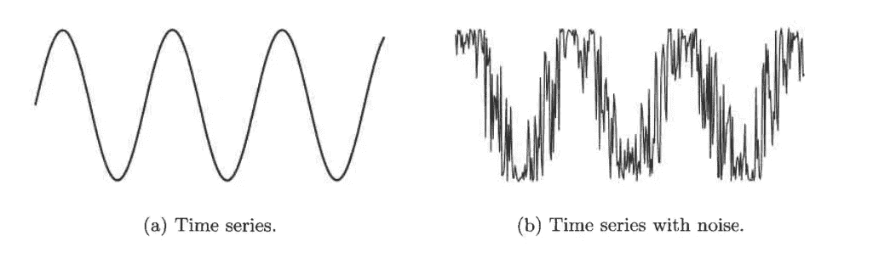

# 评估数据质量

> 原文：<https://towardsdatascience.com/assessing-the-quality-of-data-e5e996a1681b?source=collection_archive---------19----------------------->

## 对于数据挖掘和机器学习算法…

Video version of the story, if you are into that sort of thing :P

在 [*我之前的一篇帖子*](/types-of-data-sets-in-data-science-data-mining-machine-learning-eb47c80af7a) 中，我讲过数据科学中的 ***数据集类型，数据挖掘&机器学习及其一般特征*** 。这就要继续下去了，如果你还没有读过，就在这里读一下**以便对我在文章中要讲的话题和概念有一个恰当的把握。**

**数据挖掘应用通常应用于为另一个目的收集的数据，或者用于未来的未指定的应用。因此，数据挖掘通常不能利用“在源头解决质量问题”的显著优势**

**由于防止数据质量问题在这种情况下是不可行的，**数据挖掘**主要关注:**

1.  **数据质量问题的检测和纠正(通常称为 ***数据清理*** )以及**
2.  **使用可以容忍较差数据质量的算法。**

> **本文主要关注测量和数据收集问题。**

> **请容忍我的概念部分，我知道这可能有点无聊，但如果你有强大的基础，那么没有什么可以阻止你成为一名伟大的数据科学家或机器学习工程师。**

**假设数据是完美的并不是一个好主意。由于多种原因，如人为错误、测量设备的限制或有缺陷的数据收集过程，数据可能不正确。可能存在这样的数据集，其中一些值缺失，有时甚至一些数据对象不存在，或者存在冗余/重复的数据对象。我们现在将定义一些在数据科学中大量使用的术语。**

> ****什么是测量误差？****

**→指测量过程中产生的任何问题。换句话说，记录的数据值在某种程度上不同于真实值。测量值与真值之差称为 ***误差*** 。**

> ****什么是数据收集错误？****

**→它是指诸如省略数据对象或属性值，或包含不必要的数据对象等错误。**

> ****什么是噪音？****

**→噪声是测量误差的随机成分。它要么涉及值的*失真*，要么涉及不需要的对象的*添加。下图显示了一些随机噪声在*干扰*前后的时间序列。***

**

*术语噪声通常与具有*(空间相关)或*(时间相关)成分的数据相关。在这些情况下，使用来自*信号和图像处理*的技术来降低噪声。***

**但是，去除噪声是一项困难的任务，因此许多数据挖掘工作涉及使用 ***鲁棒算法*** ，即使在存在噪声的情况下也能产生可接受的结果。**

> ****什么是离群值？****

**→异常值是**

1.  **在某种意义上，具有不同于数据集中大多数其他数据对象的特征的数据对象，或者**
2.  **相对于该属性最常见(典型)的值而言非常规的属性值。**

**此外，区分噪声和异常值也很重要。离群值可以是合法的数据对象或值。因此，与噪声不同，离群值有时可能是令人感兴趣的。**

> ****数据集中是否存在缺失值。****

**数据对象的某些属性值缺失的情况并不少见。原因可能是:**

1.  **信息未被收集。**
2.  **有些属性不适用于所有对象。**

**无论如何，在数据分析期间应该处理缺失值。接下来，我们将讨论一些处理缺失数据的策略。**

*   ****消除数据对象或属性:**一个简单有效的策略是消除缺少值的对象。然而，如果一个数据集只有几个缺少值的对象，那么我们可以忽略它们。一个相关的策略是消除缺少值的属性。然而，这样做应该小心，因为被剔除的属性可能是对分析至关重要的属性。**
*   ****估计缺失值:**有些缺失数据是可以可靠估计的。如果属性本质上是连续的，那么可以使用该属性的平均值来代替缺失值。如果数据是分类的，那么最常出现的值可以替换缺失的值。**
*   ****在分析过程中忽略缺失值:**许多数据挖掘方法可以修改为忽略缺失值。例如，假设对象正在被聚类，并且需要计算数据对象对之间的相似性。如果一对对象中的一个或两个对象在某些属性上有缺失值，那么可以通过仅使用没有缺失值的属性来计算相似性。的确，相似性只是近似的，但是除非属性的总数很少或者缺失值的数量很大，否则这种不精确的程度可能并不重要。**
*   ****不一致值:**数据可以包含不一致值。考虑一个地址字段，其中列出了邮政编码和城市，但是指定的邮政编码区域不包含在该城市中。可能是输入该信息的个人调换了两位数字，或者可能是从手写表格扫描该信息时误读了一位数字。有些类型的不一致很容易发现。例如，一个人的身高不应该是负数。不一致的纠正需要额外的或冗余的信息。**
*   ****重复数据:**数据集可以包括彼此重复或几乎重复的数据对象。为了检测和消除这种重复，必须解决两个主要问题。首先，如果有两个对象实际上表示一个对象，那么相应属性的值可能不同，这些不一致的值必须得到解决。第二，需要注意避免意外地组合相似但不重复的数据对象，例如两个不同的同名人。**

**到目前为止，我们已经讨论了与数据质量相关的问题。现在，我们将借助 ***【精度、偏差和准确度】*** 来了解统计检查数据质量的方法。**

**测量过程和结果数据的质量由**精度和*偏差来衡量。*****

> ****什么是精度？****

**→重复测量(相同数量)的接近程度。通常用一组值的标准差来衡量。**

> ****什么是偏见？****

**→测量值与被测数量的系统变化。它是通过取一组值的平均值和被测量的已知值之间的差来测量的。只能对那些测量量已知的物体进行测定。**

**例如，我们有一个质量为 1g 的标准实验室砝码，想要评估我们新实验室秤的精度和偏差。我们称质量五次，得到以下五个值:{1.015，0.990，1.013，1 .001，0.986}。这些值的平均值为 1.001，因此偏差为 0.001。以标准差衡量，精度为 0.013。**

**通常使用更一般的术语“精确度”来表示数据中测量误差的程度。**

> ****什么是准确性？****

**→测量值与被测量的真实值的接近程度。**

**精度取决于精度和偏差，但既然是一般概念，就这两个量而言，精度并没有具体的公式。**

**[我正在免费赠送一本关于一致性的电子书。在这里获得你的免费电子书。](https://colossal-hustler-1290.ck.page/c717067eb6)**

**这篇关于数据质量的文章到此结束。**

**如果你喜欢阅读这样的故事，那么你应该 [**在你的收件箱**](https://tarun-gupta.medium.com/subscribe) 中获取我的帖子，如果你想支持我成为一名作家，考虑[注册成为一名媒体成员](https://tarun-gupta.medium.com/membership)。每月 5 美元，你可以无限制地阅读媒体上的故事。如果你注册使用我的链接，我会赚一小笔佣金，不需要你额外付费。**

** [## 加入我的推荐链接-塔伦古普塔

### 作为一个媒体会员，你的会员费的一部分会给你阅读的作家，你可以完全接触到每一个故事…

tarun-gupta.medium.com](https://tarun-gupta.medium.com/membership) 

这个帖子的后续是[这里](/measures-of-proximity-in-data-mining-machine-learning-e9baaed1aafb)。我的文章索引在这里:

 [## 标记故事列表的快速链接—感谢您的访问

### 我也有一份以快节奏出版为目标的出版物。读书成为作家。

tarun-gupta.medium.com](https://tarun-gupta.medium.com/thank-you-for-visiting-my-profile-9f708062c75e)**