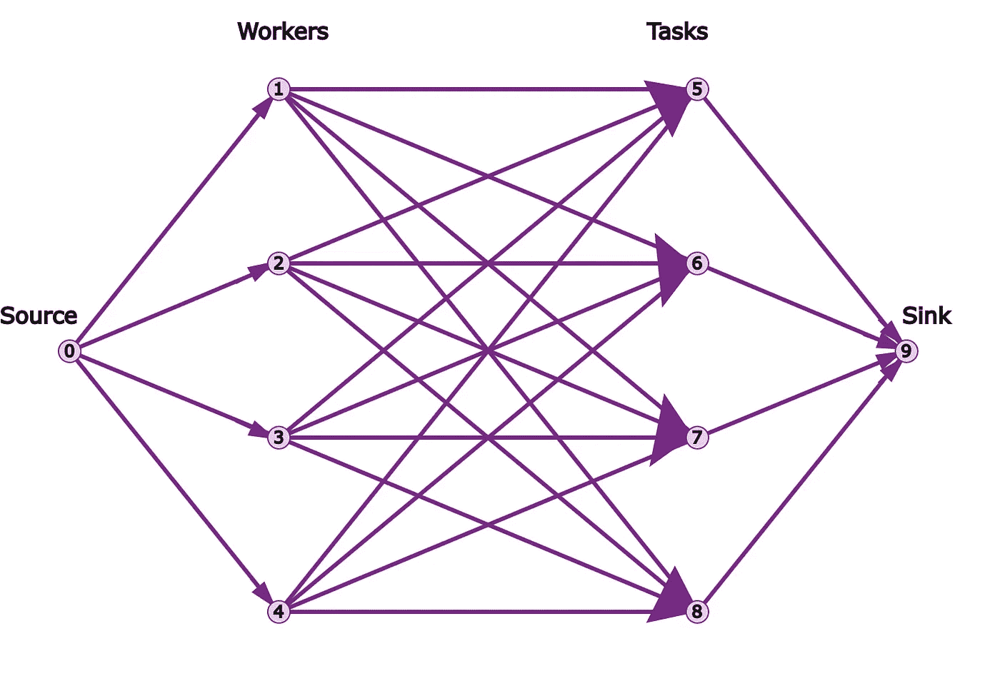
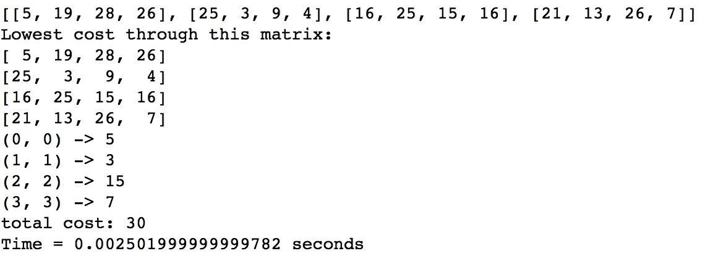

# 用线性规划法给优步司机分配最快的皮卡

> 原文：<https://towardsdatascience.com/assigning-fastest-pick-ups-to-uber-drivers-with-linear-programming-8f8bd3c44c9a?source=collection_archive---------11----------------------->

对于我在最优化方面的最后一个项目，我的教授指导我根据我们上个月学到的东西来优化任何东西。我需要定义自己的问题，用 Python 实现解决方案，并评估结果。(为了这篇文章的简洁，我省略了我的代码，我会尽快张贴我的 Jupyter 笔记本！)

我摆弄过图形化的线性程序来直观地解决资源的最优分配，我认为这是一种重新表述通常的代数问题的很酷的方式。我还想探索优化如何在日常叙事中发挥作用。因此，作为一个住在洛杉矶、忙碌而又不会开车的大学生，很明显，优化我最讨厌的一件事:等我的优步。

在设置问题之前，以下是一些重要的准备工作:

# 图表

一个图 *G = (V，E)* 由一组**顶点**(或**节点** ) *V* 和**边** *E* 组成。通常，我们将节点表示为所考虑的对象，而将边表示为对象之间的关系。当一个节点与另一个节点有边时，我们说这两个节点是连通的。

在**有向图中**由一组由边连接的顶点组成，其中边有一个与之相关的方向。在有向图中，边 *(u，v)* 不同于 *(v，u)* 。

A directed graph (source:Wikipedia)

## 完全二部图

我们感兴趣的一种特殊的图是**完全二部图**。如果我们能把节点分成两个不相交的集合 *V1* 和 *V2* ，使得 *E* 中的每条边都连接每个 *V1* 顶点和每个 *V2* 顶点，那么这个图就是完全的二部图。

A complete bipartite graph with V1 as the set of red nodes, and V2 as the set of blue nodes (source: Wikipedia)

# 线性规划

线性规划是一般约束优化问题的特例。它的目标函数是线性的，可行点集由一组线性约束确定，线性约束可以是线性方程和/或不等式。一旦我们像这样将特定问题公式化，我们就可以通过一系列方法来求解方程组，例如使用行运算(像在高中重复求解联立方程)和 [**单纯形法**](https://en.wikipedia.org/wiki/Simplex_algorithm) (黄金标准算法，连续考虑似乎合理的解决方案，同时确保我们在每次迭代中总是更接近最优解)。

## 最大流最小割问题

假设 *G = (V，E)* 是一个有向图。我们可以将**最大流**问题描述为从**源节点*s*向**汇节点**t*t*运送尽可能多的材料。材料可以通过连接节点的边从一个节点流到另一个节点。连接 *i* 到 *j* 的边具有一些**容量** *Cij，*可以从节点 *i* 推到*j*的最大流量，同时最大化从 a *s* 到 *t* ( *s！= t* )，我们还想在每个中间节点保持流入流出相等。**

一个 ***流 Fvw*** 是边 *v* 和 *w* 的权重分配。边的流量必须在其容量范围内，因为节点应该只能传输小于或等于其容量的材料。流量也必须是非负的。

Linear Program Formulation for Max Cut Min Flow

另一方面，**最小割**问题旨在以最小的破坏将节点分成两组。我们想定义一个 *s-t 割*作为顶点到两个集合 A 和 B 的划分，其中 A 包含源节点 s，B 包含汇节点 *t* 。我们希望最小化成本，即从 A 中的一个顶点开始到 b 中的一个顶点结束的所有边的权重之和。我们可以引入指示变量，然后制定一个线性规划。

[**最大流最小割定理**](https://en.wikipedia.org/wiki/Max-flow_min-cut_theorem) 陈述了同一问题的最大流和最小割公式的解是等价的。对于这个项目，我们将考虑最大流的线性规划，因为它更直观。

## 指派问题

上述问题的一个修改版本是**分配 *n* 个工作给 *m* 个机器/工人**的任务。如果作业 *j* 被分配给工人 *i* 则设 *Xij* = 1，如果作业 *j* 未被分配给工人 *i* 则为 0。每个人只能做一项工作，一项工作只能由一个人做，各有各的费用。我们希望利用我们所有的资源，最大限度地降低完成所有工作的成本。

Linear Program Formulation for the Assignment Problem

当在图中表示这个线性规划时(见下文)，我们可以通过在图中添加汇节点和源节点来匹配最大流最小割问题，这些节点表示网络中完成的作业总数。这将流量守恒表示为来源的总资源，即工人数量需要与总产出(即工作总数)相匹配。

# 将两者结合起来，提出问题

通过构建两组节点，一组用于工人，一组用于任务，我们得到了下面的完整二分图。当我们假设每个工人都有资格完成任何任务时，每个工人都与每个任务相关联。然后，这些边缘将被赋予某个值，该值表示工人完成任务的成本。

source: Google OR tools

让我们考虑一个网络，其中的节点是优步应用程序用户，特别是附近的司机和骑手，并与上述分配问题进行类比。

我们可以将**优步司机**(=工人)到附近**皮卡**(=工作)的分配公式化为最小化**等待时间**(=目标函数)，该最小化是从司机到皮卡多远(以分钟计)得出的(=成本)。我们假设是 UberX(或者优步·布莱克？UberLXL？)所以每个车手一次只能完成一次接送，骑手只能接送一次(=线性约束)。

换句话说，**指定优步最快的接送=最小化附近所有可用司机和乘客的等待时间。**这是把问题改写成线性规划的直觉，这个项目的目标是探索解决规划的不同方法。

对于这个问题，我们专注于解决司机和皮卡数量相等的情况，以简化问题并符合所用 Python 包的限制。

将问题公式化为上面的标准线性规划，我们使用 **Munkres 的匈牙利算法**和 Google OR Tools 的**线性和分配**和**最小成本流**来探索三种方法。然后，我们针对不同规模的网络，即不同数量的司机和皮卡，比较该方法的运行时间。

# **实施**

首先，为了说明问题，我们从一个只涉及该地区四个驾驶员和四个皮卡的问题开始。

对于这个问题，我们假设等待时间在 1 到 30 分钟之间整数变化。实际上，乘客等待优步到达超过 10 分钟的情况非常罕见。我们应该记住，等待时间会因地区、司机供应和接送需求而波动，因此可能不是“随机”的。

基于这些假设，我们生成随机数据来填充成本矩阵。然后，我们将驾驶员编号为 1–4，将骑手编号为 5–8(或者，更一般地，将顶点的前半部分作为驾驶员，后半部分作为骑手)，以构建开始节点和结束节点的矩阵或列表，作为实现的输入。

# 芒克雷斯匈牙利算法

Munkres 的匈牙利算法是一种强力算法，它包括生成成本矩阵的所有独立集，计算每次分配的总成本，以及搜索所有分配以找到最小和独立集。这个算法有 *n！*可能的赋值集合，因此具有指数级的运行时复杂度。

Python 的 **munkres** 包实现了一个由 James Munkres 修改的算法，具有多项式运行时复杂性，这里描述的[为](http://software.clapper.org/munkres/)。

One iteration to solve for a feasible assignment

该包将解决方案作为一对有序的驾驶员集合和驾驶员集合(注意，该包将它们索引为 0–3 表示 1–4，0–3 表示 5–8。关于这个项目的编码部分，最困难的事情是重塑所有我曾经比较的函数的输入和输出！).它打印出成本矩阵、总等待时间和运行时间。

使用 Python 中的 **networkx** 包，我写了一些代码，以有向图的形式说明解决方案。这里，0 节点表示源节点，9 节点表示汇节点，节点 1-4 表示优步司机，而节点 5-8 表示乘客。驾驶员和乘客之间的边的数字属性说明了驾驶员和乘客之间的等待时间。最佳分配由连接驾驶员节点和骑手节点的绿线表示。

Illustration for the solution

# 线性和分配

[**Google 的 OR 工具****lineasumassignment**](https://developers.google.com/optimization/assignment/simple_assignment)在给定的图中，用整数边权重集寻找最小成本的完美分配。该算法将指派问题转化为最小费用流问题，并采用推-重标法求解。

运行时间为 *O(n*m*log(nC))* 其中 *n* 为节点数， *m* 为边数， *C* 为边代价的最大值。原则上，它可能比上面的 munkres 的匈牙利算法更糟糕，但是我们不知道任何一类问题会发生这种情况。

解决问题后，程序包会打印以下赋值:

# 最小成本流

[**Google 的 OR 工具 SimpleMinCostFlow**](https://developers.google.com/optimization/assignment/assignment_min_cost_flow)**也提供了另一个求解器实现，可以处理比 LinearSumAssignment 更大的一类问题。LinearSumAssignment 是专门为解决分配问题而实现的。**

**上面我们讨论了我们的特殊问题和最小成本流之间的相似之处。**

********

**我们注意到所有三种方法产生相同的赋值和目标函数值。但是，这并不能保证。假设每种方法都以不同的方式实现，那么在具有相同目标函数值的方法之间可能存在不同的赋值。例如，在这种情况下，可能有两个或更多的等待时间组合，总计 30 个，每个方法可以选择这些组合中的任何一个。**

# **时间比较**

**为了比较每种方法的运行时间，我们将比较当我们增加工作人员和任务的数量时，每种方法如何伸缩。我们将跳出优步取件的例子，考虑这样一种情况，我们有 250-5000 个任务，以 250 个增量分配给相同数量的工人。在每次迭代中，我们将为每个任务的成本生成随机数据，然后求解最优解。然后，我们将比较给定相同数据的每个方法的运行时间。**

**注意横轴表示*第 n 个*区间，所以*第 n 个*勾号表示网络中的 *n*250* 工作人员节点和 *n*250* 任务节点。**

****

**Runtime in seconds vs the nth interval**

# **结果**

*   **从我们的图中可以明显看出，最小成本求解器是最快的，紧随其后的是线性和分配求解器。虽然我们可以看到最小成本求解器的伸缩性更好，因为在更高的间隔，线性求和的运行时间增加更多。**
*   **有趣的是，Google OR tools 提到线性和赋值求解器在处理一般赋值问题时更有效——在未来的工作中，研究这个项目的赋值问题是如何引起上述现象的可能会有所帮助。**
*   **这一比较证实了我所做的研究，即 Munkres 的算法效率最低，因为它的伸缩性比其他两个算法差得多。**

# **其他考虑**

*   ****分配的非唯一性**:在查看了不同节点数的最优解后，我们注意到，尽管实现了相同的最小成本值，但从一种方法到另一种方法的分配可能不同。由于问题的过度约束以及包的不同实现，这可能是意料之中的。**
*   ****数据的随机性**:根据数据的结构，对于相同的数据，一种方法可能比另一种方法更难解决问题。在比较运行时间时，一种更可靠的方法是取几代随机数据的平均值。

    另一个有趣的观察是，当成本往往有许多重复时，最优值往往有更多的重复解。例如，当我生成 100 个节点，每个节点的成本在 1 到 10 之间时，最小值几乎总是 100，因为节点在它的 100 条边中的一条边上的成本很可能总是 1。

    更现实的方法是使用真实世界的数据，将问题公式化到更窄的范围。然后，我们可以尝试回答为什么不同的方法给出不同的最优解，以及如何给出不同的最优解。**
*   ****任务和工人数量不等**:这个项目解决了优步司机数量和皮卡数量不匹配的情况，这不是很真实的描述。通常情况下，司机无法满足更多的乘客，这可能导致价格飙升的机会。在这种情况下，我们将来自源节点的电源修改为驱动器的数量，并且我们将有一些节点未被访问。**

# **结束语**

**总结一下，我们所做的如下:**

*   **构造了一个线性规划来最小化指派优步司机接载乘客时的总等待时间**
*   **用图表示我们的优化，并转化为最大割最小流问题，进而转化为分配问题**
*   **比较了解决指派问题的三种不同方法**

**如上所述，该项目有很大的改进空间，因为它只是对分配问题的可能方法的简要调查。在将这种方法应用于现实生活数据之前，我选择的特定应用程序有许多更微妙的边缘情况需要探索。**

**我在这门课上学到的最酷的事情是解构一个抽象的问题，并通过创造性地应用线性代数和分析中的结果来解决它们。过去四年的数学课一直致力于建立我对这些基本原则的理解，所以这门课使我能够超越它们。这个项目让我明白了如何从数学家的角度来看待问题。这门课是我在加州大学洛杉矶分校最愉快的课程之一——它让我兴奋，因为我能够应用数学高效而严谨地解决有趣的问题。**

**附言:谢谢 Sylvester 教授的大手笔，让我在整个季度都保持好奇:)我可以每天一整天都优化任何东西。**

# **参考**

*   **[https://www.joshmeetscomputer.com/bipartite-projected/](https://www.joshmeetscomputer.com/bipartite-projected/)**
*   **[http://csclab.murraystate.edu/~bob.pilgrim/445/munkres.html](http://csclab.murraystate.edu/~bob.pilgrim/445/munkres.html)**
*   **http://software.clapper.org/munkres/**
*   **[https://developers . Google . com/optimization/assignment/simple _ assignment](https://developers.google.com/optimization/assignment/simple_assignment)**
*   **[https://developers . Google . com/optimization/assignment/assignment _ min _ cost _ flow](https://developers.google.com/optimization/assignment/assignment_min_cost_flow)**