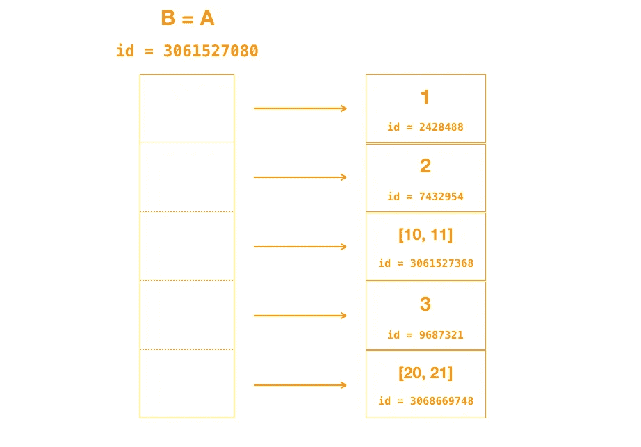
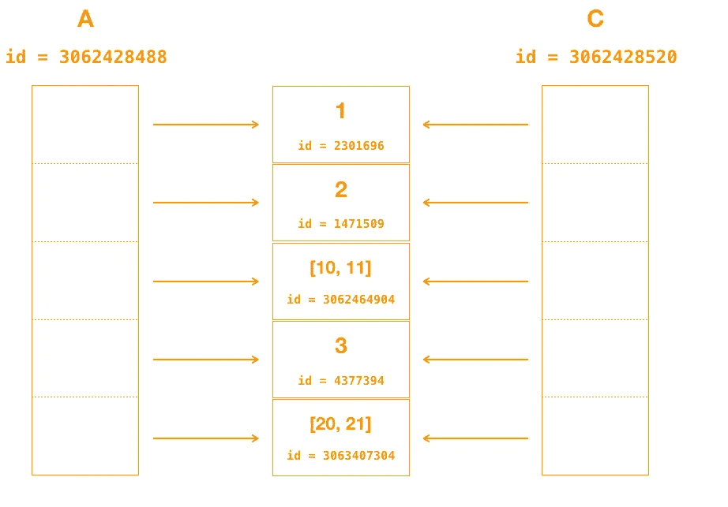
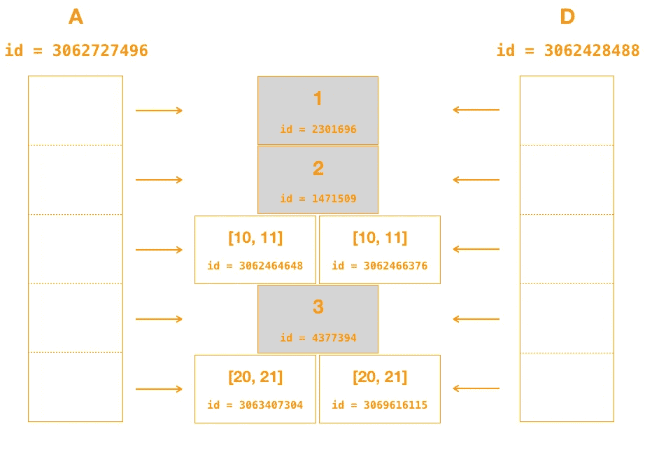
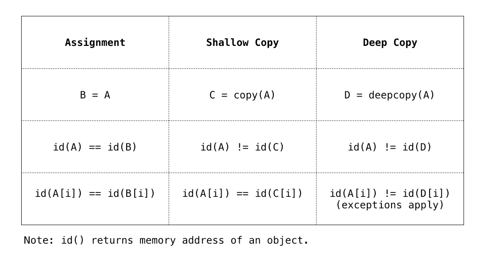

# 赋值，浅抄，还是深抄？

> 原文：<https://towardsdatascience.com/assignment-shallow-or-deep-a-story-about-pythons-memory-management-b8fad87bfa6c?source=collection_archive---------11----------------------->

## 一个关于 Python 内存管理的故事

```
from copy import copy, deepcopy
```

这篇文章的目的是描述当我们

*   分配一个变量`B = A`，
*   浅层复制它`C = copy(A)`，或者
*   深抄它`D = deepcopy(A)`。

我首先描述一下 Python 中的内存管理和优化。在奠定基础之后，我解释了赋值语句、浅拷贝和深拷贝之间的区别。然后，我在一个表格中总结了这种差异。

*如果你更喜欢看视频而不是看文章，你可以在这里* *找到补充视频* [*。*](https://youtu.be/KnirnBi13CE)

## **Python 中的内存管理**

*int* ， *float* ， *list* ， *dict* ，*类实例*，…它们都是 Python 中的对象。在 CPython 实现中，内置函数`id()`返回对象的内存地址—

```
>>> L1 = [1, 2, 3]>>> id(L1)
3061530120
```

如果我们创建一个新的变量`L2`，它引用一个与`L1`具有相同值的对象，`L2`将有一个新的内存地址—

```
>>> L2 = [1, 2, 3]>>> id(L2)
3061527304
```

每次创建一个新对象，它都会有一个新的内存地址。除非它是—

1.  一根很短的绳子
2.  [-5，256]范围内的整数
3.  一个空的不可变容器(例如元组)

让我们看一个整数对象的例子。`*x*`和`*y*`指的是同一个值 10。虽然上例中的`L1`和`L2`有两个不同的内存地址，但是`*x*` 和`*y*` 共享相同的内存地址

```
>>> x = 10>>> y = 10>>> id(x)
2301840>>> id(y)
2301840
```

这是因为，在这三个例外中，Python 通过让第二个变量引用内存中的同一个对象来优化内存，有人称之为“共享对象”。

记住共享对象的概念，因为我们稍后创建对象的*深拷贝*时会用到它。

## 变量赋值

在 [Python 文档](https://docs.python.org/3/library/copy.html)中说“Python 中的赋值语句不复制对象，它们在目标和对象之间创建绑定。”这意味着当我们通过赋值来创建一个变量时，新的变量与原始变量引用同一个对象

```
>>> A = [1, 2, [10, 11], 3, [20, 21]]>>> B = A>>> id(A)
3061527080>>> id(B)
3061527080
```

因为新变量`B`和原始变量`A`共享同一个对象(即同一个列表)，所以它们也包含相同的元素—

```
>>> id(A[2])
3061527368>>> id(B[2])
3061527368
```

如下图所示，`A`和`B`共享同一个`id`，即在内存中引用同一个对象。它们也包含相同的元素。



## 浅拷贝

当我们通过*浅拷贝*创建一个变量时，新的变量指向一个新的对象——

```
>>> A = [1, 2, [10, 11], 3, [20, 21]]>>> C = copy(A)>>> id(A)
3062428488>>> id(C)
3062428520
```

虽然`A`和`C`指的是两个不同的对象(即两个不同内存地址的列表)，但两个列表中的元素指的是相同的对象—

```
>>> id(A[0])
2301696>>> id(C[0])
2301696>>> id(A[2])
3062464904>>> id(C[2])
3062464904
```

下图说明了`A`中的元素如何引用与`C`中的元素相同的对象。



## 深层拷贝

类似于浅层拷贝，当我们通过*深层拷贝*创建一个变量时，新的变量指向一个新的对象——

```
>>> A = [1, 2, [10, 11], 3, [20, 21]]>>> D = deepcopy(A)>>> id(A)
3062727496>>> id(D)
3062428488
```

如 [Python 文档](https://docs.python.org/3/library/copy.html)所述——

> *浅拷贝和深拷贝的区别只与复合对象(包含其他对象的对象，如列表或类实例)相关:*
> 
> *-一个*浅拷贝*构造一个新的复合对象，然后(尽可能地)将*引用*插入到原始对象中。*
> 
> *-一个*深度拷贝*构造一个新的复合对象，然后递归地将*拷贝*插入到原始对象中。*

与浅层拷贝不同，两个列表中的元素现在引用不同的对象——

```
>>> id(A[0])
2301696>>> id(D[0])
2301696>>> id(A[2])
3062464648>>> id(D[2])
3062466376
```

但是为什么`A[0]`和`D[0]`共享同一个对象(即拥有相同的内存地址)？因为它们都引用整数，这是我们在开始提到的内存优化的三个例外之一。

下图显示`A`和`D`引用内存中两个不同的列表，由于内存优化的原因`A`中的元素引用的对象不同于`D`中的元素，整数元素除外。



## 摘要

如果这篇文章有什么值得一提的地方，那一定是下表。变量赋值不复制对象，所以`A`和`B`有相同的内存地址，包含相同的元素。浅层复制为`C`创建了一个新对象，但是`C`中的元素仍然引用与`A`中的元素相同的对象。深度复制还为`D`创建了一个新对象，并且`D`中的元素引用的对象与`A`中的元素不同，有三种类型的异常。



这篇文章的灵感来自于…

*   [副本上的 Python 文档](https://docs.python.org/3/library/copy.html)
*   [了解 Python 变量和内存管理](http://foobarnbaz.com/2012/07/08/understanding-python-variables/)