# 关联规则分析在广告优化中的应用

> 原文：<https://towardsdatascience.com/association-rules-analysis-applied-in-advertising-optimization-d913845eea3e?source=collection_archive---------23----------------------->

# 介绍

在客户获取领域，优化是成功的关键，目标是最小化每次转换的成本(CPA)并最大化转换率和广告支出回报(ROAS)。您可能已经知道，在客户之旅中，有许多因素会影响客户的看法以及他们是否采取行动的决定。仅举几个例子:渠道、广告文案、登陆页面、目标定位(人口统计、兴趣、关键词、..)，等等。

许多营销团队采用的一种常见方法是实验。这种方法有许多优点，例如确保结果在统计上是显著的，学习可以在团队中共享，……但是，A/B 测试和多变量测试可能需要大量的流量，因此非常耗时，特别是在转换率相对较小的情况下([查看此处的 A/B 测试计算器](https://www.optimizely.com/sample-size-calculator/))

在本文中，我想介绍另一种方法，它使用称为关联规则的数据挖掘技术来识别客户旅程中的高绩效元素，并讨论其在优化广告绩效方面的利弊。

文章包括以下几个部分:

1、资料准备

2、探索性分析，给出初始假设

3、模型构建:关联规则和机器学习

4、归因中的潜在应用

5、利弊

你可以[从这个链接下载我用 Python 写的分析。](https://github.com/Fumanguyen/machine-learning-advertising)

# 数据准备

然而在现实中，营销团队可以构建一个单一的客户视图来全面了解整个客户旅程，几乎不可能找到一个包含所有影响绩效的元素的公共数据集。然而，我从 ka ggle(【https://www.kaggle.com/fayomi/advertising】)找到了一个接近我所需要的数据集。从那里，我将为我们的目的操纵数据。

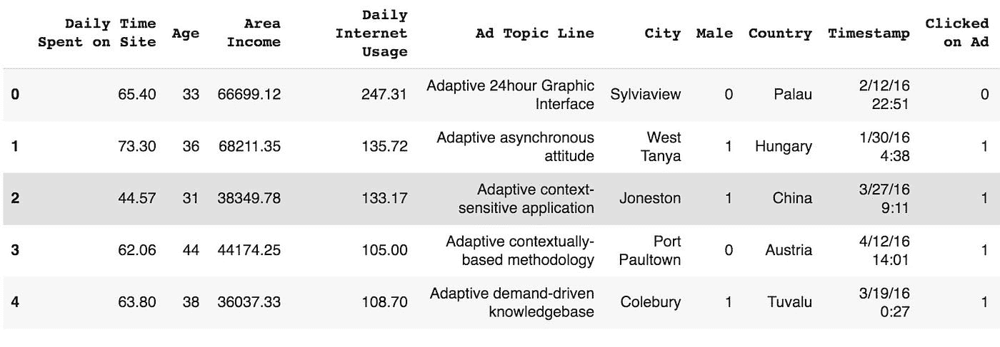

原始数据集包含 1000 个观测值。数据中的每一行代表一个看到该广告的互联网用户。标签数据是“点击了广告”,它指示互联网用户是否点击了广告。这对于我的分析来说还是不合适的。下面是我处理数据的几个步骤:

*   假设这个数据集中的每个数据点都表示通过我们的广告登陆我们的登录页面的访问者。我将为每一行添加一个访问者 ID。
*   我将随机创建 2 个以上的广告属性:登陆页面和广告文案。因为我们只有 1000 个数据点，所以我假设我们只使用 4 个登录页面和 3 个广告副本。
*   点击广告不是我要找的转换。我将删除此标签，并创建一个新标签来指示该访问者是否在登录页面上采取了操作。我假设转化率在 20%左右，所以我随机创建这个数据，并确保转化率水平保持不变。
*   删除不适当的属性，如“点击广告”、“广告主题行”

之后，我有了新的数据集:

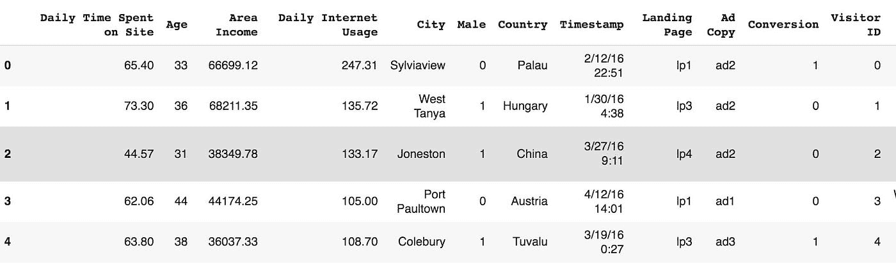

快速图表显示，国家变量有 237 个值，但我们只有 1000 个观察值。因此，我将添加 region 变量作为地理信息的指示，而不是使用 country 变量。

这是最终数据:

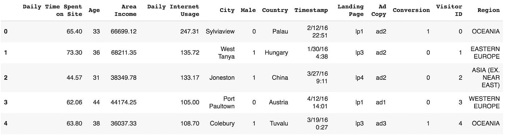

# 探索性数据分析

数据汇总:

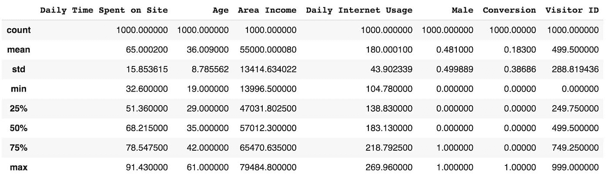

平均转化率为 18.3%。这意味着虚拟分类器可以达到 81.7%的准确率。使用配对图的快速可视化显示，在特征和标签之间似乎没有模式。

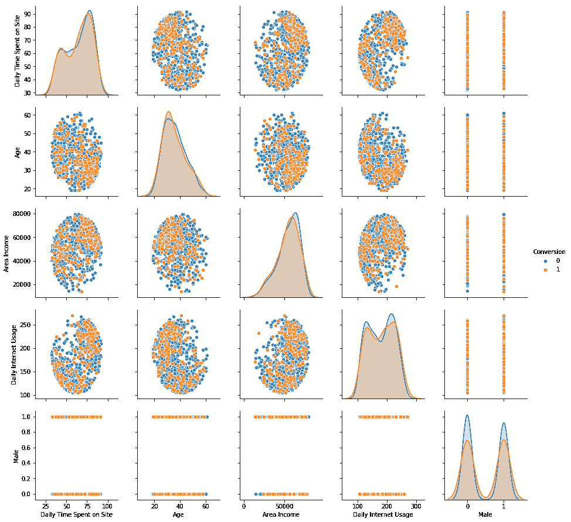

更多可视化效果，显示每个特征与标签之间的相关性:

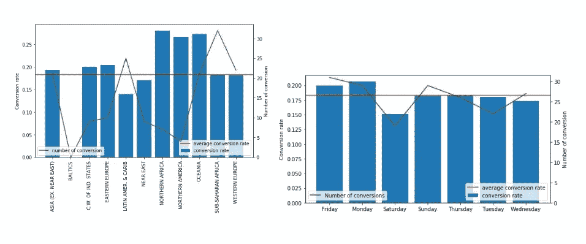

Compare the avg. conversion rate amongst regions (left) and weekdays (right)

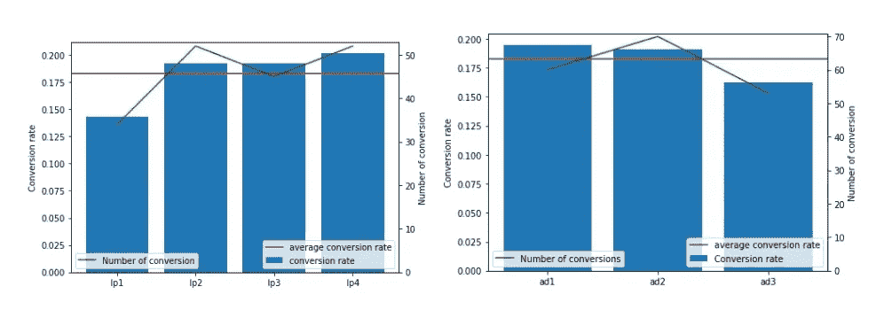

Compare the avg. conversion rate amongst landing pages (left) and ad copies (right)

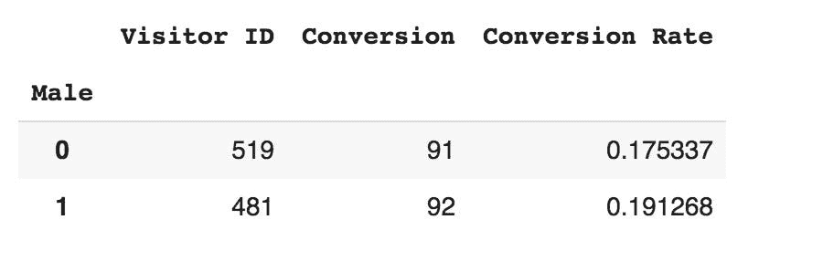

Male visitors have a higher average conversion rate than female

连续的图表再次显示了一个不清楚的模式:

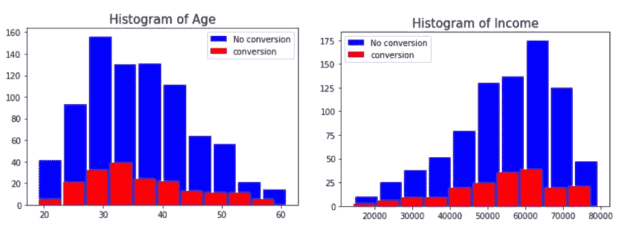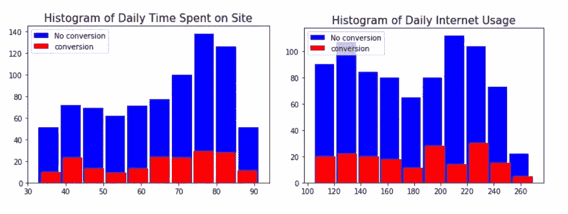

总结一下:

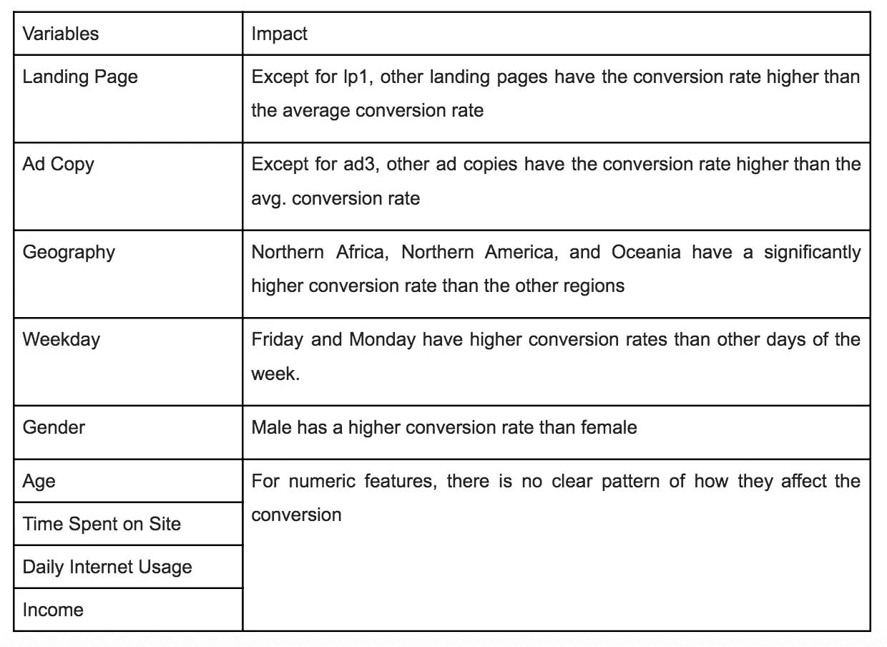

# 关联规则

关联规则是一种基于规则的机器学习方法，用于发现变量之间有趣的关系。在购物篮分析中被广泛使用，有一个经典的例子是{尿布}--> {啤酒}，意思是如果一个顾客买了尿布，他/她就更有可能买啤酒。我们可以使用这种方法来确定与“转化”有积极关系的元素(广告文案、登录页、目标定位)。《走向数据科学》有一篇很棒的文章解释了关联规则的概念。

数据预处理包括以下步骤:

*   为地区、工作日、广告文案、登录页面创建虚拟变量
*   将连续特征转化为名义特征:年龄、收入、上网时间和互联网使用情况

下面是模型构建结果:

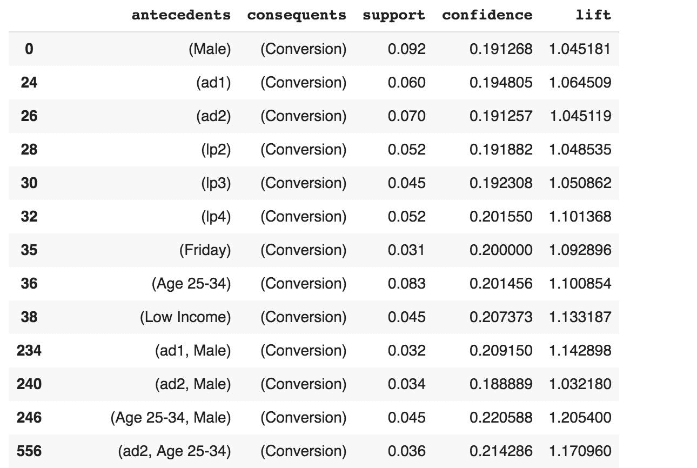

快速解释{A} → {B}的支持、信心和提升的指示

*   支持度:有多少百分比的数据集既有 A(前件)又有 B(后件)。
*   信心:如果 A 发生了，B 发生的可能性有多大
*   Lift:如果 A 发生了，B 发生的几率会增加还是减少，增加多少？

我们关注“提升”一栏，这个数字显示了如果一个访问者有前情，他/她更有可能接受“后情”的百分比。

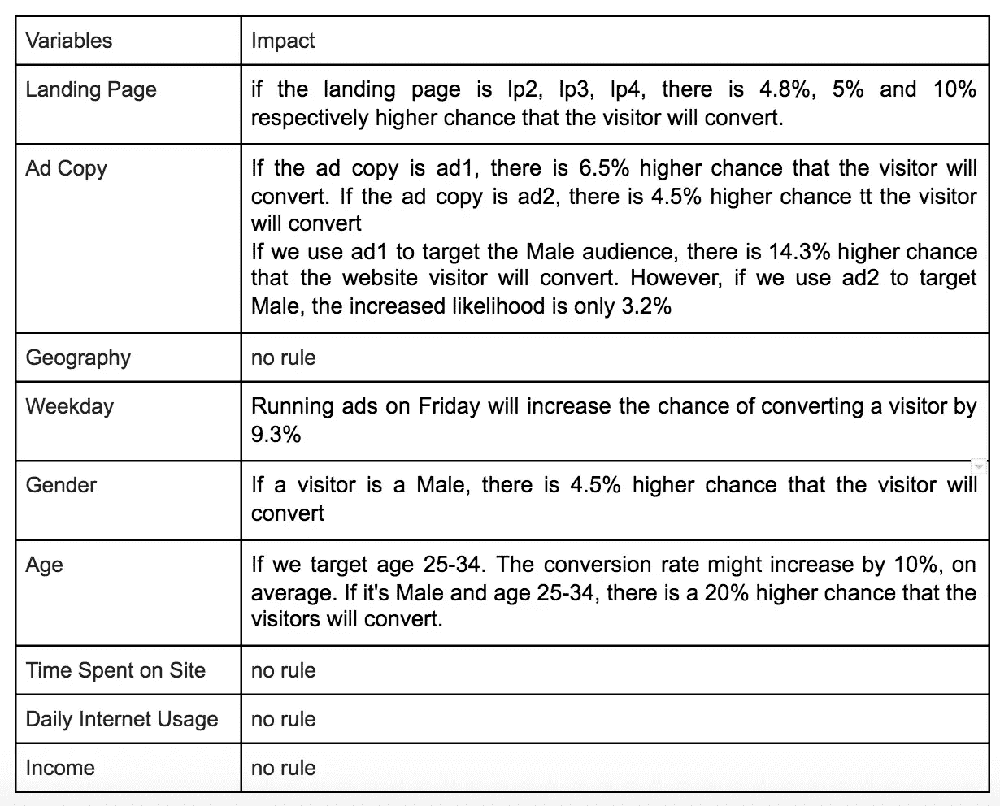

Interpretation of the result of the association rules analysis

一般来说，关联规则产生的结果与数据可视化非常相似，但仍有根本性的改进:

*   关联规则确保 A 和 B 发生的百分比是显著的。例如，您可以通过 min_support 参数设置 A 和 B 发生的最小百分比
*   关联规则提供了 A 对 B 的可能性的平均影响
*   一个广告中可以有多个元素，这可以为营销团队提供更多关于广告过程的信息。

# 在归因理解中的潜在应用

归因模型也可以是关联规则的潜在应用。您可能已经知道，客户之旅变得更加多点接触，通常，客户在采取行动之前会与多个渠道进行互动。例如，访问者可以点击显示广告来访问我们的登录页面，但直到一周后他/她通过付费搜索再次访问时才转化。因此，收购团队面临的一个常见挑战是了解漏斗顶部和中部渠道的真正价值。这就是关联规则可以发挥作用的地方。

正如你们中的许多人可能知道的，有许多归因模型可用:第一次接触、最后一次接触、基于位置、线性、时间衰减等等([在这里阅读归因模型](https://medium.com/analytics-for-humans/an-in-depth-look-at-attribution-modeling-in-digital-marketing-2ed0170c6f3b))。这些模型是基于时间的，并且总是对渠道在客户旅程中的顺序有一个特定的假设，从而形成一个“固定”的值。例如，基于位置的信道假设第一次触摸和最后一次触摸信道都将获得 40%的信用，而剩余的 20%将在中间的信道之间平均分配。但在现实中，可能有成千上万个客户旅程场景，对于每个客户，一个渠道可能有不同的价值。

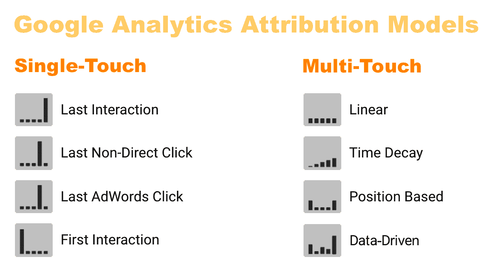

关联规则可以应用于理解在使访问者转换时渠道的归属值。我们只是想知道哪个渠道增加了某人成为转化的概率，说明那个渠道的“真实”价值。例如，GDN 可能不会带来直接的转变，但如果一个游客经过 GDN，他成为我们的领导者的几率可能会高于平均水平。你可以深入挖掘 GDN 的交通来了解原因。在这种情况下，你可能想在 GDN 上分配一些资金，即使它在你的报告中没有显示足够的转化率。我们可以期待像{ GDN }→{转换}或{付费搜索}→{转换}这样的规则

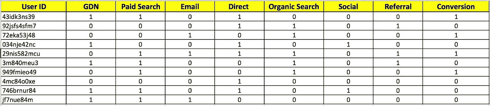

Sample dataset prepared for association rules analysis in attribution

# 使用关联规则的利与弊

优点:

关联规则是从你的广告数据集中获得有意义的见解的一种快速简单的方法。它可以让您快速浏览元素之间的关系，并为进一步的研究(如机器学习算法)和实验提供基础。

关联规则不能确保统计显著性。相反，它表示平均效果，您可以使用关联规则分析作为输入来产生测试的想法。您可以比较两组访问者之间的表现:一个对照组不经过 GDN，而治疗组经过 GDN，目的是提高转化率。

缺点:

关联规则学习需要名义变量。连续变量需要转换成名义变量，它可能会丢失重要信息。如果您希望在分析中保持连续变量，则应考虑其他选项，如逻辑回归。

***关于作者:*** *我是加州大学戴维斯分校的 MBA 毕业生。我对营销分析、建模、机器学习和数据科学充满热情。如果您有任何意见、反馈或问题，请随时通过 maitpnguyen296@gmail.com 联系我或通过 LinkedIn***联系我。快乐造型！**