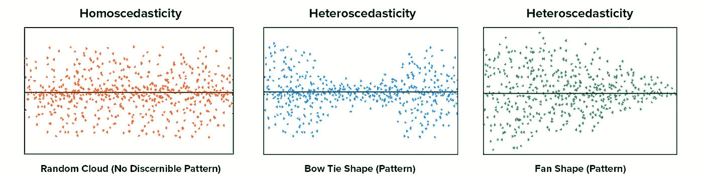

# 线性回归算法的假设

> 原文：<https://towardsdatascience.com/assumptions-of-linear-regression-algorithm-ed9ea32224e1?source=collection_archive---------1----------------------->

## 这些假设在构建线性回归模型时得到满足，从而为给定的数据集生成最佳拟合模型。

# **线性回归—简介**

线性回归是一种基于监督学习的机器学习算法。它执行回归任务来计算回归系数。回归模型是基于独立变量的目标预测。

线性回归执行的任务是根据给定的自变量(x)预测因变量值(y)。所以这种回归技术找出了 x(输入)和 y(输出)之间的线性关系。因此它被称为线性回归。一元线性回归的线性方程如下所示

Equation of a Simple Linear Regression

y-输出/目标/因变量；x-输入/特征/独立变量和θ1、θ2 分别是最佳拟合线的截距和斜率，也称为回归系数。

简单线性回归的例子:

让我们考虑一个例子，在这个例子中，给定一个人在某个特定领域的工作经验，我们预测他/她的工资。数据集如下所示

这里 x 是经验年限(投入/自变量)，y 是提取的工资(产出/因变量)。

在将数据集分成训练和测试之后，我们已经对数据拟合了简单的线性回归模型。用于将数据拟合到线性回归算法的 python 代码如下所示

绿点代表数据集的分布，红线是最佳拟合线，可以用θ1 = 26780.09 和θ2 = 9312.57 绘制。

注意-θ1 是直线的截距，θ2 是直线的斜率。最佳拟合线是最适合可用于预测的数据的线。

## **用于解释线性回归假设的数据集描述**

所使用的数据集是广告数据集。该数据集包含关于花费在广告上的钱及其产生的销售额的信息。钱花在了电视、广播和报纸广告上。它有 3 个特点，即电视，广播和报纸和 1 个目标销售。

First 5 rows of the data set

# **线性回归的假设**

线性回归算法有 5 个基本假设:

1.  **特性和目标之间的线性关系:**

根据这一假设，在特征和目标之间存在线性关系。线性回归只捕捉线性关系。这可以通过绘制特征和目标之间的散点图来验证。

电视与销售的第一个散点图告诉我们，随着电视广告投资的增加，销售也线性增加，第二个散点图是广播与销售的散点图，也显示了它们之间的部分线性关系，尽管不是完全线性的。

**2。要素之间很少或没有多重共线性:**

多重共线性是独立变量之间高度相关或关联的状态。因此，如果数据中存在干扰，就会削弱回归模型的统计能力。配对图和热图(相关矩阵)可用于识别高度相关的特征。

Pair plots of the features

上面的配对图显示特征之间没有显著的关系。

Heat Map(Correlation Matrix)

该热图为我们提供了每个要素之间的相关系数，而这些系数又小于 0.4。因此，这些要素之间的相关性并不高。

为什么移除高度相关的特征很重要？

对回归系数的解释是，当所有其他特性保持不变时，它代表特性中每个单位变化的目标的平均变化。然而，当特征相关时，一个特征的变化又会转移另一个特征。相关性越强，改变一个特性而不改变另一个特性就越困难。模型很难独立地估计每个特征和目标之间的关系，因为这些特征趋向于一致地变化。

多重共线性可以如何处理？

如果我们有两个高度相关的特征，我们可以丢弃一个特征或者组合这两个特征以形成新的特征，该新的特征可以进一步用于预测。

**3。同方差假设:**

同方差描述了误差项(即特征和目标之间关系中的“噪声”或随机干扰)在所有独立变量值中相同的情况。残差值与预测值的散点图是检查同质性的好方法。分布中不应该有明确的模式，如果有特定的模式，数据就是异方差的。

Homoscedasticity vs Heteroscedasticity

最左边的图显示了没有明确的模式，即残差中的恒定方差，中间的图显示了误差随着预测值违反恒定方差规则而增大然后减小的特定模式，最右边的图也显示了误差随着预测值减小而减小的特定模式，描述了异方差性

给定数据集的残差图的 Python 代码:

Error(residuals) vs Predicted values

**4。误差项的正态分布:**

第四个假设是误差(残差)遵循正态分布。然而，一个鲜为人知的事实是，随着样本量的增加，残差的正态性假设不再需要。更准确地说，如果我们考虑从总体中重复抽样，对于大样本量，回归系数的普通最小二乘估计的分布(跨重复样本)遵循正态分布。因此，对于中等到大样本量，残差的非正态性不会对通常的推断过程产生不利影响。这个结果是统计学中一个极其重要的结果的推论，被称为中心极限定理。

残差的正态分布可以通过绘制 q-q 图来验证。

Q-Q Plots

使用 q-q 图，我们可以推断数据是否来自正态分布。如果是，该图将显示相当直线。从直线上的偏差可以看出误差缺乏正态性。

Q-Q Plot for the advertising data set

广告数据集的 q-q 图显示误差(残差)相当正态分布。假设 3 中“误差(残差)与预测值”的直方图也显示误差正态分布，平均值接近 0。

**5。残差中很少或没有自相关:**

当残差相互依赖时，就会出现自相关。误差项中相关性的存在大大降低了模型的准确性。这通常发生在下一个时刻依赖于前一个时刻的时间序列模型中。

自相关可以借助杜宾-沃森检验来检验。检验的无效假设是不存在序列相关性。德宾-沃森检验统计量定义为:

检验统计量约等于 2*(1-r)，其中 r 是残差的样本自相关。因此，对于 r == 0，表示没有序列相关性，检验统计量等于 2。该统计值将始终介于 0 和 4 之间。统计值越接近 0，正序列相关的证据就越多。越接近 4，负序列相关性的证据越多。

Summary of the fitted Linear Model

从上面的总结注意到，Durbin-Watson 测试的值是 1.885，非常接近 2，如前所述，当 Durbin-Watson 的值等于 2 时，r 从等式 2*(1-r)中取值 0，这又告诉我们残差不相关。

# **结论**:

在将线性回归模型拟合到给定的一组数据之前，我们已经完成了必须牢记的最重要的假设。这些假设只是一种形式上的检查，以确保我们构建的线性模型为给定数据集提供了最佳的可能结果，并且这些假设如果不满足，也不会阻止我们构建线性回归模型。