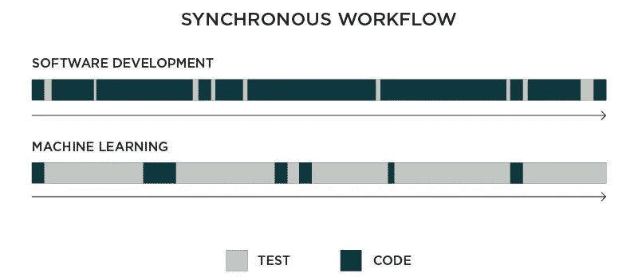

# 数据科学中的异步工作流

> 原文：<https://towardsdatascience.com/asynchronous-workflows-in-data-science-25764c52f81a?source=collection_archive---------26----------------------->

对各地的数据科学家来说，毫无意义地盯着实时日志并等待奇迹发生是一种巨大的时间浪费。相反，应该努力实现异步工作流。在本文中，我们定义了异步工作流，指出了一些障碍，并最终引导您阅读下一篇文章，了解 Jupyter 笔记本中的一个实际例子。

# 什么是同步工作流？

在我们谈论异步工作流之前，我们必须定义同步工作流。同步工作流是创建和测试的迭代循环，在任何时候都只有一个或另一个在进行。例如在软件开发中，你写代码，测试它，然后写更多的代码，然后测试这些代码，写更多的代码，再次测试，编码，测试，编码，测试，编码…重复直到 IPO。简单！

同步工作流经常如此根深蒂固地存在于我们的做事方式中，以至于我们甚至没有意识到它是一件事情。这也是为什么它经常不被质疑的原因。很难质疑你甚至没有意识到存在的东西。

虽然软件开发和机器学习的周期是一样的，但我们可以看到它们之间有巨大的差异。

在软件开发中，你通常会很快得到结果。想象一下改变一个网页表单的布局或者你的手机游戏的物理公式。与编写代码所花的时间相比，测试结果所花的时间可能微不足道。另一方面，在机器学习中，情况正好相反。改变几个超参数的时间，比起看到训练结果的时间，往往只是一眨眼的功夫。

> 衡量成功的真正标准是能在 24 小时内完成的实验数量。
> 
> ~托马斯·A·爱迪生

如果我们从上面看我们的机器学习时间线，并想象它是 24 小时，很明显我们没有将许多实验挤进去。等待训练结果是在吃我们的大部分时间。幸运的是，编码和等待之间有一个重要的区别:

一个人一次只能编写一个东西，却要等待无限的测试。

这就是我们所说的异步工作流。

当您创建一个模型并开始训练它时，重点不是喝杯咖啡，然后盯着输出日志的深渊几个小时。相反，在前一个实验还在运行的时候，同时开始另一个实验。这就是机器学习的异步工作流。

# 为什么我们不这样做？

为什么人们仍然坚持同步周期，而它显然不是最优的？有几个常见的原因:

# 缺少工具

大部分工具还是软件工程师为软件工程师做的。在软件工程中，同步工作流是标准。写一些代码，按下“播放”，等待结果。如果该工具的核心设计理念是同步的，那么工作流最终也会同步也就不足为奇了。

# 害怕失去工作

当一个人开始分支很多，并行运行几十件事情时，就会增加精神混乱，害怕失去工作或点击错误的东西。毕竟，一次只做一件事感觉更直接、更安全。

# 太专业了

在某些情况下，实际上更喜欢异步工作的人做不到。这需要额外的技能，如设置服务器或编写大量的粘合代码，因此他们被迫退回到默认的同步工作流。

# 是什么让我们这么做？

假设我们知道异步工作流是一种可行的方式，并且已经列出了一些常见的障碍，那么对一种工具的要求是什么呢？

# 简单的工具

该工具需要像同步“竞争者”一样简单。想象一下，你有两个选择来选择一个你每天都要使用的工具。你很可能选择更容易的，即使你知道更难使用的会更好。例如，如果启动一个新的测试对于同步工具来说只是一次点击，那么对于异步工具来说就不能是三次点击和一个 CLI 命令。一天重复 30 次的痛苦会让你回到以前的生活方式。

# 不具侵入性

从一个分支到几十个平行分支的转变伴随着认知负荷的增加。仅仅因为一直盯着您的现场测试的输出日志不是最佳的，这并不意味着您不应该不时地偷看一下。另一方面，当你试图编码时，你也不能有一个持续不断的通知消息流或者在你的屏幕上有一打闪烁的灯。一个好的异步工具应该退居二线，并且非常小心地平衡你的注意力。

# 安全的

多个同时分支的混乱局面给记账带来了更大的压力。如果工具不能以一种安全、直接和透明的方式组织和控制雪崩式的测试和实验，你最终会丢失工作或者在这个过程中犯认知错误。

# 完美的工具存在吗？

Valohai 是一个机器学习平台，它可以帮助您在云中执行按需实验，并具有完全的版本控制。我们已经开发了一个 [Jupyter 笔记本扩展](https://get.valohai.com/jupyter-notebook-version-control),它被专门优化来提供本文中描述的平滑异步工作流。[在下一篇博文中，我们将向你展示 Valohai 的 Jupyter 笔记本扩展在实践中是如何工作的](https://blog.valohai.com/valohai-jupyter-notebook-extension)。

【https://blog.valohai.com】最初发表于**。**