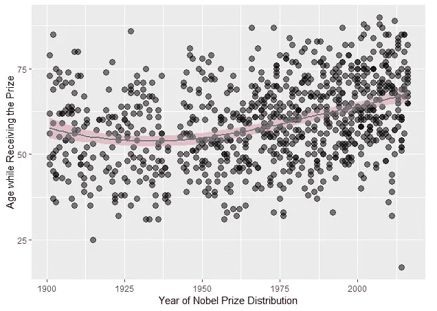
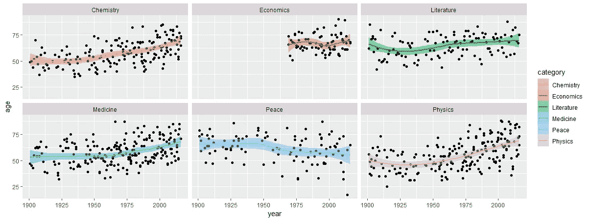

# 你会在什么年龄获得诺贝尔奖？让我们用 r 来形象化。

> 原文：<https://towardsdatascience.com/at-what-age-will-you-win-the-nobel-prize-lets-visualize-using-r-873aa702f6a9?source=collection_archive---------13----------------------->

## 让我们一起来探索你身边所有的数字中隐藏着什么。我们将可视化诺贝尔奖获得者的数据集，并用 r。


[https://www.nobelprize.org/](https://www.nobelprize.org/)

诺贝尔奖(Nobel Prize)，任何一个奖项(1969 年前共有五个，后来增加了第六个)，每年由瑞典发明家和实业家 [*阿尔弗雷德·诺贝尔*](https://www.britannica.com/biography/Alfred-Nobel) 遗赠给[的基金颁发。诺贝尔奖被广泛认为是世界上授予智力成就的最有声望的奖项。—](https://www.merriam-webster.com/dictionary/bequeathed)[britannica.com](https://www.britannica.com/topic/Nobel-Prize)

## 让我们发现

使用的数据集可以从 [*kaggle*](https://www.kaggle.com/nobelfoundation/nobel-laureates) 下载。
我们将尝试想象*(接受诺贝尔奖时)*的年龄是如何随时间变化的。



从中我们可以观察到，平均年龄几乎保持不变，直到 1950 年，此后，获奖者在接受奖励时的年龄不断增加，几乎增加了 8 岁。

我们使用了库' *tidyverse* '来执行所有的操作。 *tidyverse* 是一个非常有用的库，它装载了几个包，比如' [*dplyr*](https://cran.r-project.org/web/packages/dplyr/vignettes/dplyr.html) '、 [*ggplot2*](https://cran.r-project.org/web/packages/ggplot2/index.html) '、 [*dbplyr*](https://cran.r-project.org/web/packages/dbplyr/index.html) '、 [*lubridate*](https://cran.r-project.org/web/packages/lubridate/vignettes/lubridate.html) '、 [*readxl*](https://cran.r-project.org/web/packages/readxl/index.html) '、[](https://cran.r-project.org/web/packages/readr/index.html)

*[](https://cran.r-project.org/web/packages/tidyverse/index.html)**—“*tidyverse*”是一组协调工作的包，因为它们共享公共数据表示和“ *API* ”设计。该软件包旨在使在一个步骤中安装和加载多个' *tidyverse* '软件包变得容易。
函数' ***read.csv*** '从 *csv* 文件中读取数据，并作为一个数据帧存储到一个变量中，这里命名为' *nobel* '。
函数“ [***突变***](https://www.rdocumentation.org/packages/dplyr/versions/0.5.0/topics/mutate) ”添加新变量并保留数据框中已有的变量。这里， *mutate* 在数据帧中增加一个新列，命名为' ***age*** '。
*年龄*是用另一个函数 [***计算出来的。Date***](https://www.rdocumentation.org/packages/base/versions/3.5.3/topics/as.Date)’，它在字符表示和表示日历日期的类“ *Date* ”的对象之间进行转换。
最后，**和 *ggplot* 和**用于绘制散点图。使用变量“*年*在 *x 轴*上绘制散点图，而“*年龄”*在 *y 轴*上绘制散点图。 ***geom_point*** 用于绘制*点(dots)，*我们也可以指定每个点的大小。这里，*大小*被指定为“ *3* ”，并且 *alpha* 被设置为“ *0.5* ”，这有助于定义点的*不透明度(透明度)*，进而有助于识别点的重叠。***

```
*****#Load Required Libraries** library(tidyverse)nobel <- read.csv("nobel.csv")

nobel_age <- nobel %>%
    mutate(age = year - year(as.Date(birth_date)))ggplot(nobel_age,aes(x=year,y=age)) + geom_point(size = 3, alpha = 0.5,color = "black") + geom_smooth(aes(fill = "red")) + xlab("Year of Nobel Prize Distribution") + ylab("Age while Receiving the Prize")***
```

## ***让我们探索一下***

***看到上面的图的一个问题是，它反映了非常少的信息。在数据可视化中，使用颜色或形状弹出数据的作用类似于糖块中的糖。***

***从下面的图表中我们观察到三个类别'*'、 ***、医学*** '、 ***物理学*** '观察到一些相似的趋势，所有这些类别的平均年龄在这些年中不断增加。最大的偏差可见于类别'*物理*'。唯一显示平均年龄逐年下降的类别是“*”类别。而类别'*'和' ***文学*** '这些年来几乎保持不变。我们可以从图表中得出的一个更重要的观察结果是，在类别“*和平*”中，分数分布更广，这表明许多获奖者的平均年龄与*相差甚远*。******

****如果你获得了几个奖项的诺贝尔奖，你的假设年龄是多少？****

*   ****化学，年龄= 70 |最有可能:(年龄> 70)****
*   ****经济学，年龄= 69 |最有可能:(67****
*   ****Literature, Age = 70 | Most probable: (67****
*   ****Medicine, Age = 68 | Most probable: (Age > 52)****
*   ****和平，年龄= 55|最有可能:(年龄< 65)****
*   ****Physics, Age = 69| Most probable: (Age > 66)****

********

****让我们来理解帮助我们获得上述结果的代码。我们加载了本文前面加载的同一个库。
[***facet _ wrap***](https://www.rdocumentation.org/packages/ggplot2/versions/3.1.1/topics/facet_wrap)-将 1d 序列的面板包装成 2d。这通常比'***【facet _ grid()***'更好地利用了屏幕空间，因为大多数显示器大致是矩形的。
[***gg plot ly***](https://www.rdocumentation.org/packages/plotly/versions/4.9.0/topics/ggplotly)—将' ggplot2 '转换为' [**plotly**](https://plot.ly/r/getting-started/) '，此函数将一个' *ggplot2::ggplot()* '对象转换为一个' *plotly* '对象。****

****那么下面的代码实际上是做什么的呢？
使用 *ggplot* 函数生成一个图，其中突变的数据帧' *nobel_age* 作为数据， *x 轴*和 *y 轴*分别指定为' *year* 和' *age* '。 *geom_point* 用于指定散点图的绘制，而[***geom _ smooth***](https://ggplot2.tidyverse.org/reference/geom_smooth.html)*用于在过度绘制的情况下帮助眼睛看到图案，在过度绘制的情况下，颜色和填充由变量“ *category* 定义，这有助于为不同类别绘制不同颜色的图形。例如，如果我们必须为一家巧克力商店绘制一个图表，并考虑有三个类别“牛奶”、“白色”、“深色”，那么上述方法将用不同的颜色绘制不同类别的所有点，以帮助我们以更好的方式区分这些点。 *facet_wrap* 这里，用不同的类别对每个支线剧情进行剧情划分，从而获得基于类别划分的*六个*不同的支线剧情。*****

```
****#Load Required Libraries** library(tidyverse)
library(plotly)nobel <- read.csv("nobel.csv")

nobel_age <- nobel %>%
    mutate(age = year - year(as.Date(birth_date)))p <- ggplot(nobel_age,aes(x=year,y=age)) + 
         geom_point() + 
         geom_smooth(aes(colour = category, fill = category)) + 
         facet_wrap(~ category)ggplotly(p)**
```