# 用 Fast.ai 攻击有毒评论 Kaggle 比赛

> 原文：<https://towardsdatascience.com/attack-toxic-comments-kaggle-competition-using-fast-ai-b9eb61509e79?source=collection_archive---------16----------------------->

## 如何从头开始构建多标签 NLP 分类器


K [aggle](http://www.kaggle.com) 是学习和练习你的机器学习技能的好地方。这也是为你的学习项目寻找合适的数据集的好地方。我需要一个好的分类 NLP 数据集来实践我最近学习的 fast.ai 课程，我遇到了[有毒评论分类挑战](https://www.kaggle.com/c/jigsaw-toxic-comment-classification-challenge)。比赛是两年前举行的，早就结束了，但提交我的分数并看看我做得有多好也无妨。这是 Kaggle 的优势之一，因为在现实世界中，通常很难知道你的模型是好是坏，而在 Kaggle 中，你可以清楚地看到你的表现在排行榜上的位置。

# 数据集

他的比赛由对话人工智能团队举办，这是一个由竖锯和谷歌(都是 Alphabet 的一部分)创立的研究项目。它的目标是找出能够在评论中对多种毒性类型进行分类的最佳模型。毒性类型包括:

> 有毒的
> 
> 严重 _ 有毒
> 
> 猥亵的
> 
> 威胁
> 
> 侮辱
> 
> 同一性 _ 仇恨

在训练文件`train.cvs`和测试文件`test.csv`中给出了注释。你需要为`test.csv`中的每条评论预测每种毒性的概率。这是一个多标签的 NLP 分类问题。

# 看数据

L et 先来看看数据。我们需要导入必要的模块，并做一些后勤工作来为我们的文件设置路径。

```
import numpy as np *# linear algebra*
import pandas as pd *# data processing, CSV file I/O (e.g. pd.read_csv)* from fastai.text import *
from fastai import *
```

注意这里我们从 fastai.text 和 fastai 模块导入了所有内容。我们反对这里的软件工程最佳实践吗？实际上，不完全是。这是一种更具迭代性和互动性的数据科学方式的深思熟虑的举措。有了所有可用的库，我可以轻松地测试和尝试不同的功能/模块，而不必每次都返回并导入它们。这将使探索/实验流程更加顺畅。不过我跑题了，我们来加载数据看看:

```
# Kaggle store dataset in the /kaggle/input/ folder,
path = Path('/kaggle/input/jigsaw-toxic-comment-classification-challenge/')
path.ls()# the /kaggle/input/ folder is read-only, copy away so I can also write to the folder. 
!mkdir data
!cp -a {path}/*.* ./data/
!ls data# make sure everything is correctly copied over
path = Path('/kaggle/working/data/')
path.ls()# read in the data and have a peak
df = pd.read_csv(path/'train.csv')
df.head()
```

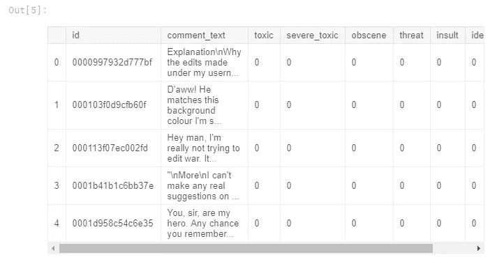

The toxicity types are one-hot encoded

注释在`comment_text`列中，所有毒性类型都是“一次性”编码的，我们将不得不对其进行一些处理，以使其适合我们以后的模型。

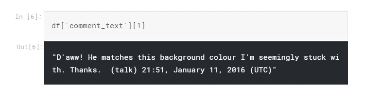

Have a look at one comment

# 迁移学习:微调我们的语言模型


我们将使用迁移学习来完成这项任务，为此，我们将使用一个基于维基百科的预训练模型，名为 [wikitext-103](https://einstein.ai/research/blog/the-wikitext-long-term-dependency-language-modeling-dataset) 。这是一个已经从维基百科数据集(或 NLP 术语中的“语料库”)中训练出来的模型，用于从给定的未完成句子中预测下一个单词。我们将利用模型已经从维基百科数据集学习到的“语言知识”,并在此基础上进行构建。为了达到最佳效果，我们需要“微调”模型，使它从我们的“评论”数据集中学习一些东西，因为人们在评论中所说的不一定与更正式的维基相同。一旦对语言模型进行了微调，我们就可以使用它来进一步完成分类任务。

现在让我们将训练数据加载到 fast.ai `databunch`中，以便我们可以首先开始训练语言模型。

```
bs = 64   # set batch size to 64, works for Kaggle Kernels
data_lm = (TextList.from_df(df, path, cols='comment_text')
                .split_by_rand_pct(0.1)
                .label_for_lm()
                .databunch(bs=bs))
```

我们使用 fast.ai 的`Data Block API`来完成这项任务。这是一种非常灵活和强大的方法，可以解决构建管道的挑战性任务:将数据加载到模型中。它将整个过程隔离为不同的部分/步骤，每个步骤都有多种方法/功能来适应不同类型的数据和数据存储方式。这个概念很像 Linux 哲学，高度模块化，每个模块只做一件事，但做得非常非常好。您可以在这里自由探索美妙的 API [，尽管对于上面的代码，它做了以下事情:](https://docs.fast.ai/data_block.html)

1.  从名为`df`的 Pandas DataFrame 导入数据，告诉模型使用`comment_text`作为输入(`TextList.from_df(df, path, cols=’comment_text’)` ) *注意这里我也可以将 test.csv 包含到语言模型中。这不被认为是“作弊”，因为我们没有使用标签，只是做语言模型训练。*
2.  将训练数据集按随机的 10/90%分成训练/验证集。(`.split_by_rand_pct(0.1)`)
3.  忽略给定的标签(因为我们只是微调语言模型，而不是训练分类器),并使用语言模型的“预测下一个单词”作为标签。(`.label_for_lm()`)
4.  将数据构建到一个`databunch`中，批量大小为`bs`。(`.databunch(bs=bs)`)

现在让我们看看我们刚刚构建的`databunch`:

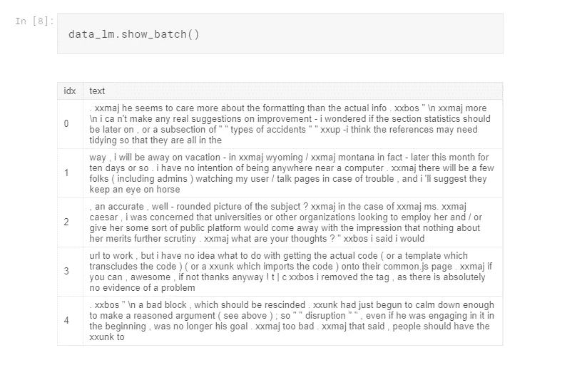

Notice we lost all the toxicity types

请注意，`databunch`没有所有的毒性类型标签，因为我们只是微调了语言模型。

好了，是时候进行一些典型的 fast.ai 学习率调整和训练了:

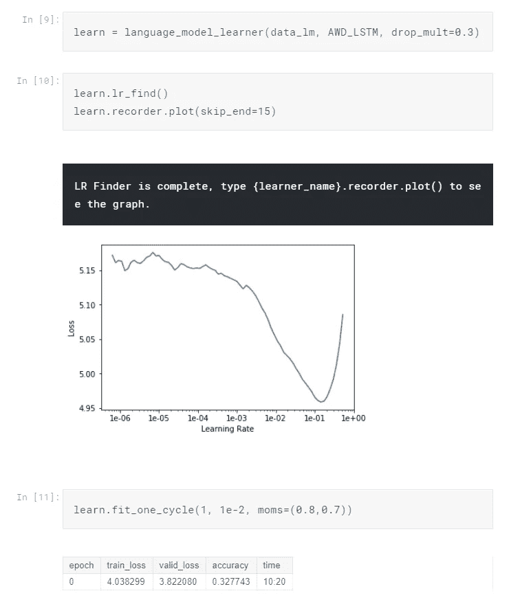

我们将我们的`databunch`放入一个`language_model_learner`中，告诉它我们想要使用的语言模型库(`AWD_LSTM`)，并分配一个默认的辍学率 **0.3** 。从`LR Finder`图中，找出最大的下降斜率，选取中间点作为我们的学习率。(关于如何实现这种‘fit _ one _ cycle’魔法的更详细解释，请参考这篇[文章](https://docs.fast.ai/callbacks.one_cycle.html#What-is-1cycle?)。它是 fast.ai 的一种 SOTA 技术，结合了学习率和动量退火)。现在，我们可以“解冻”模型，并训练几个时期的整个模型:

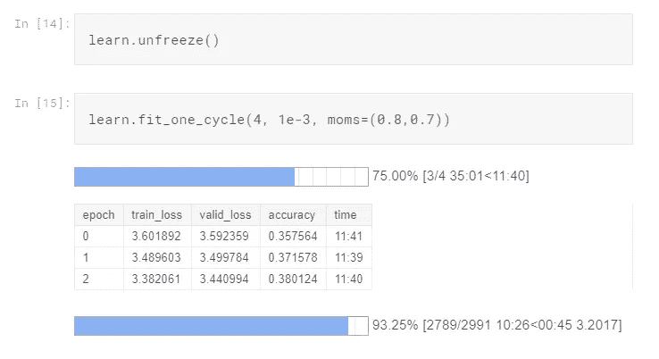

我们可以看一个模型表现如何的例子:

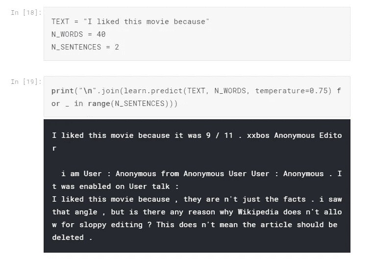

结果很难说是最佳的。但我们至少得到了一个实际上有意义的句子，并且预测下一个单词的 0.38 的准确度还不错。理想情况下，我们需要训练更多的纪元，但对于这个 Kaggle 内核，我用完了 GPU 配额，所以我停在了 4。结果肯定有提升的空间，可以自己试试。反正我们想从语言模型中得到的是编码器部分，所以我们把它保存下来。

> 训练语言模型确实需要相当长的时间，但好消息是，对于您自己的领域语料库，您只需训练一次，以后您可以将它用作任何其他分类任务的基础。

```
*# save the encoder for next step use*
learn.save_encoder('fine_tuned_enc')
```

# 迁移学习:训练分类器

让我们来看看测试数据集:

```
test = pd.read_csv(path/"test.csv")
test_datalist = TextList.from_df(test, cols='comment_text')
```

再次，建造我们的`databunch`:

```
data_cls = (TextList.from_csv(path, 'train.csv', cols='comment_text', vocab=data_lm.vocab)
                .split_by_rand_pct(valid_pct=0.1)
                .label_from_df(cols=['toxic', 'severe_toxic','obscene', 'threat', 'insult', 'identity_hate'], label_cls=MultiCategoryList, one_hot=True)
                .add_test(test_datalist)
                .databunch())
data_cls.save('data_clas.pkl')
```

请注意这次的不同之处:

1.  *在构建* `*TextList*` *时，我们指定了* `*vocab=data_lm.vocab*` *，这样我们就确保了我们使用的是相同的词汇，并且我们在语言模型上的训练可以恰当地应用到分类器模型上。*
2.  我们现在使用我们所有的毒性风格标签(`.label_from_df(cols=[‘toxic’, ‘severe_toxic’,’obscene’, ‘threat’, ‘insult’, ‘identity_hate’],label_cls=MultiCategoryList, one_hot=True),`)
3.  我们在这里添加了我们的测试集。(`.add_test(test_datalist)`)

现在看看我们的分类器`databunch`:

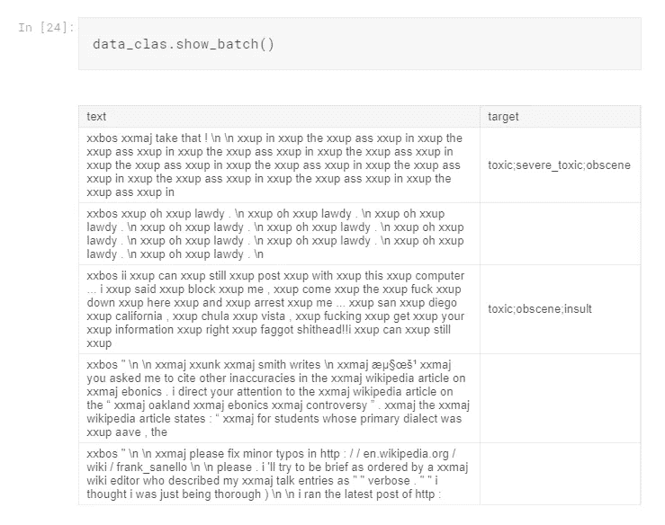

Note that now we have all the toxicity styles labels

最后，是时候把所有东西放在一起了！我们将把`databunch`放到`text_classifier_learner`模型中，并加载我们从语言模型中学到的编码器。

```
learn = text_classifier_learner(data_clas, AWD_LSTM, drop_mult=0.5)
learn.load_encoder('fine_tuned_enc')
```

再次，找到最佳学习率，训练一个周期:

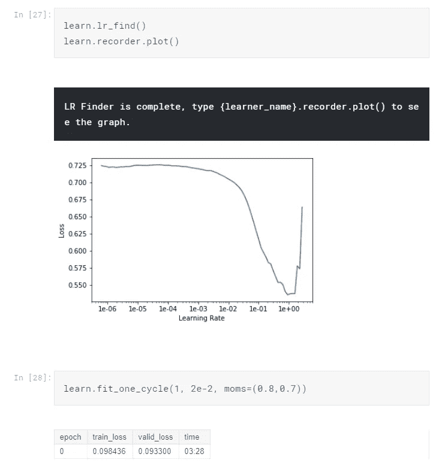

多训练几个周期，然后解冻:

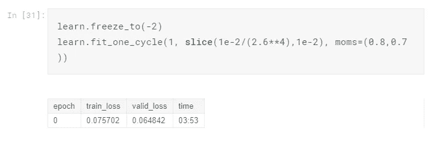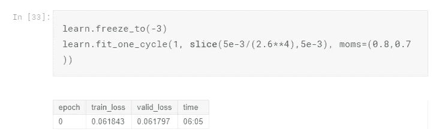

查看结果:

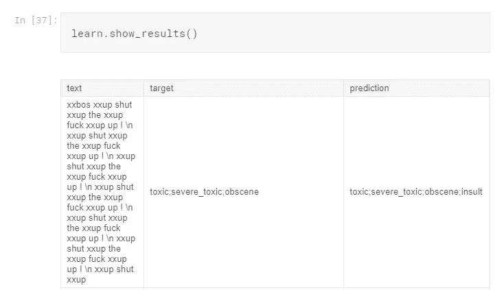

差了一个，但总体来说预测是好的。作为参考，我将预测提交给 Kaggle，得到一个 0.98098 的公众分数(落在公众领袖板的中间)。结果不是最佳的，但是就像我说的，由于 GPU 有限，我没有全程训练。本文的目的是向您展示使用 fast.ai 处理多标签文本分类问题的整个过程。这里真正的挑战是使用数据块 API 将数据加载到模型中。

# 结论

我希望你能从这篇文章中学到一些东西。Fast.ai 真的是一个精简、灵活、强大的库。对于它能做的事情(像图像/文本分类，表格数据，协同过滤等。)，它做得很好。它不像 Keras 那样广泛，但它非常尖锐和集中。有点像 Vim 和 Emacs，如果你熟悉命令行文本编辑器 war 的话。😜

> 你可以在这里找到 Kaggle 内核[。](https://www.kaggle.com/lymenlee/toxic-comments-classification-fast-ai)

欢迎任何反馈或建设性的批评。你可以在推特 [@lymenlee](https://twitter.com/lymenlee) 或者我的博客网站【wayofnumbers.com[上找到我。](https://wayofnumbers.com/)