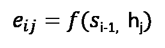
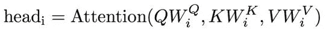
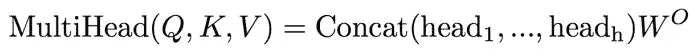
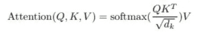

# 注意及其不同形式

> 原文：<https://towardsdatascience.com/attention-and-its-different-forms-7fc3674d14dc?source=collection_archive---------0----------------------->

## 概括注意的不同类型和用途。

([Source](https://unsplash.com/photos/tEVGmMaPFXk))

我假设你已经熟悉递归神经网络(包括 seq2seq 编码器-解码器架构)。

# **瓶颈问题**

在编码器-解码器架构中，完整的信息序列必须由单个向量捕获。这给在序列开始时保留信息和编码长程相关性带来了问题。

注意力的核心思想是关注每个输出的输入序列中最相关的部分。
通过为输入提供一条直接的路径，注意力也有助于缓解渐变消失的问题。

# 计算注意力

假设您有一个顺序解码器，但是除了前一个单元的输出和隐藏状态之外，您还要输入一个上下文向量 **c** 。

其中 **c** 是编码器隐藏状态的加权和。

这里 **αᵢⱼ** 是第 *i* 个输出应该关注第 *j* 个输入的量，而 **hⱼ** 是第 *j* 个输入的编码器状态。

**αᵢⱼ** 通过对输入相对于 *i* th 输出的注意力分数取软最大值来计算，用 **e、**表示。

在哪里

这里 **f** 是对齐模型，其对位置 *j* 周围的输入和位置 *i* 处的输出的匹配程度进行评分，并且 **sᵢ₋₁** 是来自前一时间步的隐藏状态。

对齐模型可以通过小型神经网络来近似，然后可以使用任何梯度优化方法(例如梯度下降)来优化整个模型。

Graphic illustration of the attention mechanism ([Source](https://distill.pub/2016/augmented-rnns/#attentional-interfaces))

上下文向量 **cᵢ** 也可以用于计算解码器输出 **yᵢ** 。

## 应用:机器翻译

注意力首先由 Bahdanau 等人[1]提出，用于神经机器翻译。该机制对于机器翻译特别有用，因为与输出最相关的单词经常出现在输入序列中的相似位置。

([Source](https://arxiv.org/pdf/1409.0473.pdf))

上面的矩阵显示了与每个翻译输出单词最相关的输入单词。
这样的注意力分布也有助于为模型提供一定程度的可解释性。

# 普遍注意力

给定一个查询 **q** 和一组键-值对 **(K，V)** ，注意力可以概括为计算依赖于查询和相应键的值的加权和。
查询确定关注哪些值；我们可以说查询“关注”了这些值。

在前面的计算中，查询是前一个隐藏状态 **sᵢ₋₁** ，而编码器隐藏状态集 **h₀** 到 **hₙ** 表示键和值。

反过来，对准模型可以以各种方式计算。

# 自我关注

有了自我关注，每一个隐藏状态都会关注同一个 RNN 的先前隐藏状态。

这里 **sₜ** 是查询，而解码器隐藏状态 **s₀** 到 s **ₜ₋₁** 表示键和值。

## 应用:语言建模

论文“指针哨兵混合模型”[2]使用自我注意进行语言建模。

基本思想是，细胞的输出“指向”先前遇到的具有最高注意力分数的单词。然而，该模型还在词汇 V 上使用标准的 softmax 分类器，使得它除了从最近的上下文中再现单词之外，还可以预测不存在于输入中的输出单词。

([Source](https://arxiv.org/pdf/1609.07843.pdf))

在指针词汇表分布中分配给给定单词的概率是分配给给定单词出现的所有标记位置的概率之和

其中 ***I(w，x)*** 在输入 **x** 和 **pₚₜᵣ∈ Rⱽ** 中得到单词 **w** 的所有位置。这种技术被称为指针和注意力。

该模型使用门 **g** 将 softmax 词汇分布与指针词汇分布相结合，该门被计算为查询和标记向量的乘积。

([Source](https://arxiv.org/pdf/1609.07843.pdf))

An output example ([Source](https://arxiv.org/pdf/1609.07843.pdf))

## 申请:总结

论文“用于抽象概括的深度强化模型”[3]介绍了一种具有新颖的自我关注的神经网络模型，该模型分别关注输入和连续生成的输出，

([Source](https://arxiv.org/pdf/1705.04304.pdf))

所涉及的计算可以总结如下。

([Source](https://web.stanford.edu/class/archive/cs/cs224n/cs224n.1184/lectures/lecture11.pdf))

An output example ([Source](https://web.stanford.edu/class/archive/cs/cs224n/cs224n.1184/lectures/lecture11.pdf))

# 多头注意力

## **多重查询**

当我们有多个查询时，我们可以把它们堆在一个矩阵中。

如果我们使用基本的点积注意力来计算对齐，则用于计算上下文向量的方程组可以简化如下。

([Source](https://web.stanford.edu/class/archive/cs/cs224n/cs224n.1184/lectures/lecture12.pdf))

多头关注更进了一步。

使用权重矩阵将 q、K 和 V 映射到较低维度的向量空间，然后将结果用于计算注意力(其输出我们称为“头部”)。

我们有 h 组这样的权重矩阵，这给了我们 h 个头。

然后，使用输出权重矩阵连接和变换 h 个头。

# 变形金刚(电影名)

变压器是在论文“你所需要的只是注意力”中首次提出的[4]。它基于这样一种思想，即序列模型可以完全省去，输出可以仅使用注意机制来计算。

转换器使用单词向量作为键、值以及查询的集合。

Transformer’s Multi-Head Attention block ([Source](https://arxiv.org/pdf/1706.03762.pdf))

它包含多头注意力的块，而注意力计算本身是成比例的点积注意力。

([Source](https://arxiv.org/pdf/1706.03762.pdf))

其中 **dₖ** 是查询/关键向量的维度。

执行缩放是为了使 softmax 函数的参数不会因更高维的键而变得过大。

下面是完整的变压器模型图，以及一些带有附加细节的注释。有关更深入的解释，请参考附加资源。

([source](https://arxiv.org/pdf/1706.03762.pdf))

# 额外资源

*   deeplearning.ai 的[注意力模型直觉(C5W3L07)](https://www.youtube.com/watch?v=SysgYptB198) 和[注意力模型(C5W3L08)](https://www.youtube.com/watch?v=quoGRI-1l0A)
*   [“注意？注意！”由莉莲翁](https://lilianweng.github.io/lil-log/2018/06/24/attention-attention.html)
*   [《注意力和增强的递归神经网络》作者 Olah & Carter，Distill，2016](https://distill.pub/2016/augmented-rnns/)
*   [《图解变形金刚》杰伊·阿拉玛](http://jalammar.github.io/illustrated-transformer/)

# 参考

[1] [D. Bahdanau，K. Cho 和 Y. Bengio，通过联合学习对齐和翻译进行神经机器翻译(2014)](https://arxiv.org/abs/1409.0473)

[2] [S. Merity，C. Xiong，J. Bradbury 和 R. Socher，Pointer Sentinel 混合模型(2016)](https://arxiv.org/abs/1609.07843)

[3] [R. Paulus，C. Xiong，R. Socher，抽象概括的深度强化模型(2017)](https://arxiv.org/abs/1705.04304)

[4] [A .瓦斯瓦尼、n .沙泽尔、n .帕马尔、j .乌兹科雷特、l .琼斯、A. N .戈麦斯、l .凯泽、I .波罗苏欣，《你只需要关注》(2017)](https://arxiv.org/abs/1706.03762)