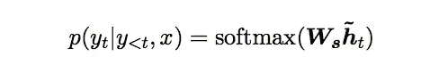

# 基于注意力的神经机器翻译

> 原文：<https://towardsdatascience.com/attention-based-neural-machine-translation-b5d129742e2c?source=collection_archive---------4----------------------->

通过在翻译过程中选择性地关注句子的子部分，注意力机制正越来越多地用于提高神经机器翻译(NMT)的性能。在这篇文章中，我们将介绍两种简单的注意力机制: ***全局方法*** (关注所有源词)和 ***局部方法*** (只关注源词的子集)。请记住，源指的是编码器，目标指的是解码器。

本博客将涵盖 [***这篇***](https://arxiv.org/pdf/1508.04025.pdf) 的论文，这篇论文证明了增加注意力可以导致比基于非注意力的网络显著的性能提升。在上述论文中提出的系综模型为 WMT 的 15 英德翻译产生了一种新的艺术状态模型。

除了提高机器翻译练习的性能，基于注意力的网络还允许模型学习不同模态(不同数据类型)之间的对齐，例如语音帧和文本之间或者图片的视觉特征和其文本描述之间的对齐。

# 神经机器翻译(NMT)

NMT 是一个巨大的神经网络，它被训练成端到端的方式，用于将一种语言翻译成另一种语言。下图是基于 RNN 的编码器-解码器架构的 NMT 的示意图。

Figure 1 : Neural machine translation as a stacking recurrent architecture for translating a source sequence A B C D into a target sequence X Y Z. Here <eos> marks the end of a sentence.

NMT 直接模拟翻译源的条件概率***【p(y/x)】****(x1，x2…xn)* 句转化为目标句 *(y1，y2…yn)* 。

NMT 由两部分组成:

1.  编码器，为每个源语句计算表示 ***S***
2.  一种解码器，一次生成一个单词的翻译，因此将条件概率分解为:

A probability of translation y given the source sentence x

可以将解码每个字 y(j)的概率参数化为

其中 ***h(j)*** 可以建模为

RNN hidden unit definition (h)

***其中
g:***a*变换函数，输出词汇大小向量
***h*** : RNN 隐藏单元
***f*** :给定先前隐藏状态，计算当前隐藏状态。*

*翻译流程的 ***培训目标*** 可以被框定为*

**

*Loss Function*

## *是什么让 NMT 如此受欢迎？*

1.  *NMT 在大规模翻译任务中，如英语到法语/德语的翻译，已经达到了艺术水平。*
2.  *NMT 需要最少的领域知识，概念上非常简单。*
3.  *NMT 的内存占用很小，因为它不存储庞大的相位表和语言模型。*
4.  *NMT 能够很好地概括很长的单词句子。*

## *注意网络和非注意网络的区别*

*在大多数基于非注意力的 RNN 架构信源表示中， ***S*** 仅被使用一次来初始化解码器隐藏状态。[在图 1 中，解码器只能访问编码器的最后一层]*

*另一方面，基于注意力的网络在整个翻译过程中指的是一组**源隐藏状态。[在图 2 中，解码器可以访问编码器的所有隐藏状态]***

# *注意机制的类型*

**

*Figure 2: NMT with attention and input-feeding approach*

*上图重点描绘了基于 RNN 的编码器-解码器架构。正如我们之前解释的，注意力可以大致分为两种类型:*

1.  ***全局关注**:关注所有源位置。*
2.  ***局部注意**:只注意几个源位置。*

*这两种基于注意力的模型仅在解码阶段不同于普通的编码器-解码器架构。这些基于注意力的方法的不同之处在于它们计算上下文向量的方式(***【c(t)】***)。*

**

*Figure 3: Hidden state of NMT architecture with global attention*

*图 3 的术语表如下*

****【t】***:隐藏目标状态
***c(t)*** :源端上下文向量
***y(t)*** :当前目标词
***h _ bar(t)***:注意隐藏状态
***a(t)*** :对齐向量*

## ***如何计算注意力？***

*这两种基于注意力的方法都有以下共同步骤:*

1.  *这两种方法首先将堆栈 LSTM 顶层的隐藏状态***【h(t)】***作为输入。(棕色单元格/解码器的目标状态)*
2.  *派生***【c(t)***来捕获相关的源端信息，以帮助预测***【y(t)***(顶部蓝色单元格)。***【c(t)***基本上是你根据每个单词的对齐权重和编码器的隐藏状态为每个单词建立的上下文。*
3.  *从 h(t)和 c(t)的简单串联计算***【h _ bar(t)***(顶部灰色单元格)。*

**

*与仅将编码器的最终输出提供给解码器的基于非注意力的架构相反，***【h _ bar(t)***具有对编码器的隐藏状态的所有状态的访问，这提供了源语句的信息视图。*

*4.使用 softmax 层转换注意力向量以产生预测分布。我们使用 softmax 层，因为我们必须从我们的词汇表中所有可用的单词中找到最可能的单词。*

**

*以上段落解释了基于注意力的网络的基本架构。在下面的段落中，我们将理解上下文向量***【c(t)***在局部和全局注意力中是如何不同地计算的，以及它的影响是什么。*

1.  ***全球关注***

*全局注意力考虑所有编码器隐藏状态以导出上下文向量(c(t))。为了计算 ***c(t)，*** 我们计算 ***a(t)*** 这是一个可变长度的对齐向量。通过计算***【t】***和 ***h_bar(s)*** 之间的相似性度量来导出对齐向量，其中 ***h(t)*** 是源隐藏状态，而 ***h_bar(s)*** 是目标隐藏状态。编码器和解码器中类似的状态实际上指的是同一个意思。*

***对齐向量(a(t))***

*对齐向量(***【t，s】***)定义为*

**

*分数是一个基于内容的函数，可以使用以下任何一种替代方法:*

**

*The score function*

*通过得分函数，我们试图计算目标和源的隐藏状态之间的相似性。直观上，隐藏和源中的相似状态指的是相同的意思，但在不同的语言中。*

**

***Figure 4: Global attentional model:** At each time step t, the model infers a variable-length alignment weight vector a(t) based on the current target state h(t) and all source states h_bar(s). A global context vector,c(t) is then computed as the weighted average, according to a(t), over all the source states.*

*图 4 中的连接线代表相互依赖的变量。*

*例如*

1.  **a(t)* 依赖于 h(t)和 h_bar(s)*
2.  **c(t)* 依赖于 a(t)和 h_bar(s)*
3.  **h_bar(t)* 依赖于 c(t)和 h(t)*

## *2.当地的关注*

*由于全局注意力集中在所有目标单词的所有源端单词上，这在计算上非常昂贵，并且在翻译长句时不切实际。为了克服这一缺陷，局部注意力选择只关注每个目标单词的编码器隐藏状态的一个小子集。*

*局部注意力有以下不同于全局注意力的步骤:*

1.  *该模型首先在时间 t 为每个目标单词生成对齐位置 *p(t)* ，与假设单调对齐的全局注意模型相反，我们在局部注意中学习对齐位置。换句话说，除了学习翻译之外，你还可以学习翻译的顺序是否与源句子不同(源的单词 1 可能是翻译句子中的单词 4，因此我们需要计算这个，否则我们的相似性得分将完全错误，因为我们的注意力将集中在源句子中与源句子的单词 1 不相关的单词上)。*
2.  *上下文向量(c(t))被导出为窗口[p(t)-D，p(t)+D]内的源隐藏状态集合的加权平均值；d 是凭经验选择的。与全局对准向量相比，局部对准向量 *a(t)现在是*固定维度的。*

*到目前为止，我们一直假设翻译句子和源句子都是单调对齐的。在此基础上，我们对局部注意力有了进一步的区分，具体如下:*

1.  ***单调对齐( *local-m* )***

*Set p(t)=t，这意味着我们假设源序列和目标序列大致单调对齐。对齐向量与全局对齐相同*

**

*Local alignment is the same as that of global alignment*

***2。预测比对** ( ***局部-p*** )*

*我们的模型不是假设单调排列，而是预测排列位置如下:*

**

*Alignment Position for ***local-p*** model*

****W(p)*** 和 **v(p)** 是模型参数，将学习这些参数来预测位置。
***S*** 是源句长度
***p(t)***:【0，S】*

*为了有利于对齐位置 ***p(t)，*** 我们放置一个以 p(t)为中心的高斯分布。这赋予位置 ***p(t)*** 更多的权重。我们将校准权重修改为*

**

*Alignment vector for ***local-p*** *model**

*去捕捉同样的东西。*

*总而言之，全局注意力在计算上更昂贵，并且对长句无用，而局部注意力集中在*D***【p(t)***两侧的隐藏状态来克服这一点。局部注意有 2 种口味 ***local-m (*** 源和目标对齐假设相同 ***)*** 和 ***local-p*** (这里我们计算的是 ***p(t))。*****

## **投入-供给方法**

**在所提出的注意机制中，独立地做出注意决定(先前预测的对准不影响下一次对准)，这是次优的。为了确保未来的对准决策考虑到过去的对准信息 ***，h_bar(t)*** 在下一时间步与输入连接，如图所示。**

**这样做是为了:**

1.  **让模型完全了解之前的对齐选择。**
2.  **创建一个横向和纵向都很深的网络。**

****

**Attentional Vectors h_bar(t) is fed to the next time steps to inform the model about past alignment decisions**

**在上面的文章中，我们和 NMT 一起讨论了注意力网络的基础知识。**

# **参考**

1.  **[基于注意力的神经机器翻译的有效方法](https://arxiv.org/pdf/1508.04025.pdf)**

**如果你对上面的帖子有任何想法或补充，请随时联系我。**