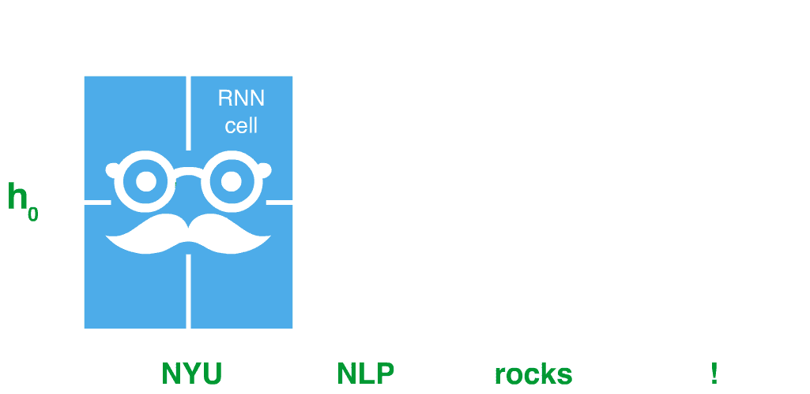
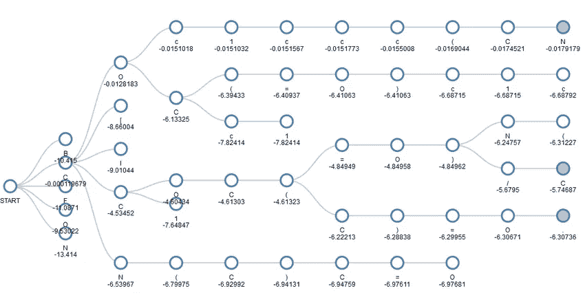
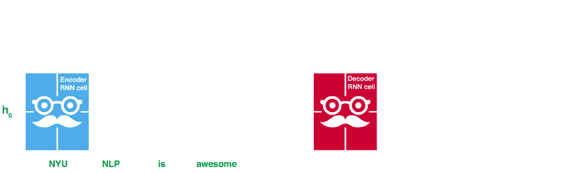
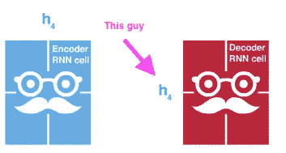
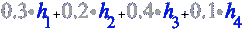
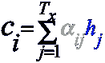
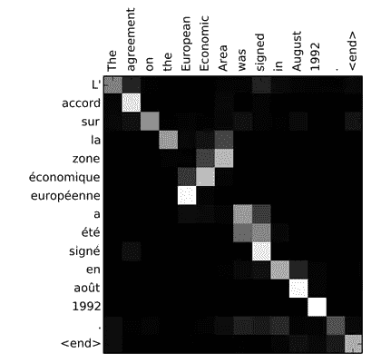
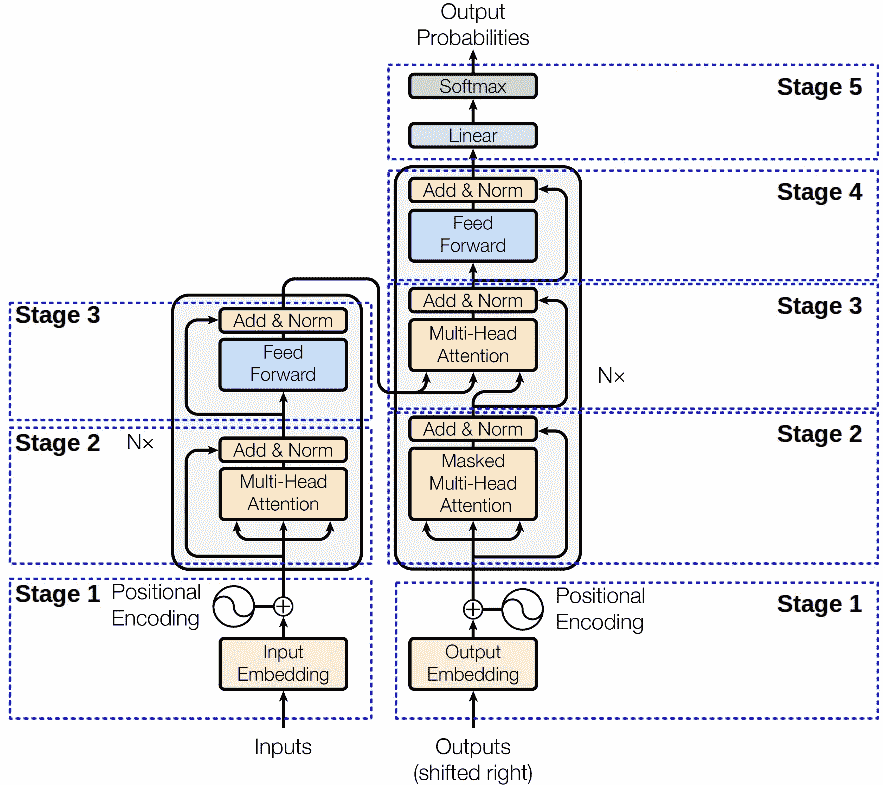

# 注意力渴望 RNNS:建立变压器网络

> 原文：<https://towardsdatascience.com/attention-craving-rnns-a-journey-into-attention-mechanisms-eec840fbc26f?source=collection_archive---------5----------------------->


将注意力放在你的神经网络上有点像想在工作时小睡一会儿。你知道这对你更好，每个人都想这样做，但每个人都害怕。

我今天的目标是什么都不假设，用动画解释细节，让数学再次伟大(MMGA？呃…)

**这里我们将介绍:**

1.  简短的 RNN 评论。
2.  短序列到序列模型审查。
3.  RNNs 中的注意。
4.  注意力的改善。
5.  变压器网络介绍。

# **递归神经网络(RNN)**

RNNs 让我们在神经网络中模拟序列。虽然有其他方法来模拟序列，rnn 是特别有用的。rnn 有两种类型，LSTMs ( [Hochreiter 等人，1997](http://citeseerx.ist.psu.edu/viewdoc/download?doi=10.1.1.676.4320&rep=rep1&type=pdf) )和 GRUs ( [Cho 等人，2014](https://arxiv.org/pdf/1406.1078.pdf) )。想要更深入的教程，请查看克里斯·科拉的教程。

**让我们来看一个 RNN 的具体例子的机器翻译。**

1.  想象我们有一个有 56 个隐藏单元的 RNN。

```
rnn_cell = rnn_cell(input_dim=100, output_dim=56)
```

2.我们有一个单词“NYU ”,它由整数 12 表示，这意味着它是我创建的 vocab 中的第 12 个单词。

```
# 'NYU' is the 12th word in my vocab
word = 'NYU'
word = VOCAB[word]print(word)
# 11
```

除了我们没有将整数输入 RNN，我们使用了一个更高维的表示，这是我们目前通过[嵌入](/neural-network-embeddings-explained-4d028e6f0526)获得的。嵌入让我们将一系列离散的记号映射到连续的空间中( [Bengio 等人，2003](http://www.jmlr.org/papers/volume3/bengio03a/bengio03a.pdf) )。

```
embedding_layer = Embedding(vocab_size=120, embedding_dim=10)# project our word to 10 dimensions
x = embedding_layer(x)
```

一个 RNN 单元接受两个输入，一个字 ***x*** ，以及一个来自前一时间步 ***h*** 的隐藏状态。在每一个时间步，它输出一个新的***h*** 。


**RNN CELL: next_h= f(x, prev_h).**

提示:对于第一步，h 通常为零。

```
# 1 word, RNN has 56 hidden units 
h_0 = np.zeros(1, 56)
```

这很重要:RNN 细胞与 RNN 细胞是不同的。

在 RNN 术语中有一个主要的混淆点。在深度学习框架中，如 [Pytorch](https://pytorch.org/docs/stable/_modules/torch/nn/modules/rnn.html#RNNCell) 和 [Tensorflow](https://www.tensorflow.org/api_docs/python/tf/nn/rnn_cell/RNNCell) ，RNN 细胞是执行这种计算的单位:

```
h1 = rnn_cell(x, h0)
```

RNN *网络* for 在时间步长上循环单元

```
def RNN(sentence):  
  current_h = h_0 all_h = []
  for word in sentence:
    # use the RNN CELL at each time step
    current_h = rnn_cell(embed(word), current_h)
    all_h.append(current_h) # RNNs output a hidden vector h at each time step
  return all_h
```

**这里有一个 RNN 随着时间推移移动*同一个* RNN 单元格的图示:**



**The RNN moves the RNN cell over time. For attention, we’ll use ALL the h’s produced at each timestep**

# **序列对序列模式(Seq2Seq)**

现在你是 RNNs 的专家了，但是让我们放松一下。


**Chill**

rnn 可以用作更大深度学习系统的模块。

一个这样的系统是由 Bengio 的小组( [Cho 等人，2014](https://arxiv.org/pdf/1406.1078.pdf) )和 Google ( [Sutskever 等人，2014](https://arxiv.org/pdf/1409.3215.pdf) )引入的 Seq2Seq 模型，它可以用于将一个序列翻译成另一个序列。你可以把很多问题框定为翻译:

1.  把英语翻译成西班牙语。
2.  将一个视频序列转换成另一个序列。
3.  将一系列指令翻译成程序代码。
4.  将用户行为转化为未来的用户行为
5.  …
6.  唯一的限制是你的创造力！

seq2seq 模型无非是 2 个 rnn，一个编码器(E)，一个解码器(D)。

```
class Seq2Seq(object): def __init__():
      self.encoder = RNN(...)
      self.decoder = RNN(...)
```

seq2seq 模型有两个主要步骤:

**第一步:*编码*一个序列:**

```
sentence = ["NYU", "NLP", "rocks", "!"]
all_h = Seq2Seq.encoder(sentence)# all_h now has 4 h (activations)
```


**Encoding**

**第二步:解码生成“翻译”**

这部分真的很复杂。前一步中的编码器一次处理完整的序列(即:这是一个普通的 RNN)。

在第二步中，我们一次运行解码器 RNN *一个*步骤，以生成自回归预测(这是为了将前一步的输出用作下一步的输入)。

有两种主要的解码方式:

选项一:贪婪解码

1.  运行解码器的 1 个步骤。
2.  选择概率最高的输出。
3.  使用此输出作为下一步的输入

```
# you have to seed the first x since there are no predictions yet
# SOS means start of sentence
current_X_token = '<SOS>'# we also use the last hidden output of the encoder (or set to zero)
h_option_1 = hs[-1]
h_option_2 = zeros(...)# let's use option 1 where it's the last h produced by the encoder
dec_h = h_option_1# run greedy search until the RNN generates an End-of-Sentence token
while current_X_token != 'EOS': # keep the output h for next step
   next_h = decoder(dec_h, current_X_token) # use new h to find most probable next word using classifier
   next_token = max(softmax(fully_connected_layer(next_h))) # *KEY* prepare for next pass by updating pointers
   current_X_token = next_token
   dec_h = next_h
```

这叫做贪婪，因为我们总是选择概率最高的下一个词。

**选项 2:光束搜索**

有一种更好的技术叫做波束搜索，它在解码过程中考虑多条路径。通俗地说，宽度为 5 的波束搜索意味着我们考虑具有最大对数似然的 5 个可能的序列(数学术语为 5 个最可能的序列)。

在高层次上，我们保留顶部 k(波束大小= k)，而不是采用最高概率预测。注意下面，在每一步我们有 5 个选项(5 个可能性最大)。



**Beam search figure found** [**here**](https://www.researchgate.net/publication/317377611_Retrosynthetic_Reaction_Prediction_Using_Neural_Sequence-to-Sequence_Models/figures?lo=1&utm_source=google&utm_medium=organic)

[这个 youtube 视频](https://www.youtube.com/watch?v=UXW6Cs82UKo)有详细的光束搜索教程！

所以，用 greedy decoding 作为动画把*【NYU NLP 很牛逼】*翻译成西班牙语的完整 seq2seq 过程看起来是这样的:



**Seq2Seq is made up of 2 RNNs an encoder and decoder**

**这个模型有各种部件:**

1.  蓝色 RNN 是编码器。
2.  红色 RNN 是解码器
3.  解码器顶部的蓝色矩形是一个带有 softmax 的完全连接层。这将挑选最有可能的下一个单词。

# **注意机制**

好了，现在我们已经讨论了所有的先决条件，让我们进入正题。

如果你注意到前面的动画，解码器只查看编码器生成的最后一个隐藏向量。



事实证明，RNN 很难记住*在这个单一向量的序列中发生的一切*([Bahdanau 等人，2015](https://arxiv.org/pdf/1409.0473.pdf) )。例如，当编码器处理完输入序列时，可能已经忘记了单词“NYU”。

注意力试图解决这个问题。

当你给一个模型一个注意机制时，你允许它在每个解码步骤中查看由编码器产生的所有 h。

为了做到这一点，我们使用一个单独的网络，通常是一个完全连接的层，它计算解码器想要查看多少 h。这被称为*注意力机制*。

想象一下，对于我们生成的所有 h，我们实际上只取其中的一点。它们的总和被称为上下文向量 *c.*



标量 0.3、0.2、0.4、0.1 称为*注意力权重。*在原始论文中，你会在第 3 页找到同样的等式:



**Alphas are generated by a neural network + softmax.**

这些权重由一个小型神经网络以这种方式生成:

```
# attention is just a fully connected layer and a final projection
attention_mechanism = nn.Linear(input=h_size+x_size, attn_dim=20)
final_proj_V = weight_matrix(attn_dim)# encode the full input sentence to get the hs we want to attend to
all_h = encoder(["NYU", "NLP", "is", "awesome"]# greedy decoding 1 step at a time until end of sentence token
current_token = '<SOS>'
while current_token != '<EOS>': # attend to the hs first
    attn_energies = []
    for h in all_h:
      attn_score = attention_mechanism([h,current_token])
      attn_score = tanh(attn_score)
      attn_score = final_proj_V.dot(attn_score) # attn_score is now a scalar (called an attn energy)
      attn_energies.append(attn_score) # turn the attention energies into weights by normalizing
   attn_weights = softmax(attn_energies)
   # attn_weights = [0.3, 0.2, 0.4, 0.1]
```

现在我们有了权重，我们用它们来提取可能与被解码的特定令牌相关的 h

```
context_vector = attn_weights.dot(all_h)
# this is now a vector which mixes a bit of all the h's
```

让我们把它分成几个步骤:

1.  我们对完整的输入序列进行了编码，生成了一个 h 列表。
2.  我们开始用解码器用贪婪搜索解码。
3.  我们没有给解码器 h4，而是给了它一个上下文向量。
4.  为了生成上下文向量，我们使用另一个网络和可学习的权重 V 来评分每个 h 与当前被解码的令牌的相关程度。
5.  我们将那些 ***注意力*** 归一化，并使用它们将所有的 h 混合成一个 h，这有希望捕获所有 h 的相关部分，即:一个 ***上下文向量*** 。
6.  现在，我们再次执行解码步骤，但这一次，使用上下文向量而不是 h4。

**视觉化注意力**

注意力权重告诉我们每个 h 有多重要。这意味着我们还可以可视化每个解码步骤的权重。以下是最初关注文件中的一个例子:



在第一行中，为了翻译“L”，网络在单词“the”上使用了一个字母，而将其余的字母置零。

为了生成单词“economique ”,该网络实际上在“欧洲经济”中放置了一些字母权重，而将其余的字母置零。这表明当翻译关系是多对一或一对多时，注意力是有用的。

# 注意力会变得复杂


**注意力类型**

这种类型的注意力只使用编码器产生的 h。有大量关于改进这一过程的研究。例如:

1.  只使用一些 h，也许是你正在解码的时间步附近的 h(局部注意)。
2.  除了 h 的 ***还有*** 使用我们之前扔掉的解码器生成的 h。
3.  …

**如何计算注意力**

另一个研究领域涉及如何计算注意力得分。除了 V 的点积，研究人员还尝试了:

1.  缩放点积。
2.  余弦(s，h)
3.  不使用 V 矩阵，并将 softmax 应用于完全连接的层。
4.  …

**计算注意力时用什么**

研究的最后一个领域是，与 h 矢量相比，到底应该研究什么。

为了对我的意思建立一些直觉，考虑像键值字典一样计算注意力。关键是你给注意力网络“查找”最相关的上下文。该值是最相关的上下文。

我在这里描述的方法只使用当前令牌和每个 h 来计算关注度分数。那就是:

```
# calculate how relevant that h is
score_1 = attn_network([embed("<SOS"), h1])
score_2 = attn_network([embed("<SOS"), h2])
score_3 = attn_network([embed("<SOS"), h3])
score_4 = attn_network([embed("<SOS"), h4])
```

但实际上，我们可以给它任何我们认为有用的东西，来帮助注意力网络做出最好的决定。也许我们也给它最后一个上下文向量！

```
score_1 = attn_network([embed("<SOS>"), h1, last_context])
```

或者也许我们给它一些不同的东西，也许一个令牌让它知道它在解码西班牙语

```
score_1 = attn_network([embed("<SOS>"), h1, last_context, embed('<SPA>')])
```

可能性是无限的！

# 实施细节


如果你决定实现你自己的，这里有一些提示供你考虑。

1.  使用[脸书的实现](https://github.com/pytorch/fairseq/blob/master/fairseq/models/lstm.py)，它已经真正优化。

好吧，好吧，那是逃避。以下是实际的建议。

1.  记住 seq2seq 有两个部分:解码器 RNN 和编码器 RNN。这两个是分开的。
2.  大部分工作都是在构建解码器。编码器只是在整个输入序列上运行编码器。
3.  记住解码器 RNN 一步一步地操作。这是关键！
4.  记住解码器 RNN 一步一步地操作。值得说两遍；)
5.  解码算法有两种选择，贪婪或波束搜索。贪心更容易实现，但是波束搜索大多数时候会给你更好的结果。
6.  关注是可选的！但是…当你拥有它时，影响是巨大的…
7.  注意力是一个独立的网络……把这个网络想象成字典，其中的关键是你想让网络用来决定每个特定的 h 有多相关的东西的集合。
8.  记住你是在计算每个 h 的关注度，这意味着你有一个 for 循环[h1，…，hn]。
9.  嵌入 dim 的注意力网络可以任意高。这会让你的 RAM 爆炸。请确保将它放在一个单独的 GPU 上，或者保持 dim 较小。
10.  让大型模型运行起来的一个技巧是将编码器放在一个 gpu 上，解码器放在第二个 gpu 上，注意力网络放在第三个 gpu 上。这样，您可以保持较低的内存占用。
11.  如果您真的部署这个模型，您将需要批量实现它。我在这里解释的一切都是针对批量=1，但是你可以通过改变到张量积和聪明的线性代数来扩展到更大的批量。我在这里详细解释一下这个[。](/taming-lstms-variable-sized-mini-batches-and-why-pytorch-is-good-for-your-health-61d35642972e)

同样，大多数情况下，您应该只使用开源实现，但是自己做也是很好的学习体验！

# 关注后的生活

原来……注意力网络本身被证明是 ***真正的*** 强大。


以至于研究人员决定放弃 RNNs 和序列对序列的方法。相反，他们创造了一种叫做变压器模型的东西。

在高层次上，[变压器](https://ai.googleblog.com/2017/08/transformer-novel-neural-network.html)仍然有一个编码器和解码器，只是各层完全连接，并立即查看完整的输入。然后，当输入在网络中移动时，注意力集中在重要的事情上。



Transformer illustration [from here](https://mchromiak.github.io/articles/2017/Sep/12/Transformer-Attention-is-all-you-need/#.XKaIwutKh-U).

这种模型在很大程度上取代了 seq2seq 模型的翻译，并落后于目前最强大的模型， [BERT](http://jalammar.github.io/illustrated-bert/) 和 [OpenAI 的 GPT](/openai-gpt-2-understanding-language-generation-through-visualization-8252f683b2f8) 。