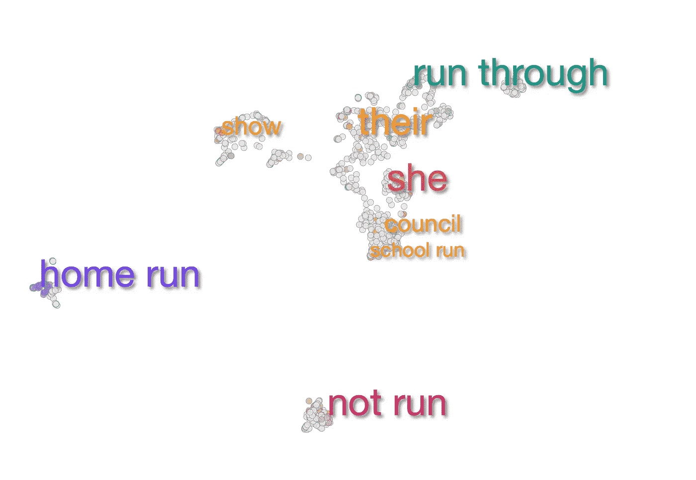
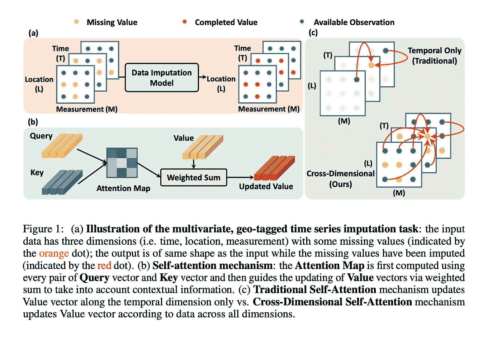
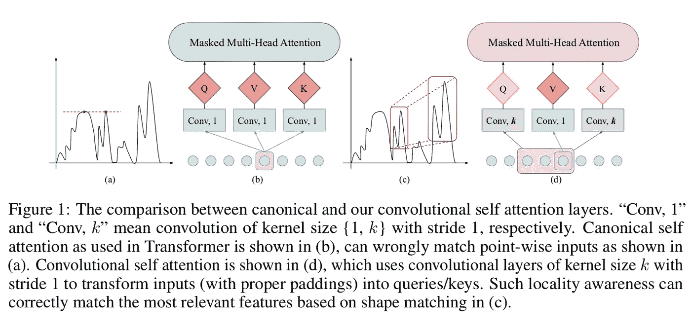
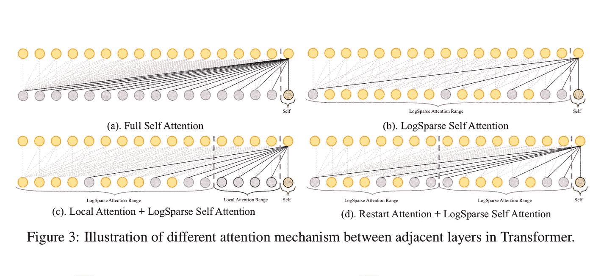

# 关注时间序列预测和分类

> 原文：<https://towardsdatascience.com/attention-for-time-series-classification-and-forecasting-261723e0006d?source=collection_archive---------2----------------------->

## 利用 NLP 的最新进展进行时间序列预测和分类

*   注意这篇文章发表于 10/18/19，我不知道为什么媒体说它来自 4/9/19。这篇文章包含了最近和最新的结果，包括将在 Neurips 2019 上发表的文章和刚刚在今年 8 月发表的预印本。
*   2020 年 8 月 24 日更新 **:** 很多人要求更新。我没有时间就这个主题写另一篇文章，但是你可以在[流量预测库](https://github.com/AIStream-Peelout/flow-forecast)中找到 transformer 和其他几个模型的实现。

变形金刚(特别是自我关注)推动了 NLP 的重大进展。它们使伯特、GPT-2 和 XLNet 等模型形成了强大的语言模型，可用于生成文本、翻译文本、回答问题、分类文档、总结文本等等。随着他们最近在 NLP 中的成功，人们会期望对时间序列预测和分类等问题的广泛适应。毕竟，两者都涉及处理顺序数据。然而，到目前为止，关于它们适应时间序列问题的研究仍然有限。此外，尽管一些结果很有希望，但其他结果仍较为复杂。在本文中，我将回顾当前关于应用变压器的文献，以及对时间序列问题的更广泛关注，讨论当前的障碍/限制，并集思广益可能的解决方案，以(希望)使这些模型达到与 NLP 相同的成功水平。这篇文章假设你对软注意、[、自我注意](https://lilianweng.github.io/lil-log/2018/06/24/attention-attention.html)和 transformer 架构有一个基本的了解。如果你不喜欢，请阅读其中一篇链接的文章。你也可以观看我在 [PyData Orono 展示之夜](https://www.youtube.com/watch?v=gk_j6CNl_E0)的视频。

## **关注时间序列数据:回顾**

对时间序列数据进行准确预测和分类的需求跨越了几乎每个行业，并且远远早于机器学习。例如，在医院中，您可能希望尽早对死亡率最高的患者进行分类，并预测患者的住院时间；在零售业，你可能想预测需求和销售；公用事业公司希望预测用电量等。

尽管深度学习在计算机视觉方面取得了成功，但许多时间序列模型仍然很肤浅。特别是，在行业中，许多数据科学家仍然利用简单的自回归模型，而不是深度学习。在某些情况下，他们甚至可能使用像 XGBoost 这样的模型，以人工制造的时间间隔进行馈送。通常，选择这些方法的常见原因仍然是可解释性、有限的数据、易用性和培训成本。虽然没有单一的解决方案来解决所有这些问题，但深度模型提供了一个令人信服的案例。在许多情况下，它们以注意力热图的形式提供了整体性能改进(其他普通 lstm/rnn)和可解释性的好处。此外，在许多情况下，它们比使用 RNN/LSTM 更快(特别是使用我们将讨论的一些技术)。

一些论文研究了使用基本的和修改的注意机制的时间序列数据。 [LSTNet](https://arxiv.org/abs/1703.07015) 是最早提出对多元预测时间序列使用 LSTM +注意机制的论文之一。[多变量时间序列预测的时间模式注意](https://arxiv.org/pdf/1809.04206.pdf)由 Shi Shun-Yao 等人提出，主要关注于应用特别针对多变量数据的注意。这种机制旨在解决多变量时间序列中包含噪声变量的问题，并引入一种比简单平均更好的方法。具体来说，

> 行上的注意力权重选择那些有助于预测的变量。因为上下文向量 vt 现在是包含跨多个时间步长的信息的行向量的加权和，所以它捕获时间信息。

简单地说，这旨在从各种特征时间序列数据中选择有用的信息来预测目标时间序列。首先，他们在 RNNs 隐藏状态的行向量上利用 2d 卷积。随后是一个评分函数。最后，他们使用 sigmoid 激活代替 softmax，因为他们期望多个变量与预测相关。其余的遵循一个相当标准的注意力练习。

Code for the temporal pattern attention mechanism. Notice that the authors choose to use 32 filters.

Diagram from the paper

就结果而言，该模型在预测太阳能和电力需求、交通和汇率方面优于(使用相对绝对误差)其他方法，包括标准自回归模型和 LSTNet。

尽管这篇文章没有使用自我关注，但我认为这是一个非常有趣且经过深思熟虑的对关注的使用。许多时间序列研究似乎集中于单变量时间序列数据。此外，那些研究多变量时间序列的人往往只扩展了注意机制的维度，而不是将其横向应用于特征时间序列。这可能是有意义的，看看是否修改自我注意机制可以选择相关的源时间序列数据来预测目标。本文的完整代码可在 GitHub 上公开获取。

## **自我关注到底是怎么回事？**

在我们深入时间序列部分之前，让我们先简单回顾一下自我关注的几个细节。有关更详细的检查，请参见这篇关于注意力数学的[文章](https://srome.github.io/Understanding-Attention-in-Neural-Networks-Mathematically/)或[图示的转换图](http://jalammar.github.io/illustrated-transformer/) r。对于自我注意力，回想一下，我们通常有查询、关键字、值向量，它们是通过嵌入与权重矩阵的简单矩阵乘法形成的。很多解释性文章没有提到的是[查询、键和值通常可以来自不同的来源，这取决于任务](https://stats.stackexchange.com/questions/421935/what-exactly-are-keys-queries-and-values-in-attention-mechanisms)，并且根据它是编码器还是解码器层而有所不同。例如，如果任务是机器翻译，编码器中的查询、键和值向量将来自源语言，但是解码器中的查询、键和值向量将来自目标语言。然而，在无监督语言建模的情况下，它们通常都是由源序列形成的。稍后我们将会看到，许多自我关注时间序列模型修改了这些值是如何形成的。

其次，自我注意通常需要位置编码，因为它不知道序列顺序。它通常通过添加到单词或时间步长嵌入而不是连接来结合这种位置信息。这有点奇怪，因为您可能会认为将位置编码直接添加到单词嵌入会对它造成伤害。然而，根据这个 [Reddit 响应](https://www.reddit.com/r/MachineLearning/comments/cttefo/d_positional_encoding_in_transformer/exs7d08?utm_source=share&utm_medium=web2x)，由于单词嵌入的高维度，位置编码得到近似正交性(即，位置编码和单词嵌入已经占据不同的空间)。此外，海报认为正弦和余弦有助于给邻近的词相似的位置嵌入。

但最终这仍然留下了一个挥之不去的问题:在这方面，直接连接不是更好吗？这是我目前没有直接答案的事情。然而，最近有一些关于创建更好的位置嵌入的好论文。transformer-XL(XLNet 的基础)有自己特定的关系嵌入。NIPs 2019 年的论文“功能时间表征学习的自我关注”也研究了通过功能特征地图创建更有效的位置表征(尽管该论文目前不在 arxiv 上)。

许多最近的研究分析了在像伯特这样的模型中实际发生了什么。虽然完全面向 NLP，但这些研究可以帮助我们了解如何有效地利用这些时间序列数据架构，以及预测可能出现的问题。

在《T2》中，伯特在看什么？伯特注意力的分析“作者分析了伯特的注意力，并调查了语言关系。这篇论文很好地说明了自我关注(或任何类型的关注)是如何自然地有助于解释的。因为我们可以使用注意力权重来可视化焦点的相关部分。

Figure 5 from the paper. This technique of illustrating attention weights is highly useful for interpretability purposes and cracking open the “black box” of deep learning. Similar methods of analyzing specific attention weights could show which time steps or time series a model focuses on when predicting.

同样有趣的是，作者发现了以下事实:

> 我们发现大多数头很少关注当前令牌。然而，有一些头专门专注于下一个或前一个令牌，尤其是在网络的早期层

显然，在时间序列数据中，注意力集中在“关注下一个标记”是有问题的。因此，在处理时间序列时，我们将不得不应用某种掩码。其次，很难判断这是否仅仅是伯特接受训练的语言数据的产物，或者更广泛地说，这是否可能随着多头注意力而发生。为了形成语言表达，关注最接近的单词是很有意义的。然而，时间序列数据的变化更大，在某些时间序列中，因果关系可能来自更早的步骤(例如，对于一些河流，暴雨可能需要 24 小时以上才能抬高河水)。

[十六个头真的比一个好吗](https://arxiv.org/pdf/1905.10650.pdf)

在这篇文章中，作者发现修剪几个注意力头对表现的影响有限。一般来说，只有当超过 20%的注意力被削减时，表现才会显著下降。这与时间序列数据特别相关，因为我们经常处理长相关性。尤其是仅消融单个注意力头部似乎对分数几乎没有影响，并且在某些情况下导致更好的表现。

From p. 6 of the article. Using fewer attention heads may serve as an effective strategy for reducing the computational burden of self-attention for time series data. There seems to be a substantial amount of overlap of certain heads. In general it might make sense to train on more data (when available) rather than have more heads.

[可视化伯特的几何图形](https://arxiv.org/pdf/1906.02715.pdf)

Umap visualization of the different semantic sub-spaces of the word “run.” Visualization made using context atlas [https://storage.googleapis.com/bert-wsd-vis/demo/index.html?#word=run](https://storage.googleapis.com/bert-wsd-vis/demo/index.html?#word=run) . It would be interesting to create Umap visualization of different time series representations from a large scale trained transformer model.

本文探讨了伯特模型中的几何结构。他们得出结论，BERT 内部似乎有解析树的几何表示。他们还发现在更大的嵌入空间中存在语义上有意义的子空间。虽然这一探索显然是以语言学为重点的，但它提出的主要问题是，如果伯特学习了这些有语言学意义的模式，那么它会学习类似的时间相关模式吗？例如，如果我们大规模训练一个 transformer 时间序列，我们会在嵌入空间中发现什么？例如，我们是否会看到相似的患者轨迹聚集在一起，或者如果我们对许多不同的流进行训练以进行洪水预测，它是否会将具有相似释放周期的坝馈流分组在一起，等等。在数千个不同的时间序列上对变压器进行大规模训练可以证明是有洞察力的，并增强我们对数据的理解。作者提供了两个很酷的 GitHub 页面，带有交互式可视化，您可以使用它们来进一步探索。

2019 年 ICLR 的另一项有趣的研究工作是[减少对轻量级和动态卷积的关注](https://arxiv.org/abs/1901.10430)。这项工作调查了为什么自我关注的工作，并提出了动态回旋作为替代。动态卷积的主要优点是，与自关注相比，它们在计算上更简单且更具并行性。作者发现这些动态回旋大致相当于自我注意。作者还采用了重量共享，这进一步减少了总体所需的参数。有趣的是，尽管潜在的速度提高，我还没有看到任何时间序列预测研究采用这种方法(至少目前没有)。

## 时间序列的自我关注

只有几篇研究论文在时间序列数据上使用了自我注意，并取得了不同程度的成功。如果你知道任何额外的，请让我知道。此外，GitHub 上的 [huseinzol05](https://github.com/huseinzol05) 已经[实现了一个普通版本的股票预测](https://github.com/huseinzol05/Stock-Prediction-Models/blob/master/deep-learning/16.attention-is-all-you-need.ipynb)。

[参加和诊断](https://arxiv.org/abs/1711.03905)利用自我对医疗时间序列数据的关注。该时间序列数据是多变量的，包含诸如患者心率、SO2、血压等信息。

The architecture for attend and diagnose

他们的架构从每个临床因素的一维卷积开始，用于实现初步嵌入。回想一下，1D Conv 将利用特定长度的内核，并对其进行一定次数的处理。重要的是要注意，这里 1-D 卷积并不像通常那样应用于时间序列步骤。因此，如果初始时间序列包含 100 步，它仍将包含 100 步。相反，它被应用于创建每个时间步长的多维表示。有关时间序列数据的一维卷积的更多信息，请参考这篇[文章。](https://blog.goodaudience.com/introduction-to-1d-convolutional-neural-networks-in-keras-for-time-sequences-3a7ff801a2cf)在一维卷积步骤之后，作者使用位置编码:

> 通过在训练和预测期间将时间步长 t 映射到相同的随机化查找表来执行编码。

这不同于标准的自我注意，标准的自我注意使用余弦和正弦函数来捕捉单词的位置。位置编码被加入(可能是添加的，虽然…作者没有指出具体的方式)到 1D Conv 层的各个输出中。

接下来是自我关注操作。这与标准类型的多头注意力操作基本相同，但也有一些细微的区别。首先，如上所述，由于这是时间序列数据，自我注意机制不能包含整个序列。它只能包含所考虑的时间步长。为了做到这一点，作者似乎使用了一种屏蔽机制，这种机制也屏蔽了太久以前的时间戳。不幸的是，作者对此的实际公式非常不具体，但是，如果我不得不猜测，我会假设它大致类似于作者在克服 transformer 瓶颈时展示的屏蔽操作。

在多头关注之后，现在转换的嵌入在有用之前仍然需要采取额外的步骤。通常在标准的自我关注中，我们有一个附加和层规范化组件。层标准化将标准化自我关注和原始嵌入的输出([参见此处了解更多关于此](/breaking-bert-down-430461f60efb)的信息)，然而，作者反而选择密集插值。这意味着从多头注意力模块输出的嵌入以对捕获句法和结构信息有用的方式被获取和使用。

在密集插值算法之后，有一个线性层，后面是 softmax、sigmoid 或 relu 层(取决于任务)。该模型本身是多任务的，因此它旨在预测住院时间、诊断代码、失代偿风险、住院时间和死亡率。

总的来说，我认为这篇论文很好地展示了自我关注在多元时间序列数据中的应用。这个结果在发布的时候是最先进的，现在已经被 TimeNet 超越了。然而，这主要是由于基于迁移学习的预训练的有效性，而不是架构。如果我不得不猜测类似的沙子预训练会导致更好的表现。

我对这篇文章的主要批评主要是从可再现性的角度，因为没有提供任何代码，各种超参数(如内核大小)要么没有包括在内，要么只是模糊地暗示了一下。其他概念讨论得不够清楚，如掩蔽机制。我目前正试图在 PyTorch 中重新实现，当我对它的可实现性更有把握时，我会在这里发布代码。

最近另一篇相当有趣的论文是马家伟等人的“[多变量、地理标记时间序列插补的跨维度自我关注](https://arxiv.org/abs/1905.09904)”。这篇文章主要关注于插补(估计)缺失的时间序列值。有效的数据插补对于许多现实应用非常重要，因为传感器经常会出现故障，导致数据丢失。这在尝试预测或分类数据时会产生问题，因为缺失值或空值会影响预测。作者建立了他们的模型来使用交叉注意机制，该机制通过利用不同维度的数据来工作，例如时间位置和测量。

This is another fascinating example of modifying the standard self-attention mechanism to work across multi dimensional data. In particular as stated above the value vector is meant to capture contextual information. Oddly this is in contrast to what we will see later where the query and key vectors utilize contextual information but not the value vector.

作者在几个交通预测和空气质量数据集上评估了他们的结果。他们从预测和估算两方面进行评估。为了测试插补，他们丢弃了一定比例的值，并尝试使用模型对其进行插补。他们将这些与实际值进行比较。在所有缺失数据率方面，他们的模型优于其他 RNN 和统计插补方法。在预测方面，该模型也取得了最好的性能。

[增强局部性，突破内存瓶颈变压器对时间序列的预测](https://arxiv.org/abs/1907.00235)李世阳等。

这是最近的一篇文章，将于 2019 年在 NIPS 上发表。它着重于将转换器应用于时间序列数据的几个问题。作者基本上认为经典的自我注意确实充分利用了情境数据。他们认为，这尤其会给随季节变化的动态时间序列数据带来问题(例如，预测假期前后与一年中其他时间的销售额，或者预测极端天气模式)。为了解决这个问题，他们引入了一种生成查询和值向量的新方法。

> 我们提出了*卷积*自我关注【机制】，通过使用因果卷积在自我关注层产生查询和密钥。知道局部上下文(例如形状)的查询键匹配可以帮助模型实现更低的训练误差，并进一步提高其预测精度。

From p. 3 of article. Essentially with other versions of multi-headed attention query, value, and key vectors are created off a single time-step, whereas a larger kernel size allows it to create the key and query vectors from multiple time-steps. This allows the model to be able to understand a greater degree of context.

本文的第二部分主要关注与 transformer 模型的内存使用相关的解决方案。自我注意是非常占用内存的，特别是对于很长的序列(具体来说是 O(L))。作者提出了一种新的注意机制，即 O(L(log L))。有了这种自我关注机制，细胞只能以指数级的步长关注先前的细胞。例如，第五单元将负责第四单元和第二单元。它们还引入了这种日志关注的两种变体:本地关注和重启关注。更多信息见下图

From page 5\. of the article. All these variations have the same overall time complexity O(L(log L)²), however the actual runtime of Local Attention + Logsparse would likely be longest due to it attending to the most cells.

作者在几个不同的数据集上评估了他们的方法，包括耗电量(以 15 分钟为间隔记录)、旧金山的交通流量(以 20 分钟为间隔)、每小时的太阳能数据产量(来自 137 个不同的发电厂)和风力数据(28 个县风能潜力占总发电量的百分比的每日估计值)。他们选择ρ-分位数损失作为评估指标有点奇怪，因为通常我会期待 MAE、MAP、RMSE 或类似的时间序列预测问题。

Equation for p quantile regression loss.

我仍在努力理解这个指标到底代表了什么，但是至少从结果来看，分数越低越好。使用这一指标，他们的卷积自我注意力转换器优于 DeepAR、DeepState、ARIMA 和其他模型。他们还进行了一项消融研究，研究在计算七天预报时内核大小的影响。他们发现内核大小为 5 或 6 通常会产生最好的结果。

我认为这是一篇很好的研究文章，它解决了 transformer 在应用于时间序列数据时的一些缺点。我特别认为卷积核(大小大于 1)的使用在时间序列问题中非常有用，在时间序列问题中，您需要捕获关键和查询向量的周围环境。目前还没有代码，但 NeurIPs 仍然需要一个多月的时间，所以希望作者在现在和那时之间发布它。

## 结论和未来方向

总之，自我关注和相关体系结构已经导致了几个时间序列预测用例的改进，但是，总的来说，它们还没有得到广泛的应用。这可能与几个因素有关，如内存瓶颈、位置信息编码困难、关注点值以及缺乏对处理多元序列的研究。此外，在 NLP 之外，许多研究人员可能不熟悉自我注意及其潜力。虽然 ARIMA 等简单模型在许多情况下对解决行业问题很有意义，但我相信变形金刚也大有可为。

希望本文中总结的方法能对有效地将 transformers 应用于时间序列问题有所启发。在后续的文章中，我计划给出一个用 PyTorch 中的转换器对时间序列数据进行预测和分类的实际例子。欢迎在评论中提出任何反馈和/或批评。如果我有不正确的地方，请告诉我(鉴于这个话题的复杂性，这是很有可能的)，我会更新这篇文章。