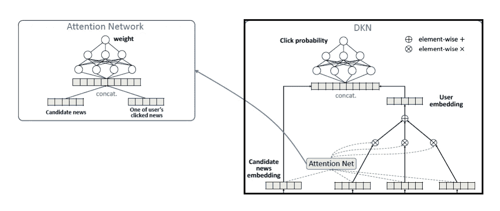

# 新闻推荐的注意力模型

> 原文：<https://towardsdatascience.com/attention-model-for-news-recommendation-cold-start-problem-dba18da8bf54?source=collection_archive---------17----------------------->

## 利用注意机制解决冷启动问题

Photo by [Sam Wheeler](https://unsplash.com/@mrsamwheeler?utm_source=medium&utm_medium=referral) on [Unsplash](https://unsplash.com?utm_source=medium&utm_medium=referral)

虽然奇异值分解为推荐系统提供了一个令人满意的解决方案，但是当新项目没有积累足够的数据时，它就不那么有效了。新闻推荐更具挑战性，因为它提出了三个额外的挑战:

1.  新闻文章对时间高度敏感
2.  用户对话题敏感，有不同的兴趣
3.  新闻语言是高度浓缩的，由每天创造的大量新实体组成

在本文中，我将向您展示如何利用注意力机制来解决推荐系统中的冷启动问题。

# 注意机制

注意机制有着悠久的应用历史，最近被引入来解决自然语言处理中的问题。注意机制使模型能够根据上下文对输入施加不同的权重。例如，在神经机器翻译(NMT)中，注意机制可以用来克服双向信息流。借助注意机制，NMT 模型可以通过“看”原文中的不同位置来生成单词。

新闻推荐系统的情况类似。推荐引擎要学会“看”相关的部分，忽略阅读历史中不相关的部分。

# 深度知识感知网络

在 HK01 中，我们的数据团队在新闻推荐系统上投入了巨大的努力。我们采用最先进的算法来改进原始的奇异值分解协同过滤算法。具体来说，我们使用带有三重丢失的自动编码器和 StarSpace 来学习文章嵌入。

 [## 使用具有三元组丢失自动编码器计算文档相似性

### 使用具有三重损失的去噪自动编码器生成嵌入，然后计算嵌入的余弦相似性

medium.com](https://medium.com/@LouisKitLungLaw/compute-document-similarity-using-autoencoder-with-triplet-loss-eb7eb132eb38)  [## 使用脸书空间学习文档嵌入

medium.com](https://medium.com/@LouisKitLungLaw/documents-embeddings-using-facebook-s-starspace-67b8d1feba32) 

对于问题 1 和 2，我们利用微软[1]提出的**深度知识感知网络(DKN)** ，来解决冷启动问题。我们用自己的文章嵌入代替知识嵌入，并保持注意力网络来学习用户兴趣和文章嵌入之间的相互作用。

Architecture of DKN

DKN 由两个网络组成。DKN 的整体建筑展示在右手边。为了预测点击概率，算法**学习聚合阅读历史序列，形成用户嵌入**。用户嵌入被视为阅读历史中文章嵌入的加权和。那么，问题来了:**如何求权重？**

每篇文章嵌入的权重由注意力网络获得。注意力网络对候选新闻、我们要预测的新闻和用户点击的新闻之间的交互进行建模。由于用户可能有各种各样的兴趣，并且不存在能够匹配每一个兴趣的单一新闻，注意力网络的作用是将候选新闻匹配到任何一个。

在获得权重后，该模型通过加权和生成用户嵌入，并将用户和候选新闻嵌入传递给前馈神经网络。

DKN 基本上是一个基于项目的算法。它不需要用户-项目交互数据来进行新项目推荐。而且，它可以在不干预的情况下处理多个利益。

# 结果

我们比较原始模型，奇异值分解的正则化版本，与奇异值分解和 DKN 的集合。通过仔细调整，集合可以实现比原始模型 10%的增量。

# 参考

[1]:周，，等.“深度兴趣网络点击率预测研究”第 24 届 ACM SIGKDD 知识发现国际会议论文集&数据挖掘。ACM，2018。