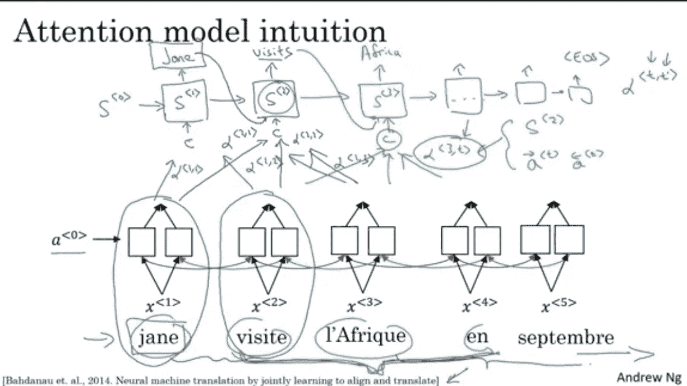
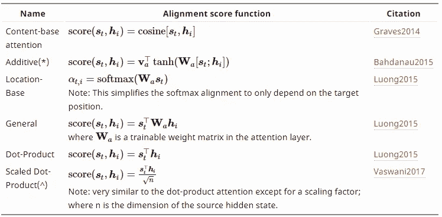
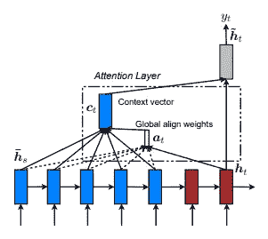
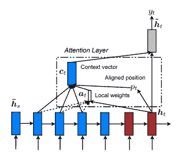
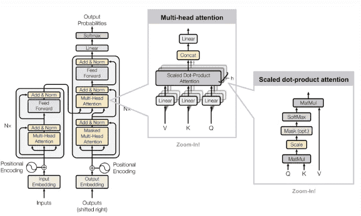

# 注意力模型简介

> 原文：<https://towardsdatascience.com/attention-networks-c735befb5e9f?source=collection_archive---------6----------------------->

在自然语言处理、机器翻译领域已经有了新的发展，并且大多数最新的(SOTA)结果已经使用注意力模型实现。胶水基准组长[板上最上面的模型](https://gluebenchmark.com/leaderboard)使用自关注模型*变形金刚。*

为了从最基本的意义上理解注意力，让我们从*吴恩达教授关于深度学习的*课程中举个例子

Source — Deep Learning Coursera

以上*注意*模型基于“ *Bahdanau 等人，2014 联合学习对齐和翻译的神经机器翻译”*的一篇论文。这是一个使用双向递归神经网络和*注意力进行序列到序列句子翻译的例子。*此处，上图中的符号“alpha”代表输出向量的每个时间步长的注意力权重。有几种方法计算这些权重“α”,例如使用**点积、具有单个隐藏层的神经网络模型**等。这些权重乘以源中的每个单词，然后该乘积与来自前一层的输出一起被馈送到语言模型，以获得当前时间步长的输出。这些字母值决定了源中每个单词的重要性，从而决定了输出的句子。

Souce-Lilian Weng Github post.

它是可用于计算注意力权重(alpha)的不同函数的列表，更普遍的说法是*对齐分数。*在(加性)函数中( *s < t >，h < i > )* 将前一时间步和源嵌入的输出串联起来，通过单层神经网络，输出为注意权重(α)。该神经网络模型与 RNN 模型并行训练，并且相应地调整这些权重。

## 注意力模型的类型:

1.  全球和地方关注(地方-m，地方-p)
2.  软硬注意
3.  自我关注

**全局注意力模型**

这和上面讨论的注意力模型是一样的。来自当前状态之前的每个源状态(编码器)和解码器状态的输入被考虑来计算输出。下面是全球注意力模型的图表。

Source-(Luong et.al. 2015)

从图中可以看出， *(a < t > )* 对齐权重或注意权重是使用每个编码器步骤和 *(h < t > )* 解码器前一步骤计算的。然后使用 *(a < t > )* 通过取*全局对齐权重*和*每个编码器步长*的乘积来计算上下文向量。然后，它被馈送到 RNN 单元，以找到解码器输出。

**局部注意力模型**

它与*全局注意力模型*的不同之处在于，在*局部注意力模型*中，仅使用来自源(编码器)的少数位置来计算对齐权重 *(a < t >)。下面是局部注意力模型的示意图。*

Source-(Luong et.al. 2015)

从图中可以看出，首先找到单对齐位置 *(p < t > )* ，然后使用来自源(编码器)层的单词窗口连同 *(h < t > )* 来计算对齐权重和上下文向量。

*局部注意-* 有单调对齐和预测对齐两种。在单调比对中，我们简单地将位置 *(p < t > )* 设置为“t”，而在预测比对中，位置 *(p < t > )* 不是仅仅假设为“t”，而是由预测模型预测。

**软硬注意**

软注意几乎和全局注意模型一样。

硬注意模型和局部注意模型的区别在于，局部模型在每一点上几乎都是不同的，而硬注意却不是。局部注意是硬注意和软注意的混合。最后给出了进一步研究的链接。

**自我关注模型**

> 关于同一输入序列的不同位置。理论上，自我注意可以采用上述任何得分函数，但只是用相同的输入序列替换目标序列。

**变压器网络**

变压器网络完全建立在自我关注机制上，不使用递归网络架构。变形金刚是用多头自关注模型制作的。

Source- Attention is all you need.

编码器层由两个子层组成，一个是多头注意，另一个是前馈神经网络。解码器由三个子层两个多头注意力网络构成，然后反馈给前馈网络。解码注意力网络从编码器输出获得输入，从解码器的前一层获得输出。

**参考链接**

1.  [注意？立正！](https://lilianweng.github.io/lil-log/2018/06/24/attention-attention.html)
2.  [神经机器翻译的有效方法](https://nlp.stanford.edu/pubs/emnlp15_attn.pdf)
3.  [Coursera 注意](https://www.coursera.org/lecture/nlp-sequence-models/attention-model-lSwVa)
4.  [初学者注意指南](https://skymind.ai/wiki/attention-mechanism-memory-network)
5.  [胶水基准排行榜](https://gluebenchmark.com/leaderboard)
6.  [关注 CNN](http://proceedings.mlr.press/v37/xuc15.pdf)

**引文**

1.  通过联合学习对齐和翻译的神经机器翻译
2.  神经机器翻译的有效方法。

如果有些地方不正确，或者我应该再补充些什么，请在下面评论。