# 收件人:图文并茂

> 原文：<https://towardsdatascience.com/attn-illustrated-attention-5ec4ad276ee3?source=collection_archive---------3----------------------->

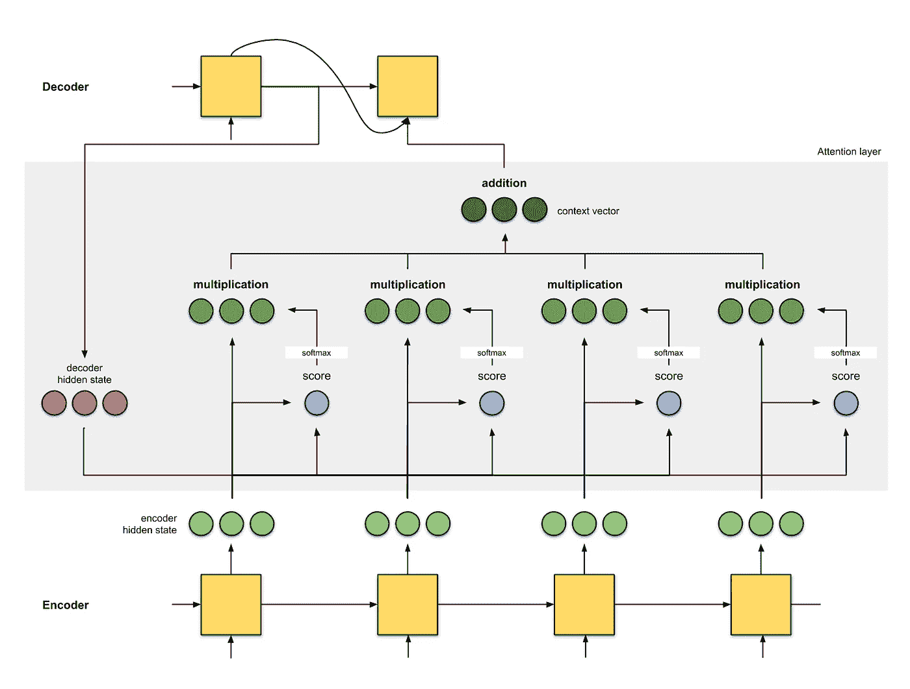

## gif 图片中的注意力，以及如何在谷歌翻译这样的机器翻译中使用它

*(TLDR:动画为关注* [*此处*](#0458) *)*

*变更日志:【2022 年 1 月 5 日—修复错别字并提高清晰度*

F 几十年来，统计机器翻译一直是占主导地位的翻译模式 [9](#df28) ，直到**神经机器翻译** (NMT)的诞生。NMT 是一种新兴的机器翻译方法，它试图建立和训练一个单一的大型神经网络，该网络读取输入文本并输出翻译[ [1](#30c6) ]。

NMT 的先驱是来自 [Kalchbrenner 和 Blunsom (2013)](https://www.aclweb.org/anthology/D13-1176) 、 [Sutskever *等人的提议。al* (2014)](https://arxiv.org/abs/1409.3215) 和 [Cho。 *etal* (2014b)](https://arxiv.org/abs/1409.1259) ，其中更熟悉的框架是从 Sutskever *等人那里学习的序列对序列(seq2seq)。艾尔*。本文将基于 seq2seq 框架，以及如何在其上建立注意力。

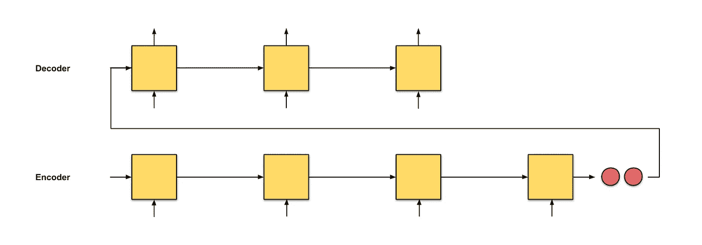

Fig. 0.1: seq2seq with an input sequence of length 4

在 **seq2seq** 中，想法是拥有两个具有编码器-解码器架构的递归神经网络(RNNs):逐个读取输入单词以获得固定维度的向量表示(编码器)，并根据这些输入，使用另一个 RNN(解码器)逐个提取输出单词。解释改编自 [5](#16cb) 。

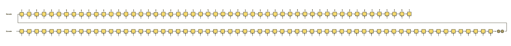

Fig. 0.2: seq2seq with an input sequence of length 64

seq2seq 的问题在于，解码器从编码器接收到的*唯一的*信息是**最后一个编码器隐藏状态**(图 0.1 中的 2 个微小红色节点)，这是一种矢量表示，就像输入序列的数字汇总。因此，对于一个长的输入文本(图 0.2)，我们不合理地期望解码器只使用这个*一个*向量表示(希望它“充分概括了输入序列”)来输出翻译。这可能会导致灾难性的遗忘。这一段有 100 个单词。你能把这一段翻译成你知道的另一种语言吗，就在这个问号后面？

如果不能，那我们就不应该对解码者这么残忍。不仅仅是一个向量表示，让我们在每个编码器时间步给解码器一个来自*的向量表示，这样它就可以做出消息灵通的翻译，怎么样？进入**关注**。*

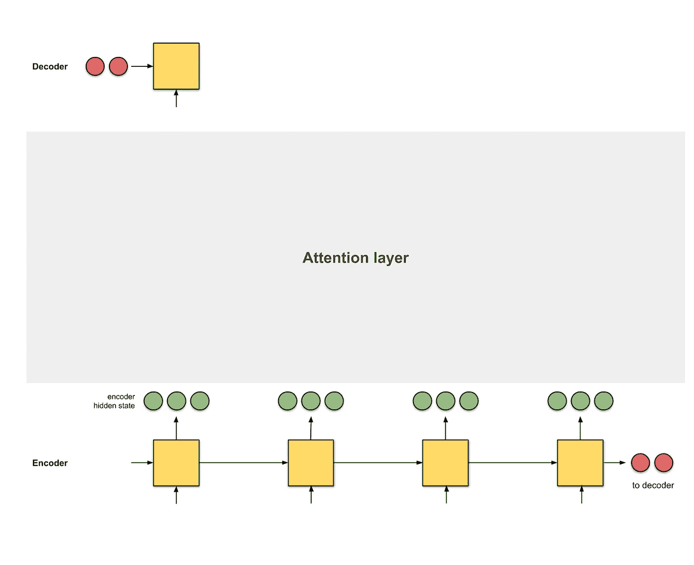

Fig 0.3: Adding an attention layer as an interface between encoder and decoder. Here, the first decoder time step is getting ready to receive information from the encoder before giving the first translated word.

注意是编码器和解码器之间的接口，它向解码器提供来自每个编码器隐藏状态的信息(除了图 0.3 中红色的隐藏状态)。通过这种设置，模型可以有选择地关注输入序列的有用部分，从而学习它们之间的*对齐*。这有助于模型有效地处理长输入句子[ [9](#df28) ]。

> ***定义:对齐*** *对齐是指将原文的片段与其对应的译文片段进行匹配。定义改编自* [*此处*](https://www.andovar.com/alignment-of-translation) *。*

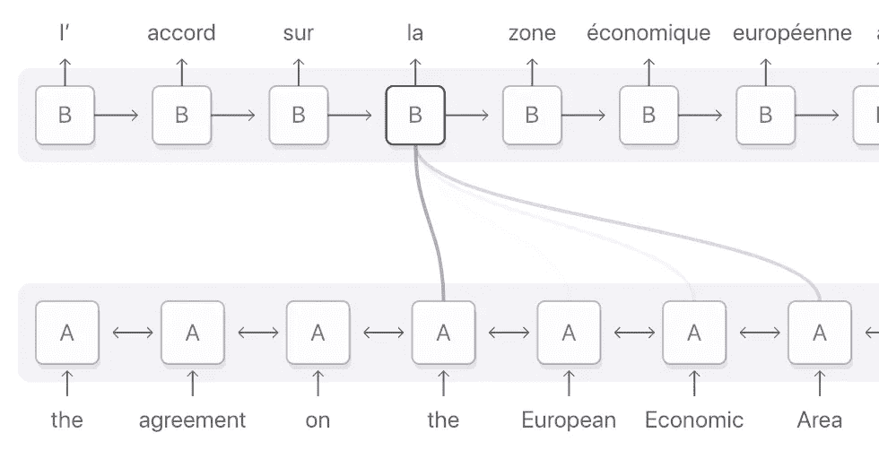

Fig. 0.3: Alignment for the French word ‘la’ is distributed across the input sequence but mainly on these 4 words: ‘the’, ‘European’, ‘Economic’ and ‘Area’. Darker purple indicates better attention scores ([Image source](https://distill.pub/2016/augmented-rnns/#attentional-interfaces))

正如[ [2](#7eef) 中所介绍的，注意力有两种类型。使用所有编码器隐藏状态的注意力类型也被称为*全局注意力*。相反，*局部注意*仅使用编码器隐藏状态的子集。由于本文的**范围是全球关注**，本文中提到的任何“关注”都是指“全球关注”

这篇文章总结了注意力是如何使用动画工作的，这样我们就可以在没有数学符号的情况下(或者在阅读了充满数学符号的论文或教程之后)理解它们😬。作为例子，我将分享过去 5 年设计的 4 个 NMT 建筑。我还会在这篇文章中穿插一些关于一些概念的直觉，所以请保持警惕！

**目录**1。[注意:概述](#1d00)2。[注意:例题](#c09a)
3。[概要](#14eb)
附录:[分数函数](#ba24)

## 1.注意:概述

在我们看注意力是如何使用的之前，请允许我用 seq2seq 模型与你分享翻译任务背后的直觉。

> ***直觉:seq2seq*** *译者从头到尾阅读德文文本。一旦完成，他开始逐字翻译成英语。如果句子非常长，他可能会忘记在文章的前几部分读过的内容。*

这是一个简单的 seq2seq 模型。我将要经历的注意力层的分步计算是一个 seq 2 seq+注意力模型。这里有一个关于这个模型的快速直觉。

> ***直觉:seq2seq +注意*** *一个翻译读德文文本*，同时从头到尾写下关键词*，之后开始翻译成英文。在翻译每个德语单词时，他会使用自己写下的关键词。*

注意力通过给每个单词分配一个分数来将不同的焦点放在不同的单词上。然后，使用 softmaxed 分数，我们使用编码器隐藏状态的加权和来聚集编码器隐藏状态，以获得上下文向量。关注层的实现可以分为 4 个步骤。

**步骤 0:准备隐藏状态。**

让我们首先准备好所有可用的编码器隐藏状态(绿色)和第一个解码器隐藏状态(红色)。在我们的例子中，我们有 4 个编码器隐藏状态和当前解码器隐藏状态。(注意:最后合并的编码器隐藏状态作为*输入*输入到解码器的第一个时间步长。解码器第一个时间步长的输出称为第一个解码器隐藏状态，如下所示。)


Fig. 1.0: Getting ready to pay attention

**步骤 1:获得每个编码器隐藏状态的分数*。***

分数(标量)由分数函数(也称为*比对分数函数* [ [2](#7eef) ]或*比对模型* [ [1](#30c6) )获得。在这个例子中，分数函数是解码器和编码器隐藏状态之间的点积。

各种得分函数见[附录 A](#ba24) 。

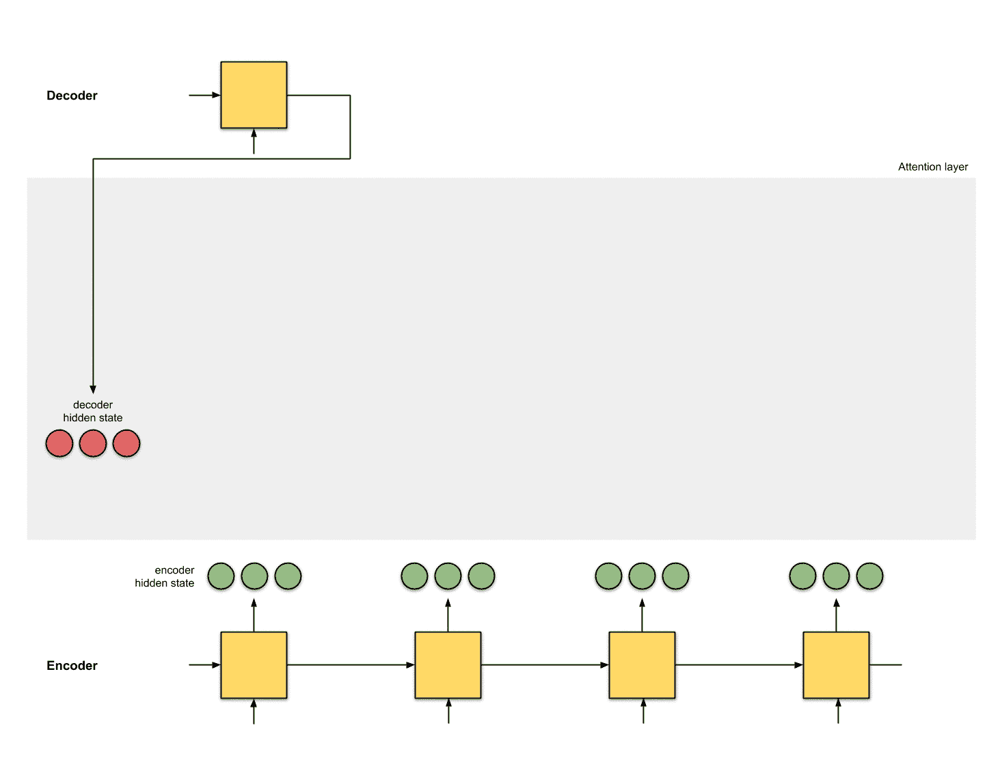

Fig. 1.1: Get the scores

```
**decoder_hidden** = [10, 5, 10]**encoder_hidden  score**
---------------------
     [0, 1, 1]     15 (= 10×0 + 5×1 + 10×1, the dot product)
     [5, 0, 1]     60
     [1, 1, 0]     15
     [0, 5, 1]     35
```

在上面的例子中，我们获得了编码器隐藏状态`[5, 0, 1]`的高关注分数`60`。这意味着下一个字(解码器的下一个输出)将会受到编码器隐藏状态的严重影响。

第二步:通过一个 softmax 层运行所有的分数。

我们将分数放到一个 softmax 层，这样 soft max 的分数(标量)加起来就是 1。这些 softmaxed 分数代表*注意力分布* [ [3](#286f) ， [10](#a255) 。

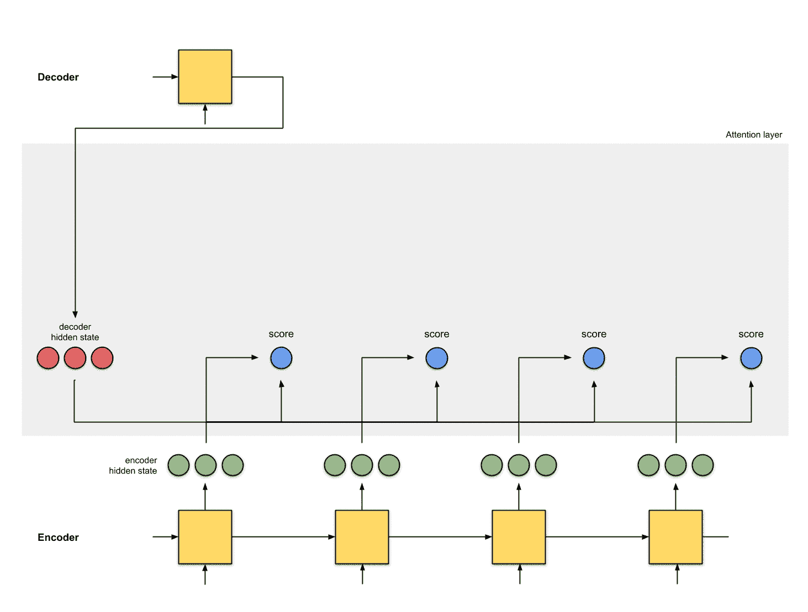

Fig. 1.2: Get the softmaxed scores

```
**encoder_hidden  score  score^**
-----------------------------
     [0, 1, 1]     15       0
     [5, 0, 1]     60       1
     [1, 1, 0]     15       0
     [0, 5, 1]     35       0
```

请注意，根据 softmaxed 分数`score^`，注意力的分布仅如预期的那样放在`[5, 0, 1]`上。实际上，这些数字不是二进制的，而是介于 0 和 1 之间的浮点数。

**第三步** : **将每个编码器隐藏状态乘以其 softmaxed 分数。**

通过将每个编码器隐藏状态与其 softmaxed 分数(标量)相乘，我们获得了*对齐向量* [ [2](#7eef) ]或*注释向量* [ [1](#30c6) ]。这正是对齐发生的机制。

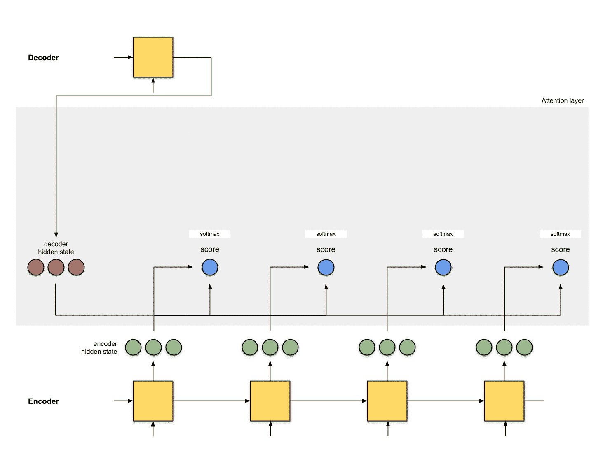

Fig. 1.3: Get the alignment vectors

```
**encoder  score  score^  alignment**
---------------------------------
[0, 1, 1]   15      0   [0, 0, 0]
[5, 0, 1]   60      1   [5, 0, 1]
[1, 1, 0]   15      0   [0, 0, 0]
[0, 5, 1]   35      0   [0, 0, 0]
```

在这里，我们看到除了`[5, 0, 1]`之外的所有编码器隐藏状态的对齐由于低注意力分数而减少到 0。这意味着我们可以预期第一个翻译的单词应该与嵌入了`[5, 0, 1]`的输入单词相匹配。

**第四步** : **对对齐向量求和。**

将对齐向量相加以产生*上下文向量* [ [1](#30c6) ， [2](#7eef) ]。上下文向量是来自前一步骤的对齐向量的聚合信息。

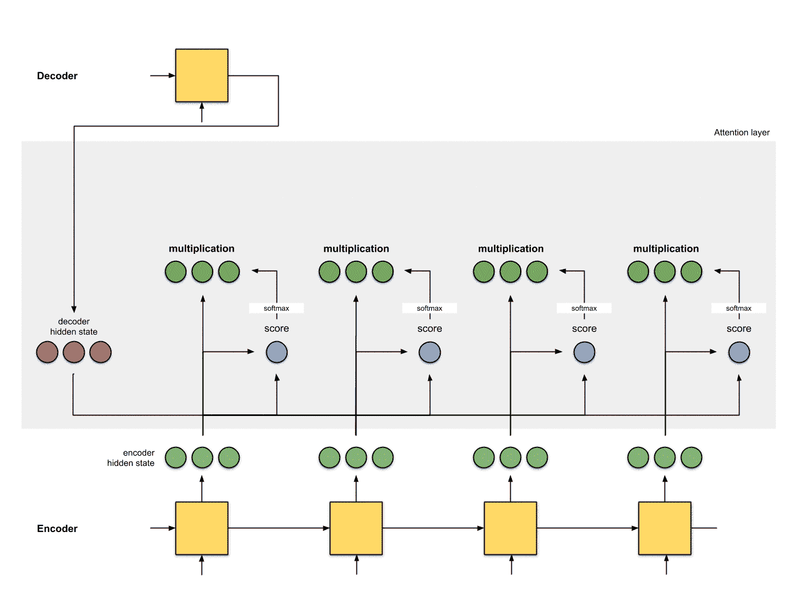

Fig. 1.4: Get the context vector

```
**encoder  score  score^  alignment**
---------------------------------
[0, 1, 1]   15     0  [0, 0, 0]
[5, 0, 1]   60     1  [5, 0, 1]
[1, 1, 0]   15     0  [0, 0, 0]
[0, 5, 1]   35     0  [0, 0, 0]**context** = [0+5+0+0, 0+0+0+0, 0+1+0+0] = [5, 0, 1]
```

**第五步** : **将上下文向量馈入解码器。**

完成的方式取决于架构设计。稍后，我们将在 2a、2b 和 2c 部分的示例中看到该架构如何为解码器利用上下文向量。

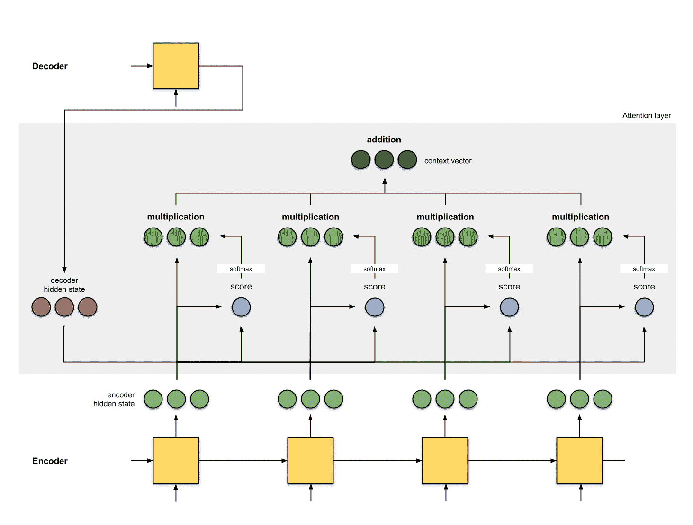

Fig. 1.5: Feed the context vector to the decoder

差不多就是这样！这是完整的动画:


Fig. 1.6: Attention

> ***训练和推理*** *在推理过程中，每个解码器时间步长 t 的输入是解码器时间步长* t-1 *的* ***预测输出*** *。
> 训练时，输入到每个解码器时间步长 t 是我们从解码器时间步长* t-1 *得到的* ***地真值输出*** *。*
> 
> ***直觉:注意力*实际上*是如何工作的？***
> 
> *答案:反向传播，惊喜惊喜。反向传播将尽一切努力确保输出接近地面真实情况。这是通过改变 RNNs 中的权重和得分函数(如果有的话)来实现的。这些权重会影响编码器隐藏状态和解码器隐藏状态，进而影响注意力得分。*

[ [返回页首](#d442) ]

## 2.注意:示例

在前面的章节中，我们已经看到了 seq2seq 和 seq 2 seq+注意力架构。在接下来的几个小节中，让我们研究另外 3 个基于 seq2seq 的 NMT 架构，它们实现了注意力。为了完整起见，我还附上了他们的双语评估替角(BLEU)分数——这是评估生成句子与参考句子的标准指标。

## 2a。巴赫达瑙等人。铝(2015) [ [1](#30c6)

这种注意力的实现是创始注意力之父之一。作者在论文标题“通过学习联合对齐和翻译的神经机器翻译”中使用了“对齐”一词，指的是在训练模型时调整直接负责得分的权重。以下是关于该架构需要注意的事项:

1.  编码器是双向(正向+反向)门控循环单元(BiGRU)。解码器是一个 GRU，其初始隐藏状态是从反向编码器 GRU(下图中未显示)的最后一个隐藏状态修改而来的向量。
2.  注意力层中的得分函数是**加法/串联**。
3.  下一个解码器步骤的输入是来自前一个解码器时间步骤的生成字(粉红色)和来自当前时间步骤的上下文向量(深绿色)之间的连接。

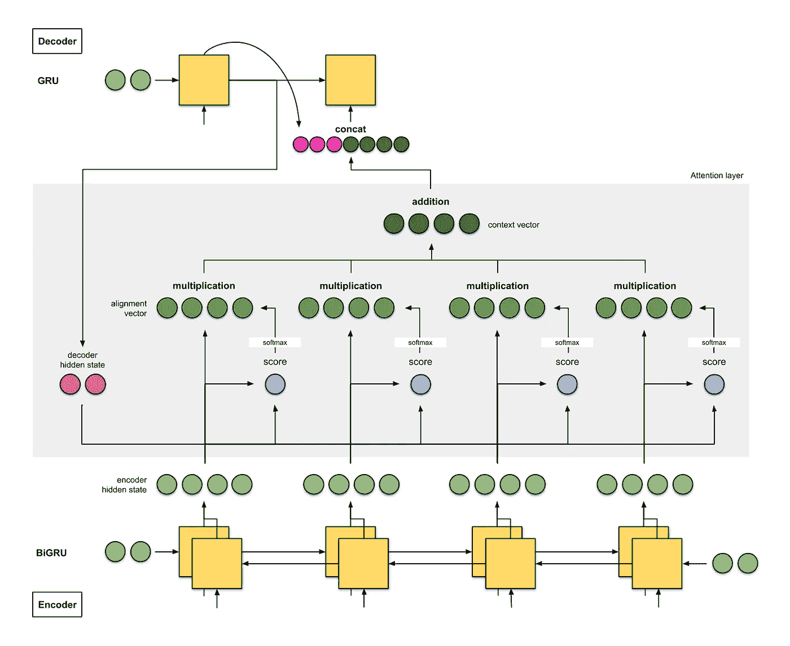

Fig. 2a: NMT from Bahdanau et. al. Encoder is a BiGRU, decoder is a GRU.

作者在 WMT 大学的 14 个英语-法语数据集上取得了 26.75 的 BLEU 分数**。**

> ***直觉:seq2seq 带双向编码器+注意力***
> 
> *译者 A 一边读德文文本，一边写下关键词。翻译者 B(承担高级角色，因为他具有从倒读句子翻译句子的额外能力)从最后一个单词到第一个单词阅读相同的德语文本，同时记下关键词。这两个人定期讨论他们到目前为止读到的每一个单词。阅读完这篇德语文章后，译者 B 的任务是根据讨论内容和他们两人收集的综合关键词，将德语句子逐字翻译成英语。*
> 
> *译者 A 是前进的 RNN，译者 B 是落后的 RNN。*

## 2b。Luong 等人。铝(2015) [ [2](#7eef)

*基于注意力的神经机器翻译的有效方法*的作者已经把简化和概括 Bahdanau *等人的架构作为一个重点。艾尔*。方法如下:

1.  编码器是两层长短期记忆(LSTM)网络。解码器也具有相同的架构，其初始隐藏状态是最后的编码器隐藏状态。
2.  他们试验的评分函数是(i) **加法/串联**、(ii) **点积**、(iii) **基于位置的**、(iv)**‘通用’**。
3.  来自当前解码器时间步长的输出和来自当前时间步长的上下文向量之间的连接被馈送到前馈神经网络，以给出当前解码器时间步长的最终输出(粉红色)。

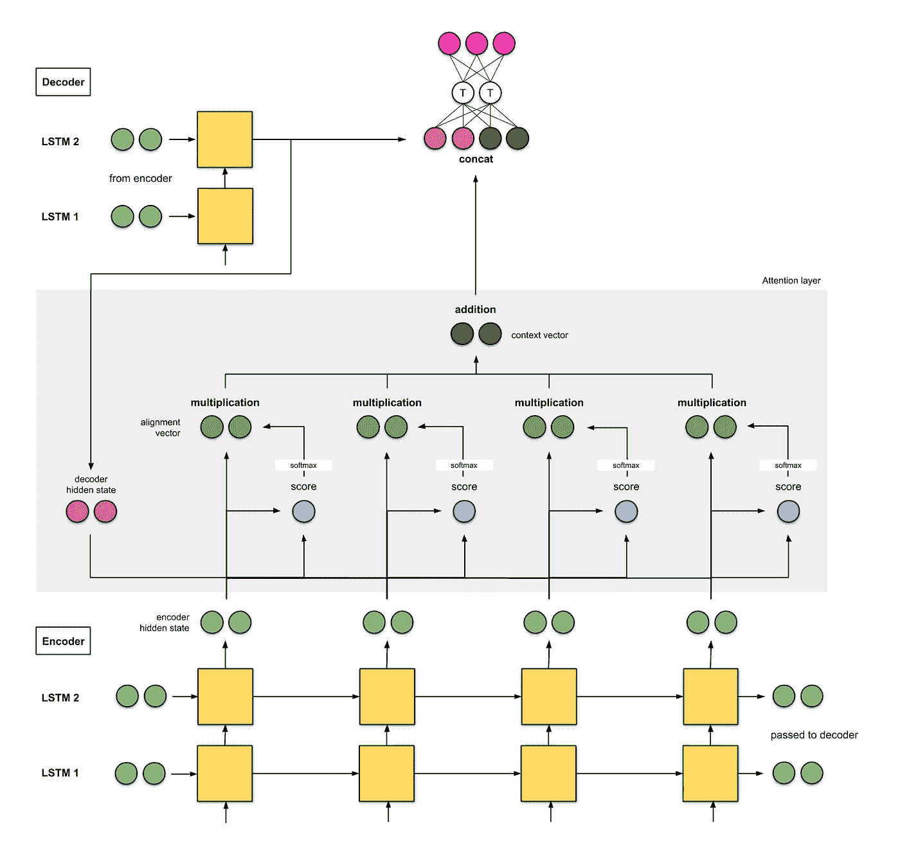

Fig. 2b: NMT from Luong et. al. Encoder is a 2 layer LSTM, likewise for the decoder.

在 WMT 2015 年英语对德语的测试中，该模型获得了 25.9 分的 BLEU 分数。

> ***直觉:seq2seq 带 2 层堆栈编码器+注意***
> 
> *译者 A 一边读德语文本，一边写下关键词。同样，译者 B(比译者 A 级别高)也阅读相同的德语文本，同时记下关键词。请注意，初级译者 A 必须向译者 B 报告他们阅读的每个单词。一旦阅读完毕，他们两人会根据他们所掌握的关键词，一起将句子逐字翻译成英语。*

[ [返回页首](#d442) ]

## 2c。谷歌的神经机器翻译(GNMT) [ [9](#df28)

因为我们大多数人肯定都以这样或那样的方式使用过谷歌翻译，所以我觉得有必要谈谈 2016 年实施的谷歌 NMT。GNMT 是我们已经看到的前两个例子的组合(很大程度上受第一个[ [1](#30c6) ]的启发)。

1.  编码器由 8 个 LSTMs 堆栈组成，其中第一个 LSTMs 是双向的(其输出是级联的)，剩余连接存在于连续层的输出之间(从第三层开始)。解码器是 8 个单向 LSTMs 的*独立*堆栈。
2.  使用的评分函数是**加法/串联**，如[ [1](#30c6) ]中所示。
3.  同样，像在[ [1](#30c6) ]中一样，下一个解码器步骤的输入是前一个解码器时间步骤的输出(粉红色)和当前时间步骤的上下文向量(深绿色)之间的连接。

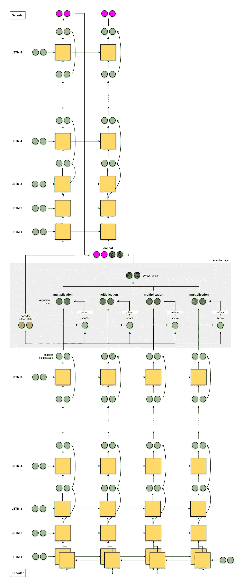

Fig. 2c: Google’s NMT for Google Translate. Skip connections are denoted by curved arrows. *Note that the LSTM cells only show the hidden state and input; it does not show the cell state input.

该模型在 WMT 的 14 英法语上达到了 **38.95** BLEU，在 WMT 的 14 英德语上达到了 **24.17** BLEU。

> ***直觉:GNMT — seq2seq 带 8 层编码器(+双向+剩余连接)+注意***
> 
> 8 名译者从下到上排成一列，从译者 A，B，…，h 开始。每个译者阅读相同的德语文本。在每一个单词上，翻译 A 都与翻译 B 分享他/她的发现，翻译 B 将对其进行改进并与翻译 C 分享——重复这一过程，直到我们找到翻译 H。此外，在阅读德语文本时，翻译 H 根据他所知道的和他所收到的信息写下相关的关键词。
> 
> 一旦每个人都读完了这篇英语文章，译者 A 被告知翻译第一个单词。首先，他尝试回忆，然后与翻译 B 分享他的答案，翻译 B 改进答案并与翻译 C 分享-重复此操作，直到我们找到翻译 H。然后，翻译 H 根据他写的关键字和他得到的答案，写出第一个翻译单词。重复这个直到我们翻译出来。

## 3.摘要

下面是您在本文中看到的所有架构的快速总结:

*   seq2seq
*   seq2seq +注意
*   带双向编码器的 seq2seq 注意
*   seq2seq 带 2 层编码器+注意
*   GNMT — seq2seq，带 8 层编码器(+双向+剩余连接)+注意

暂时就这样吧！在我的下一篇文章中，我将和你一起回顾自我关注的概念，以及它是如何在 Google 的 Transformer 和自我关注生成对抗网络(SAGAN)中使用的。留意这个空间！

## 附录:分数函数

下面是由 Lilian Weng 编译的一些得分函数。分数函数加法/串联和点积在本文中已经提到。分数函数背后的思想涉及点积运算(点积、余弦相似性等。)，就是衡量两个向量的相似度。对于前馈神经网络得分函数，想法是让模型学习对齐权重和翻译。

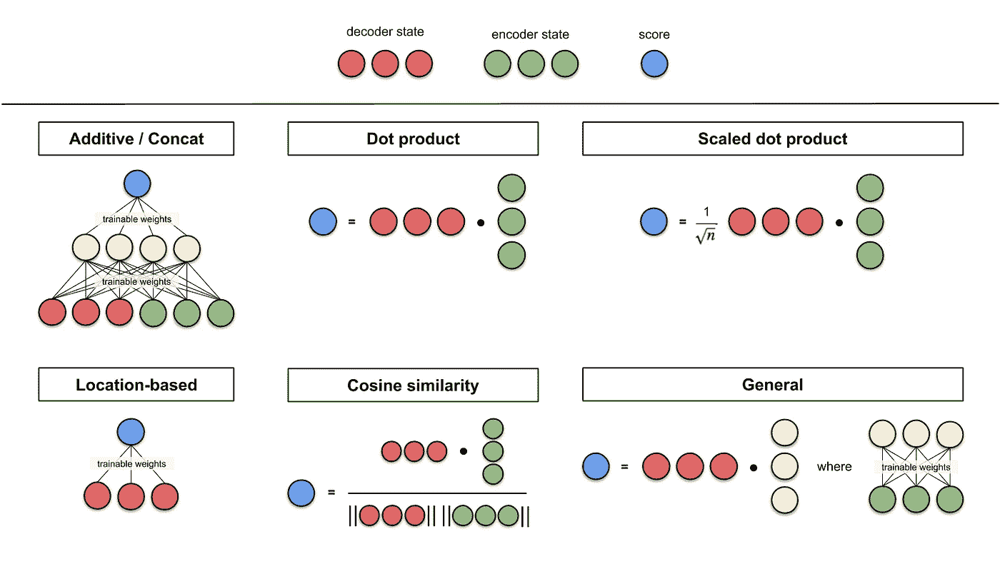

Fig. A0: Summary of score functions

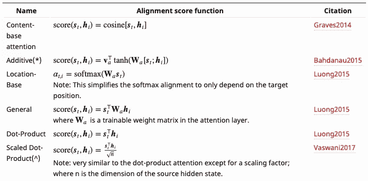

Fig. A1: Summary of score functions. **h** represents encoder hidden states while **s** represents decoder hidden states. ([Image source](https://lilianweng.github.io/lil-log/2018/06/24/attention-attention.html#summary))

【[返回页首](#d442)

## 参考

[1] [神经机器翻译通过联合学习来对齐和翻译(Bahdanau *et。艾尔*，2015)](https://arxiv.org/abs/1409.0473)

[2] [基于注意力的神经机器翻译的有效方法(Luong *et .阿尔*，2015)](https://arxiv.org/abs/1508.04025)

你所需要的只是关注。阿尔，2017)

[4] [自我关注的甘(张*等。al*2018)](https://arxiv.org/abs/1805.08318)

[5] [用神经网络进行序列对序列学习(Sutskever *等。铝*，2014)](https://arxiv.org/abs/1409.3215)

[6] [TensorFlow 的 seq2seq 教程带关注](https://github.com/tensorflow/nmt)(seq 2 seq+关注教程)

[7] [Lilian Weng 关于关注的博客](https://lilianweng.github.io/lil-log/2018/06/24/attention-attention.html#a-family-of-attention-mechanisms)(关注的伟大开始)

[8] [Jay Alammar 在 Seq2Seq 上的博客，关注度](https://jalammar.github.io/visualizing-neural-machine-translation-mechanics-of-seq2seq-models-with-attention/)(seq 2 seq+关注度上的精彩插图和工作示例)

【9】[谷歌的神经机器翻译系统:弥合人与机器翻译之间的鸿沟(吴 *et。艾尔*，2016)](https://arxiv.org/abs/1609.08144)

## 深度学习相关文章

[图文并茂:自我关注](/illustrated-self-attention-2d627e33b20a)

[动画版 RNN、LSTM 和 GRU](/animated-rnn-lstm-and-gru-ef124d06cf45)

[逐行 Word2Vec 实现](/an-implementation-guide-to-word2vec-using-numpy-and-google-sheets-13445eebd281)(关于单词嵌入)

[关于随机梯度下降线性回归的分步指南](/step-by-step-tutorial-on-linear-regression-with-stochastic-gradient-descent-1d35b088a843)

[10 种梯度下降优化算法+备忘单](/10-gradient-descent-optimisation-algorithms-86989510b5e9)

[统计深度学习模型中的参数数量](/counting-no-of-parameters-in-deep-learning-models-by-hand-8f1716241889)

*如果你喜欢我的内容并且还没有订阅 Medium，请通过我的推荐链接* [*这里*](https://medium.com/@remykarem/membership) *订阅！注意:你的会员费的一部分将作为介绍费分配给我。*

*特别感谢* [*德里克*](https://medium.com/@derekchia) *、威廉【Tjhi】*[*宇轩*](https://medium.com/@wyextay)*[*【任杰*](https://medium.com/@renjietan) *、克里斯和软软为本文出谋划策、提出建议和修改意见。**

**关注我上* [*推特*](https://www.twitter.com/remykarem) *@remykarem 或者*[*LinkedIn*](http://www.linkedin.com/in/raimibkarim)*。你也可以通过 raimi.bkarim@gmail.com 联系我。欢迎访问我的网站*[*remykarem . github . io*](https://remykarem.github.io/)*。**