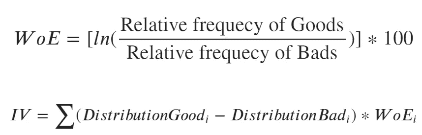
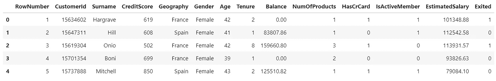
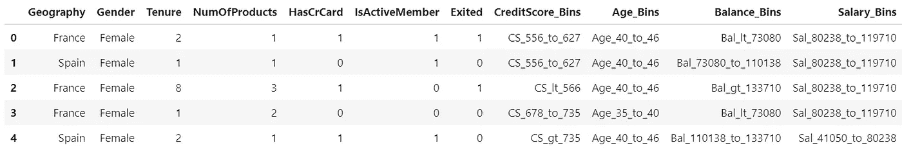
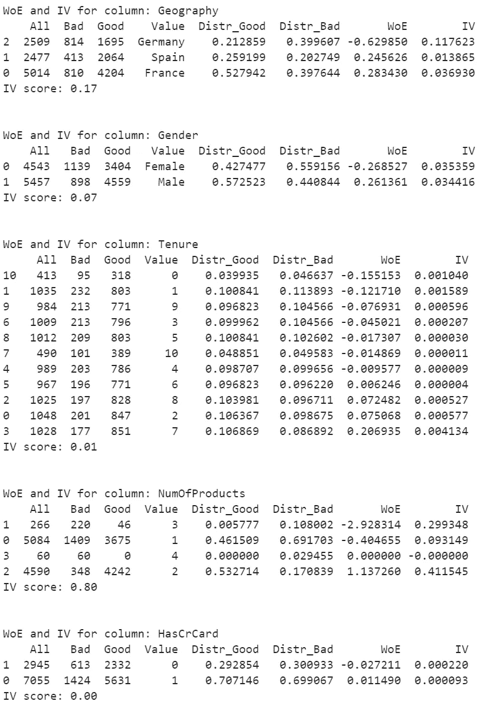
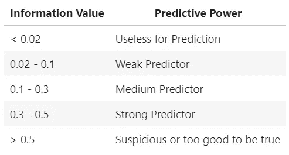
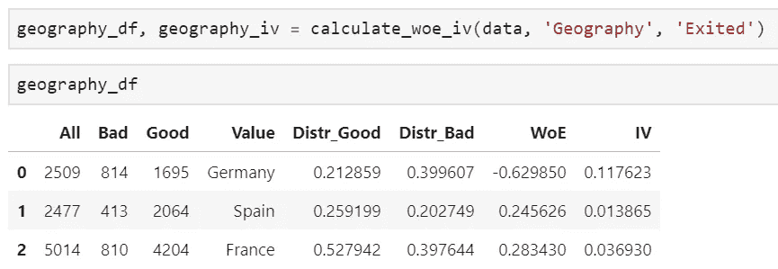
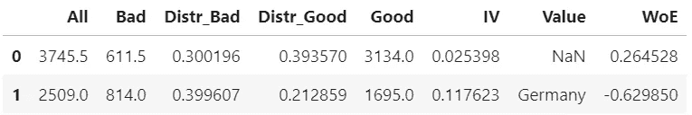
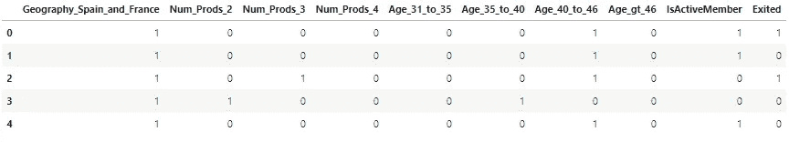
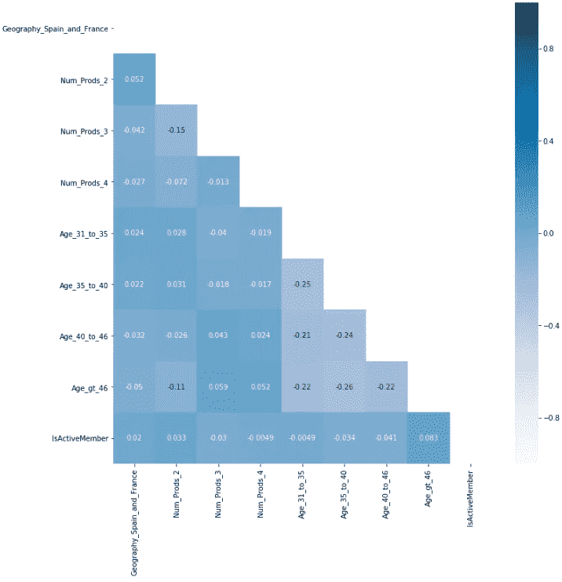

# Python-IV 和 WoE 中的属性相关性分析

> 原文：<https://towardsdatascience.com/attribute-relevance-analysis-in-python-iv-and-woe-b5651443fc04?source=collection_archive---------6----------------------->

最近我写了关于[递归特征消除](/feature-selection-in-python-recursive-feature-elimination-19f1c39b8d15)——我最常用的许多特征选择技术之一。今天我要讲的是另一个——**属性相关性分析**。与 **RFE** 不同，它更深入地挖掘个人属性，并试图告诉你变量的哪个部分与目标变量有最强的联系。

Photo by [Vladislav Babienko](https://unsplash.com/@garri?utm_source=unsplash&utm_medium=referral&utm_content=creditCopyText) on [Unsplash](https://unsplash.com/search/photos/decision?utm_source=unsplash&utm_medium=referral&utm_content=creditCopyText)

在我攻读数据科学硕士学位的第一个学期，我遇到了一位“古怪”的教授。他真的是个老古董——乍一看，你可以看出他是这个行业的老手。他的课叫做“*数据科学简介*”，根据这个名字，你会期望对数据科学领域、基本术语的基本介绍，以及对数据科学库的介绍。

不是这样的。

开始的时候，我对这门课不是很满意，主要是因为它有严重的偏见。他谈论的都是客户流失模型和一些我一无所知的神秘术语— **属性相关性分析**。

我现在在业内工作，现在才真正体会到他的话。对于一个新人来说，听客户流失建模并不是最有趣的事情——你可能更愿意学习用超复杂的神经网络对狗和猫进行分类。

但是残酷的现实是——这不是你在日常工作中要做的事情！

大多数“数据科学”工作，至少在我居住的这个不发达的第三世界国家，包括与数据库和数据仓库打交道，而每天写 R/Python 代码不是很多人做的事情。

突然听到关于流失建模变得更有趣了！

# 但是什么是属性相关性分析呢？

好问题。我引用一下官方课书里的一段话:

> 属性相关性分析阶段的任务是识别对客户流失影响最大的属性(特征)。通过属性相关性分析，显示出与流失(流失=“是”或“否”)相关的最大分离能力的属性将被选为建立预测流失模型的最佳候选。[1]

出于某种原因，这本书里的英语很糟糕。我不是说我的是完美的，但作为有声读物听这个是一个痛苦的过程。

尽管如此，我还是希望你能领会它的要点。

属性相关性分析绝不仅仅用于预测性流失模型开发，您可以将其用于所有分类任务。它基于两个术语:**信息值**和**证据权重**。

# 信息价值和证据权重

好吧，我保证我会简短的讲讲这个理论。根据[www.listendata.com](http://www.listendata.com)的证据权重解释如下:

> 证据的权重表明了自变量相对于因变量的预测能力。由于它是从信用评分世界演变而来的，它通常被描述为区分好客户和坏客户的一种方法。**【不良客户】**指拖欠贷款的客户。**【好客户】**指还贷客户。[2]

从同一来源，信息价值的解释如下:

> 信息值是选择预测模型中重要变量的最有用的技术之一。这有助于根据变量的重要性对其进行排序。[3]

两者都很容易计算。下面是公式:

WoE and IV formulas

如果我们在讨论客户流失建模，那么*商品*将是没有流失的客户，而*商品*将是流失的客户。仅仅从这一点，就可以看出公式背后的简单。

然而，计算这两者将是你最后要做的事情之一——一些**先决条件**需要事先满足。

# WoE 和 IV 先决条件

为了突出先决条件，我将把它们放在一个有序列表中。

1.  **数据集必须干净**。您可以用单词' *MISSING* '逐字填充缺失的值，我建议您这样做，看看缺失的值是如何与目标变量联系起来的。
2.  **不应该有任何连续属性**。根据你的喜好，代表年龄或任何连续事物的属性应该被分成 5-10 个格。只要确保每个箱至少有 5%的观察值。

一旦您的数据集处于这种形式，您就可以继续进行 WoE 和 IV 计算过程。

# 流失建模示例

为了制作这个例子，我使用了来自 [Kaggle](https://www.kaggle.com) 的[客户流失建模](https://www.kaggle.com/aakash50897/churn-modellingcsv)数据集。装入熊猫时，看起来是这样的:

Head of Churn_Modeling.csv

流失建模示例的属性相关性分析分为 6 个步骤:

1.  **数据清理和准备**
2.  **计算 IV 和 WoE**
3.  **识别搅拌器轮廓**
4.  **粗分类**
5.  **虚拟变量创建**
6.  **虚拟变量之间的相关性**

所以，事不宜迟，我们开始吧！

## 第一步。数据清理和准备

数据集不包含缺失值，因此满足先决条件 1/2！

有 10，000 个观察值和 14 列。从这里开始，我开始清理数据。以下是我采取的步骤:

1.  删除****CustomerId******姓氏***——任意，不能用。*
2.  *将 ***信用分数*** 、 ***年龄*** 、 ***余额*** 和 ***估计销售额*** 分组到 5 个箱中*
3.  *删除****年龄******余额*** 和 ***估计销售额*** ，因为不再需要它们**

**下面是实现这些步骤的代码片段:**

**Data Cleaning — [https://gist.github.com/dradecic/10f4b1a909a8ad42539e7b8aee4da74b](https://gist.github.com/dradecic/10f4b1a909a8ad42539e7b8aee4da74b)**

**数据集现在是干净的，不包含连续变量。2 的先决条件 2 已满足！**

**新的、清理后的数据集如下所示:**

****

**Head of the Cleaned version of Churn_Modeling.csv**

## **第二步。计算 IV 和 WoE**

**现在我可以开始计算 IV 和 WoE 了。出于某种原因，我无法找到这样做的 Python 包，至少我没有找到有良好文档记录的包，所以我必须自己编写代码——没问题！**

**下面是计算证据权重和信息值的函数。给定 Pandas 数据帧、属性名和目标变量名，它将进行计算。
该函数将返回熊猫数据帧和 IV 分数。代码乍一看可能有点复杂，但如果逐行阅读，就不会复杂。**

**IV and WoE function — [https://gist.github.com/dradecic/52d8b2b2213dd3d46f4b75f85c1183f2](https://gist.github.com/dradecic/52d8b2b2213dd3d46f4b75f85c1183f2)**

**为了避免在内存中创建许多不必要的数据帧，一个简单的循环将为您打印出所有内容:**

**Printing Loop — [https://gist.github.com/dradecic/9bd774d84c3ad9f193646fb7dccbd326](https://gist.github.com/dradecic/9bd774d84c3ad9f193646fb7dccbd326)**

**这里注意 ***Exited*** 是目标变量的名字，由于逻辑原因，你不会为它做计算。当执行这个代码单元时，您将在笔记本中获得大量输出:**

****

**Excerpt of IV and WoE output**

**如果这是你第一次计算 IV 和 WoE，你可能会想:**这到底是怎么回事？！****

**有一个简单的解释。**

**现在，你应该只关心 IV 分数那一行。更准确地说，**把你的想法放在 IV 分数最高的变量上**。下面是 IV 解释表:**

****

**IV Interpretation table**

**现在你应该能看到更清晰的画面了。您应该只保留那些具有良好预测能力的属性！在当前数据集中，它们是:**

*   *****NumOfProducts***(0.80)**
*   *****年龄 _ 仓位*** (0.74)**
*   *****地理*** (0.17)**
*   *****is active member***(0.15)**

## **第三步。识别搅拌器轮廓**

**这实际上并不是必需的步骤，但是这样做是非常有益的。**

**作为一家公司，你可能想知道典型的厨师是什么样子的。我的意思是，你不关心他/她的外表，但你想知道那个人住在哪里，他/她的年龄，等等…**

**为了找出答案，您需要仔细查看那些预测能力最强的变量的返回数据帧。更准确地说，看看 **WoE** 一栏。理想情况下，你会发现**负的 WoE 分数**——这是大多数搅拌者拥有的数值。**

**在我们的示例中，这是典型的搅拌器配置文件:**

*   **生活在德国(权重系数 0.63)**
*   **使用 3 种产品/服务(WoE -2.92)**
*   **不是活跃成员(WoE -0.36)**
*   **已超过 46 年(WoE -1.20)**

**有了这些信息，作为一家公司，您可以采取行动，解决这个关键的客户群。**

## **第四部分。粗分类**

**粗分类是另一个我在攻读硕士学位之前没有听说过的术语。解释其背后的想法非常简单，**你基本上是想把有相似遭遇的实例放在一起，因为它们提供了相同的信息。****

**我再次需要自己编写代码来完成这项工作。**

**对于这个数据集，应该对 ***地理*** 属性中的*西班牙*和*法国*进行粗分类(0.24 和 0.28)。**

****

**IV and WoE for Geography attribute**

**下面是用于粗略分类的函数，以及函数调用。要调用该函数，您必须事先知道您想要粗化的两行的索引位置。代码非常简单明了，请看一下:**

**Coarse Classing function — [https://gist.github.com/dradecic/564c3a9de955ef972b74575f2b700920](https://gist.github.com/dradecic/564c3a9de955ef972b74575f2b700920)**

**以下是粗分类过程后数据集的样子:**

****

**IV and WoE for Geography after coarse classing**

**您可以注意到，对于新创建的行，*值*为 *NaN* 。这没什么好担心的，你可以简单地重新映射原始数据集，用新的东西替换*西班牙*和*法国*，例如*西班牙 _ 和 _ 法国*。**

**Geography remapping — [https://gist.github.com/dradecic/f1a72679206cdc5285983f40fbe3a679](https://gist.github.com/dradecic/f1a72679206cdc5285983f40fbe3a679)**

**相关属性中的所有唯一值现在都有非常不同的 WoE——这意味着您可以继续下一步——创建虚拟变量。**

## **第五步。虚拟变量创建**

**我们就要到达终点了。差不多了。**

**如您所知，当只有二元属性时，分类模型表现最好。这就是虚拟变量出现的原因。**

**根据维基百科:**

> **虚拟变量是一个取值为 0 或 1 的变量，用来表示可能会改变结果的某种分类效应的存在与否。[4]**

**简而言之，如果属性有 *n* 个唯一值，您将需要创建 *n — 1* 个虚拟变量。当一个变量是另一个变量的完美预测变量时，可以少创建一个虚拟变量以避免共线性问题。**

**以下属性将需要虚拟变量:**

*   *****地理*****
*   *****NumOfProducts*****
*   *****年龄 _ 仓位*****

**下面的代码将创建它们，然后将它们与 ***IsActiveMember*** 属性和目标变量 ***Exited*** 连接成一个新的数据帧:**

**Dummy Variables — [https://gist.github.com/dradecic/e6eaafed7ed5cd6599abb12dc8a40f60](https://gist.github.com/dradecic/e6eaafed7ed5cd6599abb12dc8a40f60)**

**如果您现在看一下新创建的数据帧的头部:**

****

**DF with Dummy Variables — Head**

**现在所有的属性都是二进制格式——只剩下最后一步了！**

## **第六步。虚拟变量之间的相关性**

**你已经坚持到最后了。该过程的最后一步是计算虚拟变量之间的相关性，并排除相关性高的变量。**

**什么被认为是高相关系数还有待讨论，但是我建议你**去掉任何相关度超过 0.7** (绝对值)的东西。**

**如果您想知道在这两个变量中要删除哪个虚拟变量，**删除证据权重较低的那个**，因为它与目标变量的联系较弱。**

**我决定绘制一个相关性矩阵，以获得相关性的直观表示:**

****

**Correlation Matrix**

**这里可以看到，虚拟变量之间不存在相关性，因此，它们都必须保留。**

# **结论**

**我将在这里结束这一部分。下一部分将在几天内完成，最多一周，将涵盖基于虚拟变量的预测模型的开发和优化。**

**我希望你能看到属性相关性分析的威力，不仅在特征选择领域，而且在客户特征分析领域。这篇文章只涉及了整个过程的一小部分，所有的事情都被简化了。为了全面了解情况，我强烈建议你阅读整本书——这本书可以在亚马逊上买到。这不是最便宜的，当然也不是没有错别字，但嘿，如果你能在 YouTube 上观看印度教程，你将能够理解一些刺耳的斯拉夫英语。大概吧。**

**一旦文章上线，第二部分的链接将附在这里。
在那之前，敬请期待！**

**感谢阅读。**

***喜欢这篇文章吗？成为* [*中等会员*](https://medium.com/@radecicdario/membership) *继续无限制的学习。如果你使用下面的链接，我会收到你的一部分会员费，不需要你额外付费。***

** [## 通过我的推荐链接加入 Medium-Dario rade ci

### 作为一个媒体会员，你的会员费的一部分会给你阅读的作家，你可以完全接触到每一个故事…

medium.com](https://medium.com/@radecicdario/membership)** 

# **参考**

**[1] Klepac，g .，Kopal，r .，MRI，L. (2014 年)。使用数据挖掘技术和社会网络分析开发流失模型。美国:IGI-全球**

**[2][https://www . listen data . com/2015/03/Weight-of-Evidence-WOE-and-information . html # What-is-Weight-of-Evidence-WOE-](https://www.listendata.com/2015/03/weight-of-evidence-woe-and-information.html#What-is-Weight-of-Evidence-WOE-)**

**[3][https://www . listen data . com/2015/03/weight-of-evidence-woe-and-Information . html # Information-Value-IV-](https://www.listendata.com/2015/03/weight-of-evidence-woe-and-information.html#Information-Value-IV-)**

**[4][https://en . Wikipedia . org/wiki/Dummy _ variable _(statistics)](https://en.wikipedia.org/wiki/Dummy_variable_(statistics))**