# 音频人工智能:使用卷积神经网络从立体声音乐中分离乐器

> 原文：<https://towardsdatascience.com/audio-ai-isolating-instruments-from-stereo-music-using-convolutional-neural-networks-584ababf69de?source=collection_archive---------4----------------------->


## 黑客音乐走向衍生内容的民主化

这是我在三月份开始的“音频人工智能”系列的第二篇文章，它可以被认为是继之后的第二部分*我的第一篇关于使用 CNN 进行人声隔离的文章。如果你还没有读过那本书，我强烈推荐你从那里开始！*

*简单回顾一下，在第一篇文章中，我向您展示了我们可以构建一个非常小的卷积神经网络(~300k 参数)来实时执行声音隔离。我们*欺骗*这个网络“认为*”*它正在解决一个更简单的问题，最终我们得到了这样的结果:*

*现在，我们如何从这里开始将任何专业制作的立体声混音反向工程到 4 个乐器层，更具体地说，到主 **4 个主干**？*

# *关于茎*

*在继续之前，先了解一下词干的背景。*

*Stems 是来自多个单独音轨的立体声录音。例如，鼓干通常是一个立体声音频文件，听起来像所有鼓轨道混合在一起。在大多数情况下，还包括额外的处理，如均衡、压缩和基于时间的效果……*[*[*Izotope，on Stems vs multi tracks*](https://www.izotope.com/en/blog/music-production/stems-and-multitracks-whats-the-difference.html)*】。**

***茎从哪里来？stems 已经在录音棚中使用了几十年，作为控制、处理和操纵整组乐器的一种方式，简化了混音、母带制作和制作过程。有些人会互换使用词干、子混音、子组或总线。除了工作流程方面之外，***

> *stems 作为一种独立的格式已经获得了一些欢迎，它可以扩展创作的可能性，特别是在混音和 DJing 方面。*

*在这种背景下，许多玩家一直在尝试开发这个空间，包括拥有 [STEM 格式](https://www.native-instruments.com/en/specials/stems/)的原生乐器。*

*随着艺术家和唱片公司变得更加舒适，越来越少受到一个不断增长的生态系统的威胁，这个生态系统拥抱合作，并了解衍生品的创意和商业潜力，stems 重新受到了一些关注。*

*惯例是用 4 个词干表示混合:*

*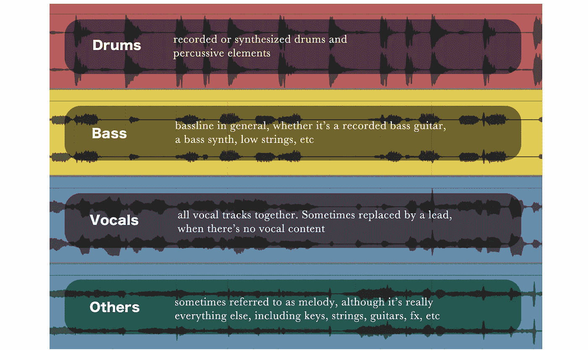*

# *彻底地*

*我的第一篇文章的*旅程*结构得到了很好的反馈，所以我将尝试在这里做一些类似的事情。然而，在这种情况下，'**' A '**现在是我们训练有素、随时可用的人声隔离模型，而'**' Z '**，则是词干隔离模型。*

# *假设:我们可以将用于分离人声的相同方法应用于其他乐器*

*这个假设实际上应该被分解成两部分:*

1.  *我们用来从混音中分离人声的二进制掩蔽试探法同样适用于其他类型的内容。或者换句话说，使用相同的二进制掩蔽技术，我们期望所有词干的隔离的可比较的感知质量。*
2.  *不管 1)是否为真，我们用于学习有声二进制掩码的相同 CNN 架构将能够以相当的准确度学习其他词干的二进制掩码。*

*如果 1)和 2)都是真的，我们应该处于一个相当好的位置。*

## *输入/输出表示*

*之前，我向你展示了我们可以创建*二进制掩码*，当应用于原始混音时，它会产生一个感觉上不错的人声重建。然后，我们训练我们的 CNN 学习如何估计这些二元掩模，这是一个比估计实际人声的幅度谱简单得多的任务。*

*在这种情况下，我们的输入-输出表示和生成的训练集如下所示:*

*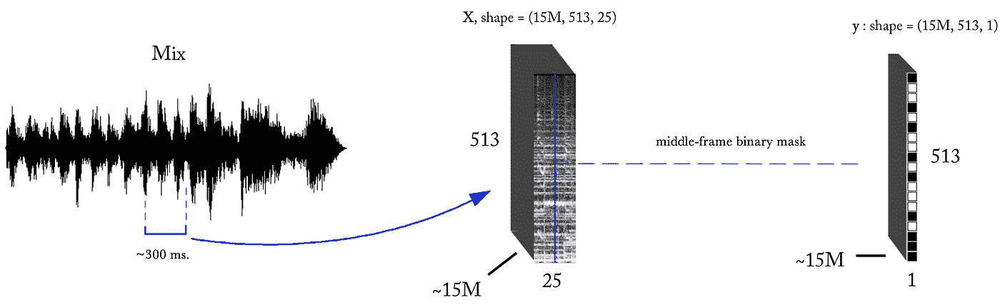*

*按照第一篇文章中描述的构建训练集的相同过程，我们现在有了与之前相同的输入**，但是有 4 组可能的目标输出**，每个词干一组。*

*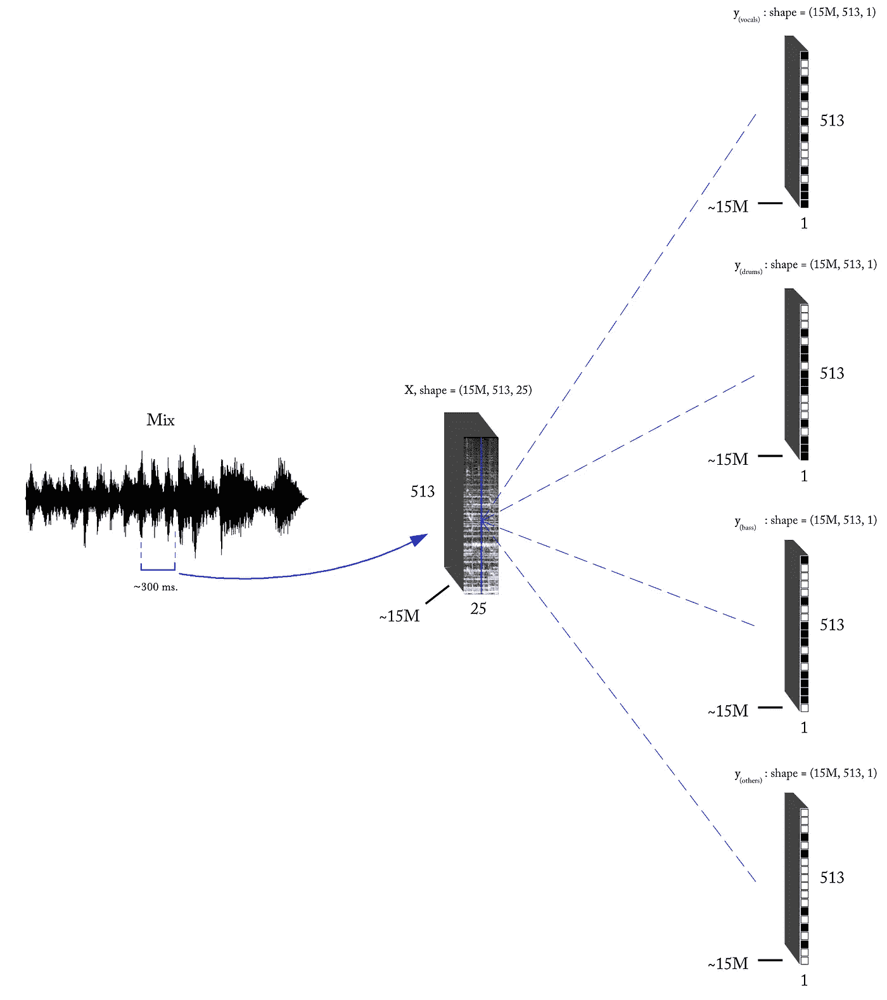*

*Our Stems training set is now composed of 15 million, ~300-millisecond mix fragments and their corresponding *vocals, drums, bass,* and *others* **middle frame** binary masks.*

*在这种情况下，youtube 抓取方法没有给我们带来多少，我们不得不投入大量的时间和精力来寻找(以及合成)完全对齐的*混合词干*对。*

*让我们以鼓二进制掩码为例。现在，值“1”表示在给定频率仓(时间帧位置 )主要存在鼓内容，而值“0”表示在给定位置主要存在 ***或其他内容*** 。当谈到频率仓—时间帧位置时，请记住我们实际上指的是二进制掩码中的单个元素(像素)，它对应于幅度 STFT 域中的某个值。*

## *多源二值掩蔽*

*现在我们有多个来源，有许多不同的方法可以生成我们的二进制掩码。实际上，我们在两个主要原则下完成了 7 种不同的变化:*

*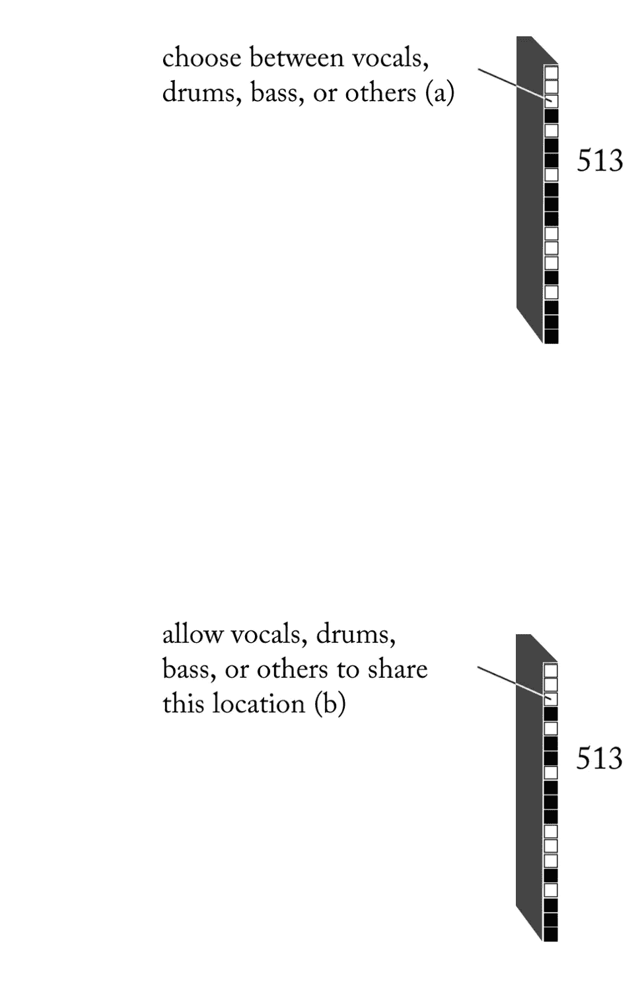*

***a)** 假设**在给定的频率仓-时间帧位置上只能出现一个** **源**。在这种情况下，您可以想象所有 4 个源 ***在每个单独的位置竞争*** 。尽管这是对现实的巨大过度简化，但在某些情况下，它的效果惊人地好。(就感知而言，就[听觉掩蔽](https://en.wikipedia.org/wiki/Auditory_masking)而言，*对存在感*的竞争实际上并不那么远离现实。)*

***b)** 源被允许*共享*一个频率仓—时间帧位置。或者换句话说，**在任何给定位置都可能存在多个源**。这显然更符合实际。*

*由于 b)不依赖于彼此竞争的源，二进制化试探法基于在每个频率仓-时间帧位置的每个单独源和原始混合的幅度 STFT 之间的*幅度比*标准，并且在一些情况下，以时间-频率空间中的相邻区域为条件。*

*这两个原则都有其利弊。本文中的内容和演示使用了原则 b)下的专有方法的组合。有关时频掩蔽的全面概述和参考资料，您可以查看[本资源](https://www.ncbi.nlm.nih.gov/pmc/articles/PMC4111459/)。*

*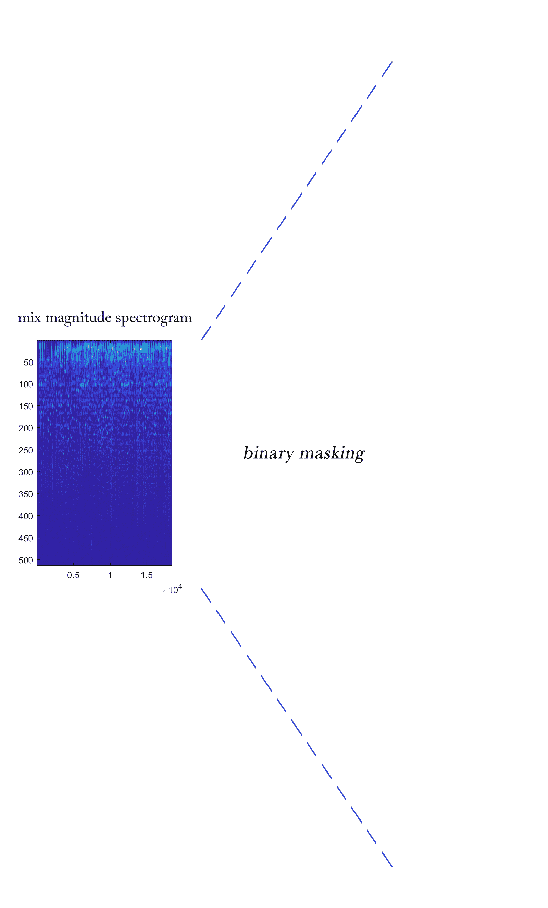*

*example: left channel of a full song and the resulting binary masks for each stem*

*现在回到我们的假设，我们如何验证假设 1？我想到了两种方法。*

*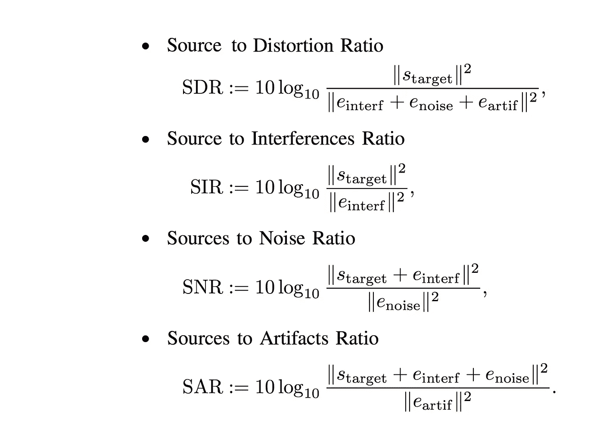*

*E. Vincent et al. [https://hal.inria.fr/inria-00544230/document](https://hal.inria.fr/inria-00544230/document)*

*1)使用类似于 [*SAR、SIR、SDR*](https://sigsep.github.io/sigsep-mus-eval/index.html) 的音频源分离度量。这些标准是由源分离学术界在几年前提出的，其目标是使评估从源分离过程中回收的估计源的质量的标准标准化，以及用于基准测试的目的。 [*museval* *工具箱*](https://sigsep.github.io/sigsep-mus-eval/usage.html) 实现了这些指标。*

*2)一种不太正式(但在构建特定应用时不一定不太有效)的方法是构建小型测试集，并进行监听会话，比较原始源和通过对原始混合进行二进制掩蔽而恢复的源。有了这些，您就可以根据您感兴趣的特定质量向量建立一些评分。*

*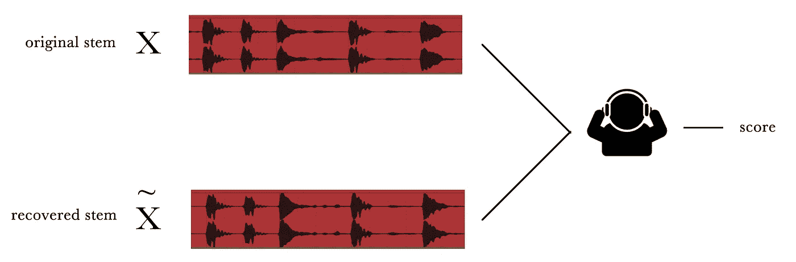*

*那么，假设 1 的结论是什么？你以后会发现…*

# *模型:学习词干的二进制掩码*

*现在我们已经有了词干训练集，我们如何*将这个输入/输出表示插入*一些兼容的架构中，这些架构将学习*混合词干*任务？*

*同样，实现这一点的方法不止一种，我将向大家展示我们在设计过程中采用的几种方法。*

## *模型[ 1 ]:合并独立训练的模型用于联合推理*

*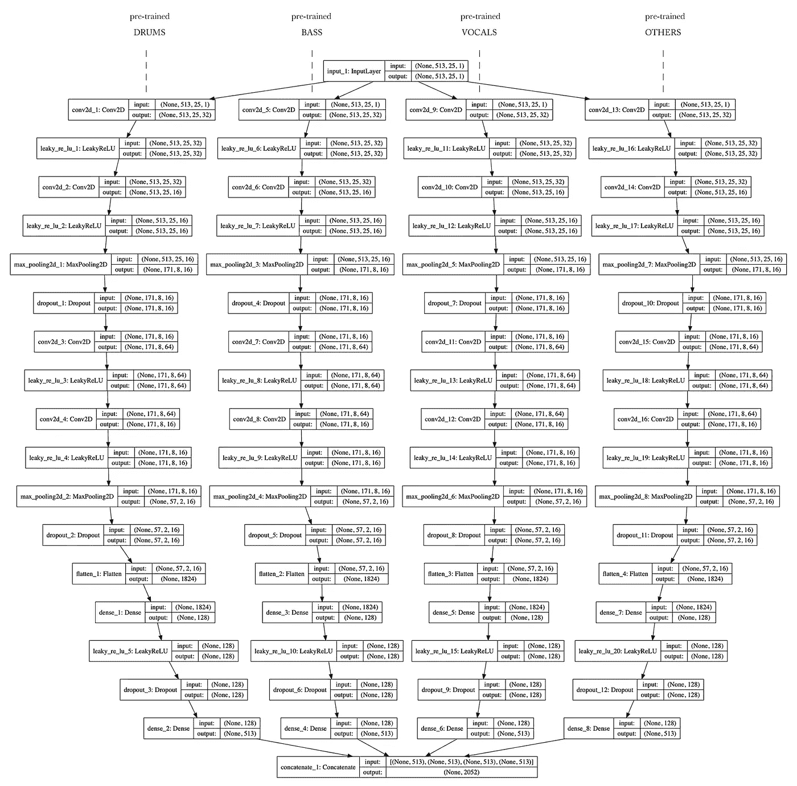*

*我们知道我们的第一个声音隔离模型效果很好。在考虑重新发明轮子之前，让我们首先验证我们用于学习声乐二进制掩码的相同 CNN 架构与其他词干的行为类似。(**假设二**)*

*本质上，*

> *通过简单地改变我们的目标二进制掩码，我们可以训练与人声完全相同的架构，用于隔离鼓、低音和其他声音*

*例如，对于鼓声干，我们将在输入端呈现 *X(混音)*，在输出端呈现 *y(鼓声)*。*

*一旦我们的 4 个独立模型训练完毕，**我们就可以将预训练的权重加载到 4 个相同的模型占位符中。**从到我们可以连接这些模型，使它们共享一个公共输入，同时连接它们的输出层，以便在每个推理步骤，我们同时获得所有 4 个词干的二进制掩码。把这 4 个模型想象成一个新的、更大的模型的分支(这就是这里发生的事情)。*

*查看这个新模型的输出层，你可以看到我们的维度现在是 **2052** (4 x 513)。因为我们确切地知道这些*模型分支*是如何连接的，我们可以通过简单的索引很容易地检索每个主干的二进制掩码。*

*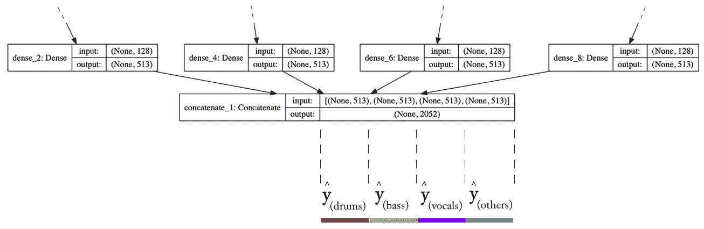*

*下面，我将向您展示使用 Keras 的 Functional API 构建上述架构的代码。我将把把权重从预训练模型加载到新模型占位符中的任务留给您。在 Keras 中使用*load _ weights()/get _ weights()/set _ weights()*函数应该相对简单。*

```
*from keras.layers import Dense, Dropout, Flatten, Conv2D, MaxPooling2D, Concatenate
from keras.layers.advanced_activations import LeakyReLU
from keras import Input, Model# this can be done in a for loop but I'll do it the 'redundant' way
# for clarityinput_shape = Input(shape=(513, 25, 1))# BRANCH VOCALSx_1 = Conv2D(32, (3,3), padding=’same’, input_shape=(513, 25, 1))(input_shape)
x_1 = LeakyReLU()(x_1)
x_1 = Conv2D(16, (3,3), padding=’same’)(x_1)
x_1 = LeakyReLU()(x_1)
x_1 = MaxPooling2D(pool_size=(3,3))(x_1)
x_1 = Dropout(0.25)(x_1)x_1 = Conv2D(64, (3,3), padding=’same’)(x_1)
x_1 = LeakyReLU()(x_1)
x_1 = Conv2D(16, (3,3), padding=’same’)(x_1)
x_1 = LeakyReLU()(x_1)
x_1 = MaxPooling2D(pool_size=(3,3))(x_1)
x_1 = Dropout(0.25)(x_1)x_1 = Flatten()(x_1)
x_1 = Dense(128)(x_1)
x_1 = LeakyReLU()(x_1)
x_1 = Dropout(0.5)(x_1)
x_1 = Dense(513, activation='sigmoid')(x_1)# BRANCH DRUMSx_2 = Conv2D(32, (3,3), padding=’same’, input_shape=(513, 25, 1))(input_shape)
x_2 = LeakyReLU()(x_2)
x_2 = Conv2D(16, (3,3), padding=’same’)(x_2)
x_2 = LeakyReLU()(x_2)
x_2 = MaxPooling2D(pool_size=(3,3))(x_2)
x_2 = Dropout(0.25)(x_2)x_2 = Conv2D(64, (3,3), padding=’same’)(x_2)
x_2 = LeakyReLU()(x_2)
x_2 = Conv2D(16, (3,3), padding=’same’)(x_2)
x_2 = LeakyReLU()(x_2)
x_2 = MaxPooling2D(pool_size=(3,3))(x_2)
x_2 = Dropout(0.25)(x_2)x_2 = Flatten()(x_2)
x_2 = Dense(128)(x_2)
x_2 = LeakyReLU()(x_2)
x_2 = Dropout(0.5)(x_2)
x_2 = Dense(513, activation='sigmoid')(x_2)# BRANCH BASSx_3 = Conv2D(32, (3,3), padding=’same’, input_shape=(513, 25, 1))(input_shape)
x_3 = LeakyReLU()(x_3)
x_3 = Conv2D(16, (3,3), padding=’same’)(x_3)
x_3 = LeakyReLU()(x_3)
x_3 = MaxPooling2D(pool_size=(3,3))(x_3)
x_3 = Dropout(0.25)(x_3)x_3 = Conv2D(64, (3,3), padding=’same’)(x_3)
x_3 = LeakyReLU()(x_3)
x_3 = Conv2D(16, (3,3), padding=’same’)(x_3)
x_3 = LeakyReLU()(x_3)
x_3 = MaxPooling2D(pool_size=(3,3))(x_3)
x_3 = Dropout(0.25)(x_3)x_3 = Flatten()(x_3)
x_3 = Dense(128)(x_3)
x_3 = LeakyReLU()(x_3)
x_3 = Dropout(0.5)(x_3)
x_3 = Dense(513, activation='sigmoid')(x_3)# BRANCH OTHERSx_4 = Conv2D(32, (3,3), padding=’same’, input_shape=(513, 25, 1))(input_shape)
x_4 = LeakyReLU()(x_4)
x_4 = Conv2D(16, (3,3), padding=’same’)(x_4)
x_4 = LeakyReLU()(x_4)
x_4 = MaxPooling2D(pool_size=(3,3))(x_4)
x_4 = Dropout(0.25)(x_4)x_4 = Conv2D(64, (3,3), padding=’same’)(x_4)
x_4 = LeakyReLU()(x_4)
x_4 = Conv2D(16, (3,3), padding=’same’)(x_4)
x_4 = LeakyReLU()(x_4)
x_4 = MaxPooling2D(pool_size=(3,3))(x_4)
x_4 = Dropout(0.25)(x_4)x_4 = Flatten()(x_4)
x_4 = Dense(128)(x_4)
x_4 = LeakyReLU()(x_4)
x_4 = Dropout(0.5)(x_4)
x_4 = Dense(513, activation='sigmoid')(x_4)# concatenate output layers
merged_output = keras.layers.concatenate([x_1, x_2, x_3, x_4], axis=1)# connect to single/common input layer
model = Model(input_shape, merged_output)# define optimizers, loss, etc and compile model...*
```

*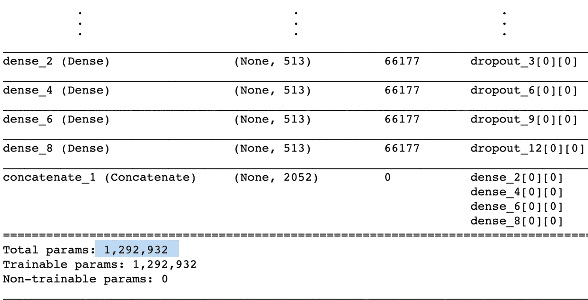*

> ***尽管最终模型有接近 1.3M 的参数，但学习过程仅在约 300K 参数的架构中进行***

*得出你自己的结论，但我想在这里指出的是:*

1.  *我们总是可以通过解决多个更小的问题来尝试解决一个大问题。(在 ML 中不总是最好的做法，但有时确实如此)*
2.  *您肯定希望关注您的参数数量与您的模型在训练期间将接触到的示例数量。请记住，在从声音隔离到词干解构的过程中，我们所做的只是生成备选的目标二元掩码集，但训练实例的数量保持不变。通过这种设计，我们保持了与之前相同的# *训练示例< > #参数*比率。*
3.  *因为我们隔离地训练每个词干的模型，所以每个模型的*能力*学习其相应的二进制掩码**不受其他模型的训练过程的影响**。*

*你可能会问…“为什么不在推理过程中将这四个模型分开呢？”*

*这是一个完全合理的问题。答案是，对于这个特定的应用程序，我们需要执行*混合到词干*解构，作为连接到其他几个进程的实时管道的一部分，包括回放。正因为如此，我们希望所有的词干同时生成，以避免缓冲和同步问题。最重要的是，我们必须在单个 GPU 上运行它。将这四种模式分开会让双方都面临更大的挑战。例如，如果您正在构建一个 API，并且您不关心同步或实时性，那么您将拥有更大的灵活性。*

## *模型[ 2 ]:使用原始的单茎模型估计 4 个二元掩模*

*假设我们想对我们使用单茎架构一次生成所有二进制掩码的能力进行压力测试。我们可以做的是将输出维数增加到 **2052** ，这样我们就可以在训练期间在输出端呈现所有 4 个二进制掩码。然而，输出维数的增加将使参数总数增加到大约 0.5M。这并不一定是一个问题，但是，就像有人说的那样“解耦你的假设！” 一天 3 次，先看看我们在可比条件下训练这个模型会发生什么。*

*有许多不同的方法可以减少参数的数量。例如，我们可以将输出前最后一个 FC 层的维度从 256 减少到 77，如下所示:*

*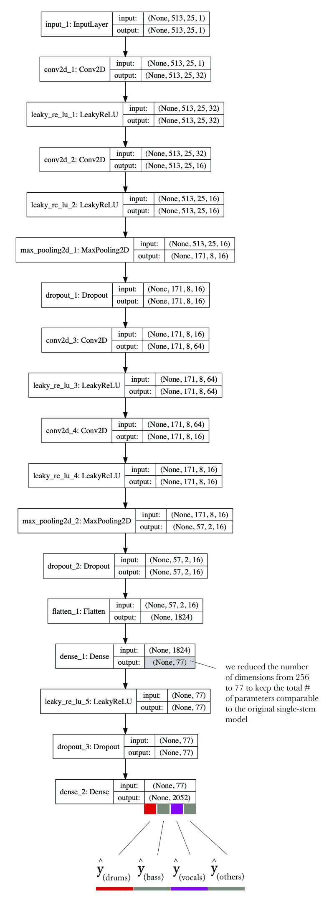*

*在训练期间，我们在输入端呈现 X(mix ),在输出端呈现所有 4 个词干的二进制掩码的串联。这里需要指出几点:*

1.  *这个模型现在必须弄清楚如何*分享*它的权重，以满足每个茎干*对*的要求:它自己的二元掩码。然而，学习过程现在将是全球性的，而不是特定于 stem 的。*
2.  *1)的一个重要含义是，在某种程度上，我们的茎现在 ***与*竞争重建质量**。(不要与我们的二进制化原则混淆 a)其中我们的茎在构建我们的二进制掩码时竞争存在)。即使我们在输出端只有一个向量，模型预测每个词干的二元掩码的能力也会受到其他词干的影响，这是基于:*

*   *我们的组合和每个词干之间的输入/输出关系在我们的训练集中有多一致。*
*   *与其他词干相比，每个词干的时频模式一般有多复杂。根据 MSE 损失标准，网络可以“优先考虑”具有更容易估计的*掩码的茎，和/或在对其他茎进行重建之前，对某些茎收敛到良好的重建。**

*以上两点是部分有效的假设，完全可以讨论。它们来自我们在实验中持续观察到的行为。*

## *型号[ 3 ]:单茎多茎杂交*

*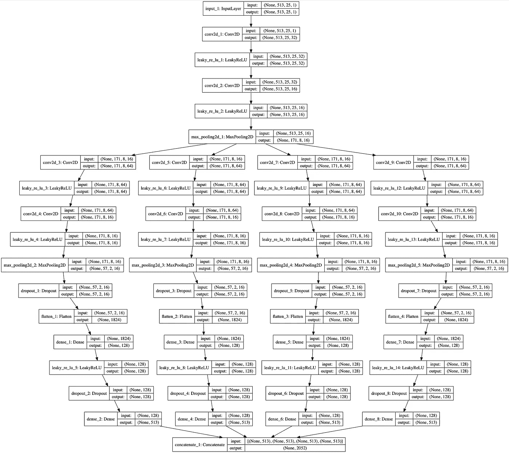**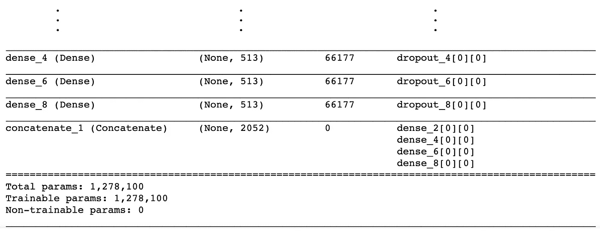*

*在这种情况下，前两个卷积层是*不可知词干的*。该模型在如何在所有 4 个茎干之间共享这些层的权重方面拥有完全的*决定权*。在第二个卷积层之后，我们创建 4 个分支，每个分支包含 2 个卷积层，每个分支对应一个主干。**虽然我们没有明确地告诉模型哪个分支对应于哪个词干，但是模型将被迫根据输出端的目标二进制掩码将每个分支优化为特定的词干**。*

*这种设计背后的推理是基于在空间域中具有结构化数据的 CNN 的已知行为，其中学习过程衍生为特征的分层分解；从粗糙原始到细致具体。我们的假设是，我们可以通过*说服*它在词干无关的过滤操作和词干特定的过滤操作之间划分任务，来帮助模型更好地学习。通过检查第一卷积阶段的一些特征图，我们没有观察到明确的词干特定模式。然而，**随着我们深入研究，在每个分支的输出端计算的大多数特征图揭示了清晰的茎特定模式**。这不应该是一个惊喜，尽管看到它非常酷:)*

*与模型 2 的情况一样，优化是全局的，而不是特定于词干的。*

*感觉上，这个模型的结果与模型 1 的结果相当。我要说我们关于这种特殊设计的有效性的假设部分得到了验证，但不是结论性的。*

## *模型[ 4 ]:从头开始训练模型 1 的架构*

*对于模型 1，我们合并了独立训练的模型，记得吗？*

*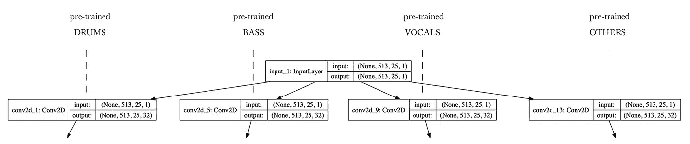*

*如果我们从头开始训练同样的完整架构会怎么样？*

*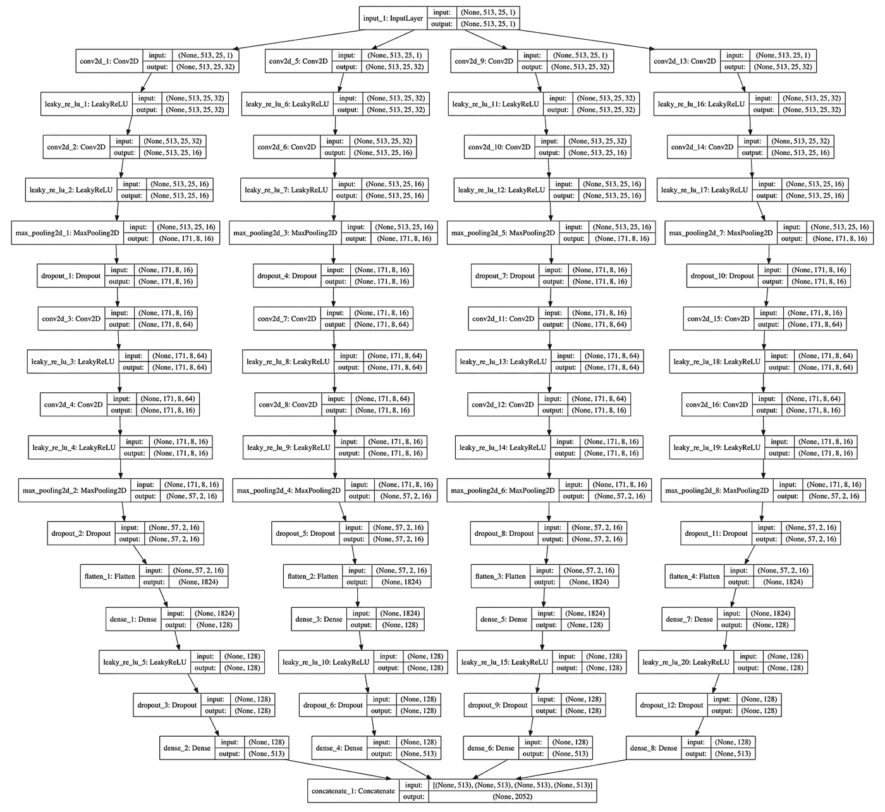*

*也不错。这里值得一提的几点:*

*   *在这种情况下，每个分支的*任务*是**特定于 stem 的**。例如，人声分支将学习如何隔离人声和人声，因为它的目标二进制掩码和**它的权重不共享或连接到任何其他分支**。*
*   *然而，**每个分支的*能力*学习其分配的任务会受到其他分支的影响……为什么？就像模型 2 和 3 一样，优化是全局的，而不是特定于 stem 的。**在训练期间，将为完整的 2052 维输出向量计算损失，而没有任何约束来对所有词干实施“公正”。这意味着，模型可能再次*决定*基于难度等级优先考虑某些词干。另一种解读方式是，一些分支可能在其他分支之前收敛到更好的解决方案。*

# *从回归到分类*

*在第一篇文章中，我解释了我们最初的声音隔离设计是如何成为某种回归-分类混合体的。*

> *“我们要求模型“将输出端的像素*”*分类为有声或非有声，尽管从概念上来说(以及根据使用的损失函数-MSE-)，这项任务仍然是一项回归任务”*

*通过查看我们的输出表示，是什么阻止我们将我们的问题作为一个分类问题来对待呢？最后，我们需要在输出端的两个离散值 0 或 1 之间做出选择。因此，我们可以将词干分离问题转化为一个多标签分类器。*

*以声音隔离模型为例，输出维度等于 513。想想这些价值代表什么。我们知道它们都是同一事物*的一部分*，对吗？只是二进制掩码中的点，稍后映射到幅度谱，等等&等等……嗯，另一种解释这些值的方式是，它们是 ***标签*或类别**，表示不同桶中内容的**存在。***

*一个类比可能有助于明确这一点:*

*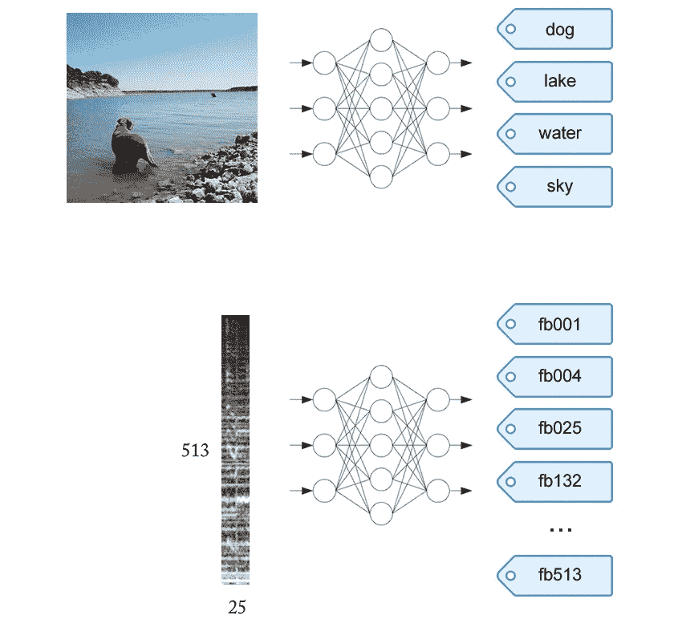*

*where ‘fb’ can be defined as ‘frequency bin’ and where each label describes a position or bucket*

*为了将我们的问题转化为多标签分类器，我们需要做什么改变？*

*   *我们现在将使用 [*二元交叉熵*](/understanding-binary-cross-entropy-log-loss-a-visual-explanation-a3ac6025181a) *，而不是使用 MSE 作为损失函数。*你可以这样想:*，*我们现在每个词干有 **513 个二元分类器，它们将以单个时间帧的分辨率进行分类。***
*   *输出前的最后一层应跟随一个*s 形*激活函数。(我们的 MSE-loss 模型已经是这种情况，但现在它是一个要求)*

*现在，当我们进行一次推理来估计中间帧的二进制掩码时，我们得到的是给定源按照 **频率仓**出现**的概率。为了构建最终的二进制掩码，在第一篇文章中描述的滑动窗口和连接机制之前，我们需要通过简单的阈值处理*重新二进制化*这些输出:***

```
*predicted_mask[predicted_mask >= 0.5] = 1
predicted_mask[predicted_mask < 0.5] = 0*
```

> ***将我们的问题视为多标签分类器，与 MSE 损失、基于回归的等效模型相比，在隔离质量方面有了一些显著改善。***

# *最小延迟模式下的中间帧预测与最后一帧预测。*

*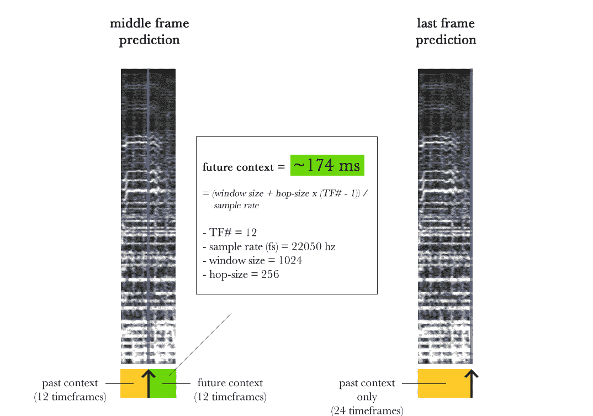*

*on the left, the input representation we’ve been working with so far. In blue, the timeframe for which we’ll be predicting our binary mask. On the right, an alternative, past-context-only solution for minimum latency.*

*对于这项工作，**实时**操作是一个重要的设计约束。这要求我们除了机器学习之外，还要花大量时间做软件架构设计和实现工作。具体来说，我们必须确保两件事:*

## *从信号处理/流水线的角度看实时性*

*确保以下过程*

**…【读取音频，将其分段，转换，使用我们的 ML 模型预测二进制掩码，将词干重建回时域，并从估计的词干中提取附加特征，包括开始、音高、转录等..这一切都在立体声中]* …*

*比音频回放速度还快。在追求这一点时，拥有一个快速推理的 ML 模型显然是非常需要的(因此在我们的设计中减少了模型参数的数量)，尽管这只是难题的一部分…你好*多线程、滑动窗口、缓冲、同步等*。为了实现这一点，我们在 [GStreamer](https://gstreamer.freedesktop.org/) 的基础上构建了一个优化的 C/C++管道，这远非没有痛苦，但当我们看到隧道尽头的光明时，这是非常美好的。我们最终的解决方案比回放快了大约 2.5 倍。*

## *实时传输动态生成的音频*

*这就是事情变得真实的地方……在第一种情况下，我们关心的只是**性能**,但是在提前访问输入数据方面没有任何限制。如果您的过程比您的回放或交付速率更快，那么您需要实现所需的排队机制来保存您的数据，以便以后检索。*

*现在，当您的输入在录制过程中以流的形式传输给您时，会发生什么情况呢？例如，您需要为现场音乐安装执行去混音？嗯，因为你不能再向前看，如果你需要未来的环境来预测现在，你将会引入延迟！那么我们能做些什么来避免(减少)这种延迟呢？*

*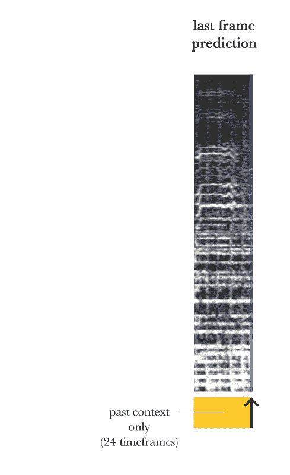*

*回到我们训练模型的输入输出表示，一个替代方案是**仅依靠过去的上下文来学习预测我们的二进制掩码**，如左图所示。这样，无论我们的管道有什么样的记录/回放缓冲阶段，我们都可以很好地限制延迟。*

***最大的问题是:当只依赖过去时，隔离质量会受到影响吗？是的，非常重要！这并不奇怪，因为音乐是时间序列数据。如果我们知道在**之前**和**之后**发生了什么，那么任何给定的时间范围都将更加*可预测。然而，这对于我们的目的来说已经足够好了。[现在你可以想象我咆哮着谈论真正特征工程的重要性，就像我在我的第一篇文章中所做的那样..]****

# *回到我们的 4 个型号，你一定想知道…哪一个更好？*

*很抱歉这么无聊，但是它们都有各自的优点和缺点…有些型号比其他型号对某些类型的内容和混合条件更敏感。其他方法以重构源的更高退化为代价实现了更好的隔离，等等。总的来说，除了模型 2，他们都很好地学习了这项任务，这可能是因为它的参数数量有限(~300k 参数)和高维输出。在任何情况下，我在这里的目标都不是给你音频源分离的*圣杯*(当我到达那里时，我可能会保留给自己:)，而是为你提供一些与这个特定问题相关的关键见解和直觉，以及设计一般人工神经网络时的一些考虑。*

*根据假设 1，最终的答案是，用于人声的二进制掩蔽方法对**低音**相对适用，但对**鼓**和**其他**不太适用。在大多数情况下，您在鼓中听到的衰减(尤其是在高音/钹中)更多地与二进制掩蔽有关，而不是与 ML 模型有关。在 **others** 的情况下，同样的二进制掩蔽导致来自其他来源的某种程度的干扰，尤其是人声。你可以在例子中听到这一点，这留下了证据，表明'*垃圾入…垃圾出…'* 原则肯定适用于 ML。*

# *最终注释*

*   *首先，非常感谢花时间阅读这篇文章和/或第一篇关于[声音隔离](/audio-ai-isolating-vocals-from-stereo-music-using-convolutional-neural-networks-210532383785)的文章的每一个人。我收到了一些很棒的评论和反馈。让他们继续前进！*
*   *与我的第一篇文章相关，我发现一些帖子里有人指出了其他类似的工作，我猜他们想知道我是否意识到了。我的答案是肯定的。**但是澄清一下，我的作品，包括你在这里看到的演示，实际上是 2016 年的…** 那些特别的论文和演示是在那之后。虽然我的重点是应用方面的东西，我很好地跟上时代(并且非常热情！)关于这个主题的所有伟大的学术工作。也就是说，即使在 3 年后，你在这里看到的输出质量也超过了当前许多学术和商业解决方案。*
*   *然而，如果我今天必须解决这个问题，我可能会探索其他方向，也许是在时域中重复出现的东西，或者是基于 GAN 的渐进设计，以及其他想法。在追求完美隔离的过程中，基于二进制/软屏蔽的解决方案总是会遇到瓶颈。*

*不要犹豫，留下问题。时间允许的话，我会继续写音频 AI 的东西！*

*ps:再次感谢 Naveen Rajashekharappa 和 Karthiek Reddy Bokka 对这项工作的贡献。*

# *奖金轨道(我的意思是，茎…)*

> ***免责声明**:本文所述的知识产权、设计和技术此前已在美国专利 US10014002B2、US9842609B2、US10325580B2 中公开。*