# 音频人工智能:使用卷积神经网络从立体声音乐中分离人声

> 原文：<https://towardsdatascience.com/audio-ai-isolating-vocals-from-stereo-music-using-convolutional-neural-networks-210532383785?source=collection_archive---------0----------------------->


## 黑客音乐走向衍生内容的民主化

如果我们能回到 1965 年，拿着“所有人都可以进入”的徽章敲开艾比路录音室的大门，并有幸聆听那些标志性的列侬-麦卡特尼和声 A-五车二，会怎么样？我们在这里输入的是一个中等质量的 mp3，由甲壳虫乐队的演奏。顶部音轨是输入混音，底部音轨是从我们的模型中分离出来的人声。

正式名称为*音频源分离*，我们在这里试图解决的问题在于恢复或重建一个或多个*源信号*，这些信号通过一些- *线性* *或* *卷积-* 过程已经与其他信号混合。该领域具有许多实际应用，包括但不限于语音去噪和增强、音乐再混合、空间音频、重新灌制等。在音乐制作的背景下，它有时被称为*去混合*或*去混合*。关于这个主题有大量的资源，从基于 ICA 的- *盲-* 源分离，到半监督非负矩阵分解技术，再到最近的基于神经网络的方法。为了更好地了解前两个，你可以看看 CCRMA 的[系列迷你教程](https://ccrma.stanford.edu/~njb/teaching/sstutorial/)，我发现它在过去非常有用。

但是在开始设计之前..一点点应用机器学习哲学…

作为一个在“*深度学习解决一切”*热潮之前已经在信号和图像处理领域工作了一段时间的人，我将作为一次**特征工程**之旅来介绍该解决方案，并向您展示**为什么对于这个特定的问题**，人工神经网络最终成为最佳方法。为什么？我经常发现人们写下这样的东西:

*“有了深度学习，你再也不用担心特征工程了；这就去做"*

或者最差…

*“机器学习和深度学习的区别* **<** 让我就此打住……深度学习还是机器学习！ **>** *在 ML 中你做特征提取，在深度学习中它在网络内部自动发生”。*

这些概括，可能来自于 DNNs 在学习好的潜在空间方面非常有效的事实，是错误的。我很沮丧地看到最近的毕业生和从业者被上述错误观念所说服，并采用'*深度学习解决一切'*方法作为你只是扔一堆原始数据(是的，即使在做了一些预处理后，你仍然可能是罪人:)，并期望事情只是按照预期工作。在现实世界中，您的数据不像 MNIST 数据集那样简单、干净和漂亮，而且您必须关心实时性、内存等问题，这些误解会让您在很长一段时间内陷入实验模式…

> 特征工程不仅在设计人工神经网络时仍然是一个非常重要的学科；在大多数情况下，就像任何其他 ML 技术一样，它将生产就绪解决方案与**失败或表现不佳的实验区分开来。对您的数据及其领域的深刻理解仍然可以让您走得更远……**

# 彻底地

好了，现在我已经结束了说教，让我们进入你来的目的吧！就像我在职业生涯中处理的所有其他数据问题一样，我将从提出问题 ***“数据看起来怎么样”？*** 。让我们来看看下面一段来自原始录音室录音的歌声片段。

‘One Last Time’ studio vocals, Ariana Grande

不太有趣吧？这是因为我们正在可视化波形或*时域信号*，我们所能获得的只是信号随时间变化的幅度值。我们可以提取诸如包络、RMS 值、过零率等东西，但是这些*特征*太过**原始*，不足以帮助我们解决问题。如果我们想从混音中提取声音内容，我们应该以某种方式**展示** **人类语言的结构，**从**开始。幸运的是，[短时傅立叶变换(STFT)](https://en.wikipedia.org/wiki/Short-time_Fourier_transform) 来拯救我们了。***

*STFT magnitude spectrum - window size = 2048, overlap = 75%, log-frequency [Sonic Visualizer]*

*虽然我喜欢语音处理，我肯定会喜欢浏览*源滤波器建模、倒谱、倒频、LPC、MFCC* 等等，但我将跳过所有这些内容，专注于与我们的问题相关的核心元素，以便尽可能多的人能够理解这篇文章，而不仅仅是音频信号处理/语音社区。*

*那么，人类语言的结构告诉了我们什么？*

**

*我们在这里可以发现三个主要因素:*

*   *一个**基频** (f0)，由我们声带的振动频率决定。在这种情况下，阿丽亚娜在 300-500 赫兹范围内歌唱。*
*   *f0 以上的多个**谐波**，遵循类似的*形状*或模式。这些谐波以 f0 的整数倍出现。*
*   ***清音**语音，包括类似*‘t’，‘p’，‘k’*，‘s’(不是我们声带振动产生的)、呼吸等辅音。它们在高频区表现为短脉冲。*

# ***使用基于规则的方法进行首次拍摄***

*让我们暂时忘记这个叫做机器学习的东西。基于我们对数据的了解，我们能想出一种方法来提取我们的声音吗？让我试一试…*

****幼稚*人声隔离 V1.0:***

1.  *识别声乐部分。在一个混合体中有很多事情在发生。我们希望将重点放在实际包含有声内容的部分，而忽略其他部分。*
2.  *区分浊音和清音部分。正如我们所看到的，有声语音和无声语音看起来非常不同，因此它们可能需要不同的处理。*
3.  *估计基波频率随时间的变化。*
4.  *基于 3 的输出，应用某种屏蔽来捕捉谐波内容。*
5.  *对无声部分做点别的…*

*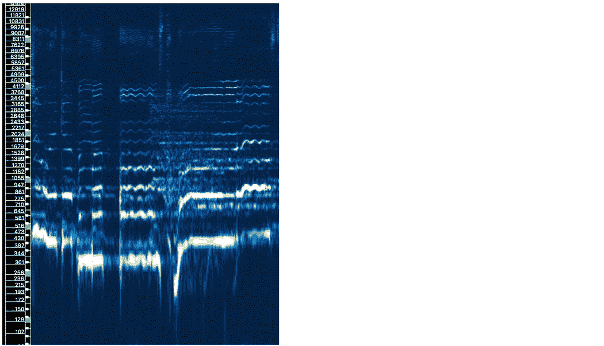*

*如果我们做得不错，这个过程的输出应该是一个*软*或*二进制* *掩码*，当它应用于(元素级乘法)混音的幅度 STFT 时，给我们一个人声幅度 STFT 的近似重建。然后，我们将该人声 STFT 估计与原始混音的相位信息相结合，计算逆 STFT，并获得重建人声的时域信号。*

**

*从头开始做这件事已经是很大的工作量了。但是为了便于演示，我们将使用一个 [pYIN 算法](https://code.soundsoftware.ac.uk/projects/pyin)的实现。即使它是为了解决第三步，在正确的约束下，它也很好地处理了第一步和第二步，同时即使在有音乐的情况下也能跟踪声乐基础。下面的例子包含了这种方法的输出，没有处理无声部分。*

*嗯…？它有点成功了，但是恢复的声音质量还没有达到。也许有了额外的时间、精力和预算，我们可以改进这个方法，让它变得更好。*

*现在让我问你…*

*当你有**多种唱腔**时会发生什么，这在今天至少 50%的专业制作的曲目中肯定是这种情况？*

*人声经过**混响**、**延迟**等效果处理后会怎么样？让我们最后一次看看爱莉安娜·格兰德的《T4》的最后一段合唱。*

*你已经感到疼痛了吗…？我是。*

*很快，如上所述的特别方法就变成了纸牌屋。这个问题太复杂了。规则太多，规则的例外太多，变化的条件太多(效果和不同的混音设置)。多步骤方法还意味着一个步骤中的错误会将问题传播到下一个步骤。改进每一步都是非常昂贵的，它需要大量的迭代来获得正确和持久，但同样重要的是，我们可能会以计算昂贵的管道而告终，这本身就可能是一个交易破坏者。*

*在这些场景中，我们需要开始考虑一种更加端到端的方法，让 ML 找出解决问题所需的底层流程和操作的一部分。然而，当谈到特性工程时，我们不会认输，你会明白为什么。*

# *假设:我们可以使用 CNN 作为传递函数，将混音映射到人声*

*受 CNN 在自然图像上的成就的启发，为什么不在这里应用同样的推理呢？*

*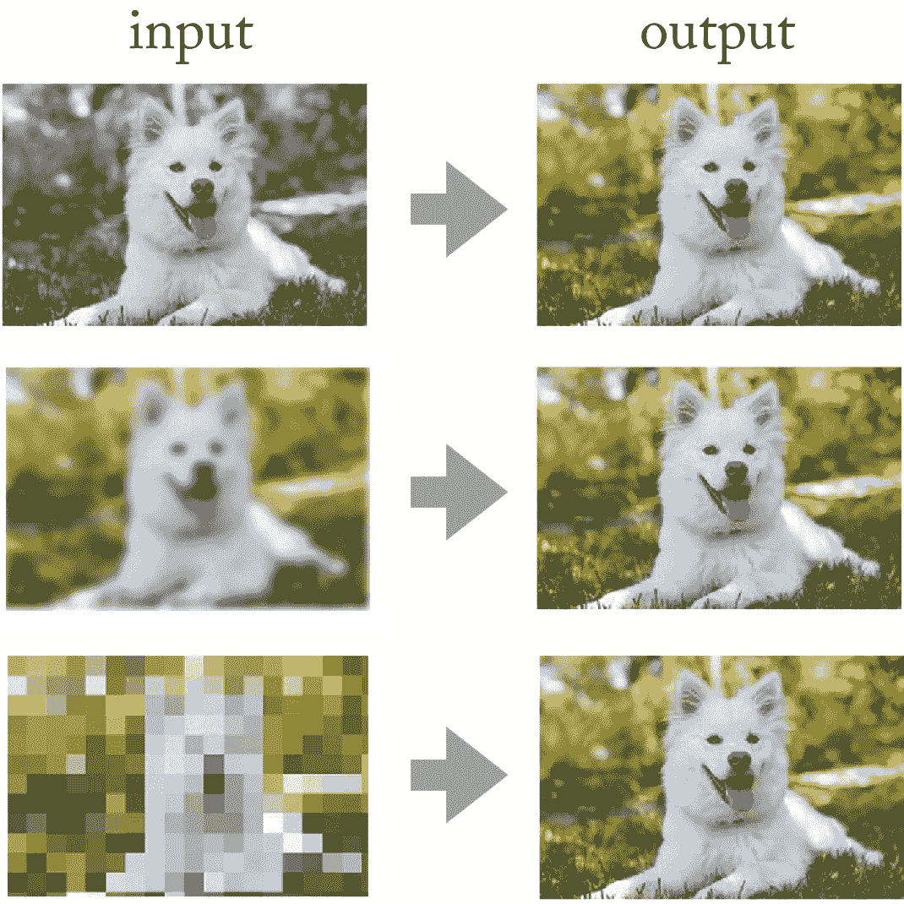*

*CNNs have been successful at tasks such as image colorization, deblurring and super-resolution.*

*最后，我们知道我们可以使用短时傅立叶变换将音频信号表示为图像*，对吗？即使这些*音频* *图像*不遵循自然图像的统计分布，它们仍然揭示了我们应该能够从中学习的空间模式(在时间与频率空间中)。**

**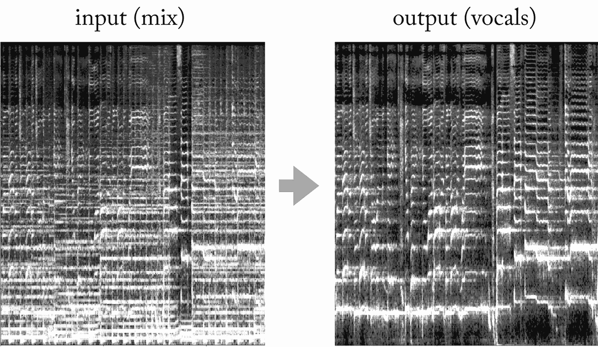**

**Mix: you can see the kick drum and baseline at the bottom, and some of the synths in the middle getting mixed with the vocals. On the right, the corresponding vocals-only**

**当时，验证这项实验是一项昂贵的工作，因为获得或生成所需的训练数据已经是一项巨大的投资。在应用研究中，我总是试图实现的一个实践是首先**确定一个更简单的问题，该问题验证与原始问题相同的原则** **，**，但是不需要做太多的工作。这允许你保持你的假设更小，迭代更快，当事情不像预期的那样工作时，以最小的影响为中心。**

**最初的解决方案起作用的一个隐含条件是一个 **CNN 必须能够理解人类语言的结构**。一个更简单的问题可以是:*给定一个混合片段，让我们看看 CNN 是否可以将这些片段分类为包含有声内容或不包含有声内容*。我们正在寻找一个音乐鲁棒的[声音活动检测器(VAD)](https://en.wikipedia.org/wiki/Voice_activity_detection) ，实现为二进制分类器。**

## **设计我们的特征空间**

**我们知道，音乐和人类语音等音频信号嵌入了时间相关性。简单地说，在特定的时间范围内，没有任何事情是孤立发生的。如果我想知道一段给定的音频是否包含人类语音，我可能也应该查看邻近区域。那个*时间背景*可以给我关于感兴趣区域正在发生什么的好信息。同时，我们希望以非常小的时间增量来执行我们的分类，以便我们能够以尽可能高的时间分辨率来捕捉人类的声音。**

**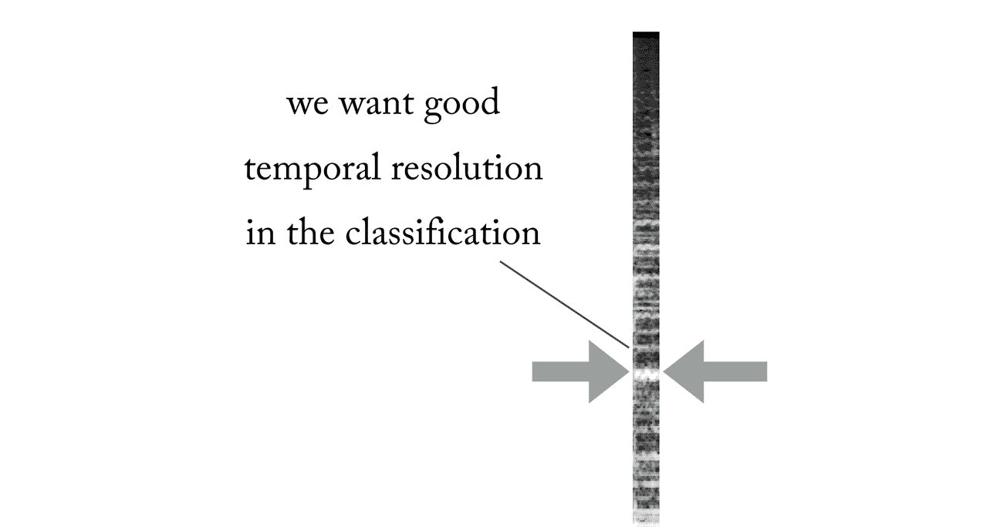**

**让我们做一些数字…**

*   **采样率(fs): 22050 Hz(我们从 44100 向下采样到 22050)**
*   **STFT 设计:窗口大小= 1024，跳跃大小= 256，[梅尔标度](https://en.wikipedia.org/wiki/Mel_scale)用于感知加权的插值。由于我们的输入数据是*实数，*我们可以使用一半的 STFT(原因不在本文讨论范围之内……)，同时保留 DC 分量(不是必需的)，这样我们就有 513 个频率仓。**
*   **目标分类分辨率:单个 STFT 帧(~11.6 毫秒= 256 / 22050)**
*   **目标时间范围:~300 毫秒= 25 个 STFT 帧。**
*   **训练样本的目标数量:50 万**
*   **假设我们使用步长为 1 STFT 时间帧的滑动窗口来生成我们的训练数据，我们需要大约 1.6 小时的标记音频来生成我们的 0.5M 数据样本。[如果你想知道更多关于生成实际数据集的细节，请在评论中提问]**

**根据上述要求，我们的二元分类器的输入/输出数据如下所示:**

**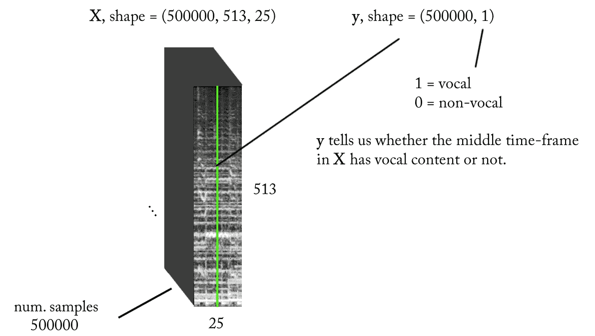**

## ****型号****

**使用 Keras，我们可以建立一个小的 CNN 模型来验证我们的假设。**

```
**import keras
from keras.models import Sequential
from keras.layers import Dense, Dropout, Flatten, Conv2D, MaxPooling2D
from keras.optimizers import SGD
from keras.layers.advanced_activations import LeakyReLUmodel = Sequential()
model.add(Conv2D(16, (3,3), padding='same', input_shape=(513, 25, 1)))
model.add(LeakyReLU())
model.add(Conv2D(16, (3,3), padding='same'))
model.add(LeakyReLU())
model.add(MaxPooling2D(pool_size=(3,3)))
model.add(Dropout(0.25))model.add(Conv2D(16, (3,3), padding='same'))
model.add(LeakyReLU())
model.add(Conv2D(16, (3,3), padding='same'))
model.add(LeakyReLU())
model.add(MaxPooling2D(pool_size=(3,3)))
model.add(Dropout(0.25))model.add(Flatten())
model.add(Dense(64))
model.add(LeakyReLU())
model.add(Dropout(0.5))
model.add(Dense(1, activation='sigmoid'))sgd = SGD(lr=0.001, decay=1e-6, momentum=0.9, nesterov=True)
model.compile(loss=keras.losses.binary_crossentropy, optimizer=sgd, metrics=['accuracy'])**
```

******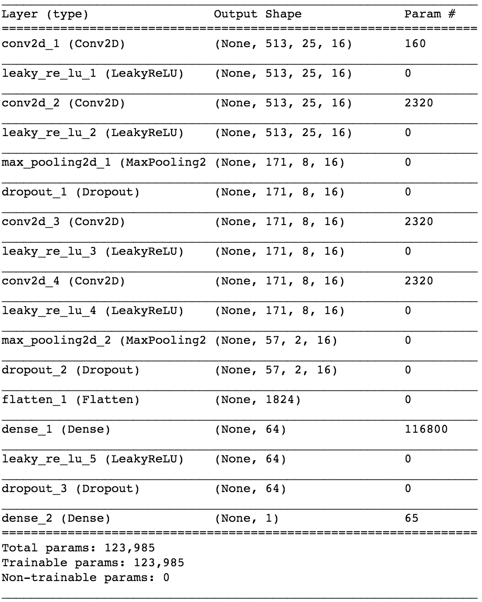**

**通过 80/20 的训练测试分割，在大约 50 个时期后，我们达到了 97%的测试准确度，这意味着有足够的证据表明我们的 CNN 模型可以区分包含声乐内容的音乐部分和没有声乐内容的音乐部分。通过检查来自第四卷积层的一些特征图，看起来我们的网络已经优化了它的内核来执行两个任务:过滤音乐和过滤人声…**

****

**Sample feature maps at the output of the 4th conv. layer. Apparently, the output on the left is the result of a combination of kernel operations that try to preserve vocal content while ignoring music. The high values resemble the harmonic structure of human speech. The feature map on the right seems to be the result of the opposite task.**

# ****从 VAD 到源分离****

**既然我们已经验证了这个简单的分类问题，我们如何从检测音乐中的人声活动一直到从音乐中分离出人声呢？好吧，从我们在开始描述的*幼稚的*方法中挽救一些想法，我们仍然想要以某种方式结束对人声的幅度谱图的估计。这现在变成了一个回归问题。我们想要做的是，给定一个来自混合的 STFT 的时间帧(具有足够的时间上下文)，估计相应的声音时间帧的幅度谱。**

****训练集怎么样？(此时你可能会问自己)****

**哦，主啊…那真了不起。我将在文章的最后解决这个问题，这样我们就不会切换上下文了！**

**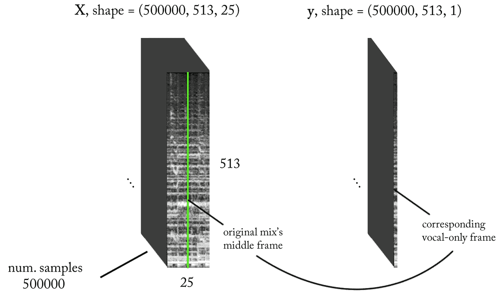**

**如果我们的模型学习得很好，在推理过程中，我们需要做的就是在混合的 STFT 上实现一个简单的滑动窗口。每次预测后，我们将窗口向右移动 1 个时间帧，预测下一个声音帧，并将其与前一个预测连接起来。关于模型，我们可以从使用我们用于 VAD 的相同模型作为基线开始，并且通过进行一些改变(输出形状现在是(513，1)，输出处的线性激活，MSE 作为损失函数)，我们可以开始我们的训练。**

****不要宣称胜利……****

**虽然上面的输入/输出表示有意义，但是在用不同的参数和数据标准化训练我们的声音分离模型几次之后，结果还没有出来。看来**我们要求的太多了……****

**我们从二元分类器转向尝试在 513 维向量上做*回归*。尽管网络在一定程度上学习了该任务，但是在重构人声的时域信号之后，存在来自其他源的明显的伪像和干扰。即使在添加更多层和增加模型参数的数量后，结果也不会有太大变化。**

**于是问题变成了:**我们能不能欺骗网络让它认为*它正在解决一个更简单的问题，并且仍然能达到预期的结果？*****

**如果我们不是试图估计人声的幅度 STFT，而是训练网络来学习一个*二进制掩码*，当它应用于混音的 STFT 时，会给我们一个简化但**感知上可接受的人声幅度谱图估计**呢？**

**通过试验不同的试探法，我们想出了一个相对简单的(从信号处理的角度来看肯定是非正统的)方法来使用二进制掩码从混音中提取歌声。在不涉及太多细节的情况下，我们将把输出视为二进制*图像*，其中值“1”表示在给定频率和时间帧位置**主要存在声乐内容**，值“0”表示在给定位置主要存在音乐。视觉上，它看起来很不美观，但是在重构时域信号时，结果却出乎意料地好。**

**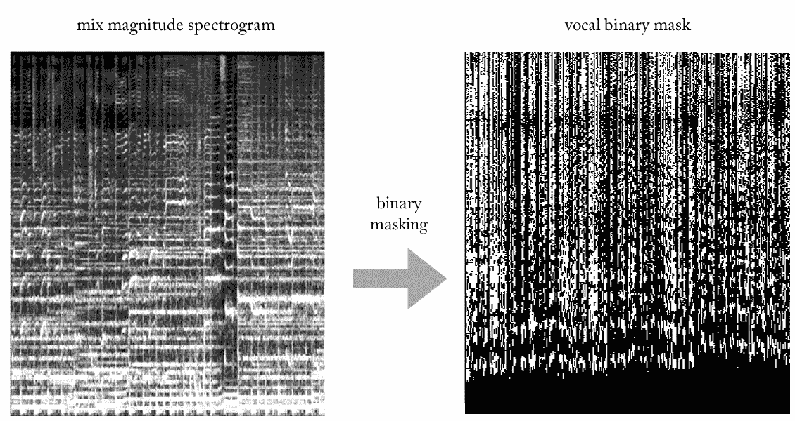**

**Binary masking (or TF masking) techniques have been around for decades and have been proven very effective in specific audio source separation and classification problems. However, most available techniques have been optimized for speech enhancement / recognition applications and fall short when it comes to real-world data such as professionally-produced & mastered music. Our binarization method was specifically designed for this scenario.**

**我们的问题现在变成了某种回归分类的混合体。我们要求模型“将输出端的像素*”*分类为有声或非有声，尽管从概念上来说(以及根据所使用的损失函数-MSE-)，该任务仍然是一个回归任务。**

**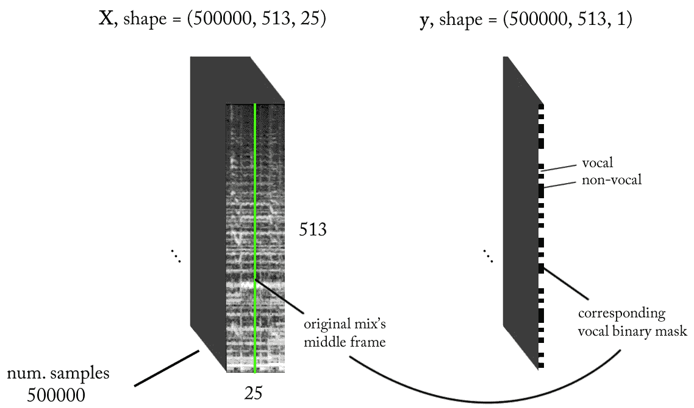**

**虽然这种区别对某些人来说似乎无关紧要，但它实际上对模型学习指定任务的能力产生了巨大的影响，第二种方法更简单，也更受限制。同时，考虑到任务的复杂性，它允许我们在参数数量方面保持我们的模型相对较小，这是实时操作非常需要的，这是这种情况下的设计要求。经过一些小的调整，最终的模型看起来像这样。**

******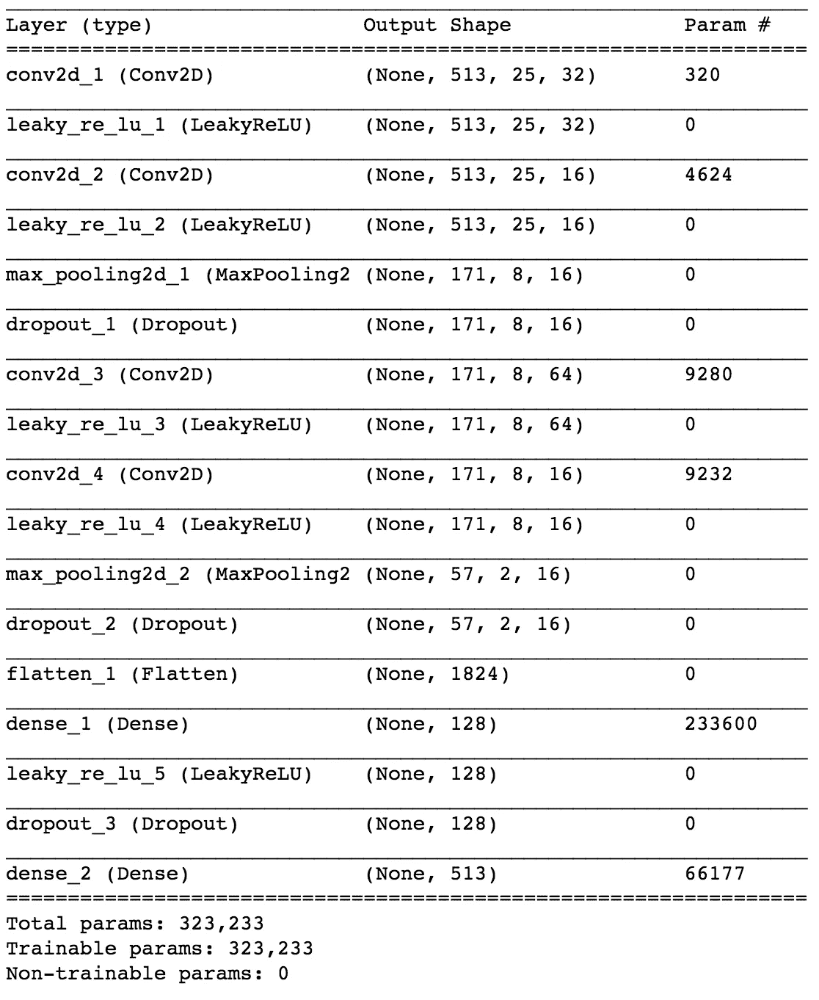**

## **我们如何重建时域信号？**

**基本上，如*天真*T2【方法】一节所述。在这种情况下，对于我们所做的每一次推理，我们都预测了人声的二进制掩码的单个时间帧。同样，通过实现一个简单的滑动窗口，一个时间帧的跨度，我们不断估计和连接连续的时间帧，最终组成整个人声二进制掩码。**

****

## ****创建训练集****

**如你所知，有监督的机器学习中最大的痛点之一(抛开所有那些有可用数据集的玩具例子不谈)是拥有针对你试图解决的特定问题的正确数据(数量和质量)。基于所描述的输入/输出表示，为了训练我们的模型，我们首先需要大量的混音及其对应的、完全对齐和标准化的声道。建立这个数据集的方法不止一种，在这里我们使用了多种策略，从手动创建带有一些网上找到的 acapellas 的混合<>声乐对，到寻找 RockBand stems，再到浏览 Youtube。为了让您了解这个耗时且痛苦的过程，我们的“数据集项目”包括创建一个工具来自动构建 mix <>人声对，如下图所示:**

****

**我们知道网络需要大量数据来学习将混音映射到人声所需的传递函数。我们最终的数据集由大约 1500 万个大约 300 毫秒的混音片段及其相应的人声二进制掩码组成。**

**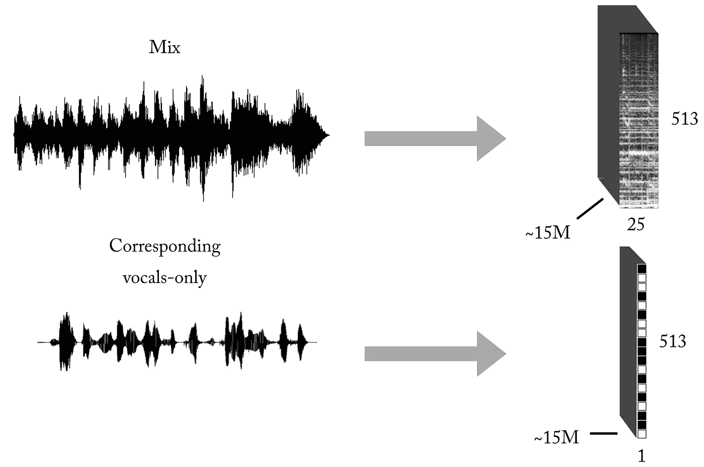**

## **流水线架构**

**为给定的任务建立机器学习模型只是交易的一部分。在生产环境中，我们需要考虑软件架构、管道和优化策略，特别是当我们处理实时时。**

**对于这个特殊的问题，可以在预测完整的人声二进制掩码(离线模式)后立即进行时域重建，或者更有趣的是，作为多线程管道的一部分，我们在小片段中进行采集、处理、重建和回放，从而使其成为流友好的，甚至能够以最小的延迟对正在录制的音乐进行实时解构。鉴于这本身就是一个完整的主题，我将把它留给另一篇关注**实时 ML 管道** …**

# **我想我已经讲得够多了，我们为什么不再听几个例子呢？**

## **蠢朋克——走运(工作室)**

**we can hear some minimal interference from the drums here…**

## **阿黛尔——放火烧雨(现场录音！)**

**Notice how at the very beginning our model extracts the crowd’s screaming as vocal content :). In this case we have some additional interference from other sources. This being a live recording it kinda makes sense for this extracted vocal not to be as high quality as the previous ones.**

# **好的，那么还有“最后一件事”…**

# **既然这适用于人声，为什么不把它应用到其他乐器上呢？**

**这篇文章已经足够广泛了，但是鉴于你已经做了这么多，我想你应该看看最后一个演示。利用提取声乐内容的完全相同的推理，我们可以通过对我们的模型进行一些修改，当然，通过适当的训练集，尝试将立体声轨道分割成主干(鼓、低音线、声乐等:)**

**准备好再去兔子洞了吗？下面是第二部分！**

**[](/audio-ai-isolating-instruments-from-stereo-music-using-convolutional-neural-networks-584ababf69de) [## 音频人工智能:使用卷积神经网络从立体声音乐中分离乐器

### 黑客音乐走向衍生内容的民主化

towardsdatascience.com](/audio-ai-isolating-instruments-from-stereo-music-using-convolutional-neural-networks-584ababf69de) 

感谢阅读，不要犹豫，留下问题。我会继续在**音频 AI** 上写文章，敬请期待！最后，您可以看到我们最终构建的实际 CNN 模型并没有那么特别。这项工作的成功是由对**特征工程**方面的关注和对假设验证实施精益流程推动的，这是我将在不久的将来写的东西！

ps:感谢 Naveen Rajashekharappa 和 Karthiek Reddy Bokka 对这项工作的贡献！**