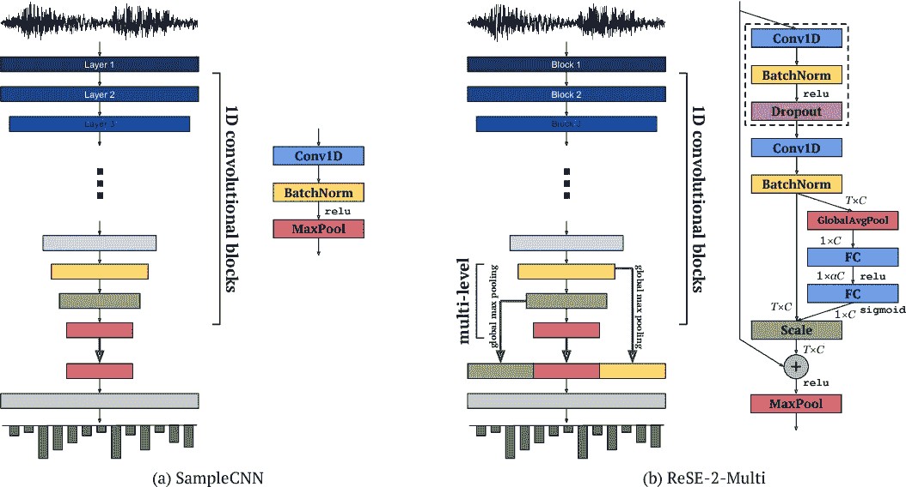

# 使用预训练的 VGG-19 (Keras)进行音频分类

> 原文：<https://towardsdatascience.com/audio-classification-with-pre-trained-vgg-19-keras-bca55c2a0efe?source=collection_archive---------10----------------------->



Taken from [https://www.semanticscholar.org/paper/Raw-Waveform-based-Audio-Classification-Using-CNN-Lee-Kim/09be9adf2a925da20db12918283c54a9044272af/figure/0](https://www.semanticscholar.org/paper/Raw-Waveform-based-Audio-Classification-Using-CNN-Lee-Kim/09be9adf2a925da20db12918283c54a9044272af/figure/0)

在这篇文章中，我将针对音频分类的问题。我将根据预先训练的 VGG-19 从音频波形中提取的特征训练一个 SVM 分类器。这篇文章背后的主要思想是展示预训练模型的力量，以及应用它们的容易程度。

我想在真实世界的数据上评估这种方法。于是我想到把超跑和重型自行车的音频分类。下面是我创建这个分类器的步骤:

## 从 Youtube 下载音频文件

首先，我选择了我想要音频的 youtube 视频，然后我使用下面这段代码下载了. mp3 格式的音频文件。

```
**from** __future__ **import** unicode_literals
**import** youtube_dl

ydl_opts = {
    **'format'**: **'bestaudio/best'**,
    **'postprocessors'**: [{
        **'key'**: **'FFmpegExtractAudio'**,
        **'preferredcodec'**: **'mp3'**,
        **'preferredquality'**: **'192'**,
    }],
}
**with** youtube_dl.YoutubeDL(ydl_opts) **as** ydl:
    ydl.download([<youtube video link>])
# for bike sounds : [https://www.youtube.com/watch?v=sRdRwHPjJPk](https://www.youtube.com/watch?v=sRdRwHPjJPk)#forcar sounds : [https://www.youtube.com/watch?v=PPdNb-XQXR8](https://www.youtube.com/watch?v=PPdNb-XQXR8)
```

**将音频文件从. mp3 转换为。wav**

下载了. mp3 文件后，我把它们转换成了。wav 文件，使用下面这段代码。

```
**from** pydub **import** AudioSegment
sound = AudioSegment.from_mp3(**"car.mp3"**)
sound.export(**"car.wav"**, format=**"wav"**)
```

**提取音频块**

下一步，我从。wav 文件。

```
**from** pydub **import** AudioSegment
**import** os
**if not** os.path.exists(**"bike"**):
    os.makedirs(**"bike"**)

count=1
**for** i **in** range(1,1000,15):
    t1 = i * 1000 *#Works in milliseconds* t2 = (i+15) * 1000
    newAudio = AudioSegment.from_wav(**"bikes.wav"**)
    newAudio = newAudio[t1:t2]
    newAudio.export(**'bike/'**+str(count)+**'.wav'**, format=**"wav"**) *#Exports to a wav file in the current path.* print(count)
    count+=1
```

**绘制振幅波形**

下一步是绘制这些音频的波形。这是用下面的代码完成的。

```
**from** scipy.io.wavfile **import** read
**import** matplotlib.pyplot **as** plt
**from** os **import** walk
**import** os
**if not** os.path.exists(**"carPlots"**):
    os.makedirs(**"carPlots"**)
car_wavs = []
**for** (_,_,filenames) **in** walk(**'car'**):
    car_wavs.extend(filenames)
    **break
for** car_wav **in** car_wavs:
    *# read audio samples* input_data = read(**"car/"** + car_wav)
    audio = input_data[1]
    *# plot the first 1024 samples* plt.plot(audio)
    *# label the axes* plt.ylabel(**"Amplitude"**)
    plt.xlabel(**"Time"**)
    *# set the title
    # plt.title("Sample Wav")
    # display the plot* plt.savefig(**"carPlots/"** + car_wav.split(**'.'**)[0] + **'.png'**)
    *# plt.show()* plt.close(**'all'**)
```

**提取特征和训练直线 SVM**

一旦我有了汽车和自行车的这些波形，我就从这些图像中提取特征，将它们输入 LinearSVM 进行分类。为了提取特征，我使用了 VGG-19 的预训练模型，并从展平层提取图像的抽象特征。提取这些特征后，我创建了一个 70-30 的训练测试分割，并训练了一个 LinearSVM。下面是代码。

```
**import** os
**from** keras.applications.vgg19 **import** VGG19
**from** keras.preprocessing **import** image
**from** keras.applications.vgg19 **import** preprocess_input
**from** keras.models **import** Model
**import** numpy **as** np

base_model = VGG19(weights=**'imagenet'**)
model = Model(inputs=base_model.input, outputs=base_model.get_layer(**'flatten'**).output)

**def** get_features(img_path):
    img = image.load_img(img_path, target_size=(224, 224))
    x = image.img_to_array(img)
    x = np.expand_dims(x, axis=0)
    x = preprocess_input(x)
    flatten = model.predict(x)
    **return** list(flatten[0])

X = []
y = []

car_plots = []
**for** (_,_,filenames) **in** os.walk(**'carPlots'**):
    car_plots.extend(filenames)
    **break

for** cplot **in** car_plots:
    X.append(get_features(**'carPlots/'** + cplot))
    y.append(0)

bike_plots = []
**for** (_,_,filenames) **in** os.walk(**'bikePlots'**):
    bike_plots.extend(filenames)
    **break

for** cplot **in** bike_plots:
    X.append(get_features(**'bikePlots/'** + cplot))
    y.append(1)

**from** sklearn.model_selection **import** train_test_split
**from** sklearn.svm **import** LinearSVC
**from** sklearn.metrics **import** accuracy_score

X_train, X_test, y_train, y_test = train_test_split(X, y, test_size=0.30, random_state=42, stratify=y)

clf = LinearSVC(random_state=0, tol=1e-5)
clf.fit(X_train, y_train)

predicted = clf.predict(X_test)

*# get the accuracy* print (accuracy_score(y_test, predicted))
```

这个简单的模型在测试集**上取得了 **97%** 的准确率。**这显示了这些预先训练的模型有多么强大，以及任何人都可以使用它们来创建工具。

我能想到的一个应用是创建一个 chrome 扩展，它可以判断网页上的视频音频是否包含明显的噪音。我鼓励阅读这篇文章的初学者思考一个新问题，并用这里介绍的方法解决它。